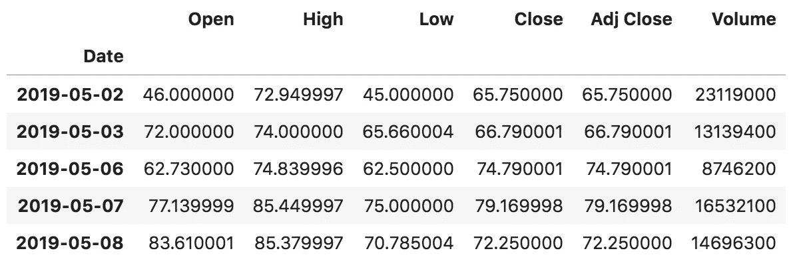
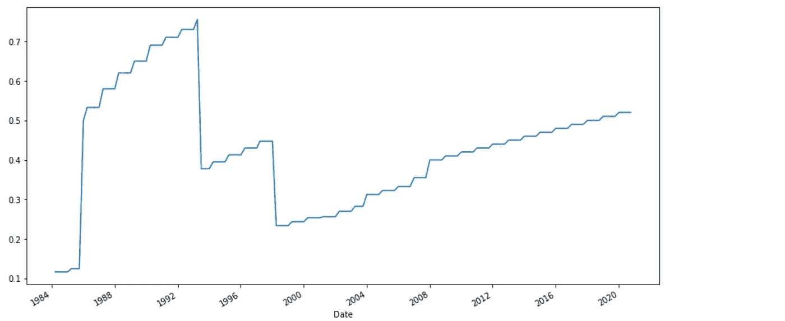

# Python 中股票市场分析的 3 个基本步骤

> 原文：<https://towardsdatascience.com/3-basic-steps-of-stock-market-analysis-in-python-917787012143?source=collection_archive---------2----------------------->

用 Python 分析特斯拉股票，计算交易指标，绘制 OHLC 图表。包括一个带有代码示例的 Jupyter 笔记本。


克里斯·利维拉尼在 [Unsplash](https://unsplash.com?utm_source=medium&utm_medium=referral) 上的照片

我最近开始阅读[斯坦·温斯坦的《在牛市和熊市中获利的秘密](https://amzn.to/2FCdl0e)。在他的书中，Stan 揭示了他成功的投资时机选择方法，以产生持续盈利的结果。

> 许多投资者说“这是你需要阅读的唯一一本投资书籍”

斯坦·温斯坦是专业的股票市场技术分析师。1987 年，他利用自己的图表阅读技巧，预测了股票市场 31%的崩盘，由此一举成名。

**我其他关于这个话题的文章:**

[](https://romanorac.medium.com/stock-market-analysis-in-python-b71bf50151d9) [## Python 中的股票市场分析

### 我用 Python 写的关于股票市场分析的文章的精选列表。

romanorac.medium.com](https://romanorac.medium.com/stock-market-analysis-in-python-b71bf50151d9) 

**这里有几个你可能感兴趣的链接:**

```
- [Complete your Python analyses 10x faster with Mito](https://trymito.io/) [Product]- [Free skill tests for Data Scientists & ML Engineers](https://aigents.co/skills) [Test]- [All New Self-Driving Car Engineer Nanodegree](https://imp.i115008.net/c/2402645/1116216/11298)[Course]
```

*你愿意多看一些这样的文章吗？如果是这样，你可以点击上面的任何链接来支持我。其中一些是附属链接，但你不需要购买任何东西。*

# 介绍

这是 Python 中股票市场分析系列的第一篇文章，在这篇文章中，我将尝试描述和实现在股票市场中获利的成功技术。

让我们从基础开始。在本文中，您将了解到:

*   用 Python 获取股票数据的最简单方法
*   什么是交易指标，如何计算
*   如何用 OHLC 图表绘制股票数据

**注意，我不是专业投资者，我不对你的损失负责。这是教育内容。**


马特·邓肯在 [Unsplash](https://unsplash.com?utm_source=medium&utm_medium=referral) 上拍摄的照片

# 1.获取股票数据

用 Python 下载股票历史数据最简单的方法是用 [yfinance](https://github.com/ranaroussi/yfinance) 包。要安装该软件包，只需运行:

```
pip install yfinance
```

使用 yfinance 将 Tesla (TSLA)的每日股票价格下载到熊猫数据框架中非常简单:

```
df = yf.download("TSLA", start="2018-11-01", end="2020-10-18", interval="1d")df.head()
```



特斯拉股票的每日价格

yfinance 下载函数有很多参数:

*   您可以使用 1m、2m、5m、15m、30m、60m、90m、1h、1d、5d、1wk、1mo、3mo，而不是将间隔设置为 1d。
*   您可以在一个列表或字符串中定义多个 tickers:“间谍 AAPL MSFT”。
*   您可以使用“ytd”来下载从今天起一年内的数据，而不是开始和结束日期。其他有效期间包括 1d、5d、1mo、3mo、6mo、1y、2y、5y、10y、ytd、max。
*   详见[y 金融](https://github.com/ranaroussi/yfinance)。

yfinance 还有许多其他有用的函数，比如股息函数。假设我们想列出美国电话电报公司(T)的股息。

```
t = yf.Ticker("T")t.dividends
```


```
t.dividends.plot(figsize=(14, 7))
```



美国电话电报公司股息增长

# 2.计算交易指标

交易指标是数学计算，在价格图表上绘制成线条，可以帮助交易者识别市场中的某些信号和趋势。

## TA-LIB

[TA-LIB](https://github.com/mrjbq7/ta-lib) 是 Python 中技术分析使用最多的库之一。

要使用它，首先需要安装 TA-LIB 依赖项:

```
# Mac OS X
brew install ta-lib# see [https://github.com/mrjbq7/ta-lib](https://github.com/mrjbq7/ta-lib) for other platforms
```

然后需要安装 python API:

```
pip install TA-Lib
```

# 移动平均数

移动平均线(MA)用于确定当前价格趋势的方向，不受短期价格上涨的影响。

MA 指标结合了特定时间范围内的股价点，并除以数据点的数量，得出一条趋势线。

让我们计算 TSLA 收盘价的 20 天(短期)和 200 天(长期)MA(我们可以用熊猫直接计算 MA):

```
df.loc[:, 'ma20'] = df.Close.rolling(20).mean()
df.loc[:, 'ma200'] = df.Close.rolling(200).mean()
```


短期和长期移动平均线的特斯拉价格

## 为什么均线很重要？

移动平均线用于识别重要的[支撑位](https://www.investopedia.com/trading/support-and-resistance-basics/)和[阻力位](https://www.investopedia.com/trading/support-and-resistance-basics/)。

交易者观察短期均线与长期均线的交叉，作为趋势变化的可能指标，以进入多头和空头头寸。

> 斯坦·温斯坦认为:要想买入一只股票，价格必须在短期 MA 以上。

## RSI——相对强度指数

相对强弱指数(RSI)是技术分析中使用的一种动量指标，用于衡量最近价格变化的幅度，以评估股票或其他资产价格的超买或超卖情况。

RSI 显示为一个振荡器(在两个极端之间移动的线形图),读数可以从 0 到 100。它通常用于 14 天的时间段。

## 相对强弱和相对强弱指数一样吗？

如果你正在阅读斯坦·温斯坦的《在牛市和熊市中获利的秘密》，斯坦提到了相对强度，但不要把它和 RSI 混淆。

相对强弱表明一只股票相对于另一只股票、指数或基准的价值，而相对强弱表明一只股票相对于同一只股票近期表现的表现。

## 让我们计算 TSLA 的相对强度

```
import talibdf.loc[:, "rsi"] = talib.RSI(df.Close, 14)
```

现在，让我们绘制 RSI 图，30 表示超卖，70 表示超买:

```
import matplotlib.pyplot as pltfig, ax = plt.subplots(1, 2, figsize=(21, 7))ax0 = df[["rsi"]].plot(ax=ax[0])
ax0.axhline(30, color="black")
ax0.axhline(70, color="black")df[["Close"]].plot(ax=ax[1])
```


14 天 RSI 左边是特斯拉收盘价，右边是特斯拉收盘价。

RSI ≥70 的资产通常被认为超买，而 RSI ≤ 30 的资产通常被认为超卖:

*   超买信号表明资产价格可能会回调。
*   超卖信号可能意味着短期下跌即将成熟，资产可能会反弹。

在上图中，我们可以观察到 TSLA 价格随着 RSI 的变化而变化的模式。当超买(RSI ≥70)时，价格处于修正阶段，反之亦然。

# 3.绘制股票数据

在这一节中，我们将看到如何绘制 OHLC 图，这是一种我们在交易平台上常见的开盘价、最高价、最低价和收盘价的图表。

我们将使用 Plotly 库来制作 OHLC 海图。要安装它:

```
pip install plotly
```

如果您使用的是 JupyterLab，您还需要安装一个 Plotly 扩展，以便 JupyterLab 可以呈现 Plotly 图表:

```
jupyter labextension install jupyterlab-plotly
```

为了用 Plotly 绘制 OHLC，我们只需要在正确的投入上设定价格。

```
import plotly.graph_objects as gofig = go.Figure(
    data=go.Ohlc(
        x=df.index,
        open=df["Open"],
        high=df["High"],
        low=df["Low"],
        close=df["Close"],
    )
)
fig.show()
```


特斯拉股价的 OHLC 图表

# 在你走之前

像往常一样，你可以[下载这个 Jupyter 笔记本](https://romanorac.github.io/assets/notebooks/2020-10-18-stocks-analysis.ipynb)在你的机器上尝试例子。

在[推特](https://twitter.com/romanorac)上关注我，在那里我定期[发关于数据科学和机器学习的推特](https://twitter.com/romanorac/status/1328952374447267843)。


照片由[Courtney hedge](https://unsplash.com/@cmhedger?utm_source=medium&utm_medium=referral)在 [Unsplash](https://unsplash.com/?utm_source=medium&utm_medium=referral) 上拍摄