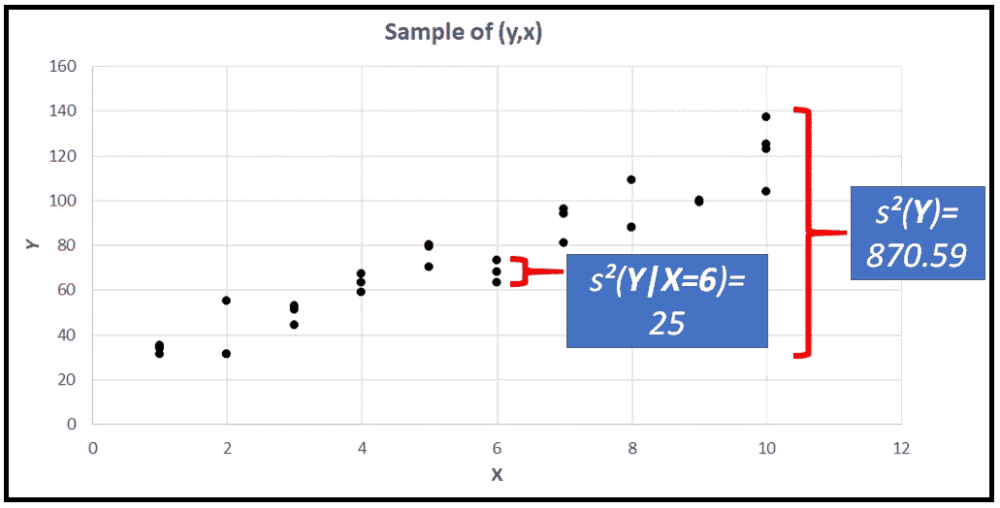

# 每个数据科学家都应该知道的 3 个条件

> 原文：<https://towardsdatascience.com/3-conditionals-every-data-scientist-should-know-1916d48b078a?source=collection_archive---------31----------------------->



图示条件方差(图片由[作者](https://sachin-date.medium.com/)提供)

## 条件期望、条件概率和条件方差:回归建模者的实践见解

## 条件期望

*随机变量的条件期望是我们期望它取的值，条件是它所依赖的另一个变量取一个特定值。*

**如果这听起来很拗口，不要绝望。**我们将很快进入这个概念的“啊哈”时刻。为了帮助我们的探索，我们将使用泊松分布的随机变量 ***Y*** 作为我们的主角。

所以设 ***Y*** 为平均发生率 *λ* 的[泊松分布离散随机变量](/the-poisson-process-everything-you-need-to-know-322aa0ab9e9a)。

*的 **P** 概率 **M** 屁股 **F** 油膏看起来如下。( **PMF** 只是离散随机变量的概率分布的另一个名称):*

**

*泊松(λ=20)随机变量的 PMF*

****【Y】***的期望值，记为**(***)【T47)，是以下各项的乘积之和:****

*   *****Y*** 在其范围【0，∞】、*和*内的每一个值，**
*   **其对应的概率*P(****Y****= Y)*，摘自其 PMF。换句话说，如下:**

****

**离散随机变量的期望值(图片由[作者](https://sachin-date.medium.com/)提供)**

**关于期望值的事情是，如果你把你的钱押在 ***Y*** 的任何一个值上，*E(****Y****)*是你应该押的。**

**在 ***Y*** 是*泊松(λ)* 分布的情况下，可以证明 ***E(Y)*** 就是单纯的 *λ* 。在上图所示的样本分布中，*E(****Y****)*= 20*。***

**如果 ***Y*** 是一个连续值的随机变量，如正态分布的随机变量，*E(****Y****)*计算如下:**

****

**无条件期待连续的 ***Y*** (图片由[作者](https://sachin-date.medium.com/))**

**其中 *f(y)* 是**Y**的 **P** 概率 **D** 密度**F**function(**PDF**)*【a，b】*是其区间 ***。*****

**那么**关于这个期望的条件**是什么呢？在这种情况下，什么都不是，因为 ***Y*** ，按照我们的定义，是一个独立变量，即它的值不依赖于任何其他变量的值。**

**我们现在介绍另一个主角:变量 ***X*** 。有了图中的 ***X*** ，我们可以考虑 ***Y*** 依赖于 ***X*** 的情况，即 ***Y 是 X:*** 的某个函数**

*****Y****= f(****X****)。***

**一个简单的例子 *f(。)*是 ***Y*** 和 ***X*** 之间的线性关系:**

****=****β0****+****β1 * X******

**其中 ***β0*** 为截距 ***β1*** 为直线的斜率。**

**让我们扮演一下上帝。我们将声称知道 ***Y*** 和 ***X.*** 之间的*真实*关系如下(但是不要让你头脑中的回归建模者知道这个真实关系！):**

*****Y****= 20+10***** X*****

**下面是 ***Y*** 对 ***X*** 的剧情:**

****

******Y****= 20+10***** X***(图片由[作者](https://sachin-date.medium.com/))***

***等等，但是 ***Y*** 不是一个*随机*变量吗？因此，对于 ***X*** 的每个值，我们会期望*占据一个或多个由***【Y】****的概率分布(PDF 或 PMF)控制的*随机*值。Y 的这种随机行为导致了下面这种图，Y*对 X*而不是我们之前看到的非常整齐的图:*******

********

****一个更现实的 Y 对 x 的曲线被假设为泊松分布的*随机变量。*(图片由[作者](https://sachin-date.medium.com/))****

****再次回忆一下，在我们的例子中，我们假设 ***Y*** 是*泊松(λ)* 分布*。*原来泊松分布的 PMF 的参数 *λ* 在我们之前看到的 ***Y*** 对 ***X*** 的整齐直线图和上图所示的*对 ***X*** 的涂抹图之间形成了结缔组织。具体来说， *λ* 是 ***X*** 的如下线性函数:*****

****λ(****X****)= 20+10***** X******

***但正如我们在文章开头所指出的，一个*泊松(λ)* 分布随机变量的期望值即*E(****Y****)*，就是*的简单λ。*因此，对于 ***的某个值 X*** :***

****E(****Y****|****X****)=λ(****X****)，从而:****

****E(****Y****|****X****)= 20+10***** X******

***符号*E(****Y****|****X****)*是*对*X***Y***的**条件期望，条件是 ***X*** 取一个特定值*******

***比如在 Y 对 X 的整齐直线图中，当***X****= 6*时，***

****E(****Y****|****X****= 6)= 20+10 * 6 = 80*。***

***所以现在我们可以说，当 ***X*** =6， ***Y*** 是一个均值 *λ* 为 80 的泊松分布随机变量。***

***我们可以对 ***X*** 的每一个值进行类似的计算，得到***X****= X*对应的条件期望***Y***这样做让我们“叠加”两个 ***Y*** 对 ***X*** 图，如下所示。橙色点是 Y 的泊松分布样本的条件平均值，由蓝色点表示。***

******

***E( **Y** | **X** )叠加在 **Y** (图片由[作者](https://sachin-date.medium.com/)提供)***

***一般来说，如果 ***Y*** 是一个随机变量，并且**与***【X】***具有线性关系，我们可以将这种关系表示如下:*****

******E(Y | X****= X****)****=β0+β1*********X****

******其中 E(Y | X****= X****)称为以 X 取值为条件的 Y 的期望值******

****条件期望，又称 ***Y*** 对*的条件均值，也可以简写为*E(****Y****|****X****)。******

## *****现在是关于条件概率分布的部分:*****

***我们将看到 ***解释变量 X*** 如何通过参数 *λ:* 进入泊松分布 ***Y*** 的 PMF***

***到目前为止，我们已经看到:***

******E(Y | X****= X****)****=λ(****X****= X)=β0+β1*****X****

***我们还知道， ***Y*** 的 PMF 由下式给出:***

******

****PMF 的泊松(λ)* (图片由[作者](https://sachin-date.medium.com/))***

***在上面的等式中，用*β0+β1*********X*替换 *λ* ，或者确实用任何其他函数*f(****X****)***X***，就宾果！ ***Y*** 取特定值 *y* 的概率现在突然依赖于***×取特定值 *x* 。请参见下面更新的 PMF 公式:*******

**

*泊松的条件 PMF(*λ(X))*(图片由[作者](https://sachin-date.medium.com/))*

*换句话说， ***Y*** 的 PMF 现在已经转化为一个 ***条件概率分布函数*** 。这不是很棒吗？*

****Y*** 可以有任何一种概率分布，离散的、连续的或混合的。同样， ***Y*** 可以通过任何一种关系 *f(.)*介于 ***Y*** 和 ***X*** 之间。因此，对于*Y 为离散随机变量的情况，我们可以将**Y**对 ***X*** 的条件期望写成如下:**

****

**离散随机变量的条件期望(图片由[作者](https://sachin-date.medium.com/)提供)**

**其中*P(****Y****= Y _ I |****X****= X)*是*条件概率* ***质量*** *函数*的 ***Y*** 。**

**如果 ***Y*** 是一个连续的随机变量，我们可以把它的条件期望写成:**

****

**连续随机变量的条件期望(图片由[作者](https://sachin-date.medium.com/)提供)**

**其中*f(****Y****= Y _ I |****X****= X)*是*条件概率* ***密度*** *函数****Y****。***

**条件概率分布和条件期望在回归模型的规范中占有突出的位置。我们将在线性回归的上下文中看到两者之间的联系。**

## **条件期望和回归建模**

**假设给我们一个(y，x)元组的随机样本，该样本取自前面图中所示的总体值:**

****

**(y，x)值的随机样本(图片由[作者](https://sachin-date.medium.com/)提供)**

**还假设您已决定将线性回归模型拟合到此样本，目标是从 x 预测 Y。在您的模型被训练(即*拟合*)到样本后，模型的回归方程可指定如下:**

*****【Y _(预测)***=**+****β1 _(拟合)*X******

***其中 ***β0_(拟合)*** 和 ***β1_(拟合)*** 为拟合模型的系数。现在让我们跳过安装步骤。下图显示了上述样本图的拟合模型。我已经叠加了 ***Y*** ， ***E(Y|X)*** 的条件期望，对于 ***X*** 的每个值:***

******

***样本 Y，E(Y|X)和拟合的模型(图片由[作者](https://sachin-date.medium.com/)提供)***

***从图中可以看出，拟合的模型并没有完全通过 ***Y*** 的条件期望。每种情况下都有少量的误差。让我们算出这个误差为 ***X*** *=8* :***

```
***When ***X***=8:
We know *E(****Y****|****X****)* because we are playing God and we know the exact equation between ***Y*** and ***X****:
E(****Y****|****X****=8)* = 20+10*8 = 100Our model cannot God, so at best it can only estimate *E(****Y****|****X****)***:
*Y_predicted****|****X****=8* = 22.034 + 9.458 * 8 = 97.698Thus the **residual error *ϵ*** for ***X****=8* is 100 - 97.698 = 2.302***
```

***这样，我们也可以找到所有其他值 ***X*** 的残差。***

***我们现在可以使用这些剩余误差项，根据拟合模型的系数来表达 ***Y*** 的条件期望。这种关系为***×****= 8*看起来是这样的:***

****E(****Y****|****X****= 8)= 100 = 22.034+9.458 * 8+2.302****

***或者总的来说，我们有:***

> ****e(****y****|****x****)=****【β0 _(拟合)****+**【β1 _(拟合)*X + ϵ****

***换句话说:***

> ***E(Y|X) = Y_(预测)+ ϵ***

****其中* ***ϵ*** *是回归模型的误差，又称模型的残差。****

***一般来说，对于“表现良好”的模型，当您在越来越大的样本量上训练您的模型时，会发生以下有趣的事情:***

*   ***在我们的示例中，拟合模型的系数: *β0_(拟合)*和 *β1_(拟合)*开始接近真实值(在我们的示例中，分别为 20 和 10)。***
*   ***拟合模型的预测( ***Y_predicted*** )开始逼近***Y***on*，*即 E(****Y****|****X*【T97)******
*   ***模型的剩余误差开始趋近于零。***

## ***条件方差***

****方差是对数据偏离均值的简单衡量。****

***数学上，样本的方差 *s* (或总体的 *σ* )是样本(或总体)值与样本(或总体)均值之差的平方和。***

******

***样本的方差(图片由[作者](https://sachin-date.medium.com/)提供)***

***下面的情节说明了 ***无条件*** 方差*s(****Y****)*和 ***有条件*** 方差*s(****Y****|****X****= X*:***

******

***无条件和有条件方差(图片由[作者](https://sachin-date.medium.com/)提供)***

***样本(或总体)的**无条件**方差考虑了样本(或总体)中的所有值，而**有条件**方差只关注与给定值***【X***相对应的*Y 值的子集。****

****在我们的示例中，我们将样本的条件方差*s(****Y****|****X****= X)定义为给定 X 值的 Y 的方差。*因此记法为*s(****Y****|*****

## *****条件方差和回归建模*****

*****与条件期望一样，条件方差在回归建模领域占有特殊的位置，其位置如下:*****

*****建立回归模型(或任何统计模型)的主要原因是试图“解释”因变量的可变性。实现这个目标的一个方法是在你的模型中包含相关的解释变量 ***X*** 。条件方差为您提供了一种解释回归变量对减少 ***Y*** 方差的帮助(即解释)程度的方法。*****

*****如果你发现一个解释变量的存在不能解释太多的差异，它可以从模型中删除。*****

*****为了说明这个概念，让我们再来看一下上面的图，它显示了*中的无条件方差和有条件方差******

******样本的总体方差为 870.59。但是，如果您要将 ***X*** 固定为 6，那么只需知道 ***X*** 为 6 就可以将方差降低到只有 25！下表列出了 ***Y*** 中*x 的剩余值的条件方差，将每个值与 Y 的总体无条件方差进行比较，即 870.59:*******

************

******不同 X 值的条件方差(图片由[作者](https://sachin-date.medium.com/)提供)******

******就是这样！这就是条件概率，条件期望和条件方差的全部内容。您可以看到这三个概念在回归建模中扮演了多么有用和重要的角色。******

******快乐造型！******

*******感谢阅读！我写关于数据科学的主题。如果您喜欢这篇文章，请* [***关注我***](https://timeseriesreasoning.medium.com) *接收关于数据科学、时间序列分析和预测主题的文章、指南和编程建议。*******