# 视觉三维重建

> 原文：<https://towardsdatascience.com/3-d-reconstruction-with-vision-ef0f80cbb299?source=collection_archive---------5----------------------->

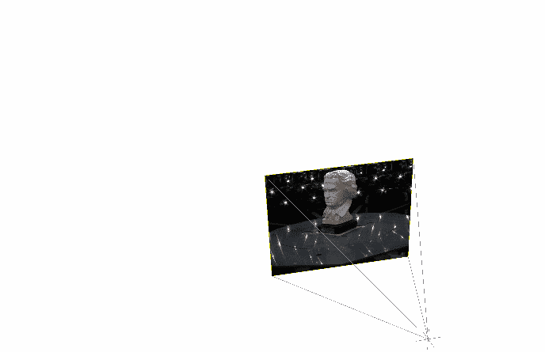

来源:卡琳·科列夫和丹尼尔·克雷默斯的论文《通过凸松弛进行连续比率优化并应用于多视角三维重建》。

整整一年前，在我开始写这篇文章之前，我看了特斯拉人工智能总监 Andrej Karapathy 的一次演讲，他向世界展示了特斯拉汽车如何使用挂在车上的摄像头感知深度，以便以 3D 方式重建周围环境并实时做出决策，一切(除了安全方面的前雷达)都是通过视觉进行计算的。那个演示让我大吃一惊！

当然，我知道通过相机可以实现环境的三维重建，但我的思维模式是，当我们拥有像激光雷达、雷达等这样高精度的传感器时，为什么有人会冒险使用普通相机呢？这能以少得多的计算量给我们一个准确的三维环境展示？我开始研究(试图理解)与深度感知和视觉三维重建相关的论文，并得出结论，我们人类从来没有从我们的头部发出光线来感知深度和周围的环境，我们很聪明，只用我们的两只眼睛就能意识到我们的周围环境，从开车或骑自行车去上班，或者在世界上最危险的赛道上以 230 英里/小时的速度驾驶一级方程式赛车，我们从来不需要激光在微秒内做出决定。我们周围的世界是由我们自己构建的，我们是有视觉的生物，所以正如埃隆所说，'*一旦我们解决了视觉问题*，这些昂贵的传感器将变得毫无意义。

在视觉深度感知领域正在进行大量的研究，特别是随着机器学习和深度学习的进步，我们现在能够仅以高精度从视觉计算深度。因此，在我们开始学习概念和实现这些技术之前，让我们看看这项技术目前处于什么阶段，以及它的应用是什么。

机器人视觉:

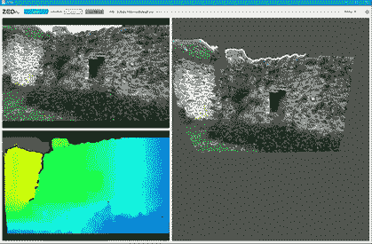

ZED 相机的环境感知

为自动驾驶创建高清地图:

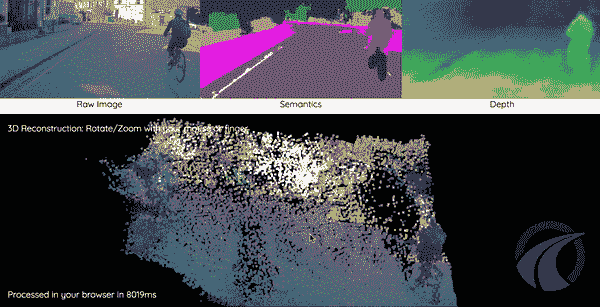

深度感知与深度学习

SfM(运动结构)和 SLAM(同步定位和映射)是主要技术之一，它们利用了我将在本教程中向您介绍的概念。

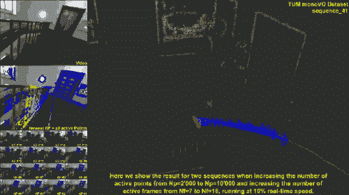

LSD-SLAM 的演示

既然我们已经有了足够的灵感来学习，我将开始教程。所以首先我要教你理解幕后发生的事情所需的基本概念，然后用 C++中的 OpenCV 库应用它们。你可能会问，为什么我要用 C++实现这些概念，而用 python 实现会容易得多，这是有原因的。第一个原因是 python 的速度不够快，无法实时实现这些概念，第二个原因是，与 python 不同，使用 C++会要求我们理解概念，没有它就无法实现。

在本教程中，我们将编写两个程序，一个是获取场景的深度图，另一个是获取场景的点云，都使用立体视觉。

在我们进入编码部分之前，理解相机几何的概念是很重要的，这是我现在要教你的。

# 相机型号

自从摄影开始以来，用来产生图像的过程就没有改变过。来自被观察场景的光被相机通过前光圈(镜头)捕获，前光圈将光发射到位于相机镜头后面的图像平面上。该过程如下图所示:

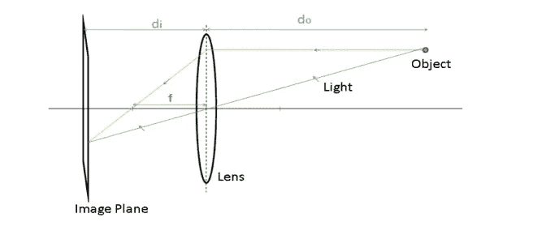

由上图可知， *do* 是镜头到被观察物体的距离， *di* 是镜头到像面的距离。并且 *f* 将因此成为透镜的焦距。根据下面所示的所谓“薄透镜方程”,这些描述的量之间具有关系:

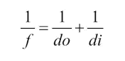

现在让我们来看看现实世界中的三维物体是如何被投影到二维平面(照片)上的。让我们理解这一点的最好方法是看看相机是如何工作的。

相机可以被看作是将三维世界映射成二维图像的功能。让我们以最简单的相机模型为例，那就是针孔相机模型，人类历史上最古老的摄影机制。下面是针孔摄像机的工作示意图:

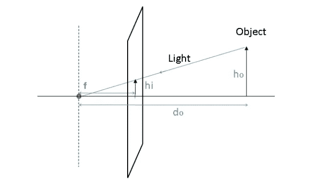

从这个图表中我们可以得出:

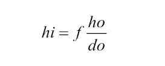

在这里，很自然地，物体形成的图像的尺寸与物体离摄像机的距离成反比。并且位于位置(X，Y，Z)的 3d 场景点将被投影到(X，Y)处的图像平面上，其中(X，y) = (fX/Z，fY/Z)。其中 Z 坐标指的是点的深度，这是在前面的图像中完成的。整个摄像机配置和符号可以用一个简单的矩阵来描述，该矩阵使用**齐次坐标** **系统**。

当摄像机生成世界的投影图像时，**射影几何**被用作现实世界中物体几何、旋转和变换的代数表示。

齐次坐标是射影几何中使用的坐标系统。即使我们可以在欧几里得空间中表示真实世界中的对象(或三维空间中的任何点)的位置，但是必须执行的任何变换或旋转都必须在齐次坐标空间中执行，然后再返回。让我们看看使用齐次坐标的优点:

*   涉及齐次坐标的公式通常比笛卡尔坐标中的要简单。
*   无穷远处的点可以用有限坐标来表示。
*   单个矩阵可以代表相机和世界之间可能发生的所有可能的保护性转换。

在齐次坐标空间中，二维点由 3 个向量表示，三维点由 4 个向量表示。

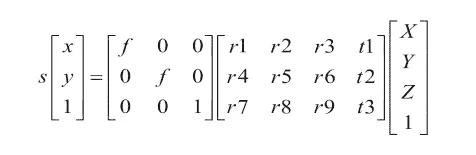

在上面的等式中，第一个带有 *f* 符号的矩阵称为内禀参数矩阵(或俗称**内禀矩阵**)。这里的固有矩阵现在只包含焦距( *f* )，我们将在本教程之前研究这个矩阵的更多参数。

带有 r 和 t 符号的第二个矩阵称为非本征参数矩阵(或通常称为**非本征矩阵**)。该矩阵中的元素表示相机的旋转和平移参数(即相机在现实世界中的位置和放置方式)。

因此，这些内在和外在矩阵一起可以给出图像中的(X，Y)点和现实世界中的(X，Y，Z)点之间的关系。这就是三维场景点如何根据给定的相机内部和外部参数投影到二维平面上。

现在我们已经获得了足够多的关于射影几何和相机模型的知识，是时候向你介绍计算机视觉几何中最重要的元素之一了，**基础矩阵**。

# 基础矩阵

现在我们知道了三维世界中的一个点是如何被投影到相机的像平面上的。我们将研究显示同一场景的两幅图像之间的投影关系。当这两个摄像机被一条刚性基线分开时，我们使用术语**立体视觉。**假设两个针孔摄像机观察一个给定的场景点，共享相同的基线，如下图所示:

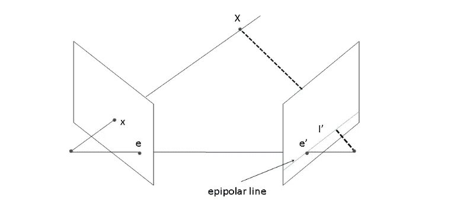

从上图可以看出，世界点 *X* 在图像平面上的位置 *x* 处有图像，现在这个 *x* 可以位于三维空间中这条线上的任何位置。这意味着如果我们想在另一幅图像中找到同一点 *x* ，我们需要沿着这条线在第二幅图像上的投影进行搜索。

这条从 *x* 画出的假想线被称为 *x* 的**极线**。这条极线带来了一个基本的约束，即在另一个视图中，给定点的匹配必须位于这条线上。意思是，如果你想从第二张图片中的第一张图片中找到 *x* ，你得沿着第二张图片中 *x* 的极线去寻找。这些核线可以描述两个视图之间的几何特征。这里需要注意的一点是，所有的极线总是通过一个点。这个点对应于一个摄像机中心到另一个摄像机中心的投影，这个点被称为**极线。**

我们可以将基础矩阵 *F* 视为将一个视图中的二维图像点映射到另一个图像视图中的核线的矩阵。图像对之间的基本矩阵可以通过求解一组方程来估计，该组方程涉及两幅图像之间的一定数量的已知匹配点。这种匹配的最小数量是 7，最佳数量是 8。然后，对于一幅图像中的一个点，基本矩阵给出了在另一个视图中应该找到其对应点的直线的方程。

如果一个点(x，y)的一个点对应的点是(x '，y ')，两个像平面之间的基本矩阵是 F，那么在齐次坐标下我们必须有下面的方程。

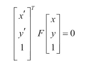

这个等式表达了两个对应点之间的关系，称为**极线约束**。

## **使用 RANSAC 匹配好的图像点**

当两个相机观察同一个场景时，它们看到的是相同的物体，但视角不同。C++和 Python 中都有 OpenCV 之类的库，它们为我们提供了[特征检测器](https://docs.opencv.org/3.4/d7/d66/tutorial_feature_detection.html)，这些检测器可以用图像中的描述符为我们找到某些点，它们认为这些点对于图像是唯一的，如果给定同一场景的另一幅图像，就可以找到这些点。然而，实际上不可能保证通过比较检测到的特征点的描述符(如 SIFT、ORB 等)在两幅图像之间获得匹配集。)会准确真实。这就是为什么引入了基于 **RANSAC(随机抽样一致性)**策略的基本矩阵估计方法。

RANSAC 背后的想法是从一组给定的数据点中随机选择一些数据点，并仅使用这些数据点进行估计。所选择的点的数量应该是估计数学实体所需的最小点的数量，在我们的基础矩阵的情况下是八个匹配。一旦从这八个随机匹配中估计出基础矩阵，匹配集中的所有其他匹配就根据我们讨论的极线约束进行测试。这些匹配形成了所计算的基础矩阵的支持集。

支持集越大，计算出的矩阵是正确矩阵的概率就越高。并且如果随机选择的匹配之一是不正确的匹配，那么计算的基础矩阵也将是不正确的，并且它的支持集将被认为是小的。这个过程重复多次，最后，具有最大支持集的矩阵将被保留为最可能的矩阵。

# 从立体图像计算深度图

人类进化成为有两只眼睛的物种的原因是我们能够感知深度。当我们在一台机器中以类似的方式组织相机时，这被称为立体视觉。立体视觉系统通常由两个并排的摄像机组成，观察同一个场景，下图显示了具有理想配置的立体装备的设置，完美对齐。

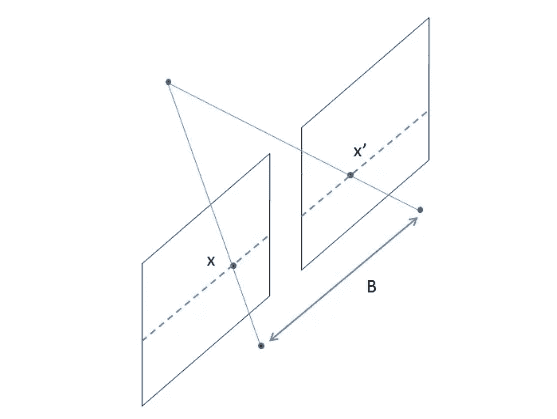

在上图所示的理想相机配置下，相机仅通过水平平移分开，因此所有的核线都是水平的。这意味着对应的点具有相同的 y 坐标，并且搜索减少到一维线。当摄像机被这样的纯水平平移分开时，第二个摄像机的投影方程将变成:

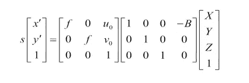

通过查看下图，这个等式会更有意义，这是数码相机的一般情况:

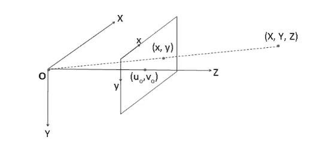

其中 *(uo，vo)* 点是经过镜头主点的直线穿过像面的像素位置。这里我们得到一个关系式:

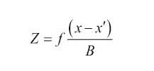

这里，术语*(x-x’)*被称为视差， *Z* 当然是深度。为了从立体对中计算深度图，必须计算每个像素的视差。

但是在实际世界中，获得这样的理想配置是非常困难的。即使我们精确地放置摄像机，它们也不可避免地会包含一些额外的过渡和旋转组件。

幸运的是，可以通过使用鲁棒的匹配算法来校正这些图像以产生所需的水平对线，该算法利用基础矩阵来执行校正。

现在让我们从获得下面立体图像的基本矩阵开始:

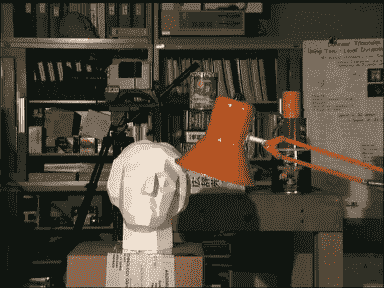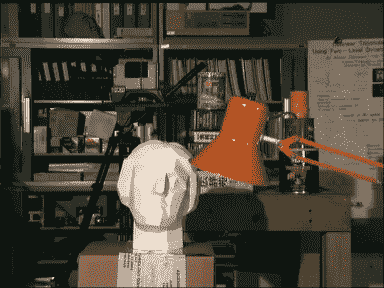

立体图像对

你可以点击[这里](https://github.com/venkateshtata/Stereo_3D_Reconstruction)从我的 GitHub 库下载上面的图片。在开始编写本教程中的代码之前，请确保您的计算机上已经构建了 opencv 和 opencv-contrib 库。如果还没有安装，我建议你在 Ubuntu 上访问[这个](https://www.pyimagesearch.com/2018/05/28/ubuntu-18-04-how-to-install-opencv/)链接来安装它们。

## 我们来编码吧！

```
#include <opencv2/opencv.hpp>
#include "opencv2/xfeatures2d.hpp"using namespace std;
using namespace cv;int main(){
cv::Mat img1, img2;img1 = cv::imread("imR.png",cv::IMREAD_GRAYSCALE);
img2 = cv::imread("imL.png",cv::IMREAD_GRAYSCALE);
```

我们做的第一件事是包含了 opencv 和 opencv-contrib 中所需的库，这是我在开始本节之前要求您构建的。在 *main()* 函数中，我们已经初始化了 *cv:Mat* 数据类型的两个变量，这是 opencv 库的成员函数， *Mat* 数据类型可以通过动态分配内存来保存任何大小的向量，尤其是图像。然后使用 *cv::imread()* 我们将这两幅图像导入到*mat*数据类型的 *img1* 和 *img2* 中。*cv::im read _ gray*参数将图像作为灰度导入。

```
// Define keypoints vector
std::vector<cv::KeyPoint> keypoints1, keypoints2;// Define feature detector
cv::Ptr<cv::Feature2D> ptrFeature2D = cv::xfeatures2d::SIFT::create(74);// Keypoint detection
ptrFeature2D->detect(img1,keypoints1);
ptrFeature2D->detect(img2,keypoints2);// Extract the descriptor
cv::Mat descriptors1;
cv::Mat descriptors2;ptrFeature2D->compute(img1,keypoints1,descriptors1);
ptrFeature2D->compute(img2,keypoints2,descriptors2);
```

这里我们利用 opencv 的 SIFT 特征检测器从图像中提取所需的特征点。如果你想更多地了解这些特征检测器是如何工作的，请访问这个[链接](https://docs.opencv.org/master/d7/d66/tutorial_feature_detection.html)。我们上面获得的描述符描述了提取的每个点，该描述用于在另一幅图像中找到它。

```
// Construction of the matcher
cv::BFMatcher matcher(cv::NORM_L2);// Match the two image descriptors
std::vector<cv::DMatch> outputMatches;
matcher.match(descriptors1,descriptors2, outputMatches);
```

*BFMatcher* 获取第一组中一个特征的描述符，并使用某种阈值距离计算将其与第二组中的所有其他特征进行匹配，然后返回最接近的特征。我们将 *BFMatches* 返回的所有匹配存储在*vector<cv::d match>*类型的输出匹配变量中。

```
// Convert keypoints into Point2f
std::vector<cv::Point2f> points1, points2;
for (std::vector<cv::DMatch>::const_iterator it=   outputMatches.begin(); it!= outputMatches.end(); ++it) { // Get the position of left keypoints
    points1.push_back(keypoints1[it->queryIdx].pt);
    // Get the position of right keypoints
    points2.push_back(keypoints2[it->trainIdx].pt);
     }
```

首先需要将获取的关键点转换成 *cv::Point2f* 类型，以便与 *cv::findFundamentalMat* 一起使用，我们将利用该函数使用我们提取的这些特征点来计算基础矩阵。两个合成向量*点 1* 和*点 2* 包含两幅图像中对应的点坐标。

```
std::vector<uchar> inliers(points1.size(),0);
cv::Mat fundamental= cv::findFundamentalMat(
  points1,points2, // matching points
     inliers,         // match status (inlier or outlier)  
     cv::FM_RANSAC,   // RANSAC method
     1.0,        // distance to epipolar line
     0.98);     // confidence probabilitycout<<fundamental; //include this for seeing fundamental matrix
```

最后，我们调用了 cv::findFundamentalMat。

```
// Compute homographic rectification
cv::Mat h1, h2;
cv::stereoRectifyUncalibrated(points1, points2, fundamental,
 img1.size(), h1, h2);
// Rectify the images through warping
cv::Mat rectified1;
cv::warpPerspective(img1, rectified1, h1, img1.size());
cv::Mat rectified2;
cv::warpPerspective(img2, rectified2, h2, img1.size());
```

正如我之前在教程中向您解释的那样，在现实世界中很难获得没有任何误差的理想摄像机配置，因此 opencv 提供了一个纠正功能，该功能应用单应变换将每个摄像机的图像平面投影到一个完全对齐的虚拟平面上。这种变换是从一组匹配点和基本矩阵中计算出来的。

```
// Compute disparity
cv::Mat disparity;
cv::Ptr<cv::StereoMatcher> pStereo = cv::StereoSGBM::create(0,               32,5);
pStereo->compute(rectified1, rectified2, disparity);cv::imwrite("disparity.jpg", disparity);
```

最后，我们计算了视差图。从下图来看，较暗的像素代表离相机较近的物体，较亮的像素代表离相机较远的物体。你在输出视差图中看到的白色像素噪声可以用一些滤镜去除，我不会在本教程中介绍。

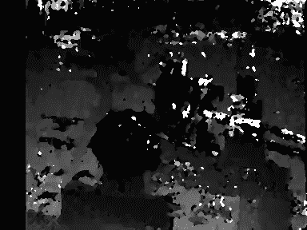

既然我们已经成功地从给定的立体对中获得了深度图。现在，让我们尝试使用 opencv 的 3D-Viz 工具将获得的二维图像点重新投影到三维空间，该工具将帮助我们绘制三维点云。

但是这一次，我们将使用**本质矩阵**来投影这些点，而不是从给定的图像点估计基础矩阵。

# 本质矩阵

本质矩阵可被视为基本矩阵，但用于校准的相机。我们也可以称之为基础矩阵的专门化，其中矩阵是使用校准的相机计算的，这意味着我们必须首先获得关于我们在世界上的相机的知识。

因此，为了估计本质矩阵，我们首先需要相机的固有矩阵(代表给定相机的光学中心和焦距的矩阵)。让我们看看下面的等式:

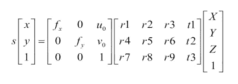

这里从第一个矩阵开始， *fx* 和 *fy* 代表相机的焦距， *(uo，vo)* 是主点。这是内在矩阵，我们的目标是估计它。

这个寻找不同摄像机参数的过程被称为**摄像机校准。显然，我们可以使用摄像机制造商提供的规格，但是对于我们将要进行的 3d 重建等任务，这些规格不够精确。因此，我们将执行我们自己的摄像机校准。**

这个想法是向摄像机显示一组场景点，我们知道这些点在现实世界中的实际三维位置，然后观察这些点在获得的图像平面上的投影位置。利用足够数量的 3-D 点和相关的 2-D 图像点，我们可以从投影方程中提取精确的摄像机参数。

做到这一点的一种方法是从不同的视点拍摄世界上一组具有已知三维位置的三维点的若干图像。我们将利用 opencv 的校准方法，其中一种方法将棋盘的图像作为输入，并返回给我们所有的角。我们可以自由地假设电路板位于 Z=0，X 和 Y 轴与网格对齐。在下一节中，我们将看看 OpenCV 的这些校准函数是如何工作的。

# 三维场景重建

让我们首先创建三个函数，我们将在主函数中使用它们。这三个功能是

*   *addchesboardpoints()*//返回给定棋盘图像的角点
*   *calibrate()* //从提取的点返回固有矩阵
*   *triangulate()*//返回重建点的三维坐标

```
#include "CameraCalibrator.h"#include <opencv2/opencv.hpp>
#include "opencv2/xfeatures2d.hpp"using namespace std;
using namespace cv;std::vector<cv::Mat> rvecs, tvecs;// Open chessboard images and extract corner points
int CameraCalibrator::addChessboardPoints(
         const std::vector<std::string>& filelist, 
         cv::Size & boardSize) {// the points on the chessboard
std::vector<cv::Point2f> imageCorners;
std::vector<cv::Point3f> objectCorners;// 3D Scene Points:
// Initialize the chessboard corners 
// in the chessboard reference frame
// The corners are at 3D location (X,Y,Z)= (i,j,0)
for (int i=0; i<boardSize.height; i++) {
  for (int j=0; j<boardSize.width; j++) {objectCorners.push_back(cv::Point3f(i, j, 0.0f));
   }
 }// 2D Image points:
cv::Mat image; // to contain chessboard image
int successes = 0;
// for all viewpoints
for (int i=0; i<filelist.size(); i++) {// Open the image
        image = cv::imread(filelist[i],0);// Get the chessboard corners
        bool found = cv::findChessboardCorners(
                        image, boardSize, imageCorners);// Get subpixel accuracy on the corners
        cv::cornerSubPix(image, imageCorners, 
                  cv::Size(5,5), 
                  cv::Size(-1,-1), 
      cv::TermCriteria(cv::TermCriteria::MAX_ITER +
                          cv::TermCriteria::EPS, 
             30,    // max number of iterations 
             0.1));     // min accuracy// If we have a good board, add it to our data
      if (imageCorners.size() == boardSize.area()) {// Add image and scene points from one view
            addPoints(imageCorners, objectCorners);
            successes++;
          }//Draw the corners
        cv::drawChessboardCorners(image, boardSize, imageCorners, found);
        cv::imshow("Corners on Chessboard", image);
        cv::waitKey(100);
    }return successes;
}
```

在上面的代码中，你可以看到我们包含了一个头文件“CameraCalibrator.h”，它将包含这个文件的所有函数声明和变量初始化。你可以通过访问这个[链接](https://github.com/venkateshtata/Stereo_3D_Reconstruction)在我的 Github 下载这个头文件以及本教程中的所有其他文件。

我们的函数使用 opencv 的*findchesboardcorners()*函数，该函数将图像位置数组(该数组必须包含每个棋盘图像的位置)和棋盘大小(您应该输入水平和垂直方向上棋盘中存在的角的数量)作为输入参数，并返回包含角位置的向量。

```
double CameraCalibrator::calibrate(cv::Size &imageSize)
{
  // undistorter must be reinitialized
  mustInitUndistort= true;// start calibration
  return 
     calibrateCamera(objectPoints, // the 3D points
          imagePoints,  // the image points
          imageSize,    // image size
          cameraMatrix, // output camera matrix
          distCoeffs,   // output distortion matrix
          rvecs, tvecs, // Rs, Ts 
          flag);        // set options}
```

在这个函数中，我们使用了 *calibrateCamera()* 函数，该函数获取上面获得的三维点和图像点，并返回给我们固有矩阵、旋转向量(描述相机相对于场景点的旋转)和平移矩阵(描述相机相对于场景点的位置)。

```
cv::Vec3d CameraCalibrator::triangulate(const cv::Mat &p1, const cv::Mat &p2, const cv::Vec2d &u1, const cv::Vec2d &u2) {// system of equations assuming image=[u,v] and X=[x,y,z,1]
  // from u(p3.X)= p1.X and v(p3.X)=p2.X
  cv::Matx43d A(u1(0)*p1.at<double>(2, 0) - p1.at<double>(0, 0),
  u1(0)*p1.at<double>(2, 1) - p1.at<double>(0, 1),
  u1(0)*p1.at<double>(2, 2) - p1.at<double>(0, 2),
  u1(1)*p1.at<double>(2, 0) - p1.at<double>(1, 0),
  u1(1)*p1.at<double>(2, 1) - p1.at<double>(1, 1),
  u1(1)*p1.at<double>(2, 2) - p1.at<double>(1, 2),
  u2(0)*p2.at<double>(2, 0) - p2.at<double>(0, 0),
  u2(0)*p2.at<double>(2, 1) - p2.at<double>(0, 1),
  u2(0)*p2.at<double>(2, 2) - p2.at<double>(0, 2),
  u2(1)*p2.at<double>(2, 0) - p2.at<double>(1, 0),
  u2(1)*p2.at<double>(2, 1) - p2.at<double>(1, 1),
  u2(1)*p2.at<double>(2, 2) - p2.at<double>(1, 2));cv::Matx41d B(p1.at<double>(0, 3) - u1(0)*p1.at<double>(2,3),
                p1.at<double>(1, 3) - u1(1)*p1.at<double>(2,3),
                p2.at<double>(0, 3) - u2(0)*p2.at<double>(2,3),
                p2.at<double>(1, 3) - u2(1)*p2.at<double>(2,3));// X contains the 3D coordinate of the reconstructed point
  cv::Vec3d X;
  // solve AX=B
  cv::solve(A, B, X, cv::DECOMP_SVD);
  return X;
}
```

上述函数采用投影矩阵和归一化的图像点，这些点可以通过使用上一个函数的固有矩阵获得，并返回上述点的三维坐标。

下面是从立体对三维重建的完整代码。这个代码需要至少 25 到 30 个棋盘图像，这些图像来自你拍摄立体像对的同一台相机。为了首先在您的 PC 上运行这段代码，克隆我的 GitHub repo，用您自己的立体对替换立体对，用您自己的数组替换棋盘图像位置数组，然后编译。我上传了一个棋盘图片的例子给你参考，你需要拍摄大约 30 个这样的图片并在代码中提及。

```
int main(){cout<<"compiled"<<endl;const std::vector<std::string> files = {"boards/1.jpg"......};
  cv::Size board_size(7,7);CameraCalibrator cal;
  cal.addChessboardPoints(files, board_size);cv::Mat img = cv::imread("boards/1.jpg");cv::Size img_size = img.size();
  cal.calibrate(img_size);
  cout<<cameraMatrix<<endl;cv::Mat image1 = cv::imread("imR.png");
  cv::Mat image2 = cv::imread("imL.png");// vector of keypoints and descriptors
  std::vector<cv::KeyPoint> keypoints1;
  std::vector<cv::KeyPoint> keypoints2;
  cv::Mat descriptors1, descriptors2;// Construction of the SIFT feature detector
  cv::Ptr<cv::Feature2D> ptrFeature2D = cv::xfeatures2d::SIFT::create(10000);// Detection of the SIFT features and associated descriptors
  ptrFeature2D->detectAndCompute(image1, cv::noArray(), keypoints1, descriptors1);
  ptrFeature2D->detectAndCompute(image2, cv::noArray(), keypoints2, descriptors2);// Match the two image descriptors
  // Construction of the matcher with crosscheck
  cv::BFMatcher matcher(cv::NORM_L2, true);
  std::vector<cv::DMatch> matches;
  matcher.match(descriptors1, descriptors2, matches);cv::Mat matchImage;cv::namedWindow("img1");
  cv::drawMatches(image1, keypoints1, image2, keypoints2, matches, matchImage, Scalar::all(-1), Scalar::all(-1), vector<char>(), DrawMatchesFlags::NOT_DRAW_SINGLE_POINTS);
  cv::imwrite("matches.jpg", matchImage);// Convert keypoints into Point2f
  std::vector<cv::Point2f> points1, points2;for (std::vector<cv::DMatch>::const_iterator it = matches.begin(); it != matches.end(); ++it) {
    // Get the position of left keypoints
    float x = keypoints1[it->queryIdx].pt.x;
    float y = keypoints1[it->queryIdx].pt.y;
    points1.push_back(cv::Point2f(x, y));
    // Get the position of right keypoints
    x = keypoints2[it->trainIdx].pt.x;
    y = keypoints2[it->trainIdx].pt.y;
    points2.push_back(cv::Point2f(x, y));
  }// Find the essential between image 1 and image 2
  cv::Mat inliers;
  cv::Mat essential = cv::findEssentialMat(points1, points2, cameraMatrix, cv::RANSAC, 0.9, 1.0, inliers);cout<<essential<<endl;// recover relative camera pose from essential matrix
  cv::Mat rotation, translation;
  cv::recoverPose(essential, points1, points2, cameraMatrix, rotation, translation, inliers);
  cout<<rotation<<endl;
  cout<<translation<<endl;// compose projection matrix from R,T
  cv::Mat projection2(3, 4, CV_64F); // the 3x4 projection matrix
  rotation.copyTo(projection2(cv::Rect(0, 0, 3, 3)));
  translation.copyTo(projection2.colRange(3, 4));
  // compose generic projection matrix
  cv::Mat projection1(3, 4, CV_64F, 0.); // the 3x4 projection matrix
  cv::Mat diag(cv::Mat::eye(3, 3, CV_64F));
  diag.copyTo(projection1(cv::Rect(0, 0, 3, 3)));
  // to contain the inliers
  std::vector<cv::Vec2d> inlierPts1;
  std::vector<cv::Vec2d> inlierPts2;
  // create inliers input point vector for triangulation
  int j(0);
  for (int i = 0; i < inliers.rows; i++) {
    if (inliers.at<uchar>(i)) {
      inlierPts1.push_back(cv::Vec2d(points1[i].x, points1[i].y));
      inlierPts2.push_back(cv::Vec2d(points2[i].x, points2[i].y));
    }
  }
  // undistort and normalize the image points
  std::vector<cv::Vec2d> points1u;
  cv::undistortPoints(inlierPts1, points1u, cameraMatrix, distCoeffs);
  std::vector<cv::Vec2d> points2u;
  cv::undistortPoints(inlierPts2, points2u, cameraMatrix, distCoeffs);// Triangulation
  std::vector<cv::Vec3d> points3D;
  cal.triangulate(projection1, projection2, points1u, points2u, points3D);cout<<"3D points :"<<points3D.size()<<endl;viz::Viz3d window; //creating a Viz window//Displaying the Coordinate Origin (0,0,0)
  window.showWidget("coordinate", viz::WCoordinateSystem());window.setBackgroundColor(cv::viz::Color::black());//Displaying the 3D points in green
  window.showWidget("points", viz::WCloud(points3D, viz::Color::green()));
  window.spin();
}
```

我知道 medium 的代码显示很混乱，特别是对于 C++，因此甚至代码看起来也很混乱，所以我建议你去我的 [GitHub](https://github.com/venkateshtata/Stereo_3D_Reconstruction) 了解上面的代码。

对我来说，给定对的输出如下所示，可以通过调整特征检测器及其类型来改进。

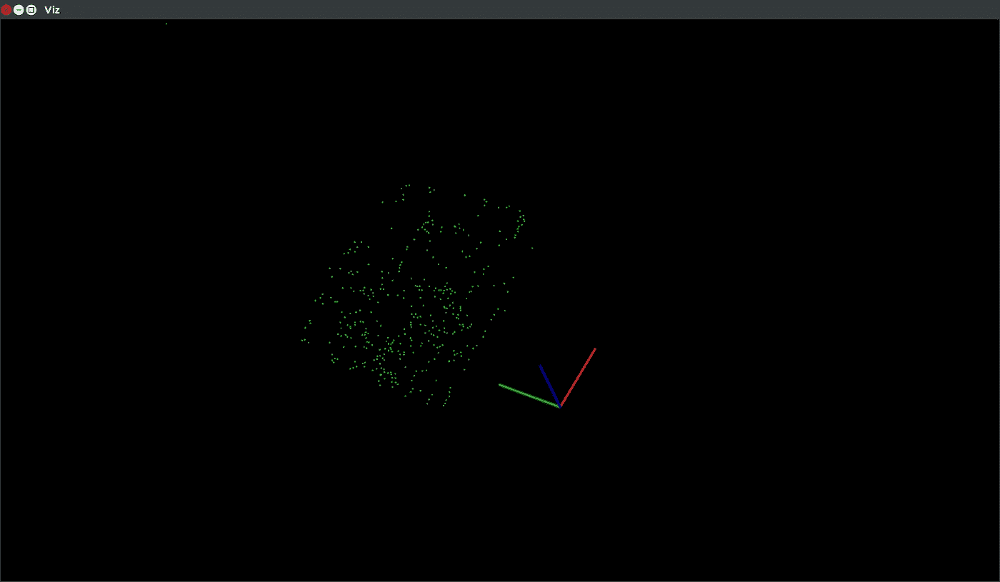

任何对深入学习这些概念感兴趣的人，我会推荐下面这本书，我认为它是计算机视觉几何学的圣经。也是本教程的参考书。

> [计算机视觉中的多视图几何第二版](http://cvrs.whu.edu.cn/downloads/ebooks/Multiple%20View%20Geometry%20in%20Computer%20Vision%20(Second%20Edition).pdf)——作者理查德·哈特利和安德鲁·齐泽曼。

如果你有任何问题，请在评论区告诉我。

谢谢你。