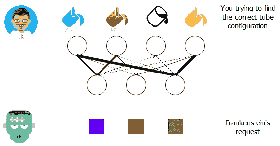
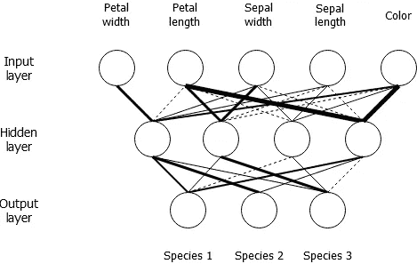
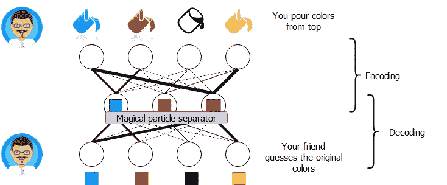
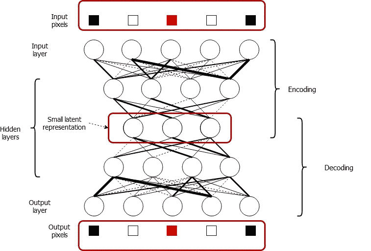
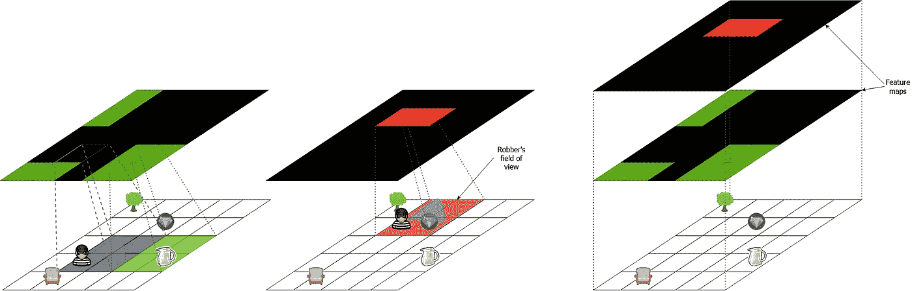
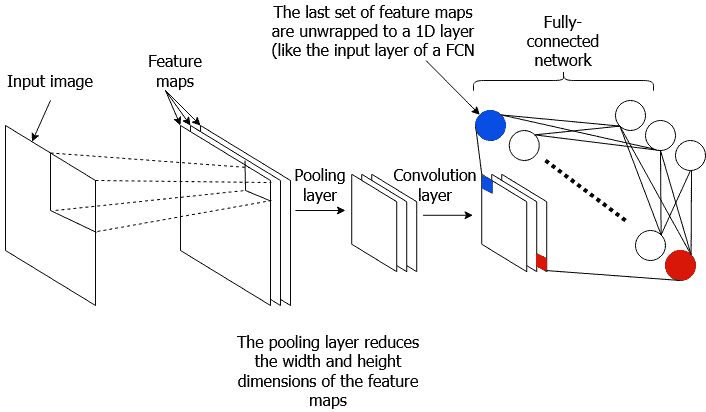

# 不到 5 分钟的 3 个深度学习算法—第 1 部分(前馈模型)

> 原文：<https://towardsdatascience.com/3-deep-learning-algorithms-in-under-5-minutes-part-1-feed-forward-models-1065992e2ccd?source=collection_archive---------15----------------------->

图片由来自 [Pixabay](https://pixabay.com/?utm_source=link-attribution&utm_medium=referral&utm_campaign=image&utm_content=959578) 的 [Thomas Breher](https://pixabay.com/users/TBIT-715211/?utm_source=link-attribution&utm_medium=referral&utm_campaign=image&utm_content=959578) 拍摄

如果你认为机器学习是你没有勇气与之交谈的暗恋对象，深度学习就是你暗恋对象的父亲！由于硬件的前所未有的进步和研究人员对更好更大模型的渴望，深度学习日益变得令人生畏和难以捉摸。每天涌现的研究越多，你应该掌握的基础知识水平就越高。所以，对于那些犹豫是否直接投入到深度学习的阴暗和俗气的好处中的人，我希望这篇文章能增强你的信心。本文不会讨论这些模型的任何数学问题，但会为您提供概念上的强化，让您在血淋淋的数学过程中走得更远。

# 全连接网络

你能找到的最简单的深层网络。它通常有一个输入层，一个输出层和可选的中间多个隐藏层。让下面的类比来解释。

## 类比:弗兰肯斯坦的实验室

想象你是科学怪人实验室的助手，那里充满了古怪的设备。弗兰肯斯坦刚刚要求你使用下面的仪器，用蓝色、红色、黑色和黄色的颜料来制作紫色、深橙色和绿色。当你把颜料倒在顶部时，根据管子开口的宽度，颜料会流到下面的一系列球上。有一种机制可以改变管子的大小。

管子的结构。线条的粗细表示管的厚度。你可以把虚线想象成非常小(或者不存在)的管子

这类似于 FCN 的工作原理。你给它输入，即特征向量(例如花的各种属性)(例子中的油漆桶)，然后你预测结果(例如花的种类)(例子中的混合颜色)。预测结果是一系列的数学计算(包括矩阵乘法、加法等。).您可能已经意识到该设备已经被配置为最佳配置。达到最佳设置被称为*训练/优化*一个模型，它涉及输入特征向量、预测标签和真实标签(在示例中调整管宽度)。它也不需要仅仅是输入层和输出层。你也可以有中间层(即隐藏层)。这是 FCN 真正的样子。(了解更多:[这里](https://www.oreilly.com/library/view/tensorflow-for-deep/9781491980446/ch04.html))

一种 FCN，用于在给定一些花卉属性的情况下预测正确的花卉种类。

## 应用程序

*   结构化数据的简单分类任务，例如根据房屋属性预测房价

# 自动编码器

自动编码器是一种全连接网络，不同之处仅在于它们的使用方式。它们从一个输入开始，就像 FCNs 一样，将其映射到一个更小的隐藏表示(称为编码)，最后重建原始输入(称为解码)。

## 类比:回到科学怪人的实验室

假设你和你的朋友有两个以上的小工具，并决定玩他们。您将它们组合起来，以便它们共享输出。现在看起来像下面。请注意，底部的管配置是顶部的镜像。

你和你朋友发明的小玩意。你把颜色倒在顶部和底部，你会得到相同的颜色。

你可以从顶部倒颜色，让它们在中间混合。那么一个可以分离不同颜色的“神奇粒子分离器”就会让颜色分离到原来的颜色。你甚至可以在顶部倒一种随机的颜色，让这个流形在底部找出随机的颜色。

这就是自动编码器中发生的情况。它接受一个输入(本例中为 paint)，计算一个较小的潜在表示(本例中为混合颜色)，最后导出原始输入(本例中为底部的颜色)。这是在真正的自动编码器中的样子。(了解更多:[自动编码器](http://ufldl.stanford.edu/tutorial/unsupervised/Autoencoders/))

自动编码器在现实生活中是什么样子的。它接受一些输入(例如图像像素)，将其转换为较小的表示形式，然后重建原始输入。

## 应用程序

*   恢复损坏的图像-您可以训练自动编码器通过输入损坏的图像并要求模型预测原始图像来恢复图像(类似于识别倒在顶部的随机颜色)。
*   图像/数据聚类-您可以使用学习到的较小潜在表示作为数据的特征表示代理，从而对数据进行聚类

# 卷积神经网络

啊！计算机视觉的征服者。CNN 非常擅长处理图像。CNN 由卷积层、全连接层和可选的汇集层组成。CNN 接收具有高度、宽度和通道(例如 RGB —红绿蓝)的图像。

## 类比:博物馆抢劫！

有一个令人讨厌的逃犯正试图闯入博物馆偷一颗钻石。他走进博物馆计划抢劫。他把地板分成一个 5x5 的格子。然后，他从一个牢房走到另一个牢房，每行从左到右。然后他会查看四个相邻的单元格(即他所在的一个单元格、右边的单元格、上面的单元格和右上角的单元格)。如果他在视野中看到一些障碍物/艺术品，他会在正上方的天花板上射出一个绿色的夜光标记，如果钻石在这 4 个单元中的一个，他会射出一个红色的夜光标记。如果他站在地板上的每个细胞都这样做，他会有下面的计划。有了这个，他可以在晚上偷偷溜进来，即使在漆黑一片的时候也能准确地知道去哪里！

强盗将如何绘制博物馆的地图。你可以看到，在他偷偷摸摸的小冒险结束时，他得到了两张特征地图，可以帮助他在地板上导航，而不会触发任何警报。

这就是 CNN 的卷积层所做的。它移动一个内核(强盗想要映射的东西)，这个内核一次只看到图像的一小部分，覆盖在图像上(就像强盗去所有的单元格)。并且在每个位置，它将输出一些值(例如，障碍物是否存在)。这一过程导致了要素地图的开发，这些地图提供了有用的宏观分析信息。最后，将 FCN 连接到最后一个卷积层，因为任何分类/回归任务都需要 FCN。这是典型的 CNN 的样子。(了解更多:[卷积神经网络](/light-on-math-machine-learning-intuitive-guide-to-convolution-neural-networks-e3f054dd5daa?source=---------13------------------))。

一个真正的 CNN。它接收图像并使用卷积层生成多个特征图。可选地，网络具有池化图层，这从本质上减少了要素地图的宽度和高度(有助于减少模型的参数计数),最后还有一个完全连接的网络，允许您进行分类/回归。

## 应用程序

*   图像分类—识别图像中存在的对象的类别
*   对象检测—识别图像中的所有对象及其位置

# 结论

我们看了三种算法:全连接网络(FCNs)、自动编码器和卷积神经网络(CNN)。以下是主要的几点。

*   FCN 接受输入特征向量并预测正确的输出类别
*   自动编码器接收输入，将其转换为较小的表示形式，并重建原始输出
*   CNN 接收一幅图像，通过一系列卷积/池层发送，最后通过 FCN，预测图像中存在的正确对象类别。

# 想在深度网络和 TensorFlow 上做得更好？

检查我在这个课题上的工作。

[1] [(书)TensorFlow 2 在行动——曼宁](https://www.manning.com/books/tensorflow-in-action)

[2] [(视频课程)Python 中的机器翻译](https://www.datacamp.com/courses/machine-translation-in-python) — DataCamp

[3] [(书)TensorFlow 中的自然语言处理 1](https://www.amazon.com.au/Natural-Language-Processing-TensorFlow-Ganegedara/dp/1788478312/ref=sr_1_25?dchild=1&keywords=nlp+with+tensorflow&qid=1603009947&sr=8-25) — Packt

# 新的！加入我的新 YouTube 频道

如果你渴望看到我关于各种机器学习/深度学习主题的视频，请确保加入 [DeepLearningHero](https://www.youtube.com/channel/UC1HkxV8PtmWRyQ39MfzmtGA/) 。

# 其他文章

[第二部分:深度序列模型](/3-deep-learning-algorithms-in-under-5-minutes-part-2-deep-sequential-models-b84e3a29d9a8)