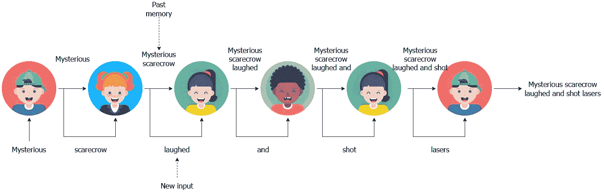
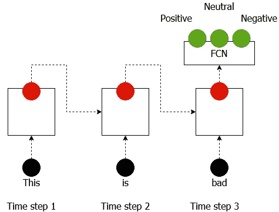
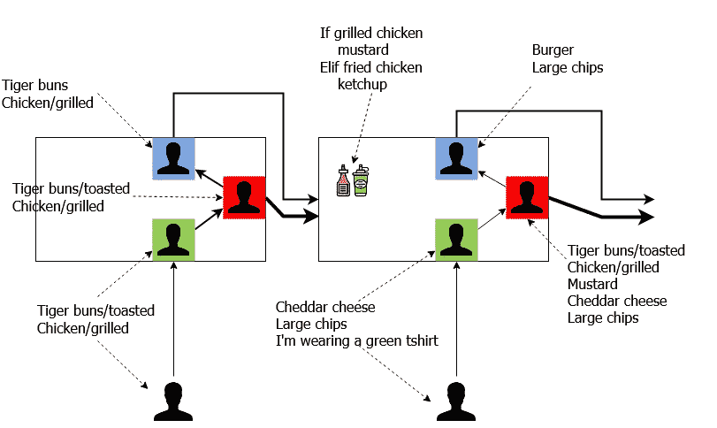
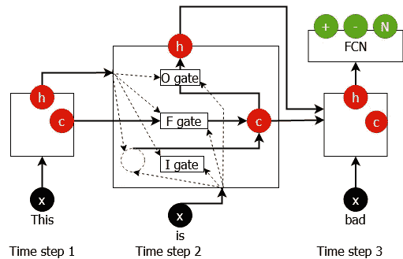
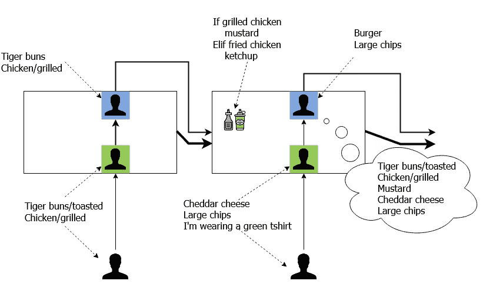
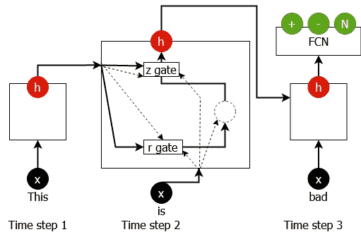

# 不到 5 分钟的 3 种深度学习算法—第 2 部分(深度序列模型)

> 原文：<https://towardsdatascience.com/3-deep-learning-algorithms-in-under-5-minutes-part-2-deep-sequential-models-b84e3a29d9a8?source=collection_archive---------36----------------------->

图片由来自 [Pixabay](https://pixabay.com/?utm_source=link-attribution&utm_medium=referral&utm_campaign=image&utm_content=1694404) 的[埃里克·斯坦](https://pixabay.com/users/erik_stein-2524241/?utm_source=link-attribution&utm_medium=referral&utm_campaign=image&utm_content=1694404)拍摄

在[的上一篇文章](/3-deep-learning-algorithms-in-under-5-minutes-part-1-feed-forward-models-1065992e2ccd)中，我们研究了处理非时间序列数据的模型。是时候把我们的注意力转向其他模型了。这里我们将讨论深度序列模型。它们主要用于处理/预测时间序列数据。

[链接到第 1 部分](/3-deep-learning-algorithms-in-under-5-minutes-part-1-feed-forward-models-1065992e2ccd)，以防你错过。

# 简单递归神经网络/Elman 网络

简单的递归神经网络(也称为 RNNs)对于时间序列问题就像 CNN 对于计算机视觉一样。在时间序列问题中，您向模型提供一个值序列，并要求它预测该序列的下一个 *n* 值。rnn 遍历序列的每个值，同时建立它所看到的记忆，这有助于它预测未来会是什么样子。(了解更多关于 RNNs[【1】](http://karpathy.github.io/2015/05/21/rnn-effectiveness/)[【2】](https://en.wikipedia.org/wiki/Recurrent_neural_network#Elman_networks_and_Jordan_networks))

## 类比:新改进的秘密列车

我小时候玩过这个游戏，你可能知道它的另一个名字。孩子们被要求站成一排，你对排在队伍中的第一个孩子耳语一个随机单词。这个孩子应该在这个单词上加上一个合适的单词，然后小声告诉下一个孩子，等等。当信息到达最后一个孩子时，你应该有一个由孩子的想象力酝酿的令人兴奋的故事。

输入简单的 RNNs！这就是 RNN 的症结所在。它在时间 t — *x(t)* (来自最后一个孩子的新单词)和从时间 *t-1* — *h(t-1)* (消息的先前单词)开始的状态作为输入，并产生输出— *y(t)* (先前的消息+来自最后一个孩子的新单词+您的新单词)。

一旦训练了一个 RNN，你就可以(但一般不会)永远保持预测，因为对时间 t 的预测(即 *y(t)* )在 t+1 成为输入(即 *y(t)=x(t+1)* )。这是 RNN 在现实世界中的样子。

RNN 如何解决情感分析问题。它从一个单词到另一个单词，同时产生一个状态(红球)。最后，有一个完全连接的网络(FCN)，它采用最后一个状态并产生一个标签(正/负/中性)。

## 应用程序

*   时间序列预测(例如天气/销售预测)
*   情感分析——给定一个电影/产品评论(一系列单词),预测它是负面/正面/中性的。
*   语言建模——给定故事的一部分，想象故事的其余部分/ [从描述中生成代码](https://analyticsindiamag.com/open-ai-gpt-3-code-generator-app-building/)

# 长短期记忆网络

LSTM 是 RNN 镇最酷的新成员。LSTM 是一个比 RNNs 更复杂的野兽，能够记住比 RNNs 更长的事情。LSTMs 还会遍历序列的每个值，同时建立它所看到的内容的记忆，这有助于它预测未来会是什么样子。但是记得 RNNs 只有一个状态(代表记忆)吗？LSTMs 有两种状态(一种长期状态和一种短期状态)，因此得名 LSTMs。(了解更多: [LSTMs](https://colah.github.io/posts/2015-08-Understanding-LSTMs/) )

## 类比:快餐连锁店

所有这些解释都让我饿了！所以让我们去一家快餐连锁店。这是一个字面上的连锁，因为如果你点了一顿饭，一家店做汉堡，另一家做薯条，等等。在这个快餐店里，你去了第一家店，说了下面的话。

> 我需要一个汉堡，里面有烤老虎面包和烤鸡。

有一个人接受订单(绿色)，并将信息发送给红色的人，假设他烤了面包。与蓝人交流时，他可以放下敬酒的部分，说:

> 一个汉堡，有老虎面包和烤鸡

(我们仍然需要烤的部分，因为下一家商店基于此决定酱料)。然后你开车到下一个商店说，

> 加上切达干酪，大薯条，我穿了一件绿色 t 恤

现在，绿色的人知道他的 t 恤颜色是完全不相关的，并放弃了这一部分。该商店还从上一个商店的红色和蓝色中获取信息。接下来他们会加入调味汁，准备薯条。第二家商店中的红色人员将持有大部分订单说明，以备我们稍后需要(如果客户投诉)。但他只会说，

> 一个汉堡和大薯条

蓝色的人，因为这是他工作所需要的。最后，您从第二个商店的输出终端获得订单。

快餐连锁店。有三个人；绿色(输入)、红色(单元状态)和蓝色(输出状态)。它们还可以从您提供的输入中丢弃某些信息，以及在内部处理它们时丢弃信息。

LSTMs 与这个链条的运作方式相差不远。在给定的时间 t，

*   输入 x(t)(本例中的客户)，
*   输出状态 h(t-1)(来自先前商店的蓝色人)和
*   a 细胞状态 c(t-1)(前一家店的红人)。

并产生，

*   一个输出状态 h(t)(这个商店里的蓝色人)和
*   a 细胞状态 c(t)(本店红人)

但是，LSTM 没有对这些元素进行直接计算，而是有一个门控机制，可以用来决定允许这些元素传递多少信息。例如，记得当顾客说“我在第二家商店穿了一件绿色 t 恤”时发生了什么，绿色的人(输入门)丢弃了该信息，因为它对订单不重要。另一个例子是，当红色的人在第一家商店扔掉了面包烘烤的部分。LSTM 的牢房里有许多扇门。即，

*   输入门(绿色的人)——丢弃输入中无用的信息。
*   遗忘之门(红人的一部分)——丢弃在之前的细胞状态中无用的信息
*   一个输出门(蓝色人的一部分)——丢弃单元状态中无用的信息，生成输出状态

如您所见，交互是复杂的。但是最重要的是，

> LSTM 保持两种状态(输出-短期状态和单元状态-长期状态),并在计算最终和中期输出时使用门控来丢弃信息。

这是 LSTM 的样子。

现实世界中的 LSTM。你可以看到这是一个复杂的连接迷宫。因此，不要试图理解它们在这一点上是如何连接的。了解所涉及的各种实体。红色虚线球表示由 LSTM 单元计算的中间输出

## 应用程序

*   与 RNNs 相同

# 门控循环单元

唷！我离开的时候，LSTMs 真的花了不少时间。GRU 是 LSTMs 的继承者，它简化了 LSTMs 未来的机制，而没有过多地损害性能。(了解更多:格鲁什[【1】](http://colah.github.io/posts/2015-08-Understanding-LSTMs/)[【2】](/illustrated-guide-to-lstms-and-gru-s-a-step-by-step-explanation-44e9eb85bf21#:~:text=An%20LSTM%20has%20a%20similar,operations%20within%20the%20LSTM%27s%20cells.&text=These%20operations%20are%20used%20to,to%20keep%20or%20forget%20information.))

## 类比:快餐连锁店 v2.0

不是作为一个美食评论家，但我们之前看到的快餐连锁店看起来相当低效。有没有办法让它更有效率？这里有一个方法。

新的改良快餐连锁店。我们不再有红色的人。这将导致更少的延误，并有助于更快地获得您的货物。

1.  去掉红色的人(细胞状态)。现在长时记忆和短时记忆都由绿人管理(输出状态)。
2.  只有一个输入门和一个输出门(即没有遗忘门)

你可以把 GRU 看作是简单的 RNN 和 LSTMs 之间的一个中间者。这是 GRU 的样子。

现实世界中的 GRU。虽然不像 LSTMs 那么复杂，但还是有点难以下咽。因此，不要试图理解它们在这一点上是如何连接的。了解所涉及的各种实体。红色虚线球表示由 GRU 单元计算的中间输出。

## 应用:

*   与 RNNs 相同

# 结论

我们看了简单的 rnn、LSTMs 和 gru。以下是主要的几点。

*   简单 RNNs——从一个时间步到另一个时间步的简单模型，同时在每一步生成一个输出状态(无门控机制)
*   LSTMs —相当复杂。有两种状态；单元状态(长期)和输出状态(短期)。它还有一个门控机制来控制流经模型的信息量。
*   GRUs——RNNs 和 LSTMs 的折衷。只有一个输出状态，但仍有门控机制。

接下来将包括深度学习中最热门的话题；变形金刚。

如果你喜欢我分享的关于数据科学和机器学习的故事，考虑成为会员吧！

 [## 通过我的推荐链接加入媒体

### 作为一个媒体会员，你的会员费的一部分会给你阅读的作家，你可以完全接触到每一个故事…

thushv89.medium.com](https://thushv89.medium.com/membership) 

# 想在深度网络和 TensorFlow 上做得更好？

检查我在这个课题上的工作。

[1] [(书)TensorFlow 2 在行动——曼宁](https://www.manning.com/books/tensorflow-in-action)

[2] [(视频课程)Python 中的机器翻译](https://www.datacamp.com/courses/machine-translation-in-python) — DataCamp

[3] [(书)TensorFlow 中的自然语言处理 1](https://www.amazon.com.au/Natural-Language-Processing-TensorFlow-Ganegedara/dp/1788478312/ref=sr_1_25?dchild=1&keywords=nlp+with+tensorflow&qid=1603009947&sr=8-25) — Packt

# 新的！加入我的新 YouTube 频道

如果你渴望看到我关于各种机器学习/深度学习主题的视频，请确保加入 [DeepLearningHero](https://www.youtube.com/channel/UC1HkxV8PtmWRyQ39MfzmtGA/) 。

# 以前的文章

[第 1 部分](/3-deep-learning-algorithms-in-under-5-minutes-part-1-feed-forward-models-1065992e2ccd):前馈模型