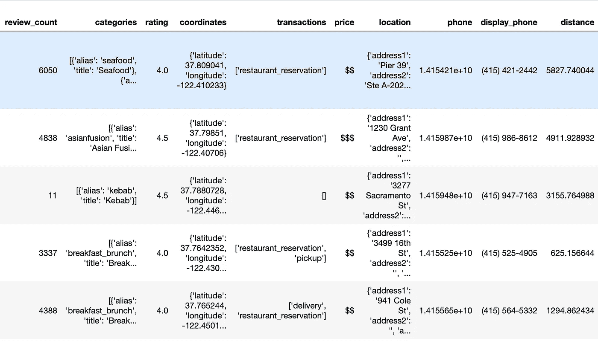
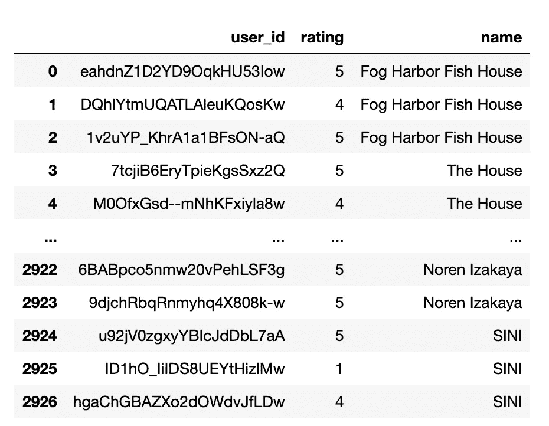

# 为旧金山的餐馆建立推荐系统的 3 种不同技术

> 原文：<https://towardsdatascience.com/3-different-techniques-to-build-recommender-systems-for-restaurants-based-in-san-francisco-cb5c3754449e?source=collection_archive---------59----------------------->

## 饿了吗？这里有一些推荐餐厅的方法！


由[粘土银行](https://unsplash.com/@claybanks?utm_source=medium&utm_medium=referral)在 [Unsplash](https://unsplash.com?utm_source=medium&utm_medium=referral) 上拍摄

生活在像旧金山这样的大都市，这个城市有这么多令人惊叹的餐馆。在本文中，我将构建几个推荐系统来推荐旧金山的类似餐馆。

**收集数据**

收集的数据来自 Yelp API。Yelp 提供了一个 API，允许用户查询商家。为了从 Yelp 获取数据，你必须建立一个[开发者账户](https://www.yelp.com/developers)并创建一个应用程序。Yelp 将为您生成一个客户端 ID 和 API 密钥，这些凭证将作为您查询数据的身份验证令牌。

这个[文档](https://www.yelp.com/developers/documentation/v3/get_started)将为您提供如何查询数据的端点。看一看他们。

对于这种情况，我们感兴趣的是位于旧金山的餐馆和位置。这将是与我的查询相关的端点:

```
[https://api.yelp.com/v3/businesses/search?term=restaurants&location='San](https://api.yelp.com/v3/businesses/search?term=restaurants&location='San) Francisco'
```

通过 URL，我们能够查询数据

```
import requestsreq_business_string = "[https://api.yelp.com/v3/businesses/search?term=restaurants&location='San](https://api.yelp.com/v3/businesses/search?term=restaurants&location='San) Francisco'"r = requests.get(req_business_string, 
                 headers={"content-type":"application/json", 
                          "authorization": "Bearer " + auth_token})
```

`auth_token`将是您创建应用程序时提供给您的 API 密钥。

```
json = r.json()
businesses = json['businesses']
```

通过运行上面的命令，您将能够从 API 收集业务。请记住，上面的字符串被过滤到旧金山的餐馆，这是将返回的结果。现在你有了旧金山餐馆的数据。

```
{'id': 'f-m7-hyFzkf0HSEeQ2s-9A',
  'alias': 'fog-harbor-fish-house-san-francisco-2',
  'name': 'Fog Harbor Fish House',
  'image_url': 'https://s3-media1.fl.yelpcdn.com/bphoto/Lv7tIRX3Bim9bKqtWifmNg/o.jpg',
  'is_closed': False,
  'url': 'https://www.yelp.com/biz/fog-harbor-fish-house-san-francisco-2?adjust_creative=vBso-HM6oooiiw4hc86H-A&utm_campaign=yelp_api_v3&utm_medium=api_v3_business_search&utm_source=vBso-HM6oooiiw4hc86H-A',
  'review_count': 6050,
  'categories': [{'alias': 'seafood', 'title': 'Seafood'},
   {'alias': 'bars', 'title': 'Bars'}],
  'rating': 4.0,
  'coordinates': {'latitude': 37.809041, 'longitude': -122.410233},
  'transactions': ['restaurant_reservation'],
  'price': '$$',
  'location': {'address1': 'Pier 39',
   'address2': 'Ste A-202',
   'address3': '',
   'city': 'San Francisco',
   'zip_code': '94133',
   'country': 'US',
   'state': 'CA',
   'display_address': ['Pier 39', 'Ste A-202', 'San Francisco, CA 94133']},
  'phone': '+14154212442',
  'display_phone': '(415) 421-2442',
  'distance': 5827.740044156521}
```

这是返回的结果。

除了获取餐馆数据，我们还想收集特定餐馆的评论。我们可以通过查看[评论端点](https://www.yelp.com/developers/documentation/v3/business_reviews)并执行类似的查询来查询数据。

现在我们有了餐馆和评论的数据。我们将保存到一个 csv 文件中，这样我们就不需要再次查询 Yelp API。

**分析数据**

流程的下一步是理解数据和分析数据。基于上一步，我将数据存储在一个 csv 文件中。

```
import pandas as pdrestaurants_df = pd.read_csv('data/restaurants.csv')
restaurants_df.head()
```

我将数据保存到一个名为`restaurants.csv`的数据文件夹中。



下面是 restaurants 表的屏幕截图，某些列以数组或散列格式表示。这不是建模的理想格式，我们必须将数据转换成数字格式。类似地，reviews 表确实将用户作为散列格式，我们希望解析它，以便每一列都表示一个值，而不是一个散列。


由[拉斯·维格](https://unsplash.com/@solitsocial?utm_source=medium&utm_medium=referral)在 [Unsplash](https://unsplash.com?utm_source=medium&utm_medium=referral) 拍摄的照片

**清除数据**

为了进行建模，我们需要以正确的格式准备和修改数据。这包括一次热编码，并将散列分解成每一列的单个值。

查看餐馆表，我们有散列格式的类别、坐标和位置。我们必须将它们转换成单值列。

```
import ast
address = []
city = []
state = []
country = []
zipcode = []
for idx, row in restaurants_df.iterrows():
    location = ast.literal_eval(row['location'])
    address.append(location['address1'])
    city.append(location['city'])
    state.append(location['state'])
    country.append(location['country'])
    zipcode.append(location['zip_code'])

address_df = pd.DataFrame(address).rename(columns={0: 'address'})
city_df = pd.DataFrame(city).rename(columns={0: 'city'})
state_df = pd.DataFrame(state).rename(columns={0: 'state'})
country_df = pd.DataFrame(country).rename(columns={0: 'country'})
zip_code_df = pd.DataFrame(zipcode).rename(columns={0: 'zip_code'})lat = []
long = []
for idx, row in restaurants_df.iterrows():
    coord = ast.literal_eval(row['coordinates'])
    lat.append(coord['latitude'])
    long.append(coord['longitude'])

lat_df = pd.DataFrame(lat).rename(columns={0: 'latitude'})
long_df = pd.DataFrame(long).rename(columns={0: 'longitude'})categories_hash = {}
for idx, row in enumerate(restaurants_df['categories']):
    lst = []
    rows = ast.literal_eval(row)
    for cat in rows:
        lst.append(cat['title'])

    categories_hash[idx] = ", ".join(lst)
categories_df = pd.DataFrame.from_dict(categories_hash, orient='index').rename(columns={0: 'cuisines'})
```

上面的代码将把散列转换成具有特定值的独立数据帧。

有了这些创建的数据帧，我们可以通过在数据帧上执行一个`get_dummies`方法来执行一次热编码。

```
cuis = categories_df['cuisines'].str.split(", ")
cuisines_dummies = pd.get_dummies(cuis.apply(pd.Series).stack()).sum(level=0)transaction_df = pd.DataFrame(restaurants_df['transactions'].apply(lambda x: ", ".join(ast.literal_eval(x)) if len(ast.literal_eval(x)) > 0 else "none"))
trans = transaction_df['transactions'].str.split(", ")
transaction_dummies = pd.get_dummies(trans.apply(pd.Series).stack()).sum(level=0)
```

一旦它们被转换为 one-hot 编码，我们就可以连接数据帧并删除不相关的列(出于建模的目的，我们需要这些列采用数字格式，因此可以删除带有字符串的列)。

```
restaurants_sim_df = pd.concat([restaurants_df, lat_df, long_df, address_df, city_df, state_df, country_df, zip_code_df, cuisines_dummies, transaction_dummies], axis=1).drop(columns=['categories', 'coordinates', 'is_closed', 'transactions', 'phone', 'location', '_id', 'id', 'alias', 'name', 'image_url', 'url', 'review_count','display_phone', 'address', 'city', 'state', 'country','zip_code', 'distance', 'delivery', 'none', 'pickup', 'restaurant_reservation'])
```

在这个片段中，我将原始数据帧与创建的其他数据帧连接起来。我删除了不需要的列。在最终结果中，我只剩下带有数值的列。

**推荐系统**

在这篇文章中，我将使用不同的技术构建 3 个不同的推荐系统。

1.  利用餐馆特征的内容过滤
2.  使用自然语言处理的基于内容的过滤
3.  基于模型的协同过滤

**基于内容的过滤**

*   餐馆的特点


[活动创建者](https://unsplash.com/@campaign_creators?utm_source=medium&utm_medium=referral)在 [Unsplash](https://unsplash.com?utm_source=medium&utm_medium=referral) 上的照片

对于这个推荐系统，我们正在寻找具有相似特征的推荐餐馆，即美食、位置、价格、交易。

利用这些因素，我们基于以上使用余弦相似度创建了一个矩阵来推荐餐馆。余弦相似性是基于向量的相似性度量。

```
from sklearn.metrics.pairwise import cosine_similaritycos_sim = cosine_similarity(restaurants_sim_df, restaurants_sim_df)
```

*   自然语言处理

在这项技术中，我们将使用文本来推荐餐馆。该文本将来自用户的评论和类似的餐馆，有类似的文本将被推荐。

我们将查看由 reviews 端点生成的 reviews 表。它有不同餐馆用户的评论，包括评论的描述。

```
reviews_df = user_reviews_df.groupby('slug').agg({'text': ' '.join})
```

首先，我们必须将来自相同餐馆的所有文本组合成一行。例如，B & C 的评论 A 可能属于餐馆 A。我们将把这些评论组合在一起，以便它们代表单个餐馆的相同评论。

```
from nltk.corpus import stopwords
import string
from nltk.tokenize import sent_tokenize
from nltk.tokenize import word_tokenize
import nltk
nltk.download('words')
words = set(nltk.corpus.words.words())stopwords_ = set(stopwords.words('english'))
punctuation_ = set(string.punctuation)def filter_tokens(sent):
    return([w for w in sent if not w in stopwords_ and not w in punctuation_])def cleaned_text(string):
    word_list = []
    sent_tokens = sent_tokenize(string)
    tokens = [sent for sent in map(word_tokenize, sent_tokens)]

    tokens_lower = [[word.lower() for word in sent]
                 for sent in tokens]
    tokens_filtered = list(map(filter_tokens, tokens_lower))
    for tlist in tokens_filtered:
        for w in tlist:
            if w != '...':
                word_list.append(w)

    return " ".join(word_list)reviews_df['cleaned_text'] = reviews_df['text'].apply(lambda t: cleaned_text(t))
```

在这一步中，我们对文本进行清理，例如删除停用词和标点符号。

`cleaned_text`表示删除了停用词和标点符号的文本。

```
from sklearn.feature_extraction.text import CountVectorizercorpus = reviews_df['cleaned_text']tf = CountVectorizer()document_tf_matrix = tf.fit_transform(corpus)
doc_sim = cosine_similarity(document_tf_matrix, document_tf_matrix)
```

使用计数矢量器创建矩阵，并执行余弦相似性。

**基于模型的协同过滤**

在这项技术中，我们将需要一个用户项过滤。最后两种技术是逐项过滤。


[瓦列里·安德鲁斯科](https://unsplash.com/@voodushevlyonniy?utm_source=medium&utm_medium=referral)在 [Unsplash](https://unsplash.com?utm_source=medium&utm_medium=referral) 上的照片

在 reviews 表中，我们有餐馆名称、用户名和评级。我们可以创建一个新的矩阵，只包含这些列，这样它将成为一个用户条目矩阵。

```
ratings_df = reviews_df.merge(restaurants_name_df, left_on='slug', right_on='alias')
ratings_df.drop(columns=['slug', 'alias'], inplace=True)
```



它看起来会是什么样子的截图

我们可以在此基础上创建一个数据透视表

```
ratings_crosstab = ratings_df.pivot_table(values='rating', index='user_id', columns='name', fill_value=0)
```

由于大多数值将为 null(并非所有用户都会查看所有餐馆)，所以我用 0 填充了这些值。

看这个表，我们在这个矩阵中有许多行(餐馆)和列(用户)。为了减少列数，我们使用奇异值分解(SVD)将用户数减少到 x 列数(因子)。要阅读更多关于 SVD 的内容，请点击这里的。

```
import numpy as np
import sklearn
from sklearn.decomposition import TruncatedSVDSVD = TruncatedSVD(n_components=12, random_state=17)
resultant_matrix = SVD.fit_transform(ratings_crosstab.values.T)
```

可以生成相关矩阵

```
corr_mat = np.corrcoef(resultant_matrix)
```

一旦生成了相关矩阵，我们就能够根据索引推荐餐馆。

如果你想看看我是如何用不同的推荐技术生成餐馆的，请看看知识库！

[](https://github.com/yueweng/yelp_recommender_restaurants) [## 悦翁/yelp _ 推荐者 _ 餐厅

### Yelp 提供了一个我可以查询商家的 API。在这个项目中，我专注于获得餐厅，所以…

github.com](https://github.com/yueweng/yelp_recommender_restaurants)