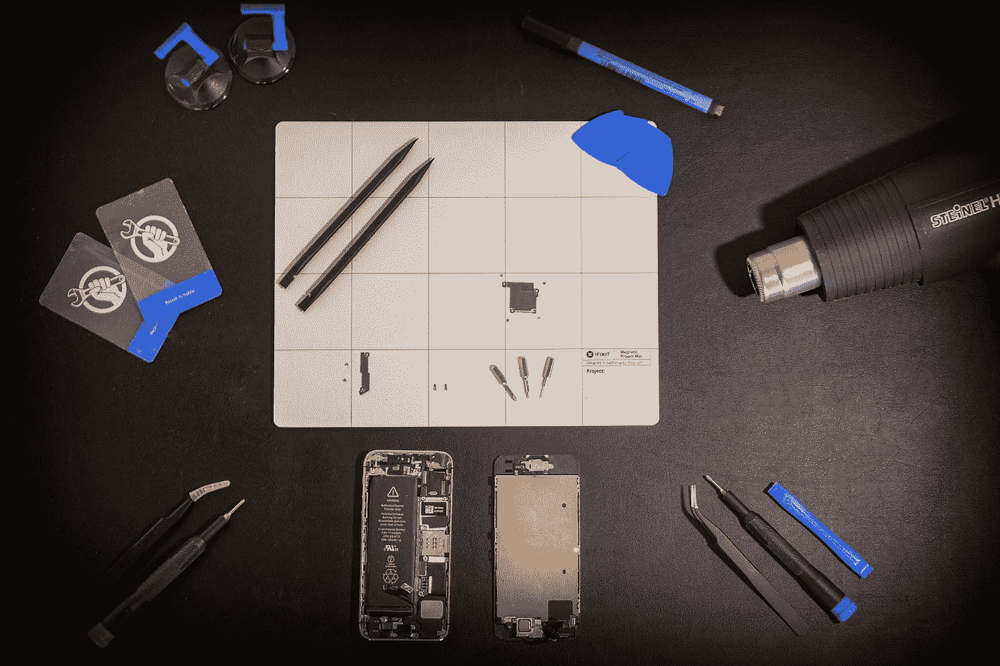

# 在数据科学领域取得成功的三个要做和三个不要做

> 原文：<https://towardsdatascience.com/3-dos-and-3-don-ts-to-become-successful-in-data-science-c49e2c293a56?source=collection_archive---------15----------------------->

## 意见

## 我希望开始时就知道的黄金法则。深入了解如何转变为一名成功的 ML 或 DS 从业者

照片由 [Nghia Le](https://unsplash.com/@lephunghia?utm_source=medium&utm_medium=referral) 在 [Unsplash](https://unsplash.com?utm_source=medium&utm_medium=referral) 上拍摄

数据科学和人工智能是巨大的领域，我喜欢每天都在努力改进。

到了现代，最被炒作和谈论的是实体。随着数据科学和人工智能的持续发展和不断成就，世界对每天出现的各种机会充满敬畏。

然而，要成为一名成功的数据科学家或机器学习实践者，有一些黄金规则必须遵循，以提高他们期望的任务或项目的生产率和整体效率。

我构建机器学习和深度学习模型已经有相当一段时间了，并且一直在从事各种项目。根据我的个人经验，这是我想与大家分享的三个要做和三个不要做的列表，这样你就可以启动并开始你的史诗般的旅程，或将你的成功轨迹提高到天文数字的水平。

让我们开始学习对您的数据科学未来最重要的方面。

# 1.做:广泛的研究持续的研究

[绿色变色龙](https://unsplash.com/@craftedbygc?utm_source=medium&utm_medium=referral)在 [Unsplash](https://unsplash.com?utm_source=medium&utm_medium=referral) 上拍照

人工智能和数据科学最棒的部分是这些学科每天都在不断发展。技术的进步正在迅速增加。了解数据科学领域的最新趋势和新兴发展变得越来越重要。

研究是任何数据科学项目不可或缺的一部分。对人工智能领域的发展有所了解或至少有一个简单的概念是至关重要的。

研究一个项目或任何特定的任务，甚至只是一个简单的数据科学术语是非常必要的。感谢每个人，尤其是专家对这个问题的看法，因为他们每个人都有自己的观点，你可以适应和学习。

因此，研究和批判性思维是将你的技能提升到一个完全不同的水平的少数方法之一。

**我的建议:**我强烈建议观看大量来自优质数据科学、人工智能、数学或编程频道的 YouTube 视频。阅读书籍和最重要的研究论文是绝对知识和理解任何特定主题或数据科学方面的必要条件。

# 1.不要:放弃！

由[尼克·舒利亚欣](https://unsplash.com/@tjump?utm_source=medium&utm_medium=referral)在 [Unsplash](https://unsplash.com?utm_source=medium&utm_medium=referral) 上拍摄的照片

数据科学有时会很难，尤其是对于试图入门的初学者来说。你看看这个领域的潜在话题，它可能会吓到不少人。

与编程类似，数据科学的有趣之处在于，你犯的每一个错误都会让你学到新的东西，以及你做错了什么，前提是你通过在互联网上查找或自己破解找到了解决方案。这种感觉让整体体验更加令人满意。

如果你第一次尝试无法解决机器学习或数据科学问题，也不要担心。只要你坚持不懈，找到解决方案，更好地理解这些概念，这是完全没问题的。

此外，如果这能让你感觉更好的话，即使是这个领域的专家也会犯错误，并且不得不查找资料来解决某些问题。这个领域可能是唯一一个你不需要记很多东西的领域，因为你可以用谷歌来记你忘记的东西。

我的建议:我强烈建议你改变对挑战性任务的看法，并更加享受它们。每一次失败都应该被视为成功的垫脚石，仅此而已。在数据科学中，你犯的错误越多，你学到的就越多。所以，振作起来，继续学习！

# 2.待办事项:实际实施

乔尔·罗兰在 [Unsplash](https://unsplash.com?utm_source=medium&utm_medium=referral) 上拍摄的照片

要欣赏数据科学的真正魅力，你需要尝试许多项目。能完成的任务，能解决的问题，绝对了不起。

从理论上理解机器学习概念的直觉和这些数据科学概念背后的数学至关重要。

但是，您还需要知道如何在现实生活的实际场景中实现以下项目。不要害怕接触一些代码，自己实现这些项目。

这方面的一个例子可以是任何机器学习或深度学习概念。让我们考虑一个多层感知器或神经网络反向传播的例子。你可能知道这些概念在数学上和理论上是如何工作的。

太棒了。但同样重要的是实际执行这些，并通过您的执行来实现此类任务的解决方案。这有助于你提高，也有助于你突破面试。

**我的建议:**即使它只是一个简单的机器学习算法，我也强烈建议不要使用 scikit-learn 库或类似的有用工具来实现更简单的实现。相反，试着发现最好的可能性，然后自己从头开始执行。这有助于提高技能并更好地理解这些概念。

# 2.不要:犹豫是否寻求帮助

由[安妮·斯普拉特](https://unsplash.com/@anniespratt?utm_source=medium&utm_medium=referral)在 [Unsplash](https://unsplash.com?utm_source=medium&utm_medium=referral) 上拍摄

在数据科学中，陷入长期致力于解决的问题并不罕见。最棒的是，数据科学有一个非常棒的社区，里面有非常乐于助人的人和大量资源供您使用。

堆栈溢出、不和谐频道、YouTube 视频、免费在线代码营、GitHub、走向数据科学等。都是有用的资源，可供我们所有人利用和提高我们的技能。

与他人和专家交流分享想法是学习更多知识的好方法。不能有效地沟通会导致很多问题，比如你可能会对某个特定的话题产生误解。

此外，与人交谈非常有助于分享你的观点，以及获得知识。通过与更多的人交谈，你会产生更好的想法，最重要的是互动，这在与数据科学项目团队合作的公司中非常有用。

**我的建议:**刚开始的时候，我会犹豫是否要寻求帮助。我认为最好靠自己找到这些问题的所有解决方案。很长一段时间以来，我认为这是最佳实践，但这只是部分正确。有时你可能误解了一个概念，或者没有做好某件事。自己尝试后，如果还是有困惑，问问能帮你解惑的朋友或专家是个不错的做法！

# 3.Do:不断探索，建立新项目，积极参与！

本·怀特在 [Unsplash](https://unsplash.com?utm_source=medium&utm_medium=referral) 上的照片

人工智能和数据科学领域非常广阔。有太多的东西值得好奇和探索。有很多数学功能，机器学习和深度学习的多个方面的深入理论。

实践变得很重要，让自己跟上所有最新的趋势，并处理这个巨大领域中正在进行的技术。随着不断的发展，每个方面都有很大的空间。所以，继续编码，继续致力于实际的实现！

尽量积极参加网站上的比赛。Kaggle 就是这样一个网站，它主办了一些最好的数据科学相关竞赛。不要担心你是第几名。只要你能学到新东西，这没多大关系。

有很多网站可以提高你的编码水平，也可以参加像 HackerRank 这样的比赛，你应该考虑一下。加入社区有助于不断向其他数据科学爱好者学习更多知识。

**我的建议:**我对这个 Do 的建议类似于我在文章第二个 Do 中的建议。有大量的实际项目和想法可以实施。只要选择一个你喜欢的项目，然后开始着手去做。多做项目是保持学习的最好方法！多找项目，不断升级技能！

# 3.不要:一旦你解决了一个问题，就不要停止寻找更好的解决方案！

照片由[斯科特·格雷厄姆](https://unsplash.com/@sctgrhm?utm_source=medium&utm_medium=referral)在 [Unsplash](https://unsplash.com?utm_source=medium&utm_medium=referral) 上拍摄

祝贺您完成数据科学项目！

但是嘿！你可以做更多的事情来改进你的项目。数据科学领域的美妙之处在于它为您提供了多种选择。总有比你能尝试并相应实现的更好的东西。

为了让你们更好地理解我在这一点上的意思，请随时重温我的前两篇关于人类情感和手势识别项目的文章。你可以通过下面的链接来完成。

 [## 使用深度学习的人类情感和手势检测器:第 1 部分

### 了解如何从零开始构建具有深度学习的人类情感和手势检测器。

towardsdatascience.com](/human-emotion-and-gesture-detector-using-deep-learning-part-1-d0023008d0eb)  [## 使用深度学习的人类情感和手势检测器:第 2 部分

### 深入探究人类情感和手势识别

towardsdatascience.com](/human-emotion-and-gesture-detector-using-deep-learning-part-2-471724f7a023) 

你可以观察我在这些文章的第一部分和第二部分中发布的情感模型。我建立的最好的定制深度学习模型是经过了大量的试错。我对自己能够取得的成绩感到高兴。但是对于同一个问题的第二个模型，经过更多的尝试和概念上的理解，我能够获得更高的准确性和更好的结果。

你在数据科学领域构建的每个模型，完成的每个项目，都有很大的提升空间。考虑备选方案和各种其他方法或改进，以获得更好的结果，这始终是一个好的做法。

我的建议:在最初的日子里，我常常会因为完成一个项目而兴奋不已，以至于我会放松下来，继续下一个任务。这也是一件很好的事情，但是通常有办法将你的项目提高到下一个水平。在迈向下一个目标之前，列出你可以改进的地方。😃

由 [Johannes Plenio](https://unsplash.com/@jplenio?utm_source=medium&utm_medium=referral) 在 [Unsplash](https://unsplash.com?utm_source=medium&utm_medium=referral) 上拍摄的照片

# 结论:

用几句话总结我们在本文中讨论的所有内容，在我看来，最重要的收获是保持专注于数据科学的不断发展，在一致的基础上建立更多的机器学习或深度学习项目，每天都学习新的东西，阅读更多的研究论文，并保持实践。

有时你可能在第一次尝试时没有得到想法或项目，只要你从每次失败中学到新的东西，这完全没问题。遇到困难时，不要犹豫寻求帮助，并不断整合你的技能，以发挥你的最大潜力。

如果你对这篇文章有任何疑问或建议，请随时告诉我，我会尽快给你们答复。

看看我的其他一些文章，你可能会喜欢读！

 [## 用代码和例子理解 Python 中的高级函数！

### 详细了解 python 中的匿名函数和高级函数及其实际应用…

towardsdatascience.com](/understanding-advanced-functions-in-python-with-codes-and-examples-2e68bbb04094)  [## 简单有趣的万圣节 Python 项目！

### 这是一个有趣的“不给糖就捣蛋”的游戏，让你在万圣节愉快地学习 python 编程

towardsdatascience.com](/simple-fun-python-project-for-halloween-ff93bbd072ad)  [## 2020 年及以后最受欢迎的 10 种编程语言

### 讨论当今 10 种最流行的编程语言的范围、优缺点

towardsdatascience.com](/10-most-popular-programming-languages-for-2020-and-beyond-67c512eeea73) 

谢谢你们坚持到最后。我希望你们都喜欢这篇文章。祝大家有美好的一天！