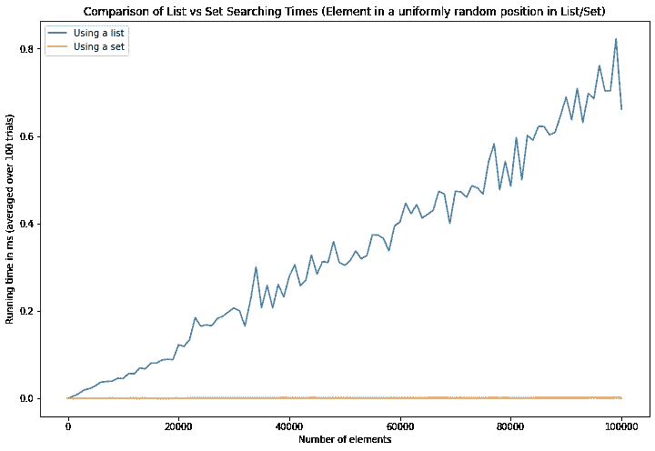
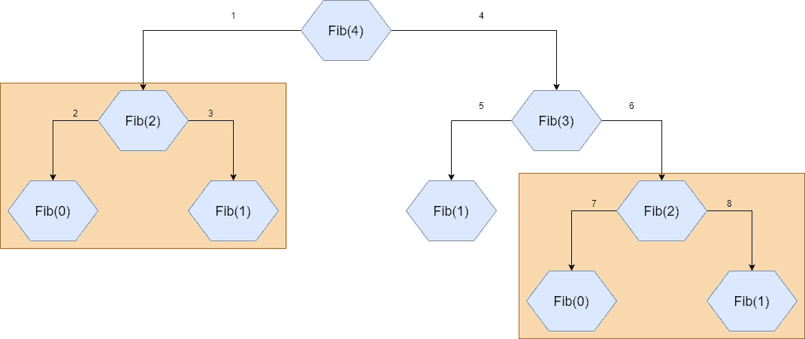
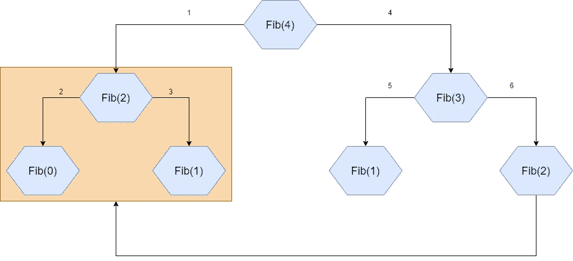
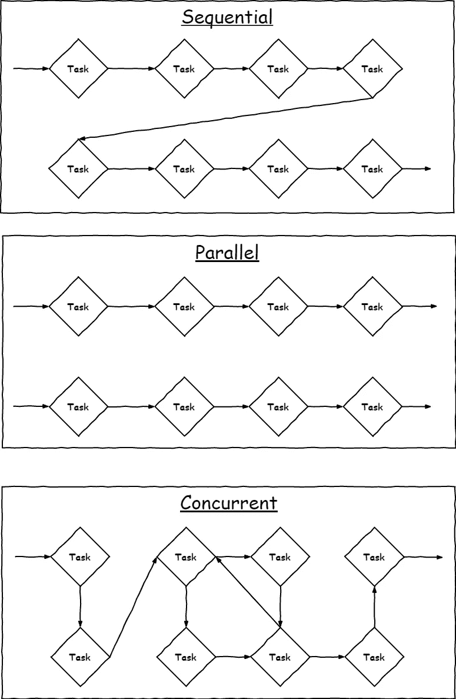

# 3 种简单且非侵入性的方法可以立即提升您的 Python 代码性能

> 原文：<https://towardsdatascience.com/3-easy-and-noninvasive-ways-to-instantly-boost-your-python-code-performance-b21cd823f37e?source=collection_archive---------8----------------------->

## 对于想要更快的代码，但不想钻研低级优化的人来说，这是一个小指南。


由 [Unsplash](https://unsplash.com?utm_source=medium&utm_medium=referral) 上的 [chuttersnap](https://unsplash.com/@chuttersnap?utm_source=medium&utm_medium=referral) 拍摄

我看到的一个常见模式是人们没有充分利用 Python 标准库。虽然这不必要地膨胀了代码，使维护更加困难，但也可能导致**低效和缓慢的代码**。因此，在本文中，我想解决后一个问题，并向您展示一些能够让您编写更快代码的东西。

> 在我将要向你展示的非常简单的优化之后，程序可以运行数千倍，而你几乎不用付出任何努力。这就是等待一分钟或等待一整天来完成一个程序的区别。

由于我是数学家，所以我喜欢处理高层次的问题。我不想移动位，从我的代码中获得最后的性能。我钦佩能做到这一点的工程师，我很高兴他们给了我们这么多伟大而高效的程序，但这不是我自己喜欢做的事情。

然而，有时我不得不自己编码一些东西。它发生了。当它出现时，我使用一些非常简单的技巧来加快速度，而不会太深入。

这是我给你的建议。

# 1.使用集合

集合对很多任务都很有用。从高层次来看，您可以将集合视为不允许重复值的列表。写作

```
l = [1, 1, 2, 3, 3, 3]
s = set(l)
```

将留给您集合 s = {1，2，3}。您可以使用[并集、交集、补集和对称差](https://en.wikipedia.org/wiki/Set_(mathematics))将几个集合组合成新的集合。您可以检查一个集合是否包含在另一个集合中。可能性是无限的！

但是我**真正**想告诉你的是:当你想检查一堆元素是否包含在一个*列表中时，使用集合——对不起，集合！*

想象一下，我们得到一串小于 50，000 的随机数，我们必须测试它们是否是素数。此外，我们还想检查得出一个素数的概率是多少。所以，让我们先定义 50，000 以内的质数。

```
def is_prime(n):
    for i in range(2, n):
        if n%i == 0:
            return False
    return True

primes = [n for n in range(2, 50000) if is_prime(n)]
```

现在，我们可以开始通过[蒙特卡洛模拟](https://en.wikipedia.org/wiki/Monte_Carlo_method)计算概率。这是通过将我们抽取的素数的个数除以抽取的数的总数来完成的。

```
n_numbers = 10000
counter = 0

some_numbers_to_test = np.random.randint(0, 50000, n_numbers)

for number in some_numbers_to_test:
    if number in primes:
        counter += 1

probability = counter / n_numbers
print(probability)
```

这段代码在我的机器上运行了大约 **6 秒**，但是我们在这里使用的时间非常少，所以此时**应该不会发生**！我希望是几毫秒，甚至几纳秒。

## 问题是

你猜对了，问题是`primes`是一个列表。测试，如果一个元素被包含在一个列表中，平均花费列表长度的**线性时间，因为每个元素都必须被一个接一个地检查！这意味着:如果你有一个包含 10，000 个元素的列表，并且搜索一个元素需要 1 秒，那么如果你在包含 1，000，000 个元素的列表中搜索这个元素，将需要 100 秒。**

当然，我们可以运气好，我们寻找的元素是在开始，然后搜索很快。但是平均来说，我们可以期望我们的元素在中间的某个地方，在最坏的情况下**元素甚至不在列表**中，我们查看列表中的所有元素。

## 解决方案

用套！神奇的是，在内部，集合中的元素得到了[散列](https://en.wikipedia.org/wiki/Hash_function)。简单地说，你可以把它看作每个元素都有一个固定的地址，有点像普通数组。这样，检查一个元素是否在一个集合中归结为散列元素，查看地址，敲门，看看是否有人在那里。这可以在恒定时间内完成(散列通常可以忽略不计)。

比较列表和集合中的搜索时间，在我的机器上得到以下结果:



你可以清楚地看到，列表搜索时间线性增长，而设置的搜索时间保持不变。

所以，让我们用一种非常简单的方式来修改我们的代码:

```
primes = set(primes) # <- the fix!

n_numbers = 10000
counter = 0

some_numbers_to_test = np.random.randint(0, 50000, n_numbers)

for number in some_numbers_to_test:
    if number in primes:
        counter += 1

probability = counter / n_numbers
print(probability)
```

现在代码在我的机器上运行的时间是 2 毫秒，这是 3000 倍的巨大进步！

> 关于概率的注意事项:根据[素数定理](https://en.wikipedia.org/wiki/Prime_number_theorem)实际在 1/ln(50000)≈9.24%左右！

如您所见，提升代码非常容易。它只需要添加一点点关键字`set`。

# 2.隐藏物

有时，尤其是在使用递归函数时，一些函数值会被反复计算。以斐波那契数列为例。

```
def fibonacci(n):
    if n in [0, 1]: # a list is ok here ;)
        return 1
    else:
        return fibonacci(n-2) + fibonacci(n-1)
```

在我的机器上，计算第 35 个斐波那契数需要大约 4 秒，这也是相当慢的。我不想去想当我计算第 100 个数的时候会发生什么。但是为什么呢？

## 问题是

如果你像这样执行它，它是有效的，但是它也是非常低效的，因为许多函数值被反复计算。以`fibonacci(4)`的执行树为例:



斐波那契(4)调用斐波那契(2)和斐波那契(3)，依此类推。我用箭头旁边的小数字表示了执行的顺序。

您可以看到 fibonacci(2)是在两个不同的地方计算的:第 7 次和第 8 次调用是多余的，因为这两次调用与第 2 次和第 3 次调用完全相同。

斐波纳契数越高，问题就越严重。树变得更深，因此会出现越来越多的重复和浪费的重新计算。如果我们计算斐波那契( *n* )，我们会重新计算 fib(2) *n* -2 次，比如。我们将重新计算 fib(3) *n* -3 次，fib(4) *n* -4 次，以此类推。，简直是灾难。

## 解决方案

从`functools`导入`lru_cache`！这是一个装饰器，使您的函数能够存储已经计算过的值，并在需要时重用它们。其他什么都不用做，导入它，修饰你的功能就行了！

```
from functools import lru_cache

@lru_cache()
def fibonacci(n):
    if n in [0, 1]: # a list is ok here ;)
        return 1
    else:
        return fibonacci(n-2) + fibonacci(n-1)
```

使用这一改进，执行树看起来更像这样:



最后一次调用只是从缓存中读取 fibonacci(2)的值，而不是再次手动计算。

您还可以看到运行时间的改进。计算第 35 个斐波那契数现在需要 **0.05 毫秒**，比以前快了 **80000 倍**！

所以，缓存肯定有帮助，尽管你必须记住你的机器上有足够的存储空间。

# 3.多进程和多线程

当没有其他帮助时，你总是可以像以前一样继续，但是并行或并发地做事情。很多资源告诉你多处理(并行性)和多线程(并发性)的区别是什么。

## 一个小小的烹饪例子

想象一下，你要炒肉、切菜、烤蛋糕。


卡罗琳·阿特伍德在 [Unsplash](https://unsplash.com?utm_source=medium&utm_medium=referral) 上的照片

如果你是一个人，你不知道如何多任务，也许你先切蔬菜，然后完全烤蛋糕。然后，你开始煎肉。当然，这很慢，但这是你的程序通常的运行方式。

相比之下，并行性就是你和几个厨师(处理者)一起完成这个任务。你团队中的一个人炸肉，另一个人切蔬菜，第三个人烤蛋糕，所有这些都在同一时间进行。这已经好多了！

> 使用多处理(并行性)，几个任务并行完成。当您必须处理大量计算繁重的任务，并且 CPU 是瓶颈时，它工作得最好。

并发是指你再次独自一人，但更聪明和/或更有经验。你把蛋糕放进烤箱，把肉扔进锅里，然后切蔬菜，在肉熟之前完成。然后你继续吃肉，最后，你再次处理蛋糕，因为它需要最多的时间。并发就是当你不得不等待一个进程完成时，不要无所事事。

> 使用多线程(并发)，总是同时完成一个任务，但是如果有等待时间，任务就会被切换。当您经常不得不等待其他进程完成，并且 I/O 是瓶颈时，它工作得最好。

我给你做了一个小图来说明不同之处:



在顺序方法中，每项任务都是一个接一个地完成的。在并行方法中，情况是一样的，但是有更多的处理器在处理它。在并发方法中，任务在各处被启动、暂停、恢复，以减少等待时间。这也可以由单个 CPU 来完成。

如果你不确定是使用多处理还是多线程，就两者都试试。Python 中的代码几乎相同，[看看这个](https://docs.python.org/3/library/concurrent.futures.html)。这就像把单词 *ThreadPoolExecutor* 换成 *ProcessPoolExecutor* 一样简单，反之亦然。

之所以会发生这种情况，是因为 CPU 受限任务和 I/O 受限任务之间的区别并不总是很明显。以图像处理为例。假设您的磁盘上有许多较大的图片，您想对它们进行一些变换。

很难事先判断加载图片是整个过程的瓶颈，还是转换本身。

现在，让我们来看一个具体的例子。想象一下，你想获取一些网站的 HTML 代码，因为你想从中解析一些东西。您的代码可能如下所示:

```
import requests

urls = ['https://google.com', 'https://yahoo.com', 'https://bing.com', 'https://amazon.com']
get_url = lambda url: requests.get(url).content

for url in urls:
    get_url(url)
```

对我来说，这大约需要 3.5 秒。同样，这可以更有效地完成！

## 问题是

你是一个不会一心二用的厨师！你请求一个网站，等到你得到它，然后去下一个。同时，你就等着吧。

以下是修复方法。

## 解决方案

你可以从`concurrent.futures`包中导入 Python 的`ThreadPoolExecutor`。然后，您可以使用`map`方法将`get_url`函数应用于所有 URL。结果被收集在*迭代器*T4 中。

```
import requests
from concurrent.futures import ThreadPoolExecutor

urls = ['https://google.com', 'https://yahoo.com', 'https://bing.com', 'https://amazon.com']
get_url = lambda url: requests.get(url).content

with ThreadPoolExecutor(max_workers=4) as executor:
    result = executor.map(get_url, urls)
```

通过这种方式，你可以向所有网站发送请求，并在收到回复时收集回复。对我来说，现在只需要 1.6 秒，大约是以前的两倍。

# 好处:使用更智能的算法

通常你可以通过这些简单且非侵入性的方法来调整你的算法的性能。不过，有时候还是想出一个更好的算法比较好。

检查一个数是否是质数有比将它除以所有可能的约数更好的方法(尽管这在第一个例子中不是问题)。有更好的方法来计算斐波纳契数列，因为有一个[封闭公式](https://en.wikipedia.org/wiki/Fibonacci_number#Closed-form_expression)可用于此！

睁大眼睛寻找更智能的算法。你不一定要自己想出来，但你至少应该搜索它们，看看它们是否真的能提高你的表现！或许你在实践中也永远不会使用[冒泡排序](https://en.wikipedia.org/wiki/Bubble_sort)(我希望如此)，而是依赖[快速排序](https://en.wikipedia.org/wiki/Quicksort)或者其他更好的排序算法，如果你碰巧必须自己编写一个排序方法的话。

# 结论

我们已经看到了一些简单的方法来改善你的问题的性能，几乎是免费的。这些方法都是高级的，每个懂一点 Python 的人都可以实现。我们学到了以下内容:

1.  **使用集合:**或者更一般的，使用正确的数据结构。有些结构非常适合写东西，有些数据结构非常适合读取条目(集合！).
2.  **缓存:**不要反复计算东西。如果你有存储空间(通常都有)，那就好好利用它。
3.  **多进程和多线程**:通常你需要计算一个不同输入的函数。并行或者并发就行，别让你的 CPU 休息！
4.  **使用更好的算法**:这种算法可能很难实现，但要经常考虑。要么自己想一个更好的算法，要么尝试在网上搜索一个适合你问题的算法。

如果你把这些建议付诸实践，你可以更快地完成工作，并且有更多的时间处理新的令人兴奋的问题！

我希望你今天学到了新的、有趣的、有用的东西。感谢阅读！

**作为最后一点，如果你**

1.  **想支持我多写点机器学习和**
2.  **无论如何，计划获得一个中等订阅，**

**为什么不做** [**通过这个环节**](https://dr-robert-kuebler.medium.com/membership) **？这将对我帮助很大！😊**

透明地说，给你的价格不变，但大约一半的订阅费直接归我。

**非常感谢，如果你考虑支持我！**

> *如有问题，在*[*LinkedIn*](https://www.linkedin.com/in/dr-robert-k%C3%BCbler-983859150/)*上写我！*