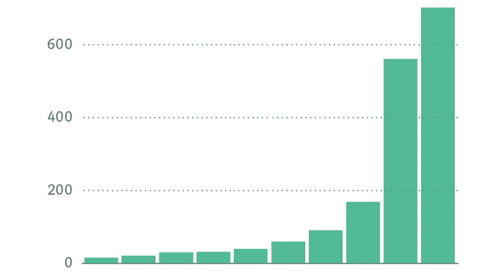

# 做出更好决策的 3 个要素

> 原文：<https://towardsdatascience.com/3-essentials-to-make-better-decisions-9b2cdc60365e?source=collection_archive---------47----------------------->

## 数据科学只是其中之一

照片由[晨酿](https://unsplash.com/@morningbrew?utm_source=medium&utm_medium=referral)在 [Unsplash](https://unsplash.com?utm_source=medium&utm_medium=referral) 拍摄

你有没有想过:

*   谷歌是如何统治 [92.1%的搜索引擎](https://gs.statcounter.com/search-engine-market-share)市场份额的？
*   脸书是如何获得社交媒体 74.1%的市场份额的？
*   微软是如何拿下桌面 OS[77.7%的市场份额的？](https://gs.statcounter.com/os-market-share/desktop/worldwide)

除了伟大的愿景之外，他们都决定如何做事，引领他们走向成功。谷歌决定专注于其搜索引擎，以提供更好的用户体验，而不是盈利。从早期采用者那里学习，脸书决定[计划它的成长，选择它进入的时间，明智地管理它的公共关系](https://www.forbes.com/sites/gilpress/2018/04/08/why-facebook-triumphed-over-all-other-social-networks/)。微软决定在构建 Windows 时考虑到兼容性，减少未来的问题，这样他们就可以有更多的创新。

> 他们都做出了伟大的决定，并赌上了胜利。

作为数据科学领域的一员，数据驱动是必须的。根据数据决定我们的行动是一件很正常的事情。毕竟工作描述里有。然而，我的导师曾经说过，“不仅仅是一个数据科学家”。后来我明白了这意味着什么。不是所有的问题都能用数据解决。也许可以，但这是最好的方法吗？

除了数据科学和分析，还有两个要素可以帮助我们做出更好的决策。找到这三者的平衡很重要，因为我们的决定决定了我们的未来。无论我们是想解决个人问题、制造产品还是创业，我们都必须决定下一步。

看一下这个图表。想象你已经建立了一个创业公司。这些条形代表你每月的产品销售额。

1.  前 8 根棒线显示稳定增长，这很好。
2.  你尝试并设法在下个月增长 3 倍。
3.  你很高兴，但对发生的事情没有绝对的概念。

从我的中等统计截图完美地展示了 3 个要点。图片作者。

通读时请记住这张图表。

# 分析学

> 根据剑桥大学的说法，分析是一个过程，在这个过程中，计算机使用数学方法检查信息，以便找到有用的模式。

数据是新的石油。分析通过数据洞察帮助我们实现更好的业务绩效。对分析的需求正在增长，催生了成为 21 世纪最性感工作的[数据科学家。如今，大多数组织已经应用描述性、规范性和预测性分析来释放他们的全部潜力。](https://hbr.org/2012/10/data-scientist-the-sexiest-job-of-the-21st-century)

我自己从事分析工作。我的大部分产出被用来决定战略行动和发现商业问题的答案。此外，它可以将新的机会转化为现实。没有数据，就像没有方向的流浪。

谷歌甚至弄了个[首席决策科学家](https://medium.com/@kozyrkov)；确保使用数据和分析来推动对其产品的决策——或者他们称之为[决策智能](https://www.wired.co.uk/article/google-chief-decision-scientist-cassie-kozyrkov)。他们投资 it 以换取更好的商业决策。

美容数据是基于事实的。只有用数据才能找到真相。

*   你的新公司运转良好吗？
*   我们能降低成本吗？
*   实施哪种策略更有效？
*   未来趋势如何？

**分析可以回答所有这些问题。**

假设您已经使用定量数据来优化流程并推动您的业务战略。你的初创企业在第 8 个月之前一直以恒定的速度增长。但是，就这样吗？难道你不想提高天花板，超越吗？你还能做什么？

# 直觉

> 根据[剑桥](https://dictionary.cambridge.org/dictionary/english/intuition)的说法，直觉是一种基于你的感觉而非事实来立即理解或知道某件事的能力。

有多少次你相信自己的直觉并成功了？大概几次吧。直觉只是在你意识到之前突然出现在你的脑海里。如果做对了，这个瞬间的想法可能会让你产生重大影响。

人们梦想去太空，但很少有人认真考虑如何到达那里。埃隆·马斯克决定相信自己的直觉和远见。然后他建立了一个创新，一个还不存在的东西。现在，他已经证明“ [SpaceX 可以做它说想做的事情](https://www.wired.co.uk/article/space-x-crew-dragon-launch)”。

然而，像他这样的直觉是独一无二的。我们其余的人呢？我们无法量化某人直觉的价值，但好消息是:随着时间的推移，每个人都可以通过[使用直觉来加强他/她的直觉。](https://doi.org/10.1177/0956797616629403)

尽管如此，当直觉得到逻辑、推理和数据的验证时，最好还是相信直觉。在工作中，我偶尔会相信自己盲目的直觉，但大多数时候，这种直觉并不奏效。仅凭感觉建立的想法更容易失败。光靠直觉是走不了多远的。毕竟每一段旅程都是马拉松，不是短跑。

第 9 个月，你相信了自己的直觉，实施了一个怪异的策略。下个月你的销售额增长了 3 倍。你很开心。出乎意料。尽管真正的原因仍然是个问题。

# 研究

> 根据剑桥大学的说法，研究是对一个主题的详细研究，尤其是为了发现(新的)信息或达成(新的)理解。

分析是定量的。直觉或多或少是个谜。研究以其定性研究填补了这一空白。有了它，我们可以获得超越感觉和数字的更深层次的理解。

在 Interbrand 举办的 2019 年最佳全球品牌[评选中，苹果排名第一，三星排名第六。作为一家手机供应商，他们以 30.9%和 24.8%的全球市场份额引领行业发展](https://www.interbrand.com/best-brands/best-global-brands/2019/ranking/)[。但是撇开这个不谈，让我们来看看](https://gs.statcounter.com/vendor-market-share/mobile)[中国的苹果](https://www.theguardian.com/technology/2015/jan/16/xiaomi-chinas-equivalent-to-apple)。

与那些创新并为用户树立标杆的前 2 名不同，小米的做法正好相反。雷军建立了一个生态系统，在这里“粉丝”共同设计并宣传他们的产品。雷认真地考虑了所有的研究和反馈，然后——拿下了[在印度](https://gs.statcounter.com/vendor-market-share/mobile/india)的市场份额第一名，把三星甩在了后面。

我们可以在数字上运用逻辑，但在反馈上运用同理心。研究可以通过了解人来回答问题。这与[高效能人士的 7 个习惯](https://www.franklincovey.com/the-7-habits.html)中的一个习惯非常吻合——“先寻求理解，再寻求被理解”。

当面对涉及几个人的问题时，我会记住这个习惯。理解他们的观点——思考——然后提供解决方案。结果:我们更快地决定了解决方案，没有不必要的争论。如果你是一个数据科学爱好者，可以考虑在这里阅读更多关于其他习惯的文章。

不管你的分析和直觉有多好，人们总是会参与其中。听听他们的声音。

但是要注意，太多没有好的感觉和数据的研究可能会导致错误的决定。一个常见的错误是糟糕的研究抽样:过多地听取少数人的意见，而忽视大多数人。

在第 10 个月的开始，你和你的客户联系并聊天。不是两个而是很多。现在你明白了你突然成长背后的原因——在接下来的一个月里，你轻而易举地创造了新的记录。

恭喜你！✋

# 找到平衡

我们每天都在做决定。有些好，有些坏。把不好的作为我们的学习曲线，每天争取更好的决策。我们决定成为什么样的人。

> "我不是环境的产物，我是我决定的产物."—斯蒂芬·R·科维

总而言之，这三个要素相互联系，相互促进:

1 分析将支持和验证你的直觉&研究。它帮助你更好地维持你的事业，并发挥其最大潜力。即便如此，过分依赖它也不会有什么结果。

2 直觉可以产生巨大的影响，并作为从你的分析研究中提取有价值见解的指南&。相信你的直觉，同时用你的经验来支持它。错误的预感可能会导致失败。

3 研究通过理解问题来丰富直觉&分析。利用定性的洞察力，你可以用多种方式复制你的决定。不过，一定要听听各种各样的人的意见。

记住:重大决策会带来巨大的风险。平衡所有这三个要素，以减轻它，并找到你的下一个最佳行动。

*这篇帖子的灵感来自“# first principles Ep06 with*[*拉维梅塔*](https://medium.com/u/4c140b794f71?source=post_page-----9b2cdc60365e--------------------------------) *”。谢谢分享！🙌*

*所有市场份额数据均为 2020 年 7 月起最近 1 年的数据，来源于*[*Statcounter Global Stats*](https://gs.statcounter.com)*。*