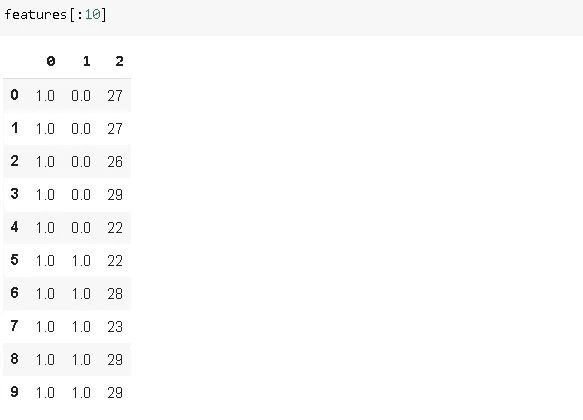
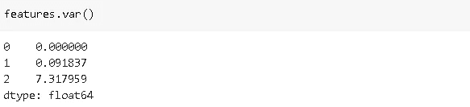
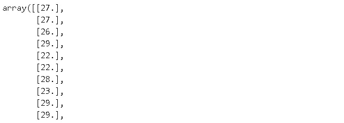
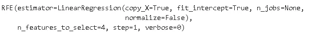
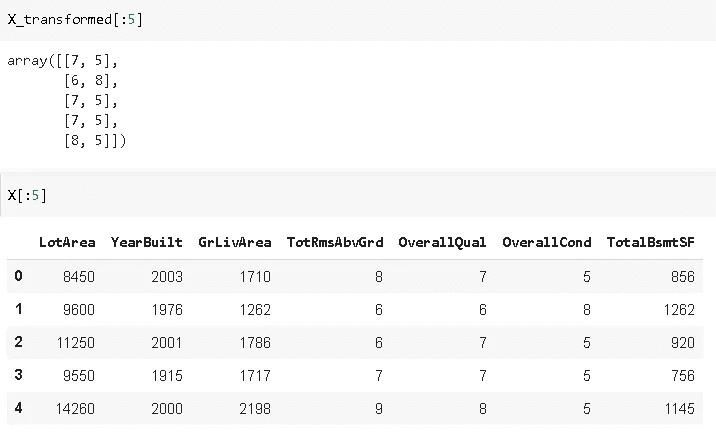

# Scikit-learn 的 3 个特征选择技术

> 原文：<https://towardsdatascience.com/3-feature-selection-techniques-of-scikit-learn-c9a5f7eb7364?source=collection_archive---------25----------------------->

## 使用 scikit-learn 增强您的数据预处理步骤。


维多利亚诺·伊斯基耶多在 [Unsplash](https://unsplash.com/s/photos/selection?utm_source=unsplash&utm_medium=referral&utm_content=creditCopyText) 上的照片

Scikit-learn 是一个广泛使用的 python 机器学习库。它以现成的机器学习算法而闻名。然而，scikit-learn 也为数据预处理提供了许多有用的工具。

数据预处理是机器学习流水线中的一个重要步骤。我们不能只是将原始数据转储到模型中。我们需要清理数据，并应用一些预处理技术，以便能够创建一个健壮而准确的机器学习模型。

特性选择仅仅意味着使用更有价值的特性。这里的价值是信息。就目标变量而言，我们希望使用信息更丰富的特性。在监督学习任务中，我们通常有许多特征(独立变量)，其中一些很可能很少或没有关于目标(因变量)的有价值的见解。另一方面，一些特征非常关键，以至于它们解释了目标的大部分变化。特征选择就是寻找那些有价值的特征。特征选择的另一个应用是降维，这意味着通过使用现有特征导出新特征来减少特征的数量。当我们有高维(大量特征)数据时，降维特别有用。

在本帖中，我们将介绍 scikit-learn 提供的 3 种特征选择技术。

# **1。变化阈值**

VarianceThreshold 移除方差小于指定阈值的要素。考虑一个对数据集中的所有观测值(行)采用相同值的要素。它不会给模型增加任何信息能力。使用此功能还会增加不必要的计算负担。因此，我们应该将它从数据集中删除。类似地，方差非常小的特征也可以被省略。

让我们创建三个具有不同方差值的要素。

```
import numpy as np
import pandas as pdcol_a = pd.Series(np.ones(50))
col_b = pd.Series(np.ones(50))
col_b[:5] = 0
col_c = pd.Series(np.random.randint(20,30, size=50))features = pd.concat([col_a,col_b,col_c], axis=1)
```



特征的差异:



我们可以创建 VarianceThreshold 的选择器实例，并使用它只选择方差大于 0.1 的要素。

```
from sklearn.feature_selection import VarianceThresholdselector = VarianceThreshold(threshold=(0.1))
selector.fit_transform(features)
```



它只选择了预期的 col_c。

# **2。递归特征消除**

顾名思义，递归特征消除(RFE)通过递归消除特征来工作。该消除是基于来自估计器的输出来完成的，该估计器将某种权重分配给特征。例如，权重可以是线性回归的系数或决策树的特征重要性。

该过程从在整个数据集上训练估计器开始。然后，删除最不重要的特征。之后，用剩余的特征训练估计器，并再次修剪最不重要的特征。重复该过程，直到达到期望的特征数量。

让我们使用一个样本房价数据集。在 kaggle 上可以获得数据集。我将只使用其中的一些功能。

```
df = pd.read_csv("/content/train_houseprices.csv")X = df[['LotArea','YearBuilt','GrLivArea','TotRmsAbvGrd',
'OverallQual','OverallCond','TotalBsmtSF']]y = df['SalePrice']
```

我们有 7 个特征和一个目标变量。下面这段代码将使用 RFE 来选择最好的 4 个特性。

```
from sklearn.linear_model import LinearRegression
from sklearn.feature_selection import RFElr = LinearRegression()
rfe = RFE(estimator=lr, n_features_to_select=4, step=1)
rfe.fit(X, y)
```



我们使用线性回归作为估计量。所需的特征数量由 **n_features_to_select** 参数决定。RFE 给每个特征分配一个等级。分配有 1 的功能是选定的功能。

```
rfe.ranking_
array([4, 1, 2, 1, 1, 1, 3])
```

# **3。从模型中选择**

与 RFE 一样，SelectFromModel 与具有系数或特征重要性属性的估计器一起使用。根据特征的权重选择更重要的特征。

让我们使用在上一节中使用的相同的特性子集。我们将使用岭回归作为估计量。作为选择特征的阈值，我们使用“均值”关键字。

```
from sklearn.feature_selection import SelectFromModel
from sklearn.linear_model import Ridgeridge = Ridge().fit(X, y)
model = SelectFromModel(ridge, prefit=True, threshold='mean')
X_transformed = model.transform(X)
```



我们从 7 个功能中选择了 2 个。所选择的特征是“总体相同”和“总体一致”，这是有意义的，因为这些是决定房子价格的关键因素。它们还与使用递归特征消除技术选择的特征相匹配。

在这种情况下，我们可以通过直觉在某种程度上确定重要的特征。然而，现实生活中的案例更加复杂，可能包含许多特征。对于这些情况，特征选择技术很方便。

Scikit-learn 提供了许多特征选择和数据预处理工具。我们已经讨论了其中的三个。您可以随时访问整个范围的文档。

感谢您的阅读。如果您有任何反馈，请告诉我。