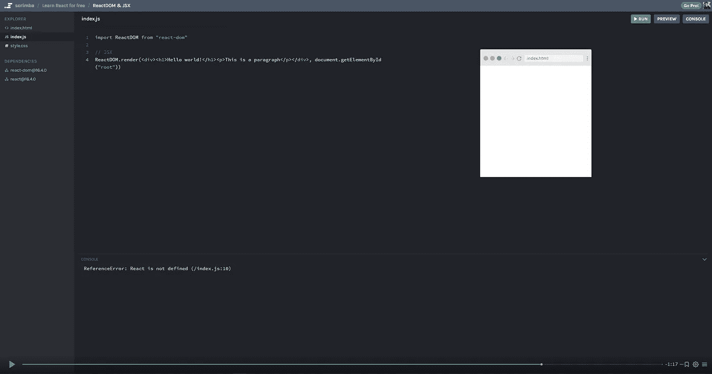
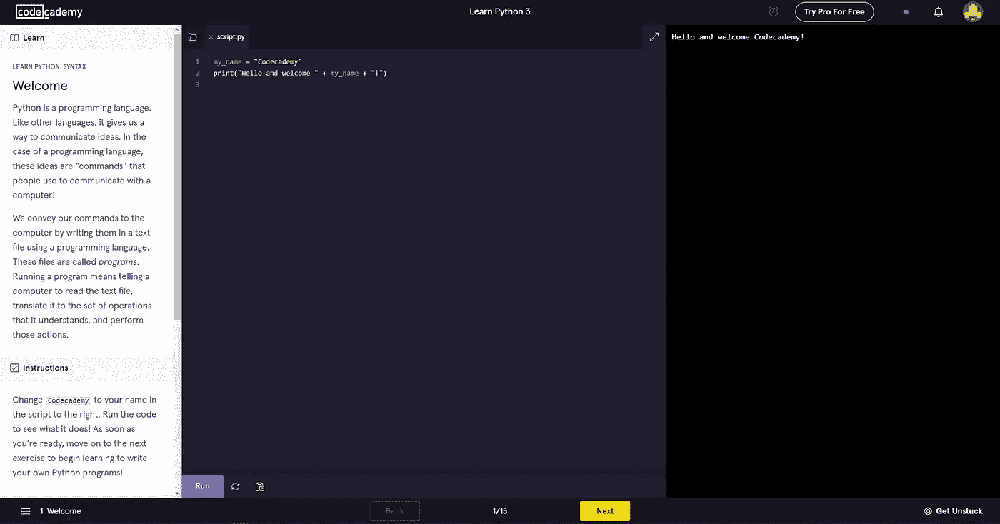
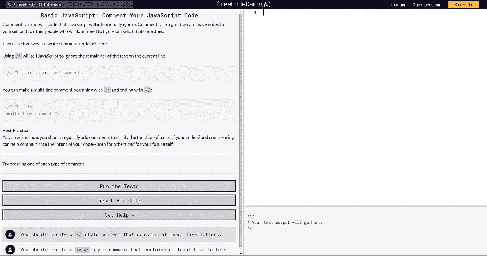

# 3 个免费的应用程序来学习编码和建立你的 MVP

> 原文：<https://towardsdatascience.com/3-free-apps-to-learn-coding-build-your-mvp-ee9f7423f42?source=collection_archive---------43----------------------->

妮可·沃尔夫在 [Unsplash](https://unsplash.com?utm_source=medium&utm_medium=referral) 上的照片

## 学习编码很容易，尤其是如果你使用正确的资源。

这是许多有抱负的企业家都在纠结的问题:他们有一个想法，他们有一个计划，但他们不知道如何将这个想法变成一个 MVP。几乎每隔一天，在 [/r/Startups](https://www.reddit.com/r/startups/new/) 上，我都会看到有人问社区如何在没有技术知识的情况下创建一个 MVP。在我的回答中，我通常会列出三个选项:

1.  **你可以找到一个技术型的联合创始人，**但是找到合适的人可能会很棘手。一方面，你必须找到一个真正相信愿景和用例的人，这个人应该有很高的适应能力(这样他们就不会一有麻烦就跑了)。另一方面，这个人需要有相关的技能来构建准确的产品或服务。
2.  你可以外包，但这需要一些前期资金。不是每个人都有。还有，外包有很多细微差别；如果你做得不对，你最终会付出比你预期更多的钱，你的产品甚至可能不工作。通常，激励措施并不一致:外包承包商是按小时计酬的，他们的激励措施是最大化他们的报酬。另一方面，你的动机是得到一个工作产品。此外，没有详细的说明，你可能会得到一个不满意的产品。
3.  最后，你可以自学编程。这是一个令人惊讶的选择，人们没有考虑，因为非技术型企业家可能会对复杂的编码感到害怕。然而，现实是编码很简单，需要一些实践和熟悉。在我看来，学习编码是最好的选择，因为你将拥有一项在你的创业过程中会派上用场的技能。除了自己编写程序之外，您还将更好地了解未来的工程团队和产品规划，并为产品里程碑或客户约定设定准确的时间表/截止日期。

与普遍的看法相反，学习如何编码并不复杂。对于以前从未接触过代码的人来说，学习在 Python 上构建一个基本的计算器程序可能需要大约 30 分钟。一旦你熟悉了基础知识，你就能构建许多程序了。此外，对于一个 MVP 来说，你不需要任何花哨的东西。如果你有一些有用的东西，可以开始展示给你的第一批用户和投资者，那会很有帮助。无论如何，MVP 很少是最终产品。

我开第一家公司的时候，没有任何编程经验。我通过各种免费工具学习，成功构建了 MVP，并在几个月后开始获得公司的第一批客户。一年过去了，财富 500 强公司都在使用我们公司最新版本的工具。为了可伸缩性、弹性和许多其他特性，该工具的大部分被重新构建和重构，但是一些核心代码仍然使用我最初的 MVP。现在，我使用免费(和付费版本)工具继续自我教育。

我试过很多，下面是我推荐的前三种。前两个，Scrimba 和 Codecademy，有免费和付费课程，但不要误解:免费课程是完整的，独立的课程，给你所有的培训，你需要开始建立程序。他们甚至还附带了练习应用程序，你可以在整个课程中使用。

# 斯克林巴

*   免费和高级课程
*   *我* [*通过这个免费课程学会了反应*](https://scrimba.com/learn/learnreact)

Scrimba 是一个更新的网站，有很多令人惊叹的功能。如果你喜欢听而不是读，那么 Scrimba 是你的正确选择。体验中的声音叠加会让你感觉你的老师就在你身边。最值得注意的是，在教程中，你从听和看你的老师在看似视频的内容中键入代码开始。之后，你可以在同一个屏幕上输入代码，亲自尝试一下。你的老师也会在视频的最后给你留一些挑战来帮助你练习，你也可以随时用他们做的来检查你的工作。虽然 Scrimba 确实有很棒的 Python 课程，但它的大部分课程目前都集中在 JavaScript 上。

# 代码集

*   免费和高级课程
*   *通过这个免费课程* 我学会了 [*Python*](https://www.codecademy.com/learn/learn-python)

Codecademy 的 [Python 3 课程，第 1 课](https://www.codecademy.com/courses/learn-python-3/lessons/learn-python-syntax/exercises/welcome)

Codecademy 是我第一次开始学习编程的地方。如果你更喜欢阅读指南而不是通过视频观看/收听，那么 Codeacademy 非常适合你。阅读的好处是，你可以回过头去重读特定的部分，这比你回过头去看视频的特定部分要容易得多。它类似于 Scrimba，因为它提供了一个文本编辑器，你可以在其中输入代码，程序会检查你输入的代码是否正确。虽然 Codecademy 的免费课程足以让你入门，但如果你想要额外的练习，它的付费选项会很有用。

# 自由代码营

*   免费课程
*   *通过这个课程* 我学会了 [*JavaScript*](https://www.freecodecamp.org/learn/javascript-algorithms-and-data-structures/basic-javascript/)

FreeCodeCamp 关于 JavaScript 的[课程](https://www.freecodecamp.org/learn/javascript-algorithms-and-data-structures/basic-javascript/comment-your-javascript-code)

顾名思义， [FreeCodeCamp](http://freecodecamp.org) 是完全免费的，并且依靠捐款。它注册为非营利组织。但它的目标是让人们获得合适的技能，在大公司找到工作。根据他们的网站，他们已经为超过 40，000 人安排了工作，包括谷歌和微软。经过他们的教训，我不怀疑这一点。课程很全面。用户体验类似于 Codecademy，它提供基于文本的指导。不过，如果你想要视频，FreeCodeCamp 也有一个充满教程的 YouTube 频道。因为你是在 YouTube 上看的，所以你需要自己的应用程序来编写和测试你的代码。

对大多数企业家来说，学习编程是一项无价的技能。它让你具备走出去，从零开始构建自己愿景的技能。此外，你还会学到更多关于工程流程的知识，当你有了团队后，你会成为一个更有效的领导者。有了技术上的理解，你会更好地管理时间和期望，因为你知道发生了什么。

虽然找到一个技术型的联合创始人很好，但找到合适的人可能需要一些时间。对于那些有一些现金的人来说，外包听起来可能是一个诱人的替代选择，但它可能会变得非常混乱，尤其是如果你不太懂编码的话。花一两个星期学习编码将使你获得开始构建自己的 MVP 的基础，并且你不必继续依赖他人。

[**创业很辛苦。我是来帮忙的——注册我的时事通讯，让我们一起聊天吧！**](https://upscri.be/yxd5qk)