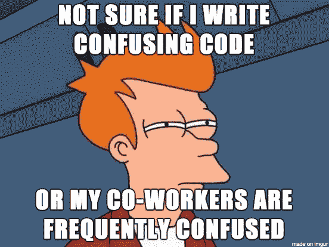

# 初学者的 3 个好的 Python 实践

> 原文：<https://towardsdatascience.com/3-good-python-practices-for-beginners-3e747b28f3e5?source=collection_archive---------5----------------------->

## Python 初学者

## 今天就开始编写可重用的代码


杰弗里·F·林在 [Unsplash](https://unsplash.com?utm_source=medium&utm_medium=referral) 上的照片

让我们面对现实吧。 ***编码比较辛苦。*** 你只想把事情做完，然后收工。但是，如果你很快地编写代码，却没有重构和注释你那勉强可读的意大利面条式代码，它会回来困扰你。或者其他人收拾你的烂摊子。

为了可读性和可重用性，负责任地重构和记录代码是非常重要的。这里有 3 个好的 Python 实践，你应该学会，成为一个更好的程序员。



由[共同导师](https://medium.com/@CodementorIO)在[媒介](https://medium.com/@CodementorIO/good-developers-vs-bad-developers-fe9d2d6b582b)上形成的迷因

# 1.文档字符串

Python 文档字符串，又名 **docstring** ，是由**三重双引号** `"""`括起的模块、函数、类或方法定义中的**第一条语句**。下面是一个函数中 docstring 的最小例子。

```
def foo():
    """This function does nothing."""
    passprint(foo.__doc__) # This function does nothing.
```

函数的 docstring 应该包含一个(单行的)**简短描述**其目的，后面是描述调用函数的**约定**的段落。有许多不同的风格，但这里有一个我最喜欢的模板:


安妮·斯普拉特在 [Unsplash](https://unsplash.com?utm_source=medium&utm_medium=referral) 上拍摄的照片

# 2.f 弦

您可能习惯于使用`%`或`.format()`来格式化字符串。

```
name = 'World'
'Hello %s' % name        # Hello World
'Hello {}'.format(name)  # Hello World
```

扔掉它们。一旦你需要在更长的字符串中打印多个变量，代码很快就会变得凌乱不堪，可读性更差。无论如何，这些格式化方法并不简单**直观**。

Python f-string 是 Python 3.6 中引入的游戏规则改变者。**在字符串**内部嵌入表达式，是一种可读性强、优雅的字符串格式化语法。这是通过语法`f'{expr}'`完成的，其中表达式被 f 字符串中的花括号括起来，在单引号之前的开头有一个`f`。

```
name = 'World'
print(f'Hello {name}')   # Hello World
```

您还可以将任何语法上有效的表达式**放在花括号内，它工作得很好，您甚至可以在表达式中调用函数！**

```
a = [1,2.2,3]
print(f'Sum of squares of {a} is {sum_of_squares(a)}')
# Sum of squares of [1, 2.2, 3] is 14.84
```


照片由[丹金](https://unsplash.com/@danielcgold?utm_source=medium&utm_medium=referral)在 [Unsplash](https://unsplash.com?utm_source=medium&utm_medium=referral) 上拍摄

# 3.命名约定

**给事物命名**是计算机科学中最难的事情之一。你没有主意了。您不知道如何命名临时中间变量。 ***你并不孤单。***

尽管有这些困难，Python 中有命名约定来“缩小”命名变量的选择范围。它们有助于提高代码的一致性、可读性和可重用性。

所以你不应该再用像`a`、`x`这样的小写字母来声明所有的变量。如果字母本身没有意义。还有，你要用有意义的、通俗易懂的、**易认的词**来命名，比如用`user_profile`代替`uspr`。

这里有 6 个关于命名事物的额外建议:

1.  出于显而易见的原因，避免使用单个字母命名事物，如`O`、`I`、`l`。
2.  变量和函数名都应该用小写的**和**。
3.  变量或函数名中的单词应该用一个**下划线**隔开。
4.  私有变量(比如在一个类中)可能以一个下划线开始。
5.  类名中的单词应该连在一起并大写，比如`MarioKart`。
6.  常量名要用**大写**，比如`GOLDEN_RATIO`。

这份清单绝非详尽无遗。命名变量可以说是编程中最难学的事情之一。我发现在 GitHub 上看别人的代码，学习他们的命名**风格**很有好处。


[Bekky Bekks](https://unsplash.com/@bekky_bekks?utm_source=medium&utm_medium=referral) 在 [Unsplash](https://unsplash.com?utm_source=medium&utm_medium=referral) 上拍摄的照片

## 相关文章

感谢您的阅读！你觉得这些 Python 实践有用吗？下面留言评论！你可以查看[官方风格指南](https://www.python.org/dev/peps/pep-0008/)了解更多 Python 约定。

你也可以[注册我的时事通讯](http://edenau.mailchimpsites.com/)来接收我的新文章的更新。如果您对提高 Python 技能感兴趣，以下文章可能会有所帮助:

[](/5-python-features-i-wish-i-had-known-earlier-bc16e4a13bf4) [## 我希望我能早点知道的 5 个 Python 特性

### 超越 lambda、map 和 filter 的 Python 技巧

towardsdatascience.com](/5-python-features-i-wish-i-had-known-earlier-bc16e4a13bf4) [](/6-new-features-in-python-3-8-for-python-newbies-dc2e7b804acc) [## Python 3.8 中针对 Python 新手的 6 项新特性

### 请做好准备，因为 Python 2 不再受支持

towardsdatascience.com](/6-new-features-in-python-3-8-for-python-newbies-dc2e7b804acc) [](/4-common-mistakes-python-beginners-should-avoid-89bcebd2c628) [## Python 初学者应该避免的 4 个常见错误

### 我很艰难地学会了，但你不需要

towardsdatascience.com](/4-common-mistakes-python-beginners-should-avoid-89bcebd2c628) 

*最初发表于*[*edenau . github . io*](https://edenau.github.io/)*。*