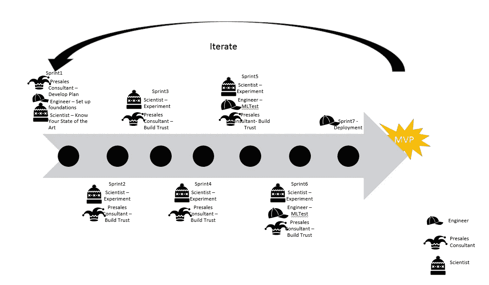

# 如何在数据科学项目中身兼数职

> 原文：<https://towardsdatascience.com/3-hats-to-wear-for-a-data-science-project-443c877b03f0?source=collection_archive---------48----------------------->

工程师、科学家和销售主管。图片由 [GraphicMama-team](https://pixabay.com/users/GraphicMama-team-2641041/?utm_source=link-attribution&amp;utm_medium=referral&amp;utm_campaign=image&amp;utm_content=1455991) 、 [Clker-Free-Vector-Images](https://pixabay.com/users/Clker-Free-Vector-Images-3736/?utm_source=link-attribution&amp;utm_medium=referral&amp;utm_campaign=image&amp;utm_content=309922) 、 [isuru prabath](https://pixabay.com/users/Isucc-1611501/?utm_source=link-attribution&amp;utm_medium=referral&amp;utm_campaign=image&amp;utm_content=1260380) 来自 CC0 的 Pixabay

## 除了 Kaggle 竞赛之外，数据科学项目还需要什么？

## 如何通过戴上三顶帽子(工程师帽、数据科学家帽和售前顾问帽)来实现小规模数据科学项目的不同视角。

您加入了一个新团队，该团队为数据科学家创造了一个新角色，因为他们有一些令人兴奋的问题需要解决。你是一个单人数据科学团队，很高兴接受这一挑战。由于你正在努力使这个项目有一个良好的开端，

我在问你(作为你的祝福者):*“为了让这个项目成功，除了 Kaggle 竞赛之外，你还需要什么？”*

你可能会说:“C *计算能力、需求收集、软件工程原则、领域专业知识等等*”

我说:“*精彩！你有没有一本关于如何有效地做到这些的剧本？”*

我相信，即使你是一个人的数据科学团队，你也可以通过身兼工程师、科学家和售前顾问的多重角色，仔细平衡三个不同的角度，为项目创造更好的结果。在这篇文章中，我想阐述三个主要观点。

*   *在数据科学项目中，身兼工程师、科学家和售前顾问三职时需要考虑什么？*
*   *戴着工程师、科学家和售前顾问的帽子，如果没有任何约束，你可以追求什么。*
*   *设计中这三个视角之间如何产生张力，以及如何平衡这三个视角的建议。*

让我们从这三个角度来探讨这些想法。

# 1.帽子# 1:工程师

***像伟大的工程师一样做机器学习，而不是像伟大的机器学习专家一样——***[***ML 规则******来自 Google***](https://developers.google.com/machine-learning/guides/rules-of-ml)

图片来自 [Pixabay](https://pixabay.com/?utm_source=link-attribution&amp;utm_medium=referral&amp;utm_campaign=image&amp;utm_content=1455991) 的 [GraphicMama-team](https://pixabay.com/users/GraphicMama-team-2641041/?utm_source=link-attribution&amp;utm_medium=referral&amp;utm_campaign=image&amp;utm_content=1455991)

成为一名伟大的工程师意味着什么？一个伟大的工程师会产生可靠的设计，同时确保工作是可复制的、可重复的和高质量的。

关于如何有效地戴上工程师的帽子，我们可以看看 A-Team，这个来自谷歌的团队阐明了理想的机器学习生产系统的规则。本文引入了 [***ML 测试分数***](https://storage.googleapis.com/pub-tools-public-publication-data/pdf/45742.pdf)**的概念，其中* 是评估您在数据科学项目中如何戴上工程帽子的一个极好的衡量标准。本文件描述了以下类别中需要考虑的各个方面*(高度概括)*。*

1.  *对特征和数据的测试，例如每个特征的分布、特征和目标之间的关系以及单个特征的成对相关性。*
2.  *模型开发的测试，例如作为基线的简单模型的测试，对重要数据切片的模型质量的测试，以及对模型的隐含偏差的测试。*
3.  *对模型基础设施的测试，例如训练的再现性，以及对 ML 管道的集成测试。*
4.  *用于监控 ML 的测试，例如特征中的上游不稳定性、训练和服务中的数据分布变化。*

*对于以上每一点，都有各种场景需要考虑。对于每个场景，如果您已经执行了手动测试，记录并发布了结果，您将得到 1 分。如果你有自动运行测试的系统，你就得到了第二点。 [**ML 测试分数**](https://storage.googleapis.com/pub-tools-public-publication-data/pdf/45742.pdf) 是每一节中的最小值的总和。*

*虽然我们现在知道我们需要朝着什么方向努力，但要达到这个目标，我们需要基本的基础。所以，让我们从一些软件工程的最佳实践开始，然后慢慢地向上达到 Google 的 ML 测试分数。*

*以下是一些关于如何从基础开始有效佩戴*工程师帽*的指南:*

1.  *采用在 GIT 中提交所有增量变更的最佳实践。*
2.  *通过编写环境细节的脚本并对其进行版本控制，采用将环境与代码分离的最佳实践。*
3.  *通过将配置细节分离到一个设置文件中，采用从代码中分离配置的最佳实践。它将简化部署。*
4.  *通过记录实验特征、条件和结果，让事情变得简单。我已经使用了 [MLFlow](https://www.mlflow.org/) 进行跟踪，我发现它减轻了跟踪迭代的痛苦。*
5.  *小规模项目的目标是 **ML 测试分数**至少为 5 分。*

*如果你拥有世界上所有的资源，戴着工程师的帽子你能渴望得到什么？。*

*使用 Google 论文中的框架，获得 12+的 ML 测试分数表明自动化测试和监控的卓越水平。这将是你戴着工程师帽时的终极目标。*

# *2.帽子# 2:科学家*

**

*图片来自 CC0 pix abay 的[Clker-Free-Vector-Images](https://pixabay.com/users/Clker-Free-Vector-Images-3736/?utm_source=link-attribution&amp;utm_medium=referral&amp;utm_campaign=image&amp;utm_content=309922)*

*科学家帽是为你试图解决的问题提供最佳模型的帽子。科学家知道对于类似的研究问题和有条不紊的实验来说什么是最好的结果*

> *科学家唯一的使命:尽可能好的模型。*

*没有免费的午餐定理表明，没有一个模型是所有问题的最佳解决方案。您的数据集分布是独一无二的。你的问题空间是独特的。作为一名科学家，你在不断地实验，以改进之前的迭代。*

> ***了解你的技术水平(SOTA)***

*作为一名科学家，你会在相似的数据集上遇到相似问题的当前研究。随着越来越多的研究人员公开他们的 GitHub 库，通过网站查看代码变得更加容易。几个领域也有研究人员公开跟踪最新成果。例如，对于自然语言处理， [Sebastian Ruder](https://nlpprogress.com/) 维护着各种自然语言处理问题和数据集的所有最新成果的列表。*

****如果你有必要的技能、足够的时间和培训资源，戴着科学家的帽子你能渴望什么？****

*作为一名科学家，你会渴望超越最先进的技术。也许，你会梦想发现一项新技术。说起来容易做起来难，哈！*

# *3.帽子# 3:售前顾问*

**

*图片来自 CC0 的[pix abay](https://pixabay.com/?utm_source=link-attribution&amp;utm_medium=referral&amp;utm_campaign=image&amp;utm_content=1260380)ISU ru pra bath*

*假设您是一家价值数百万美元的软件供应商的售前顾问。你的主要角色是向公司客户销售你的软件产品。你会根据顾客的需求和要求来调整你的陈述吗？当然，你会的。如果你在 A-league，你将超越客户正在寻求解决的当前问题，真正理解客户的目标。然后，你将描绘出你的软件产品将如何帮助公司客户解决手头的问题并实现客户更广泛的目标的完美画面。*

*现在，让我们过渡到现实。您不再是在销售周期结束时与首席执行官会面并获得巨额奖金的售前顾问。您是一位优秀的数据科学家，与运营团队密切合作。来戴上您的售前帽子吧！*

***a)售前顾问任务#1:销售产品***

*你需要推销你的项目如何解决客户的问题，你需要和客户一起踏上探索之旅。这里有一些问题让你开始。*

*   *对利益相关者来说，成功是什么样的？利益相关者的未来是什么样的？*
*   *我们正在解决的问题的影响是什么？*
*   *理解我们正确解决问题的关键指标是什么？*
*   *问题是否有可能自行消失(有时，我们可能正在解决系统约束，但是系统约束将会消失，因为我们正在替换系统)*

*在与客户的梦想阶段结束时，您的售前顾问需要提出一个计划。该计划需要有一个快速的途径来获得一个最小可行的产品，该产品将验证解决方案的可行性。它还需要关注迭代方面，这是解决方案的下一级调整。*

***b)售前顾问任务#2:建立信任***

***信任等于长期的一致性。两者都没有捷径可走。***

***—** [**杰夫·韦纳，领英**](https://twitter.com/jeffweiner/status/467110451675795457)*

*作为售前顾问，您的第二个也是更重要的任务是建立信任。当然，为了长期持续地交付，你需要最好的科学家和最好的工程师。能够听取客户的反馈，解决反馈，并衡量您的机器学习解决方案的执行情况将大有裨益。*

****如果您拥有必要的技能、足够的时间和培训资源，您对售前人员有什么期望？****

*一种机器学习解决方案，受到客户的信任，并已证明其有效。*

# *这三种不同的观点之间会有张力吗？*

*100%.嗯，科学家想永远实验，以提高模型的准确性。工程师希望确保我们构建可伸缩性，自动检查一切，并避免任何技术债务。售前顾问希望向客户展示最好的结果，这是昨天就需要的。问题是，只有一两个人承担所有的角色。所以，平衡之举来了。*

*那么，它将如何工作呢？这三种观点能友好共存吗？ 明确，通过在项目 ***的不同时间给予不同的视角以关注和优先权。****

*根据我有限的经验，这里有一个关于如何组织它的建议。(你可以把这当作一个起点，然后即兴创作。)*

*   *在项目开始的时候，你戴上了售前顾问和工程师的帽子。这有助于理解您正在解决的问题，并为成功奠定工程基础。*
*   *然后，你继续成为实验模式(Kaggle 模式)中的科学家，同时不断与客户沟通，建立信任并展示进展。*
*   *然后，一旦你有了一个合理的工作原型，你就戴上了工程师即兴 MLTest 分数和科学家即兴模型的帽子。*
*   *您的工程师负责部署，售前顾问则滔滔不绝地谈论新产品。*

*这是一个敏捷方式下的大概情况*

**

*图片作者*(请点击图片放大)**

**在上图中，Sprint 2 到 Sprint 4 以及后续 Sprint 的部分可能在 Kaggle 竞争的领域中。**

*如果您是一个试图交付数据科学项目的小团队，戴上这三顶帽子可能会变得必不可少。如果你是一个大规模的团队，它可能与你无关，因为你可能有不同的团队来执行这些观点。在这种情况下，这篇文章可能会帮助你从另一个角度更好地理解其他角色。祝你在下一个项目中成功，同时扮演工程师、科学家和售前顾问三个角色。如果你已经采用了这种方法的变体，请分享你对什么对你有效以及你如何克服挑战的想法。*

*参考资料:*

*[1]马丁·津克维奇，*ML 规则*[https://developers . Google . com/machine-learning/guides/Rules-of-ML](https://developers.google.com/machine-learning/guides/rules-of-ml)*

*[2]埃里克·布雷克，山青·蔡，埃里克·尼尔森，迈克尔·萨利布，D·斯卡利，你的 ML 测试分数是多少？ML 生产系统的规则*

*[https://storage . Google APIs . com/pub-tools-public-publication-data/pdf/45742 . pdf](https://storage.googleapis.com/pub-tools-public-publication-data/pdf/45742.pdf)*