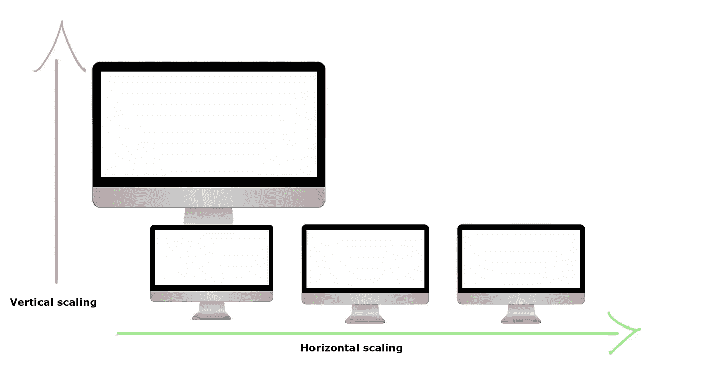
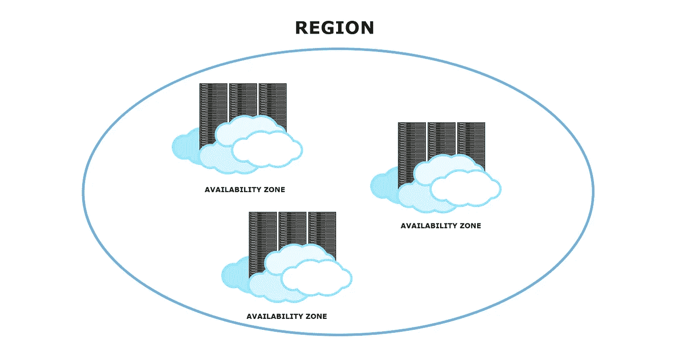
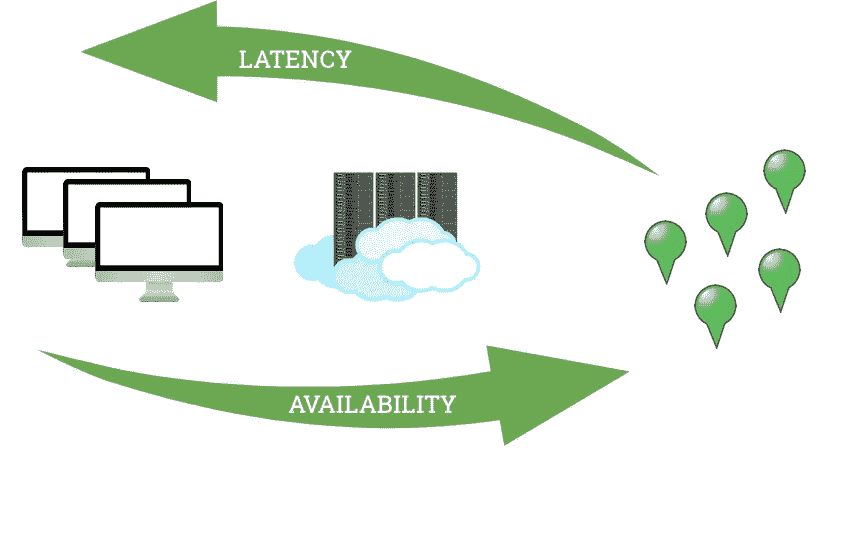
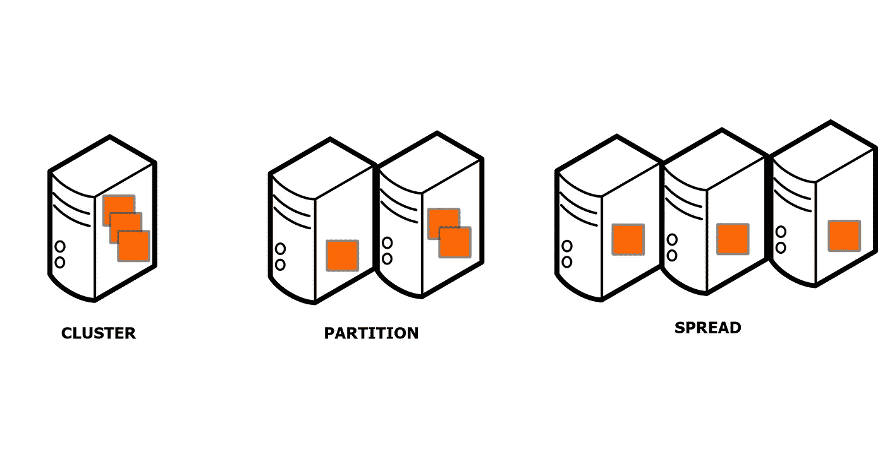

# 您应该知道的 3 个高可用性云概念

> 原文：<https://towardsdatascience.com/3-high-availability-cloud-concepts-you-should-know-93f3bab2cb4a?source=collection_archive---------17----------------------->

## 从扩展到虚拟机放置策略

Josep Castells 在 [Unsplash](https://unsplash.com?utm_source=medium&utm_medium=referral) 上拍摄的照片

拥有一个公开可用的解决方案通常意味着你需要在某个地方*部署并保持它的工作。如今“*某处*”经常是云环境。这是一个灵活的解决方案，您可以从小规模开始，随着业务的增长而增加容量。然而，不管您拥有什么样的系统，您都需要使它高度可用，以便用户可以依赖它。*

*云环境使得构建可靠的系统成为可能，但这并不意味着云本身不会出现故障。事情不是这样的。您需要意识到并让您的系统准备好处理故障，而不是相信您使用的所有云组件总是可用的。*

*让我们来了解一下对于提高系统可用性至关重要的主要云概念。*

# *缩放比例*

**

*垂直与水平缩放(图片由作者提供，使用 [Pixabay](https://pixabay.com/pl/vectors/monitor-ekran-komputer-elektronika-1130493/) 上 [1117826](https://pixabay.com/pl/users/1117826-1117826/) 的监视器图片)。*

*让您的系统为不断变化的负载做好准备并保持所需的最小容量是确保高可用性的一种方式。当你开始小的时候，大的负载不是问题，但是，使用云机制比如 scale sets 仍然是一个好主意。他们可以保持系统需要启动的最少数量的虚拟机。如果出现意外事件，比如机器停机，那么 scale set 规则应该会为您创建一个新的实例。有两种主要的缩放方式，水平缩放和垂直缩放。*

***水平扩展**意味着向堆栈中添加或移除相同类型的实例(如虚拟机实例或运行应用程序的容器)。就其使用的资源而言，新实例与其他实例相同，并且能够处理负载。也称为**向外扩展**(增加实例数量)和**向内扩展**(减少实例数量)。要水平扩展，您的系统需要为此做好准备，并且每个实例都必须能够独立工作。当需要某种同步时，这在有状态系统的情况下尤其重要。*

***垂直扩展**是在您增加一个实例的资源时完成的。您可以添加更多的 RAM、CPU、GPU、磁盘空间或任何其他资源。就像让你的机器变得更强大，这一点在本节开头的图片中有很好的描述。垂直扩展也称为**向上扩展**(添加资源)或**向下扩展**(移除资源)。这种扩展的主要缺点是，有时需要停止一个实例，添加资源，然后重新启动。它会引起混乱。使用水平缩放时，情况并非如此。*

*扩展您的系统不是一件容易的事情。如果负载波动很大，可能很难找到保持低成本并为高需求做好准备的方法。通常，您可以使用系统的不同指标来构建缩放规则。CPU 利用率、内存量或磁盘空间是这些指标的一些示例。您还可以考虑使用诸如到达系统的请求数量、队列容量(如果使用的话)或任何与负载变化相关的特定信息等指标。对于更复杂的情况，甚至有机器学习算法帮助找到最佳的缩放规则。*

# *多区域部署*

**

*基本云单位(图片由作者使用 [camelia_sasquana](https://pixabay.com/pl/users/camellia_sasanqua-2366387/) 在 [Pixabay](https://pixabay.com/pl/vectors/cloud-computing-czarny-bia%C5%82y-1924338/) 上的云图制作)。*

*在云环境中，系统部署在称为**区域**的单元中。区域是一个或一组彼此靠近的数据中心。区域内部还有一个更细粒度的单元，称为**可用性区域**。每个可用性分区是一个区域内的单个数据中心。*

*区域和可用性区域都很好地服务于系统的可用性。此外，当您在西欧和美国东部等不同地区部署该系统时，用户可以受益于**更低的延迟**，因为他们将连接到最近的实例。*

*将您的系统部署在不同的区域和/或不同的可用性区域中，可以使其更好地抵御区域故障。它只是给你的架构增加了更多的冗余。当你使用的云服务在你所在的地区出现故障时，你仍然有另一个运行良好的地区。这是多区域部署背后的主要思想。*

*有时整个地区或几个地区可能会下降，这种情况很少见，但也有可能发生。在这种情况下，如果你使用一个云提供商，你不能做太多。另一方面，使用多个提供商和多个地区是很昂贵的，所以你需要计算什么是最适合你的选择。*

*在不同的云环境中有多少区域可用？再来看看 Azure 和 AWS。*

*在 Azure [1]中有:*

*   *51 个地区*
*   *至少有 3 个可用区域的 12 个区域*

*在 AWS [2]中，您可以使用:*

*   *25 个地区*
*   *72 个可用区域*
*   *除大阪外，每个地区至少有 2 个可用区*

*如你所见，这些供应商选择了不同的策略。微软将区域和可用性区域作为扩展，而亚马逊选择为每个区域配备可用性区域，但区域较少。无论您选择哪种解决方案，它都将符合您的高可用性要求。*

**

*比例集 vs 可用区域 vs 区域(图片由作者提供，使用图片由 [camelia_sasquana](https://pixabay.com/pl/users/camellia_sasanqua-2366387/) 、 [1117826](https://pixabay.com/pl/users/1117826-1117826/) 、[openclipbart-Vectors](https://pixabay.com/pl/users/openclipart-vectors-30363/)on[pix abay](https://pixabay.com/))。*

*如果你决定采用多区域策略，你需要考虑你的架构是否适合它。假设您有一个可以部署在多个地区的系统，每个部署都可以独立工作。在这种情况下，没有问题，您可以选择适合您的用户需求的任何地区或可用区域。*

*但是，如果您的系统具有需要相互通信并通过网络发送大量数据的组件，多区域部署可能会损害其性能。在图中，您可以看到可用性和延迟之间的权衡。*

*如果您选择只有一个区域，一个可用性区域，您的实例将在一个数据中心。它会降低可用性，因为如果数据中心停机，系统也会停机。但是，系统组件将彼此靠近放置，因此它将具有最低的延迟。*

*如果您选择在一个区域内的许多可用性区域中部署系统，那么您将把实例分散到不同的数据中心。它将增加您系统的理论可用性。您会增加一些延迟，但是，可用性区域是通过快速光纤网络连接的，所以应该不会太差。*

*最后，如果您进行多区域部署，您的组件将在很远的距离之间进行通信。它具有最高的可用性，因为各地区相距遥远，自然灾害不应影响多个地区。但是区域之间的延迟将比其他情况高得多。*

# *虚拟机放置策略*

**

*AWS 虚拟机放置组(图片由作者使用服务器图片由 [Clker-Free-Vector-Images](https://pixabay.com/pl/users/clker-free-vector-images-3736/) 在 [Pixabay](https://pixabay.com/pl/vectors/komputer-serwer-przyciski-pc-305534/) 上制作)。*

*无论您选择哪种策略，最终都会在一个数据中心内至少有一个部署。这就是为什么了解故障域和更新域很重要。*

*实例可以位于相同或不同的**故障域**。一个故障域基本上是一个带电源的机架。如果故障域停止运行，机架中的所有实例也会停止运行。您可以检查在您选择的区域中有多少个可用的故障域。*

*更新域的工作方式与故障域相同，但当云提供商引入更改(如修补操作系统)或需要运行一些维护操作时，它们会有所帮助。如果实例分布在不同的更新域中，您可以确保在维护期间只有一部分实例(在一个更新域中)不可用。*

*在 AWS 中，您还可以定义虚拟机放置组。他们有三种类型。集群类型将实例放在一个机架上。Partition 使您能够创建一个逻辑分区，并决定哪个实例去哪个分区。最后，spread(默认)试图尽可能多地调度实例，这样它们就不太容易受到中断的影响。*

# *我为什么要在乎？*

*好吧，但是为什么我需要理解和照顾它？我只是一个云用户，我为服务付费，我想让它工作。正如我之前所写的，使用云并不意味着你可以忽略它是如何工作的。您负责系统的架构并使其高度可用。*

*我们用一个例子来描述一下。在我们的理论系统中，我们有一个 Apache Zookeeper 集群[1]。这是一个支持分布式系统协调的工具。它有助于分布式配置和状态。*

*动物园管理员需要在法定人数内工作。非常特别的法定人数。基本上你需要有 2N + 1 个动物园管理员。n 是自然数。最小的高可用性设置包含三个动物园管理员。一个宕机，群集可以正常工作，但是，如果两个宕机，整个群集都会宕机。假设您不太在意，并且在具有两个故障域(机架)的数据中心中部署了您的动物园管理员。动物园管理员会这样传播:*

**

*动物园管理员分布在两个故障域(图片由作者提供，使用 [Apache Zookeeper 徽标](https://svn.apache.org/repos/asf/comdev/project-logos/originals/zookeeper.svg))。*

*现在，当其中一个机架损坏时，您的群集有 50%的几率会停机。因此，您的系统并不真正具有高可用性，一次故障就会导致系统停机:*

**

*有两个动物园管理员的机架下降(图片由作者提供，使用 [Apache Zookeeper 徽标](https://svn.apache.org/repos/asf/comdev/project-logos/originals/zookeeper.svg))。*

*好吧，也许我们可以衡量动物园管理员？让我们假设 N = 2，在这样的设置中，两个动物园管理员可以毫无问题地倒下:*

**

*5 个实例的 Zookeepers 集群(图片由作者提供，使用 [Apache Zookeeper 徽标](https://svn.apache.org/repos/asf/comdev/project-logos/originals/zookeeper.svg))。*

*但是，请稍等，如果您只有两个机架，它们可以像这样展开(最佳情况):*

**

*三个动物园管理员的架子放下来了(图片由作者提供，使用[阿帕奇动物园管理员标志](https://svn.apache.org/repos/asf/comdev/project-logos/originals/zookeeper.svg))。*

*如你所见，这没有多大帮助。你的集群就像三个动物园管理员一样脆弱。这说明了为什么理解幕后发生的事情很重要。*

# *准备好！*

*我们讨论了三个基本但有用的概念，它们有助于使您的系统高度可用。将它们与设计良好的体系结构一起实现将提高服务的可用性，并使它们为意外但可能发生的事件做好准备。相信我，如果你使用云，你迟早会体验到。*

***参考书目:***

1.  *[https://azure . Microsoft . com/en-us/global-infra structure/geographies/](https://azure.microsoft.com/en-us/global-infrastructure/geographies/)*
2.  *[https://AWS . Amazon . com/about-AWS/global-infra structure/regions _ az/](https://aws.amazon.com/about-aws/global-infrastructure/regions_az/)*
3.  *[https://zookeeper.apache.org/](https://zookeeper.apache.org/)*