# 3 熊猫高度实用的操作

> 原文：<https://towardsdatascience.com/3-highly-practical-operations-of-pandas-61d86ca09979?source=collection_archive---------78----------------------->

## Sample，其中，isin 用例子详细解释。


[张家瑜](https://unsplash.com/@danielkcheung?utm_source=unsplash&utm_medium=referral&utm_content=creditCopyText)在 [Unsplash](https://unsplash.com/s/photos/small?utm_source=unsplash&utm_medium=referral&utm_content=creditCopyText) 上拍照

Pandas 是一个非常强大和通用的 Python 数据分析库，它加速了数据科学项目的预处理步骤。它提供了许多在数据分析中非常有用的函数和方法。

在这篇文章中，我的目标是涵盖一些我经常使用的非常方便的操作。本帖将涉及的主题有:

*   **样品**
*   **其中**
*   **Isin**

# **样品**

样本方法允许您从**系列**或**数据帧**中随机选择数值。当我们想从分布中选择一个随机样本时，这是很有用的。假设我们有一个随机变量，它的值存储在数据帧的序列或列中。我们可以使用 loc 或 iloc 方法选择它的一部分，但我们需要指定索引或选择范围。但是，使用样本方法，我们可以随机选择值。在开始举例之前，我们先导入 numpy 和 pandas:

```
import numpy as np
import pandas as pd
```

让我们创建一个具有 3 列和 10000 行的数据帧:

```
col_a = np.random.random(10000)
col_b = np.random.randint(50, size=10000)
col_c = np.random.randn(10000)df = pd.DataFrame({
    'col_a':col_a,
    'col_b':col_b,
    'col_c':col_c
})print(df.shape)
(10000, 3)df.head()
```

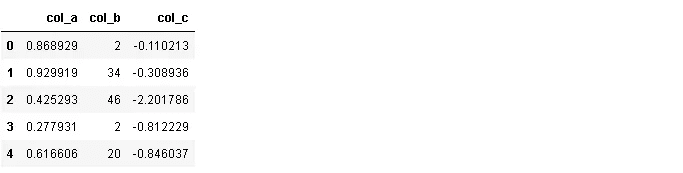

我们可以从任何列中选择 n 个值:

```
sample1 = df.col_a.sample(n=5)sample1
3309    0.049868
7856    0.121563
3012    0.073021
9660    0.436145
8782    0.343959
Name: col_a, dtype: float64
```

**sample()** 返回值和索引。我们用 n 参数指定值的数量，但是我们也可以将一个比率传递给 **frac** 参数。例如，0.0005 将返回一行中 10000 个值中的 5 个:

```
sample2 = df.col_c.sample(frac=0.0005)sample2
8955    1.774066
8619   -0.218752
8612    0.170621
9523   -1.518800
597     1.151987
Name: col_c, dtype: float64
```

默认情况下，采样在*完成，无需更换*。因此，每个值只能选择一次。我们可以通过将替换**参数**设置为真来改变这种选择方式。则可以多次选择这些值。请注意，这并不意味着样本一定会多次包含一个值。它可能选择相同的值，也可能不选择相同的值。

```
sample3 = df.col_c.sample(n=5, replace=True)sample3
3775    0.898356
761    -0.758081
522    -0.221239
6586   -1.404669
5940    0.053480
Name: col_c, dtype: float64
```

默认情况下，每个值被选中的概率相同。在某些情况下，我们可能希望从一个系列或数据帧的特定部分中随机选择。例如，我们可能希望跳过前 9000 行，并希望从剩余的 1000 行中随机选择。为此，我们可以使用**权重**参数。

我们给每个数据点分配权重，表示被选中的概率。权重之和必须为 1。

```
weights = np.zeros(10000)
weights[9000:] = 0.0001sample4 = df.col_c.sample(n=5, weights=weights)sample4
9232   -0.429183
9556   -1.282052
9388   -1.041973
9868   -1.809887
9032   -0.330297
Name: col_c, dtype: float64
```

我们将第一个 9000 的权重设置为零，因此结果样本只包括索引 9000 之后的值。

为了获得可再现的样本，我们可以使用 **random_state** 参数。如果将整数值传递给 random_state，则每次运行代码时都会产生相同的样本。

```
sample6 = df.col_b.sample(n=5, random_state=1)sample6
9953    31
3850    47
4962    35
3886    16
5437    23
Name: col_b, dtype: int32
```

我们也可以通过将轴参数设置为 1 来随机选择一列。

```
sample5 = df.sample(n=1, axis=1)sample5[:5]
```

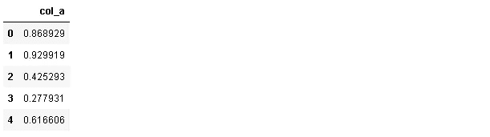

# **哪里**

“Where”用于根据条件替换行或列中的值。默认的替换值是 NaN，但是我们也可以指定替换值。让我们复习一个例子，这样就清楚了。

让我们首先创建一个示例数据帧:

```
df2 = pd.DataFrame({
    'A':[0,0,1,2,4,3,5,8],
    'B':[-1,3,4,-2,2,-4,6,5],
    'C':[9,11,13,5,8,9,11,19]
})df2
```


考虑这样一种情况，我们需要用 0 替换负值。我们不用遍历 if 语句和 for 循环，而是使用 **where** 轻松实现这一点:

```
df2.where(df2 > 0, 0)
```

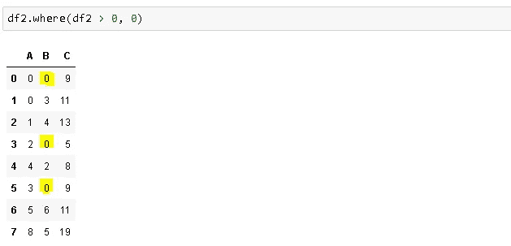

“where”的工作方式是选择符合条件的值，并用指定的值替换剩余的值。**其中(df2 > 0，0)** 选择所有大于 0 的值，其余值替换为 0。因此，where 也可以被认为是一个掩码操作。

让我们再看一个例子。我们希望保持负值不变，但将正值转换为负值(即 2 替换为-2):

```
df2.where(df2 < 0, -df2)
```

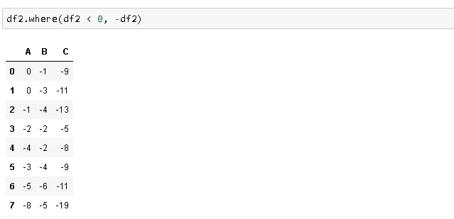

为了保存原始数据帧中的更改，我们需要将 **inplace** 参数设置为 True。

重要的一点是，熊猫和熊猫的“T10”和“T11”并不完全相同。我们可以获得相同的结果，但语法略有不同。使用 **DataFrame.where** ，选择符合条件的值**作为**，其他值替换为指定值。 **Np.where** 还要求指定符合条件的值。以下两行返回相同的结果:

```
df2['B'].where(df2['B'] < 0, 0)np.where(df2['B'] < 0, df2['B'], 0)
```

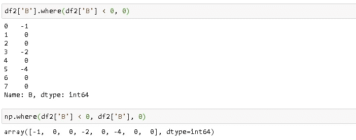

因此，numpy 版本更加灵活。我们也可以改变符合条件的值。例如，我们可能希望将负值乘以 2:

```
np.where(df2['B'] < 0, df2['B']*2 , 0)
```

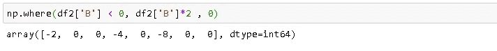

# **isin**

在处理数据帧时，我们经常使用过滤或选择方法。我们可以像使用 where 那样基于条件进行过滤，或者使用行或列索引选择数据帧的一部分。Isin 方法是一种先进的滤波方法。例如，我们可以选择符合一系列条件的值。

让我们为“isin”示例创建一个不同的数据帧:

```
df3 = pd.DataFrame({
    'A':[7,4,1,2,4,3,5,8],
    'B':['cat','cat','dog','bird','bird','cat','dog','chicken'],
    'C':['brown','black','black','yellow','green','brown','white','brown']
})df3
```

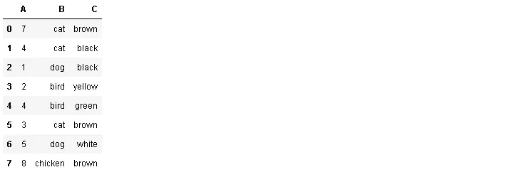

我们可以使用简单的掩码操作设置一个条件:

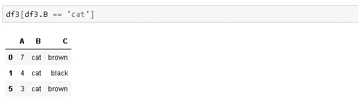

**isin** 允许在一个列表中设置多个条件:

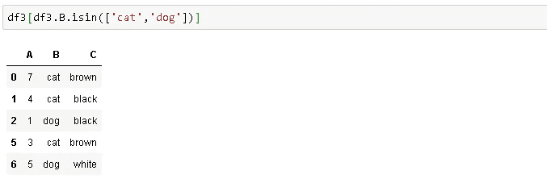

我们还可以在 isin 中使用波浪号(~)运算符。然后返回*不符合条件的值:*

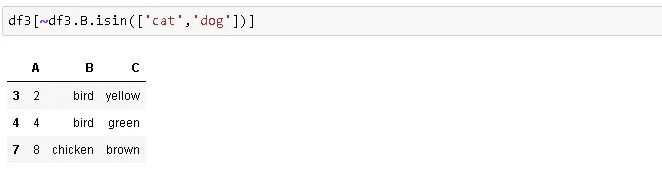

我们还可以将一个过滤器以字典的形式传递给 isin。将基于以下条件返回布尔值:

```
values = {'B':['cat','dog'], 'C':['brown','black']}df3.isin(values)
```

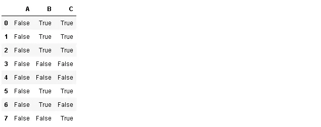

我认为熊猫的成功和流行来自于其多功能、强大且易于使用的操作和分析数据的功能。和熊猫一起完成一项任务几乎总是有多种方式。由于花在数据科学项目上的大部分时间都花在了数据清理和预处理步骤上，Pandas 是您武库中的宝贵资产。

感谢您的阅读。如果您有任何反馈，请告诉我。