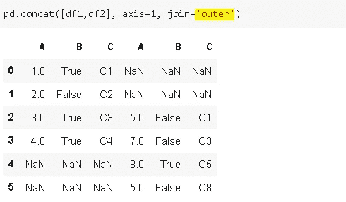

# Pandas 的 Merge 和 Concat 功能之间的 3 个主要区别

> 原文：<https://towardsdatascience.com/3-key-differences-between-merge-and-concat-functions-of-pandas-ab2bab224b59?source=collection_archive---------6----------------------->

## 何时以及如何使用它。


安德烈·亨特在 [Unsplash](/s/photos/different?utm_source=unsplash&utm_medium=referral&utm_content=creditCopyText) 上的照片

Pandas 是一个高效且广泛使用的数据分析工具。Pandas 的核心数据结构是 dataframe，它用带有标签的行和列的表格形式表示数据。DataFrame 有许多强大而灵活的功能和方法，可以简化和加快数据清理和分析过程。

数据科学项目通常需要我们从不同的来源收集数据。因此，作为数据准备的一部分，我们可能需要组合数据框架。 **concat** 和 **merge** 功能都用于合并数据帧。在这篇文章中，我将解释它们之间的 3 个主要区别。

# **1。结合的方式**

**Concat** 函数沿行或列连接数据帧。我们可以把它想象成多个数据帧的叠加。


**合并**根据共享列中的值合并数据帧。与 concat 函数相比，Merge 函数提供了更大的灵活性，因为它允许基于条件的组合。


假设您有一个包含信用卡交易的数据集。您有一组关于交易细节的列和一个指示客户 ID 的列。另一个数据帧包括关于客户和客户 ID 的更详细的信息。为了组合这两个数据框架，我们可以在“客户 ID”列上合并它们，以便条目匹配。我们使用 concat 的一个例子是合并包含 2019 年和 2020 年信用卡交易的数据帧。我们可以用 concat 函数把它们堆叠起来。

# **2。轴参数**

只有 concat 函数有轴参数。Merge 用于根据共享列中的值并排组合数据帧，因此不需要轴参数。

根据 axis 参数的值，我们可以将数据帧按行(上下重叠)或列(并排)连接起来。axis 参数的默认值为 0，表示沿行组合。

我们来做几个例子。

```
import numpy as np
import pandas as pddf1 = pd.DataFrame({
'A':[1,2,3,4],
'B':[True,False,True,True],
'C':['C1','C2','C3','C4']
})df2 = pd.DataFrame({
'A':[5,7,8,5],
'B':[False,False,True,False],
'C':['C1','C3','C5','C8']
})
```


**轴=0:**


**轴=1:**


# **3。加入 vs 如何加入**

Join 是 concat 函数的参数，how 是 merge 函数的参数。他们的目标是一样的，但是他们工作的方式有点不同。

Join 指定在数据帧具有不同索引的情况下如何处理索引。让我们用不同的索引创建前面的数据帧。

```
df2 = pd.DataFrame({
'A':[5,7,8,5],
'B':[False,False,True,False],
'C':['C1','C3','C5','C8']},
index=[2,3,4,5]
)
```


我们只是通过将索引值传递给 **index** 参数来更改第二个数据帧的索引。

Join 参数取两个值，**外**和**内**。

*   外部:取所有索引( **join** 参数的默认值)
*   内部:仅采用共享索引



我们获取所有索引，但是第二个数据帧没有索引为 0 和 1 的行。因此，第二个数据帧中的值用 NaN(缺省缺失值标记)填充。类似地，第一个数据帧中的行 4 和行 5 被填充 NaN 值。

如果我们将 join 设置为 **inner** ，那么只有存在于两个数据帧中的索引才会显示出来。因此，我们不会因为连接而丢失任何值。


合并功能的**参数**的工作方式类似。**如何**的可能值为**内**、**外**、**左**、**右**。

*   inner:只有在参数**指定的列中有相同值的行( **how** 参数的默认值)**
*   外部:所有行
*   左侧:左侧数据帧中的所有行
*   右侧:右侧数据帧中的所有行

下面的数字更清楚地代表了参数的概念。


在做一些例子之前，让我们先回忆一下我们的数据框架。


我们将在列‘C’上合并 df1 和 df1 **。**


df1 和 df1 在列 C 中的值都是 C1 和 C3，因此当 how 设置为“inner”时，只有这些值才会显示。

外面怎么样？


当选择 **outer** 作为 how 参数时，合并的数据帧包括列“C”的所有值。公共值不重复，df1 或 df2 中不存在的值用 NaN 填充。

当选择 **left** 作为 how 参数时，合并的数据帧包括左侧数据帧中的所有行。如果列“C”(传递给 on 参数的列)中的值不在右数据帧中，则来自右数据帧的列将填充 NaN 值。**右**选项很少使用，因为我们可以只改变 merge 函数中 dataframe 的顺序(而不是(df1，df2)使用(df2，df1))。


感谢您的阅读。如果您有任何反馈，请告诉我。