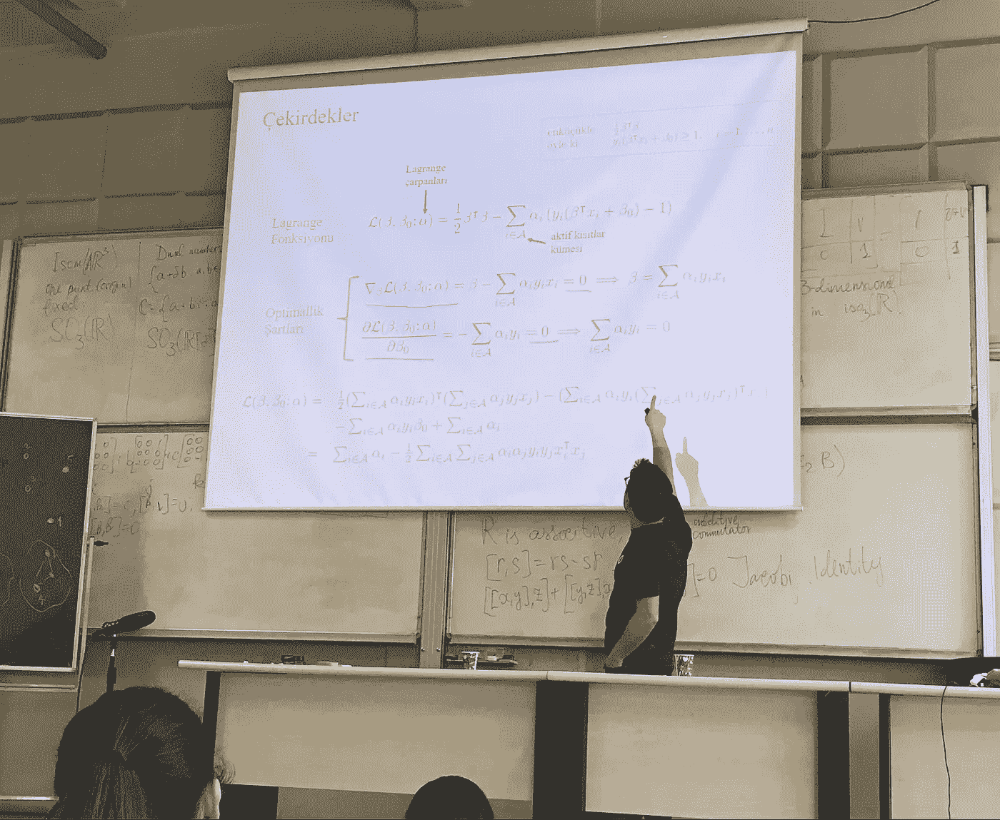
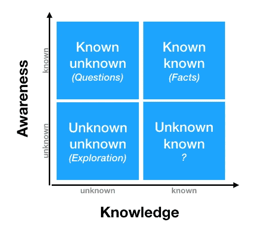

# 机器学习课程的 3 个关键要点

> 原文：<https://towardsdatascience.com/3-key-takeaways-from-a-machine-learning-course-4a36030960d5?source=collection_archive---------21----------------------->

## [机器学习](https://towardsdatascience.com/machine-learning/home)

## 为期一周的现场培训带来的非技术性收益

由[卡拉·伊德斯](https://unsplash.com/@karaeads?utm_source=medium&utm_medium=referral)在 [Unsplash](https://unsplash.com?utm_source=medium&utm_medium=referral) 上拍摄的照片

上周，我参加了一个现场机器学习课程，从技术和非技术的角度拓宽了我的视野。这是鹿特丹伊拉兹马斯大学教授的这门课程的强化版。在这篇博文中，我将总结 3 个对我来说最重要的非技术性成果。

在开始之前，我想强调一下，我交替使用了“机器学习”(ML)和“数据科学”这两个术语。

事不宜迟，我们开始吧！

## 1.用理论解释机器学习算法是至关重要的

作为一名自学成才的数据科学家，我用基于应用的方法学习了机器学习算法。我的意思是，我首先应用算法，然后通过文章和开源文档探索它们是如何工作的。

这种方法在构建解决方案时效果很好；但是，当需要向你的观众(或老板)展示你的模型时，你需要简单而令人信服的解释来翻译机器学习的概念和结果。总而言之，我们(数据科学家)是我们的模型和观众之间的桥梁。

形成这种桥梁的一种方法是理解算法背后的理论和数学。乍一看，理解这个充满数学符号的理论似乎有些吓人。一旦你迈出了理解它们的第一步，你就会认识到，从最简单的线性回归到最复杂的神经网络模型，理论都遵循相似的逻辑。

了解理论将是建立坚实基础的关键，并有助于将您的模型结果和机器学习概念方便地传递给非技术受众。

支持向量机背后的理论:算法如何在二元和非线性分类中找到最佳分离边界的证明

## 2.人工智能领域正在不同学科的人们的努力下成长

与会者来自不同背景(学者和专业人士)，课程讲师解释说，他们是有意从不同背景中挑选出来的。多亏了这次选拔，我认识了非常有趣的人:)

例如，有一位正在研究架构背景下的 GAN 网络的博士生建筑师提出了这样一个问题:

> 一个 [GAN(生成对抗网络)](/what-is-a-gan-d201752ec615)算法能生成平面图吗？

如果答案是肯定的，从长远来看，这项研究可能会改变建筑师在我们社会中的地位。

我的一个同桌是计算机科学学生和艺术家。他受到了媒体艺术家 [Refik Anadol](http://refikanadol.com/) 的启发，他利用机器学习和人工智能将数据转化为艺术雕塑和装置。他正在考虑跟随他的脚步，这是对人工智能领域的独特贡献。

Refik Anadol 的资料雕塑:[博斯普鲁斯](http://refikanadol.com/works/bosphorus/)。[视频源](https://vimeo.com/325634926)

## **3。在人工智能的世界里总会有**“已知的未知”和**“未知的未知”**

尽管我很喜欢我在数据科学方面的学习之旅，但有时我会对我尚未发现或不知道它们存在的算法和应用程序感到气馁。

但我意识到的是，即使我在这个领域花了几十年时间；将会有“已知的未知”和“未知的未知”，因为这个领域本身是不断发展的，它的应用范围也在扩大。

图片来源: [freeCodeCamp](https://www.freecodecamp.org/news/how-to-discover-your-unknown-knowns/)

由于这次培训，我探索了一些未知的未知——我不知道它们已经存在——机器学习和人工智能在艺术中的应用。通过理解机器学习算法背后的理论，我从已知的未知领域中划掉了一些。

尽管如此，在前进的道路上仍有许多有待发现的东西！

感谢您的阅读，我将在下一篇博文中分享我在本课程中的技术收获，请关注我的[媒体](https://medium.com/@cereniyim)来了解他们😉

对于评论或建设性的反馈，您可以通过回复、 [Twitter](https://twitter.com/cereniyim) 或 [Linkedin](https://www.linkedin.com/in/ceren-iyim) 联系我！