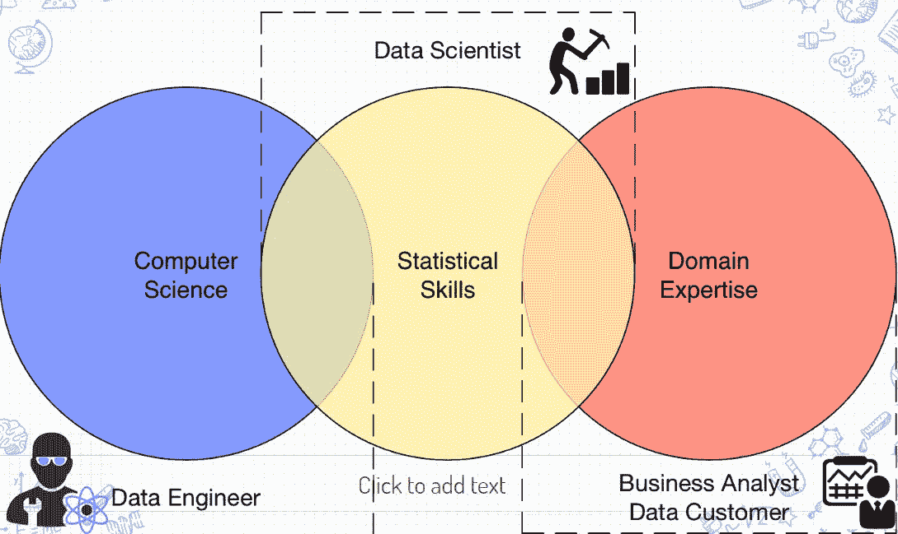

# 钢琴家成为伟大数据科学家的经验

> 原文：<https://towardsdatascience.com/3-lessons-of-data-science-harmony-b204840f6ce7?source=collection_archive---------66----------------------->

## 我对数据科学同事和低年级学生的建议

## 关于为什么数据科学就像弹钢琴的 3 堂课

来源 [Unsplash](https://unsplash.com/photos/StAl7MQIioY)

# “过度使用”的数据科学家维恩图

我在[数据科学家课程简介](https://docs.google.com/presentation/d/1--oxNPtolT1p7fBwqR1-x8TylYGmZu6cBbhgDEQMAfs/edit?usp=sharing)中对数据科学家/数据专家的定义

这是一个典型的过度使用的图表，你总是在数据科学导论中看到。在这个图表中，我们可以看到 3 个不同的领域:计算机科学技能、统计技能和领域专长。

然后，在这一切的中间，我们放置了久负盛名的数据科学家，我认为这是一个超卖的头衔，他们被创业公司广泛滥用[来吸引人才](/the-danger-of-title-play-in-data-analytics-b94e92c49c53)。虽然维恩图是对数据科学的很好介绍，但它缺乏价值主张的批判性思维。

就像任何需要起草商业模式以获得公司投资的企业一样。没有客户需要的附加值，您就无法解释数据科学的真正工作。典型的数据科学维恩图有几个问题。

1.  **它没有解释数据科学的核心目标。**我们在为谁分析？我们如何知道我们是否成功？
2.  **它不激发行动**。好的..我该如何开始？
3.  **它没有强调与不同团队合作的环境**。数据科学永远是团队的成就。

在这种情况下，我想介绍一个类比，为您提供更多关于如何成为一名伟大的数据科学家的信息。

> 通过向钢琴家学习。

有一天，我支持我的一个好朋友，他是一个优秀的钢琴家。在他的钢琴音乐会之后，我祝贺了他。我们聊了一会儿，直到他问我“数据科学家是做什么的？”我想了想，编造了一个比喻来解释。现在，我想和你分享。

> 我希望这种理解有助于你理解数据科学家作为职业的核心思维模式。

# 观众:你会对牛弹琴吗？

[来源](https://www.hanbridgemandarin.com/article/chinese-learning-tips/chinese-chengyu-duiniutanqin/)

> 战国时期，有一个叫的音乐家，擅长演奏乐器。有许多人喜欢听他演奏，并且非常尊敬他。
> 
> 一天，伊在乡下休息时看见一头牛。他想，“每个人都称赞我的音乐。要不我给这头牛放点音乐？”
> 
> 他为牛演奏了一首优雅古雅的音乐，但牛只是低着头不停地吃草。他又放了一段欢快的音乐，但牛还是低着头吃草，完全不理他。伊展示了他所有的技能，但牛仍然不理他。
> 
> 然后他调整他的演奏来模仿小牛的声音。奶牛做出了反应。
> 
> [—中国民间故事(对牛弹琴)——](https://www.echineselearning.com/blog/chinese-idiom-duiniutanqin-to-play-the-harp-to-a-cow)

这是一个简单而伟大的教训。不管你的解决方案有多复杂。如果你的利益相关者/听众不理解，你将不会有任何结果。数据科学的关键成果是做出数据驱动的决策。要做到这一点，你需要你的关键利益相关者的认可和支持。

这包括你的应用程序用户，你的 ML 应用程序的用户，甚至是支持你的应用程序发布的工程师。你不应该想太多，应该开发简单的解决方案，旨在解释而不是复杂。

例如，如果项目很小，并且您的利益相关者需要概念证明来确定其连续性，则不要将深度学习作为您的第一个赌注。相反，要理解问题和数据，并创建一个交互式仪表板来提取见解。

做对你的利益相关者有益和足够的事情，而不是为了你的自我。

同样对我来说，每当我收到一个新项目，我总是强调最小可行产品(MVP ),并在我有利益相关者购买时冒险进入复杂的机器学习/深度学习。

这意味着，我会从探索性的分析开始。我用基于阈值的规则(例如:决策树)对结果进行分类，以产生 80%的影响。总是尝试 20/80 帕累托比较，以确认你正朝着正确的方向前进。

如果你忽略了这一点，你将会给你的利益相关者带来巨大的成本，而不是你在解决方案中承诺的影响。 [*【网飞】因工程费用从未使用过其 100 万美元的算法*](https://www.wired.com/2012/04/netflix-prize-costs/)*。这可能是你的下一个头条。*

> *了解你在为谁演奏音乐，这是成为伟大的数据科学家的关键*

# *学科:学钢琴用钢琴 tab 吗？*

**

*钢琴标签的普及学习*

> *不懂统计学可以学数据科学吗？*
> 
> *我能实现深度学习并自称数据科学家吗？*

*简单的回答就是……可以。*

*您可以在不知道回归如何工作的情况下进行回归。你可以策划并理解它。你甚至可以按照 Keras 教程为 Kaggle 比赛快速实现深度学习。*

*毕竟学校不就是这么教我们的吗？饼干切刀和结果生产？*

> *想象一个钢琴标签*

*你演奏冬季奏鸣曲。有了钢琴标签，当你一个键一个键地跟随作者的指示时，你可以给你的女朋友留下深刻印象。你甚至不需要读一个音符。*

> *但是你是一个伟大的音乐家吗？*

*是的，你可以演奏音乐，但你不会成为伟大的钢琴家。钢琴键是训练轮。你永远不会听到一个职业自行车手用训练轮训练。*

*你可以训练和演奏任何你想要的歌曲。但是不懂看音符，你的理解就会很浅。除非你懂音符，否则你永远不会编曲自己的曲子。*

*同样，一个伟大的数据科学家会在以下几个方面下大力气，磨砺自己的技能:*

1.  *你的观众:你在为谁演奏？*
2.  ***您的作品**:ML 模型/分析的里外是什么？*
3.  ***你的工具**:你如何利用现有资源制作高质量的作品？*

> *同样，没有统计学，你能成为伟大的数据科学家吗？*

# *团队合作:音符形成和谐*

**

*来源: [Unsplash](https://unsplash.com/photos/p60mNTW5glI)*

> *自己做项目能成为数据科学家吗？*

*数据科学永远是团队合作。唱诗班里有女高音、男高音、女低音和男低音的合奏。每一个都不能独立存在，但是他们一起创造和谐。*

*同样，在数据科学领域，您会发现启动概念验证的工程师、查看您的分析并做出决策的产品经理，甚至其他拥有不同专业知识的数据科学家。*

*作为数据科学家，我们不能孤军奋战。我们可以建立基础设施和模型。但是，如果我们不尊重和协调我们的工作，我们就会失败。*

*同样的，对于我来说，我总是很庆幸自己身边总是有比我懂得多的同事。他们有不同的专长(Yara/ Yodalog/ ML Ops)在我冒险进入未知领域时帮助我。我们通过产品发布同步我们的工作。*

> *就像音调如何形成和声一样，同步的作品传递着冲击力。*

# *结论*

*综上所述，通过向钢琴家学习。你学到了成为伟大数据科学家的更多观点:*

1.  ***受众:**在着手每一个数据项目之前，充分了解你的受众。得到他们的认同，你就不会浪费你的努力。*
2.  ***纪律:**努力学习自己的技能。明白你需要你的观众、作品和工具的多种技能。*
3.  ***团队合作:**了解如何建立人际关系，将项目协调成和谐/有影响力的项目。*

*索利·德奥·格洛丽亚*

# *关于作者*

*文森特用 ML @ Google 对抗网络滥用。文森特使用高级数据分析、机器学习和软件工程来保护 Chrome 和 Gmail 用户。*

*除了在谷歌的工作，Vincent 还是《走向数据科学媒体》的特约撰稿人，为全球 50 万以上的观众提供有抱负的 ML 和数据从业者的指导。*

*在空闲时间，文森特在佐治亚理工学院攻读硕士学位，并为铁人三项/自行车旅行进行训练。*

*最后，请通过 [**LinkedIn**](http://www.linkedin.com/in/vincenttatan/?source=post_page---------------------------) **，** [**Medium**](https://medium.com/@vincentkernn?source=post_page---------------------------) **或** [**Youtube 频道**](https://www.youtube.com/user/vincelance1/videos?source=post_page---------------------------) 联系文森特*