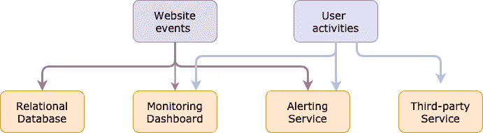
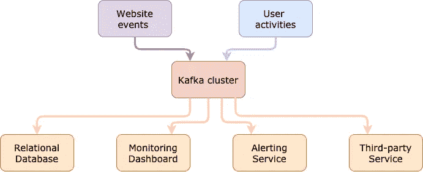
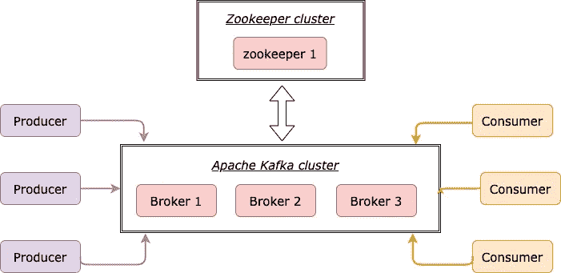
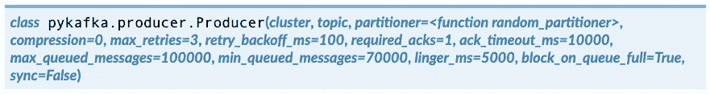

# 掌握 Python 中的 Apache Kafka 应该知道的 3 个库

> 原文：<https://towardsdatascience.com/3-libraries-you-should-know-to-master-apache-kafka-in-python-c95fdf8700f2?source=collection_archive---------4----------------------->

## Python 开发者使用 Kafka 的手册


杰克·吉文斯在 [Unsplash](https://unsplash.com/) 上的照片

数据赋予世界力量。我们每秒钟都会获得大量信息，我们对其进行清理、分析并创造出更有价值的输出，无论是日志文件、用户活动、聊天消息还是其他内容。我们交付得越快，我们给客户带来的价值就越多。我们处在一个快节奏和不断变化的环境中。

Apache Kafka 是一个分布式流媒体平台，可以实时发布、订阅、存储和处理消息。其基于拉的架构减轻了负载较重的服务的压力，并使其易于扩展。它以低延迟将大量数据从源移动到目的地。

[](https://medium.com/@_JeffPoole/thoughts-on-push-vs-pull-architectures-666f1eab20c2) [## 关于推与拉架构的思考

### 我最近和一些人讨论了不同服务架构的优缺点…

medium.com](https://medium.com/@_JeffPoole/thoughts-on-push-vs-pull-architectures-666f1eab20c2) 

Kafka 是一个基于 JVM 的平台，所以客户端的主流编程语言是 Java。但是随着社区的快速发展，高质量的开源 Python 客户端也可以使用，并被用于生产中。

在本文中，我将涵盖最知名的 Python Kafka 客户端: *kafka-python* 、 *pykafka* 和 *confluent-kafka* 并对它们进行比较。最后，我会给出我对每个库的利弊的看法。

## 我们为什么要卡夫卡？

首先要做的事。为什么是卡夫卡？Kafka 旨在推动事件驱动的架构。它通过提供高吞吐量、低延迟、高耐用性和高可用性解决方案来增强架构。*(这并不意味着你可以同时拥有它们，总会有所取舍。阅读此白皮书了解更多信息。)*

[](https://www.confluent.io/white-paper/optimizing-your-apache-kafka-deployment/) [## 如何部署和优化 Kafka 以实现高性能和低延迟

### Apache Kafka 是一个 power stream 处理平台。本白皮书讨论了如何优化 Kafka 部署，以用于…

www.confluent.io](https://www.confluent.io/white-paper/optimizing-your-apache-kafka-deployment/) 

除了它的高性能，另一个吸引人的特性是*发布/订阅*模型，其中发送者不专门向接收者发送消息。取而代之的是，根据 ***主题*** ，消息被传送到接收者可以订阅的集中地点。

通过这样做，我们可以轻松地分离应用程序，摆脱单一设计。让我们看一个例子来理解为什么解耦更好。

您创建了一个需要将用户活动发送到某个地方的网站，因此您编写了一个从您的网站到实时监控仪表板的直接连接。这是一个简单的解决方案，效果很好。有一天，您决定将用户活动存储在数据库中以供将来分析。所以，你写另一个直接的数据库连接到你的网站。与此同时，您的网站获得了越来越多的流量，您希望通过添加警报服务、实时分析服务等来增强它的能力。

你的架构最终会变成这样。诸如大量代码回购、安全问题、可伸缩性问题和可维护性问题等问题会伤害到你。



无解耦建筑(由高创作)

你需要一个*中枢*来分离不同角色的应用程序。对于创建事件的应用程序，我们称之为 ***生产者*** 。他们将事件发布到一个集中的*中心*。每个事件(即消息)属于一个 ***主题*** 。在*枢纽*的另一侧坐着 ***消费者*** *。他们从*中心*订阅他们需要的话题，而不直接与制作人对话。*

有了这个模型，架构可以很容易地扩展和维护。工程师可以更专注于核心业务。



解耦建筑(由高创作)

## 简而言之卡夫卡的设置

可以从 [**官网**](https://kafka.apache.org/) 下载阿帕奇卡夫卡。[快速启动](https://kafka.apache.org/quickstart)帮助你在 10 秒内启动服务器。

也可以从 [**合流平台**](https://www.confluent.io/) 下载阿帕奇卡夫卡。这是迄今为止最大的面向 Kafka 的流媒体数据平台。它为个人和企业提供了一系列围绕 Kafka 的基础设施服务，使数据可以作为实时流使用。[创始人是最初创建 Apache Kafka 的团队成员。](https://www.confluent.io/about/)

每个 Kafka 服务器被称为一个 ***代理*** ，你可以独立运行它或者组成一个集群。除了卡夫卡，我们还需要 [**Zookeeper**](https://zookeeper.apache.org/) 来存储关于卡夫卡的元数据。Zookeeper 就像一个指挥者，管理分布式系统中每个代理的状态。



卡夫卡装置(由高创作)

假设我们已经用 1 个动物园管理员和 1 个 Kafka 经纪人建立了基础设施。是时候连接它了！原 Java 客户端提供了 [**5 个 API**](https://kafka.apache.org/documentation/#api):

*   生产者 API:向 Kafka 集群中的主题发布消息。
*   消费者 API:消费 Kafka 集群中主题的消息。
*   Streams API:消费来自主题的消息，并将它们转换成 Kafka 集群中的其他主题。操作可以是过滤、连接、映射、分组等。
*   Connect API:无需编码，直接将 Kafka 集群连接到源系统或接收系统。该系统可以是文件、关系数据库、弹性搜索等。
*   Admin API:管理和检查 Kafka 集群中的主题和代理。

## 卡夫卡的 Python 库

在 Python 世界中，已经实现了 5 个 API 中的 3 个，它们是生产者 API、消费者 API 和管理 API。Python 中还没有这样的 Kafka Stream API，但是一个不错的替代品是 [**Faust**](https://faust.readthedocs.io/en/latest/) 。

本节中的测试是基于本地安装的 1 个 Zookeeper 和 1 个 Kafka broker 执行的。这与性能调优无关，所以我主要使用库提供的默认配置。

[**卡夫卡-巨蟒**](https://github.com/dpkp/kafka-python)

> kafka-python 的设计功能非常类似于官方的 java 客户端，只带有少量 python 接口。最好配合卡夫卡 0.9+版使用。第一次发布是在 2014 年 3 月。它被积极地维护着。

*安装*

```
pip install kafka-python
```

*制片人*

每条消息通过`send()` **异步发送**。当被调用时，它将记录添加到缓冲区并立即返回。这允许制作人以批处理模式向 Kafka 经纪人发送记录以提高效率。异步可以极大地提高速度，但是我们也应该理解一些事情:

1.  在异步模式下，不保证排序。你不能控制每个消息何时被 Kafka 代理确认(ack)。
2.  对于生产者来说，有一个成功的回调和一个失败的回调是一个很好的实践。例如，您可以在成功回调中写入一条信息日志消息，在失败回调中写入一条异常日志消息。
3.  由于无法保证排序，在您收到回调中的异常之前，可能会发送额外的消息。

如果想避免这些问题，可以选择同步发送消息。`send()`的返回是一个`FutureRecordMetadata`。通过执行`future.get(timeout=60)`，生产者将被阻止最多 60 秒，直到消息被代理成功确认。缺点是速度，与异步模式相比相对较慢。

*消费者*

消费者实例是一个 Python 迭代器。消费类的核心是`poll()`方法。它允许消费者不断从主题中提取信息。它的一个输入参数`timeout_ms`缺省为 0，这意味着该方法会立即返回任何提取的记录以及缓冲区中的可用记录。您可以增加`timeout_ms`返回更大的批次。

默认情况下，每个消费者都是一个无限的侦听器，所以它不会停止，直到程序中断。但另一方面，你可以根据收到的信息阻止消费者。例如，如果达到某个偏移量，您可以退出循环并关闭使用者。

还可以将消费者分配到多个主题的一个分区或多个分区。

[卡夫卡-python-consumer.py](https://gist.github.com/highsmallxu/0f9dc0e3dabfbd6f967a3bf6cf8b6740)

这是 *kafka-python* 库的测试结果。每条消息的大小为 100 字节。生产者的平均吞吐量是 1.4MB/s。消费者的平均吞吐量是 2.8MB/s

[Kafka-python-result . CSV](https://gist.github.com/highsmallxu/c58cbdf076dc8a40019e7dd855b17efb)

[**——卡夫卡**](https://docs.confluent.io/current/clients/confluent-kafka-python/)

> Confluent-kafka 是一个用于 Python 的高性能 kafka 客户端，它利用了高性能 C 客户端 [librdkafka](https://github.com/edenhill/librdkafka) 。从 1.0 版本开始，它们作为独立的二进制轮子在 PyPi 上为 OS X 和 Linux 分发。它支持 Kafka 版本。第一次发布是在 2016 年 5 月。它被积极地维护着。

*安装*

对于 OS X 和 Linux，librdkafka 包含在软件包中，需要单独安装。

```
pip install confluent-kafka
```

对于 windows 用户，在我写这篇文章的时候， *confluent-kafka* 还不支持 Python3.8 二进制轮子。你会碰到 librdkafka 的问题。请检查他们的[发布说明](https://github.com/confluentinc/confluent-kafka-python/releases)，它正在积极开发中。另一个解决方案是降级到 Python3.7。

*制片人*

*合流——卡夫卡*在速度方面有着不可思议的表现。API 设计有点类似于 *kafka-python* 。您可以通过将`flush()`放入循环中来使其同步。

[合流-卡夫卡-制片人. py](https://gist.github.com/highsmallxu/f15d7a40cf6c858786fd6c1845d8f3ae)

*消费者*

*confluent-kafka* 中的消费者 API 需要更多代码。您需要自己处理 while 循环，而不是调用像`consume()`这样的高级方法。我建议你创建自己的`consume()`，它本质上是一个 Python 生成器。每当有一个消息被拉出来并在缓冲区中可用时，它就产生该消息。

这样做，主要功能将是干净的，你可以自由地控制你的消费者的行为。例如，您可以在`consume()`中定义一个“会话窗口”。如果在 X 秒钟内没有提取任何消息，那么消费者将停止。或者您可以添加一个标志 *infinite=True* 作为输入参数来控制消费者是否应该是一个无限的监听器。

[汇合-卡夫卡-消费者. py](https://gist.github.com/highsmallxu/cccb9c70389a1160864f53098b34ec66)

这是 *conflunet-kafka* 库的测试结果。每条消息的大小为 100 字节。生产者的平均吞吐量为 21.97MB/s，消费者的平均吞吐量为 16.8～28.7 MB/s

[汇合-卡夫卡-结果. csv](https://gist.github.com/highsmallxu/d2ffc55419537514eb82fb93d408cbca)

[**卡夫卡**](https://pykafka.readthedocs.io/en/latest/)

> PyKafka 是一个程序员友好的 Python Kafka 客户端。它包括 Kafka 生产者和消费者的 Python 实现，可选地由构建在 [librdkafka](https://github.com/edenhill/librdkafka) 上的 C 扩展支持。它支持 Kafka 版本。第一次发布是在 2012 年 8 月，但自 2018 年 11 月以来就没有更新过。

*安装*

```
pip install pykafka
```

[librdkafka](https://github.com/edenhill/librdkafka) 不附带软件包，你需要在所有操作系统中单独安装。

*制片人*

pykafka 有一个 KafkaClient 接口，它覆盖了生产者 API 和消费者 API。

消息可以在异步和同步模式下发送。我发现 *pykafka* 修改了一些生产者配置的默认值，例如 *linger_ms* 和 *min_queued_messages，*这可能会对发送少量数据产生影响。

你可以和 [Apache Kafka 网站](https://kafka.apache.org/documentation/#producerconfigs)上的默认配置对比一下。

如果您想要获得每个消息的回调，请确保将 *min_queued_messages* 更改为 1，否则如果您的数据集小于 70000，您将不会获得任何报告。



[pykafka-producer-config](https://pykafka.readthedocs.io/en/2.0.0/api/producer.html#module-pykafka.producer)

pykafka-producer.py

*消费者*

你可以从 KafkaClinet 接口得到一个`SimpleConsumer`。这类似于 *kafka-python，*poll 被包装在`SimpleConsumer`类中。

[pykafka-consumer.py](https://gist.github.com/highsmallxu/d99ec0056c3420d9389bce12d9bcd2f8)

这是 *pykafka* 库的测试结果。每条消息的大小为 100 字节。生产者的平均吞吐量是 2.1MB/s。消费者的平均吞吐量是 1.57MB/s

[pykafka-result.csv](https://gist.github.com/highsmallxu/6ec2c8a303453db0cc241a7b63f9ebe7)

## **结论**

到目前为止，我已经解释了每个库的生产者 API 和消费者 API。在管理 API 方面， *kafka-python* 和 *confluent-kafka* 确实提供了显式的管理 API。您可以在您的单元测试中使用它，您想要创建一个主题，然后在执行下一个测试之前删除它。此外，如果您想用 Python 构建 Kafka 监控仪表板，Admin API 可以帮助您检索集群和主题的元数据。

[Kafka-python-result . CSV](https://gist.github.com/highsmallxu/9071651a8bbbb884e3a97714deebc981)

*汇合——卡夫卡:*

毫无疑问，在这三个图书馆中，合流-卡夫卡的表现最好。API 设计得很好，参数与最初的 Apache Kafka 保持相同的名称和默认设置。您可以很容易地将其链接到原始参数。就我个人而言，我喜欢定制消费者行为的灵活性。它也正在积极开发和支持汇合。

一个缺点是，Windows 用户可能需要努力一点才能让它工作。由于它的 C 扩展，调试可能会很棘手。

*卡夫卡-巨蟒:*

*kafka-python* 是一个没有 C 扩展的纯 python 库。该 API 设计良好，对于初学者来说简单易用。这也是一个正在积极开发的项目。

*python-kafka* 的缺点是速度。如果你真的关心性能，我会推荐你切换到*汇合-卡夫卡*。

*卡夫卡*:

相对于 *kafka-python* 和 *conflunet-kafka，*py Kafka 的开发不太活跃。[发布历史](https://pypi.org/project/pykafka/#history)显示自 2018 年 11 月以来未更新。此外， *pykafka* 有不同的 API 设计和使用不同的默认参数，这可能不是第一次直截了当。

我希望你喜欢这篇文章！如果你有任何想法，请在下面留下你的评论。

## 资源

[](https://pypi.org/project/kafka-python/#history) [## 卡夫卡-巨蟒

### Apache Kafka 分布式流处理系统的 Python 客户端。kafka-python 的设计功能很像…

pypi.org](https://pypi.org/project/kafka-python/#history) [](https://pypi.org/project/confluent-kafka/) [## 汇流-卡夫卡

### Confluent 的用于 Apache Kafka 的 Python 客户端

pypi.org](https://pypi.org/project/confluent-kafka/) [](https://pypi.org/project/pykafka/) [## pykafka

### PyKafka 是一个程序员友好的 Python Kafka 客户端。它包括 Kafka 生产者的 Python 实现和…

pypi.org](https://pypi.org/project/pykafka/) [](https://www.confluent.io/resources/kafka-the-definitive-guide/?utm_medium=sem&utm_source=google&utm_campaign=ch.sem_br.nonbrand_tp.prs_tgt.content-search_mt.xct_rgn.emea_lng.eng_dv.all&utm_term=kafka%20the%20definitive%20guide&creative=&device=c&placement=&gclid=CjwKCAjw8J32BRBCEiwApQEKgZ1vBxyFB-DnTvXRClVBHzHX8NERiYyF_2Go5iYHYP6f3aP_l9xNBhoCUi0QAvD_BwE) [## 阿帕奇卡夫卡:权威指南

### 什么是卡夫卡，它是如何工作的？在这本全面的电子书中，你会得到阿帕奇卡夫卡的全面介绍…

www.confluent.io](https://www.confluent.io/resources/kafka-the-definitive-guide/?utm_medium=sem&utm_source=google&utm_campaign=ch.sem_br.nonbrand_tp.prs_tgt.content-search_mt.xct_rgn.emea_lng.eng_dv.all&utm_term=kafka%20the%20definitive%20guide&creative=&device=c&placement=&gclid=CjwKCAjw8J32BRBCEiwApQEKgZ1vBxyFB-DnTvXRClVBHzHX8NERiYyF_2Go5iYHYP6f3aP_l9xNBhoCUi0QAvD_BwE)