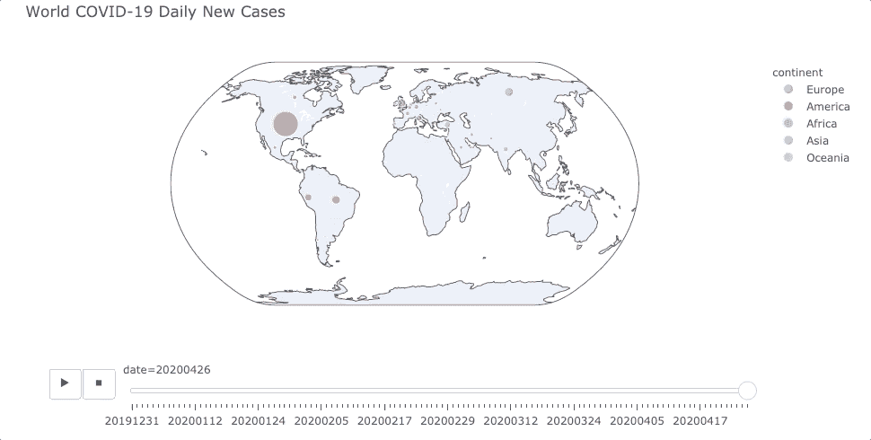
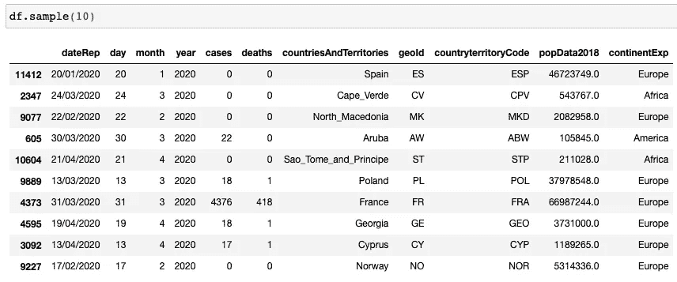
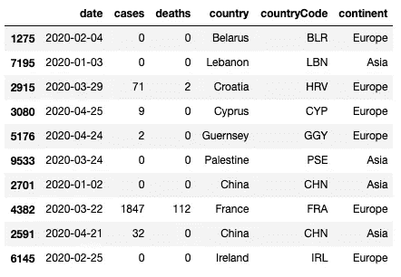
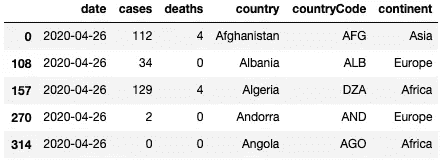
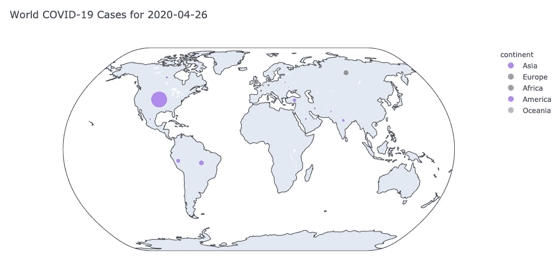
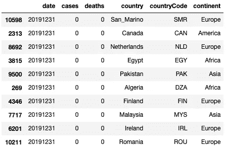
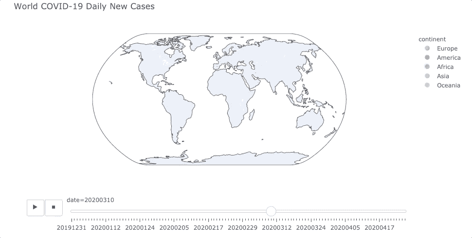

# 3 行 Python 代码创建了一个交互式可玩的新冠肺炎泡泡地图

> 原文：<https://towardsdatascience.com/3-lines-of-python-code-to-create-an-interactive-playable-covid-19-bubble-map-74807939e887?source=collection_archive---------22----------------------->


由[马丁·桑切斯](https://unsplash.com/@martinsanchez?utm_source=medium&utm_medium=referral)在 [Unsplash](https://unsplash.com?utm_source=medium&utm_medium=referral) 上拍摄的照片

## 使用 Plotly Express 创建一个可播放和交互式的全球新冠肺炎确诊病例气泡图。



> 上面的 GIF 显示了我用 Python 中的 Plotly Express 创建的全球地图上的交互式气泡图。如果你对用 3 行代码创建这个感兴趣，请通读。

毫无疑问，Plotly 是最流行的数据可视化库之一，支持许多编程语言。在本文中，我将演示如何使用 Python 中的 Plotly Express 绘制全球新冠肺炎病例数据。

# 关于 Plotly Express

[](https://plotly.com/) [## plot ly:ML 和数据科学模型的前端

### Python、R 和 Julia 中 ML 和数据科学模型的领先前端。作为 ML 和数据的领先 UI 层…

plotly.com](https://plotly.com/) 

作为 Plotly 库的一个子模块，Plotly Express 是为了最有效地传递常用图表而创建的。这是一个简洁、一致、非常高级的 API，可以用漂亮的图形绘制数据。

如果你有很多定制的需求，Plotly Express 不是你的选择。如果是这样的话，您可能需要检查一下常规的 Plotly 库 API。否则，强烈推荐使用 Plotly Express，因为它可以节省您的时间，并且与常规 API 一样出色。

# 新冠肺炎数据源


照片由[米卡·鲍梅斯特](https://unsplash.com/@mbaumi?utm_source=medium&utm_medium=referral)在 [Unsplash](https://unsplash.com?utm_source=medium&utm_medium=referral) 上拍摄

许多组织目前正在提供最新的新冠肺炎数据。我在欧盟找到了这个:

[](https://www.ecdc.europa.eu/en/publications-data/download-todays-data-geographic-distribution-covid-19-cases-worldwide) [## 下载今天全球新冠肺炎病例地理分布的数据

### 每天在欧洲中部时间 6:00 到 10:00 之间，一组流行病学家筛选多达 500 个相关来源，以收集…

www.ecdc.europa.eu](https://www.ecdc.europa.eu/en/publications-data/download-todays-data-geographic-distribution-covid-19-cases-worldwide) 

> 说明:数据来源可以通过搜索引擎简单地找到，本文使用的新冠肺炎数据仅用于数据可视化技术演示，因此我不对数据的准确性负责。

你可以从上面的链接下载 CSV。但是，我们可以使用熊猫直接读取 Python 中的一个 URL。

```
import pandas as pddf = pd.read_csv('[https://opendata.ecdc.europa.eu/covid19/casedistribution/csv'](https://opendata.ecdc.europa.eu/covid19/casedistribution/csv'))
```

下面是数据的样子。请注意，我使用的是`sample`函数，而不是`head`，因为我想看到数据集不同部分的数据，而不仅仅是顶部的几个条目。



在本教程中，我们将使用数据集中的以下字段:

*   日期
*   案例数量
*   死亡人数
*   国家
*   大陆

因此，让我们删除无用的列，并将这些列重命名为 preferences。请注意，这一步是可选的，但这是保持熊猫数据框整洁的好方法。

```
# Remove unuseful columns
df = df[['dateRep', 'cases', 'deaths', 'countriesAndTerritories', 'countryterritoryCode', 'continentExp']]# Rename columns
df = df.rename(columns={
    'dateRep': 'date',
    'countriesAndTerritories': 'country',
    'countryterritoryCode': 'countryCode',
    'continentExp': 'continent'
})# Convert string to datetime
df['date'] = pd.to_datetime(df['date'], format='%d/%m/%Y')# Preview the data frame
df.sample(10)
```



# 创建气泡图


马库斯·斯皮斯克在 [Unsplash](https://unsplash.com?utm_source=medium&utm_medium=referral) 上拍摄的照片

在创建交互式地图之前，让我们先创建一个静态地图。稍后，你会惊讶地发现创建一个可玩的交互式地图是多么容易。

对于静态地图，我想为“今天”创建它。因此，让我们获得全球所有国家的数据框架，但仅限于“今天”。

```
from datetime import datetime# Get today as string
today = datetime.now().strftime('%Y-%m-%d')# Get a data frame only for today
df_today = df[df.date == today]# Preview the data frame
df_today.head()
```



我现在的日子是 4 月 26 日，所以我得到的数据框如上图所示。

然后，让我们使用 Plotly Express 绘制数据框。

```
import plotly.express as pxfig = px.scatter_geo(
    df_today, 
    locations='countryCode',
    color='continent',
    hover_name='country',
    size='cases',
    projection="natural earth",
    title=f'World COVID-19 Cases for {today}'
)
fig.show()
```

简单地说上面的 3 行(这里有 12 行，因为我想以更好的可读性来显示它们)，带有气泡的全球地图显示了今天的确诊病例数，如下所示。



我来解释一下`px.scatter_geo()`函数的参数。

*   对于第一个参数，我们需要提供 Pandas 数据框。Plotly Express 与 Pandas 完全兼容，因此我们可以始终使用数据帧。
*   `locations`采用国家代码对地图上的国家进行地理编码。请注意，我们只是让 Plotly Express 知道名为“countryCode”的列是指示位置的列。我们也可以使用纬度和经度。然而，由于数据源提供了“ [ISO-Alpha](https://en.wikipedia.org/wiki/ISO_3166-1_alpha-3) ”国家代码，因此使用起来更加方便。
*   `color`在这里是可选的，但是根据不同的洲用不同的颜色代码显示气泡是很好的，这样可以使图形更清晰。
*   `hover_name`决定当鼠标悬停在气泡上时显示什么。这里我们让它显示国家名称，因此我们从数据框中指定列名“country”。
*   `size`是决定地图上的气泡有多大的重要参数。当然，我们希望它表明每个国家有多少病例，所以我们指定“病例”。
*   `projection`告诉 Plotly 表达我们要使用的地图的呈现方式。还有许多其他选项，如“等矩形”将显示如下矩形地图。


*   `title`就是简单的设置图形的标题。

现在，创建一个“可玩的泡泡地图”怎么样？轻松点。

让我们放弃`df_today`数据帧，因为它只有今天的数据。我们的原始数据帧`df`有所有的数据。

在我们制作地图动画之前，需要提到的是，Plotly Express 目前只支持“播放”基于整数或字符串类型的数据。我们希望根据日期“播放”气泡图，因此需要将它们转换成数据类型。此外，不要忘记根据日期对数据框进行排序，因为我们希望在自然时间轴中“播放”地图。

```
# Convert date to string type
df['date'] = df.date.dt.strftime('%Y%m%d')# Sort the data frame on date
df = df.sort_values(by=['date'])# Some countries does not have code, let's drop all the invalid rows
df = df.dropna()# Preview the data frame
df.head(10)
```



好的。数据帧现在准备好了。请参考之前我们为今天的数据创建的`px.scatter_geo()`函数。要使其“可播放”，只需让 Plotly 知道哪一列将用于“播放”`animation_frame=”date”`。完整的功能如下。

```
fig = px.scatter_geo(
    df, 
    locations='countryCode',
    color='continent',
    hover_name='country',
    size='cases',
    projection="natural earth",
    title=f'World COVID-19 Cases',
    animation_frame="date"
)
fig.show()
```



我们还可以拖动进度条快速导航到特定日期，以及与地图进行交互以放大/缩小和平移。


看看有多简单！多亏了 Plotly，我们可以在几秒钟内创建精美的图表。

# 摘要


照片由[亚伦·伯顿](https://unsplash.com/@aaronburden?utm_source=medium&utm_medium=referral)在 [Unsplash](https://unsplash.com?utm_source=medium&utm_medium=referral) 上拍摄

的确，Plotly Express 的功能是有限的。例如，如果我们想在地图上自定义气泡大小的比例(一些病例较少的国家不可见)，这将是不方便的。

然而，这些限制是一种权衡，因为 Plotly Express 旨在提供简洁的 API 来非常快速地创建漂亮的图形。因此，我们可以选择使用 Graph Objects 等非常常规的 API 来实现那些定制的需求。

[](https://medium.com/@qiuyujx/membership) [## 通过我的推荐链接加入 Medium 克里斯托弗·陶

### 作为一个媒体会员，你的会员费的一部分会给你阅读的作家，你可以完全接触到每一个故事…

medium.com](https://medium.com/@qiuyujx/membership) 

如果你觉得我的文章有帮助，请考虑加入 Medium 会员来支持我和成千上万的其他作者！(点击上面的链接)

***编者按:*** [*走向数据科学*](http://towardsdatascience.com/) *是一份以数据科学和机器学习研究为主的中型刊物。我们不是健康专家或流行病学家，本文的观点不应被解释为专业建议。想了解更多关于疫情冠状病毒的信息，可以点击* [*这里*](https://www.who.int/emergencies/diseases/novel-coronavirus-2019/situation-reports) *。*