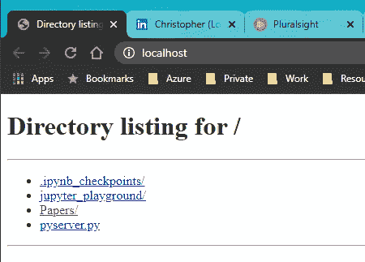
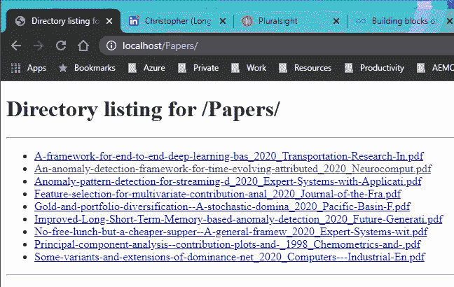
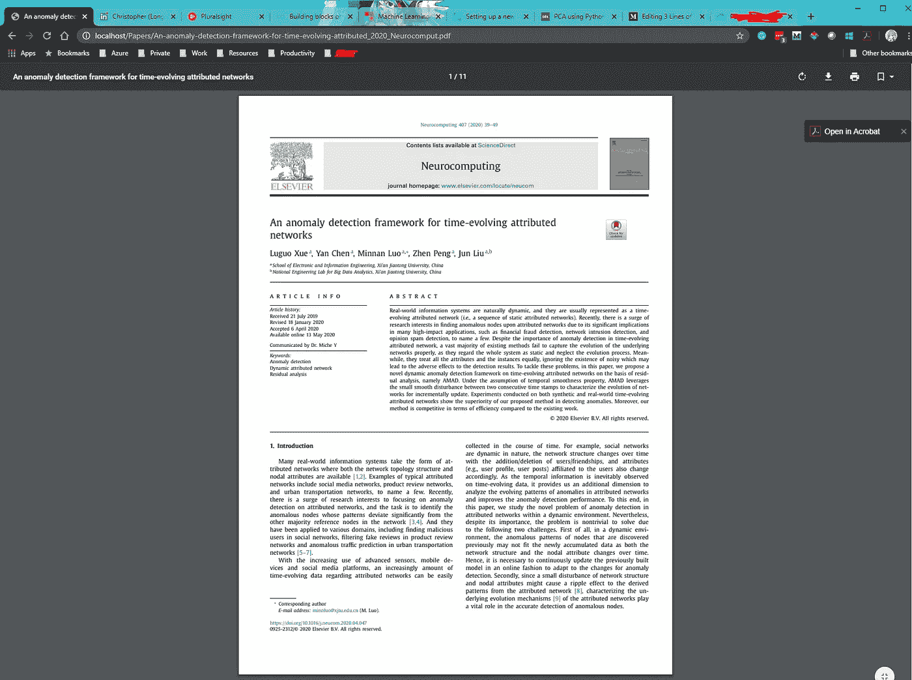

# 用 3 行 Python 代码编写一个 Web 服务器

> 原文：<https://towardsdatascience.com/3-lines-of-python-code-to-write-a-web-server-46a109666dbf?source=collection_archive---------4----------------------->


照片由[卡伦·艾姆斯利](https://unsplash.com/@kalenemsley?utm_source=medium&utm_medium=referral)在 [Unsplash](https://unsplash.com?utm_source=medium&utm_medium=referral) 上拍摄

## 使用内置库“http.server”用 Python 编写的最简单的 web 服务器

要知道 Python 可以非常有效的用来写 web 服务器。据了解，目前有许多流行和优秀的框架和库，如 Django 和 Flask，这使得后端开发人员可以专注于业务逻辑，节省了大量的编码时间。

但是，你知道 Python 的内置库`http.server`也可以用来写 web 服务器吗？还有，你知道你甚至可能只用三行代码就写出一个吗？在本文中，我将向您展示如何在一分钟内编写并运行一个 web 服务器！

# 简单的准备


[Toa Heftiba](https://unsplash.com/@heftiba?utm_source=medium&utm_medium=referral) 在 [Unsplash](https://unsplash.com?utm_source=medium&utm_medium=referral) 上拍摄的照片

web 服务器将需要在某个地方启动，因此您需要考虑要在哪里启动它。然后，你可能想把你的代码放在那里。

此外，我们需要导入`http.server`库。可选地，建议导入`os`库，以确保 web 服务器确实运行在“当前”目录中。换句话说，使用当前目录作为 web 服务器的根路径。

```
import os
from http.server import HTTPServer, CGIHTTPRequestHandler
```

从`http.server`库中，我们需要`HTTPServer`类来实例化服务器对象，以及`CGIHTTPRequestHandler`类作为请求处理器。

如果你不知道什么是`CGI`，这里有一个来自维基百科的简短定义:

> 在计算中，**公共网关接口** ( **CGI** )是一种接口规范，用于 web 服务器执行程序，如运行在动态生成网页的服务器上的控制台应用程序(也称为命令行接口程序)。这样的程序被称为 CGI 脚本或简称为 T21 CGI。服务器如何执行脚本的细节由服务器决定。在一般情况下，CGI 脚本在发出请求时执行，并生成 HTML。[1]

# 三行代码


乔希·里默尔在 [Unsplash](https://unsplash.com?utm_source=medium&utm_medium=referral) 上拍摄的照片

然后，让我们用三行代码编写服务器，不开玩笑。

## 第一行

让我们确保在当前目录下创建服务器，并将其用作根路径。`os.chdir()`方法会将路径设置为当前工作目录。这里我们将当前目录`.`设置为它的工作目录。

```
# Make sure the server is created at current directory
os.chdir('.')
```

## 第二行

让我们从`HTTPServer`类创建一个“服务器对象”。它有两个参数，第一个是`server_address`,它是

*   侦听的地址，其中空字符串表示侦听本地主机
*   侦听的端口号。我将使用端口 80，这样我就不必输入端口号来访问。您可以选择使用其他端口号，如 8080

```
# Create server object listening the port 80
server_object = HTTPServer(server_address=('', 80), RequestHandlerClass=CGIHTTPRequestHandler)
```

第二个参数是请求处理程序类。这里我们使用已经导入的`CGIHTTPRequestHandler`。

## 第三行

没别的，我们跑吧！

```
# Start the web server
server_object.serve_forever()
```

`serve_forever()`方法将基于我们刚刚创建的服务器对象启动服务器，并确保它持续运行。

## 所有代码放在一起

```
Here is all the code:import os
from http.server import HTTPServer, CGIHTTPRequestHandler# Make sure the server is created at current directory
os.chdir('.')
# Create server object listening the port 80
server_object = HTTPServer(server_address=('', 80), RequestHandlerClass=CGIHTTPRequestHandler)
# Start the web server
server_object.serve_forever()
```

# 测试服务器以及我们为什么需要它


本·怀特在 [Unsplash](https://unsplash.com?utm_source=medium&utm_medium=referral) 上的照片

将所有代码保存到一个名为`pyserver.py`的文件中。然后，转到命令行并运行 Python 脚本。

```
python pyserver.py
```

您将在 stdout 中看到预期的任何输出。去你的浏览器输入`localhost`，网络服务器已经开始工作了。



web 服务器根目录的屏幕截图

因此，这个 web 服务器将允许您从根路径浏览文件。

现在，你可能会问我为什么需要这个 web 服务器？对，没那么有用。但是想想你能用网络浏览器做什么？例如，我过去常常下载一些通常是 PDF 格式的学术研究论文。你会发现在网页浏览器中浏览子文件夹和打开 PDF 文件比使用 Windows 资源管理器和 Mac OS Finder 要快得多。



包含 PDF 文件的文件夹的屏幕截图



打开的 PDF 文件的屏幕截图

同样，在这个例子中，我们在本地机器上运行 web 服务器。如果您可以在远程机器上运行这个 Python 脚本，那么您将获得一个非常快速的文件共享服务器！

# 总结和注意事项


照片由[吴礼仁](https://unsplash.com/@gohrhyyan?utm_source=medium&utm_medium=referral)在 [Unsplash](https://unsplash.com?utm_source=medium&utm_medium=referral) 上拍摄

在本文中，我介绍了如何只用三行 Python 代码编写一个 web 服务器，让您可以浏览服务器上的文件。

然而，需要注意的是，实现如此简单的`http.server`是不安全的。因此，请不要在重要的环境中只使用这三行代码，这可能会成为潜在的安全漏洞。

[](https://medium.com/@qiuyujx/membership) [## 通过我的推荐链接加入 Medium 克里斯托弗·陶

### 作为一个媒体会员，你的会员费的一部分会给你阅读的作家，你可以完全接触到每一个故事…

medium.com](https://medium.com/@qiuyujx/membership) 

如果你觉得我的文章有帮助，请考虑加入 Medium 会员来支持我和其他成千上万的作者！(点击上面的链接)

# 参考

[1]通用网关接口，*维基百科*[https://en.wikipedia.org/wiki/Common_Gateway_Interface](https://en.wikipedia.org/wiki/Common_Gateway_Interface)