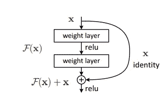
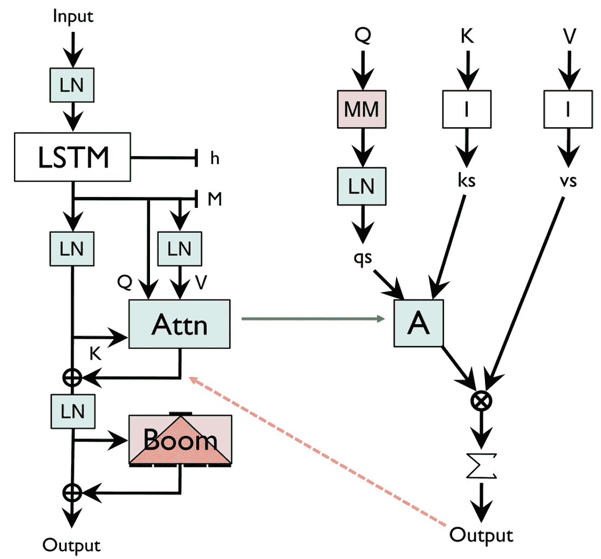
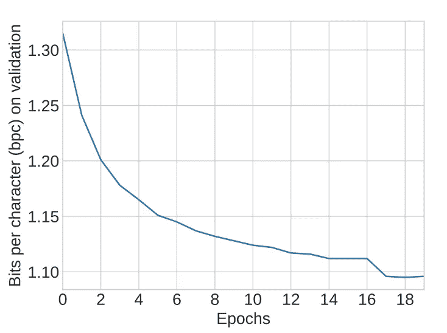
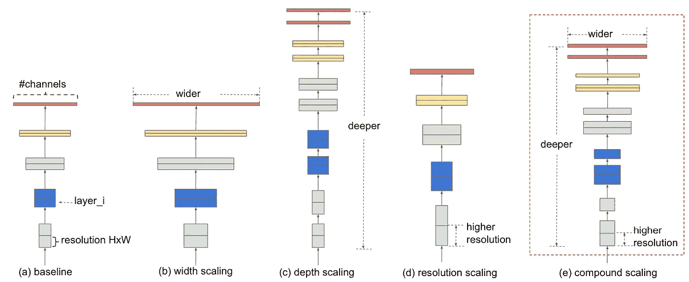
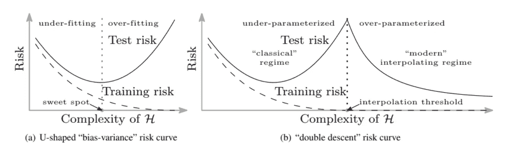
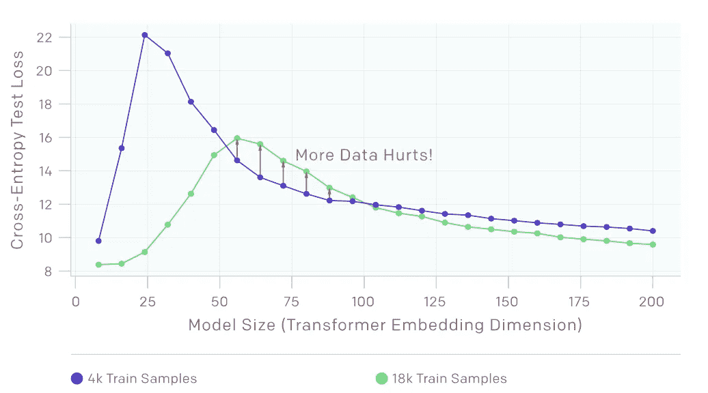
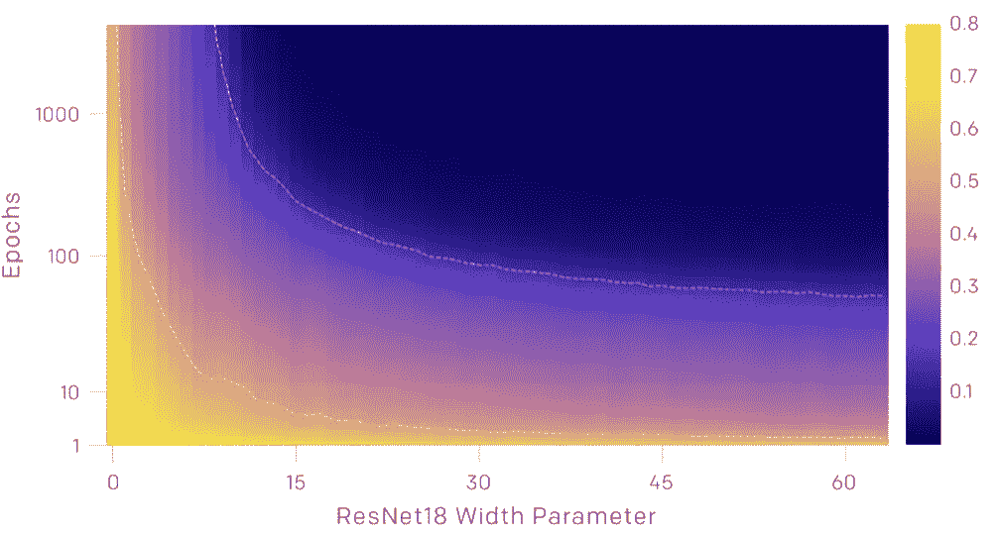
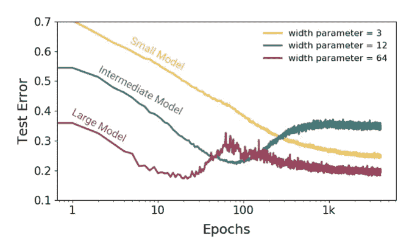

# 2021 年你应该阅读的 4 篇重要的机器学习和深度学习论文

> 原文：<https://towardsdatascience.com/3-machine-learning-research-papers-you-should-read-in-2020-9b639bd0b8f0?source=collection_archive---------9----------------------->

## 2021 年机器学习的突破

## 从数百篇高质量的 ML 研究论文中筛选出来的，这些是最突出的。

丹·迪莫克在 [Unsplash](https://unsplash.com?utm_source=medium&utm_medium=referral) 上拍摄的照片

> 2021 年重要的机器学习和深度学习论文

[**机器学习**](https://www.iunera.com/kraken/fabric/machine-learning/) 突然成为计算机科学最关键的领域之一，几乎涉及到所有与人工智能相关的领域。

每个公司都在应用 [**机器学习**](https://www.iunera.com/kraken/fabric/machine-learning/) 并开发利用这个领域的产品来更有效地解决他们的问题。

每年都有数千篇与 [**机器学习**](https://www.iunera.com/kraken/fabric/machine-learning/) 相关的研究论文发表在 NeurIPS、ICML、ICLR、ACL、MLDS 等热门刊物上。

该标准使用来自三个学术来源的**引用计数**:[scholar.google.com](https://scholar.google.com/)；[academic.microsoft.com](https://academic.microsoft.com/)；还有 semanticscholar.org 的。

> 自然语言处理、[对话式人工智能、计算机视觉、强化学习](https://www.iunera.com/kraken/fabric/machine-learning/)和人工智能伦理方面的重要研究论文每年发表一次

几乎所有的论文都提供了在 [**机器学习**](https://www.iunera.com/kraken/fabric/machine-learning/) 领域的某种程度的发现。然而，有三篇论文特别站得住脚，它们在 [**机器学习**](https://www.iunera.com/kraken/fabric/machine-learning/) 领域，特别是在 [**神经网络**](https://www.iunera.com/kraken/fabric/machine-learning/) 领域提供了一些真正的突破。

# 用于图像识别的深度残差学习

arvix:[https://www . cv-foundation . org/open access/content _ cvpr _ 2016/papers/He _ Deep _ Residual _ Learning _ CVPR _ 2016 _ paper . pdf](https://www.cv-foundation.org/openaccess/content_cvpr_2016/papers/He_Deep_Residual_Learning_CVPR_2016_paper.pdf)

## 摘要:

*越深的神经网络越难训练。我们提出了一个剩余学习框架来简化比以前使用的网络更深入的网络训练。我们明确地将这些层重新表述为参考层输入的学习剩余函数，而不是学习未被参考的函数。*

## 在深度意义的驱动下，一个问题产生了:学习更好的网络是不是和堆叠更多层一样简单？

具有 20 层和 56 层平面网络的 CIFAR-10 上的训练误差(左)和测试误差(右)。

学习身份函数[极其困难](https://www.kdnuggets.com/2017/04/top-20-papers-machine-learning.html)，因为权重和偏差的所有可能组合的范围都是巨大的，因此学习[身份函数的机会微乎其微](https://www.kdnuggets.com/2017/04/top-20-papers-machine-learning.html)。如上所述，[给神经网络增加更多的层](https://www.kdnuggets.com/2017/04/top-20-papers-machine-learning.html)实际上可能会适得其反:更多的层=更低的精度(收益递减)。

该文件指出，对此有一个解决办法。也就是通过**将隐藏层的输入与输出**相加

剩余学习:一个积木。

通过在更深的网络上实现这一想法，他们能够在 COCO 对象检测数据集上获得 28%的相对改善。深度残差网络是我们提交给 ILSVRC 和 COCO 2015 竞赛的基础，在那里他们还在 ImageNet 检测、ImageNet 定位、COCO 检测和 COCO 分割任务中获得了[第一名](https://www.kdnuggets.com/2017/04/top-20-papers-machine-learning.html)。

# 单头注意力 RNN:停止用你的头脑思考

arvix:*作者:[*史蒂文*](https://scholar.google.com/citations?hl=en&user=AolIi4QAAAAJ&view_op=list_works&sortby=pubdate)*

*在这篇论文中，哈佛毕业生史蒂文·梅里蒂介绍了一种最新的自然语言处理模型，称为单头注意力 RNN 或沙-RNN。Stephen Merity，独立研究员，主要专注于 [**机器学习、NLP 和深度学习**](https://www.kdnuggets.com/2017/04/top-20-papers-machine-learning.html) 。作者通过一个简单的带有 SHA 的 LSTM 模型进行演示，在 *enwik8 上实现了最先进的字节级语言模型结果。**

*作者的主要目标是表明，如果我们沉迷于稍微不同的首字母缩写词和稍微不同的结果，整个领域可能会朝着不同的方向发展。*

* [## Smerity/sha-rnn

### 要了解全部细节，请参见题为《单头注意力 RNN:停止用你的头脑思考》的论文。总而言之，“停止思考…

github.com](https://github.com/smerity/sha-rnn) 

Steven 提出的模型架构的中心概念由一个 **LSTM 架构和一个基于阿沙的网络**组成，该网络具有三个变量(Q、K 和 V)。

来源:Arvix([*https://arxiv.org/pdf/1911.11423.pdf*](https://arxiv.org/pdf/1911.11423.pdf)*)*

每个 SHA-RNN 层只包含一个关注点，通过消除更新和维护多个矩阵的需要，有助于将模型的内存消耗保持在最低水平。

Boom 层与在变形金刚 和其他架构中发现的 **l** [**arge 前馈层紧密相关。与传统的向下投影层相比，该块通过使用高斯误差线性单元(GeLu)乘法来分解输入以最小化计算，从而减少并移除了整个参数矩阵。**](https://www.kdnuggets.com/2017/04/top-20-papers-machine-learning.html)

下面我们来看实际对比。2016 年，[RNN 正则化方法 surprise-Driven zone out](https://www.kdnuggets.com/2017/04/top-20-papers-machine-learning.html)在 Hutter Prize 数据集 *enwiki8* 上取得了 1.313bpc 的优异压缩成绩，该数据集是一个百兆字节的维基百科页面文件。

与 2016 年的车型相比，SHA-RNN 的 bpc 甚至更低。令人印象深刻。每个字符的位数是由 Alex Graves 提出的模型，用于在给定过去字符的情况下近似下一个字符的[概率分布。](https://www.kdnuggets.com/2017/04/top-20-papers-machine-learning.html)

来源:[https://arxiv.org/pdf/1911.11423.pdf](https://arxiv.org/pdf/1911.11423.pdf)

此外，单头注意力 RNN(沙-RNN)设法实现了强大的最先进的结果，几乎没有超参数调整，并通过使用一个单一的泰坦 V GPU 工作站。此外，他的工作没有经历过密集的超参数调整，完全依赖于一台商用台式机，这使得作者的小工作室公寓有点太温暖了，他不喜欢。这就是对 [**机器学习**](https://www.iunera.com/kraken/fabric/machine-learning/) **的热情。*** 

# *EfficientNet:重新思考卷积神经网络的模型缩放*

*arvix:[【https://arxiv.org/abs/1905.11946】](https://arxiv.org/abs/1905.11946)
作者: [*谭明兴*](https://arxiv.org/search/cs?searchtype=author&query=Tan%2C+M)*[*郭诉乐*](https://arxiv.org/search/cs?searchtype=author&query=Le%2C+Q+V)**

**在本文中，作者系统地研究了模型缩放，并确定仔细平衡网络深度、宽度和分辨率可以获得更好的性能。本文展示了一种新的缩放方法，它使用一个简单而高效的复合系数统一缩放深度、宽度和分辨率的所有维度。**

** [## narumiruna/efficient net-pytorch

### “EfficientNet:卷积神经网络模型缩放的再思考”的 PyTorch 实现。…

github.com](https://github.com/narumiruna/efficientnet-pytorch) 

论文提出了一种*简单*然而*有效*的复合缩放方法，描述如下:

来源:Arvix([*)https://arxiv.org/abs/1905.11946*](https://arxiv.org/abs/1905.11946)*)*

经过尺寸缩放(宽度、深度或分辨率)的网络可提高精度。但是需要注意的是，模型精度随着模型的增大而下降。因此，在 CNN 缩放过程中平衡网络的所有三个维度(宽度、深度和分辨率)对于提高精度和效率至关重要。

与传统的缩放方法相比，如上所述的***复合缩放方法*** 持续提高了放大现有模型的模型精度和效率，例如 [MobileNet](https://arxiv.org/abs/1704.04861) (+1.4%图像净精度)和 [ResNet](https://arxiv.org/abs/1512.03385) (+0.7%)

缩放不会改变图层操作；相反，他们通过进行神经架构搜索(NAS)获得了他们的基本网络，该网络同时优化了准确性和 FLOPS。与 ResNet-50 和 DenseNet-169 等现有 ConvNets 相比，扩展的 EfficientNet 模型始终将参数和 FLOPS 减少了一个数量级(参数减少高达 8.4 倍，FLOPS 减少高达 16 倍)。

EfficientNets 还在八个数据集的五个中实现了最先进的准确性，如 [CIFAR-100](https://www.cs.toronto.edu/~kriz/cifar.html) (91.7%)和 [Flowers](http://www.robots.ox.ac.uk/~vgg/data/flowers/) (98.8%)，参数数量级更少(参数减少高达 21 倍)，这表明 EfficientNets 也传输良好。** 

# **深度双重下降:更大的模型和更多的数据会造成伤害**

**arvix: *作者:[*普雷顿·纳克兰*](https://arxiv.org/search/cs?searchtype=author&query=Nakkiran%2C+P)*[*加尔·卡普伦*](https://arxiv.org/search/cs?searchtype=author&query=Kaplun%2C+G)*[*亚米尼·班萨尔*](https://arxiv.org/search/cs?searchtype=author&query=Bansal%2C+Y)*[*特里斯坦·杨*](https://arxiv.org/search/cs?searchtype=author&query=Yang%2C+T)********

***在本文中，作者在 [OpenAI](https://openai.com) 将[神经网络](https://www.iunera.com/kraken/fabric/machine-learning/)的一个训练过程的有效模型复杂度(EMC) 定义为它能达到接近零训练误差的最大样本数。进行的实验表明，在*插值阈值*附近存在一个临界区间。***

**插值阈值意味着模型随着模型参数的数量、训练的长度、分布中的标签噪声量以及训练样本的数量而变化。临界区域只是参数化不足和参数化过度的风险域之间的一个小区域。**

****

**来源:[https://www . less wrong . com/posts/frv 7 ryoqtvsuqbxut/understanding-deep-double-descent](https://www.lesswrong.com/posts/FRv7ryoqtvSuqBxuT/understanding-deep-double-descent)**

**在大多数研究中，*偏差-方差权衡*是经典统计学习理论中的一个基本概念。这个想法是，模型越复杂，偏差越小，但方差越大。**

## **一旦模型复杂性超过临界区间，模型会过度拟合，方差项会控制测试误差，因此从这一点开始，增加模型复杂性只会降低性能，这称为双下降现象。**

** [## 深度双重下降

### 我们证明了双重下降现象发生在 CNN、ResNets 和 transformers 中:性能首先提高，然后…

openai.com](https://openai.com/blog/deep-double-descent/) 

本文定义了模型性能降低的三种情况，因为下面的状态变得更加重要。

## (按型号)双重下降—型号越大，伤害越大

**模范政权**(来源:[*【https://arxiv.org/abs/1912.02292】*](https://arxiv.org/abs/1912.02292)*)*

论文展示了不同架构、数据集、优化器和训练过程中的模型式双下降现象。

该论文的结论是，通过在训练之前对数据集进行的常规修改(例如，添加标签噪声、使用数据扩充和增加训练样本的数量)，测试误差峰值会向更大的模型移动**。**

此外，在上面的图表中，测试误差的峰值出现在插值阈值附近，此时模型刚好大到足以适合训练集。

## (样本方面)非单调性—更多数据会造成伤害

**样本政权**(来源:[*https://arxiv.org/abs/1912.02292*](https://arxiv.org/abs/1912.02292)*)*

在本节中，图表显示了改变固定模型的训练样本数量的效果。增加样本数量会使曲线向较低的测试误差方向下移，但也会使峰值误差向右移动。

## (纪元方式)双重下降-更高的纪元伤害

**历朝政权**(来源:[【https://arxiv.org/abs/1912.02292】T21](https://arxiv.org/abs/1912.02292)*)*

对于给定数量的优化步骤(固定的 y 坐标)，测试和训练误差呈现出模型大小的双重下降。对于给定的模型尺寸，随着训练过程的进行，测试和训练误差减小、增大、再减小；我们称这种现象为划时代的双重下降。

# 增加训练时间会增加 EMC，因此在整个训练阶段，一个足够大的模型会从参数不足过渡到参数过多。

此外，具有更多宽度参数的较大模型(如 ResNet 架构)可能会经历显著的双下降行为，其中测试误差首先下降(*比其他尺寸模型*更快)，然后在插值阈值附近上升，然后再次下降，如下所示。

来源:[https://mltheory.org/deep.pdf](https://mltheory.org/deep.pdf)

对于处于插值阈值的模型，实际上只有一个全局模型适合训练数据，强制它适应甚至小的错误指定的标签将破坏它的全局结构。然后，该论文得出结论，没有好的模型既能对训练集进行插值，又能在测试集上表现良好。

如上所述，这些关键机制的特征为实践者提供了一种有用的思维方式，**希望很快在机器学习方面取得突破。**

# 参考

 [## 理解“深度双重下降”——less wrong 2.0

### 如果你不熟悉双重下降现象，我想你应该熟悉。我认为双重血统是一种…

www.lesswrong.com](https://www.lesswrong.com/posts/FRv7ryoqtvSuqBxuT/understanding-deep-double-descent)  [## 深度双重下降

### 我们证明了双重下降现象发生在 CNN、ResNets 和 transformers 中:性能首先提高，然后…

openai.com](https://openai.com/blog/deep-double-descent/) 

# 最后

随着 [**机器学习**](https://www.iunera.com/kraken/fabric/machine-learning/) 社区每年的成长，会有越来越多的论文发表。这是我们的一部分，阅读新的和合理的文章，以装备自己在社区的最新和最先进的突破。继续阅读爱好者伙伴！

如果我已经设法让你注意到这一点，请留下评论，如果你对这个系列有任何建议，因为它将大大增加我的知识，改善我的写作方式。[***Prem Kumar***](/@premstroke95)**是一个无私的学习者，对我们身边的日常数据充满热情。如果你想谈论这个故事和等待的未来发展，请在*[***LinkedIn***](https://www.linkedin.com/in/premstrk/)**上与我联系。*****