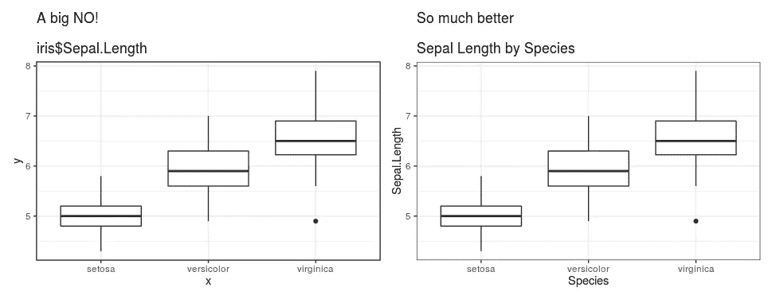
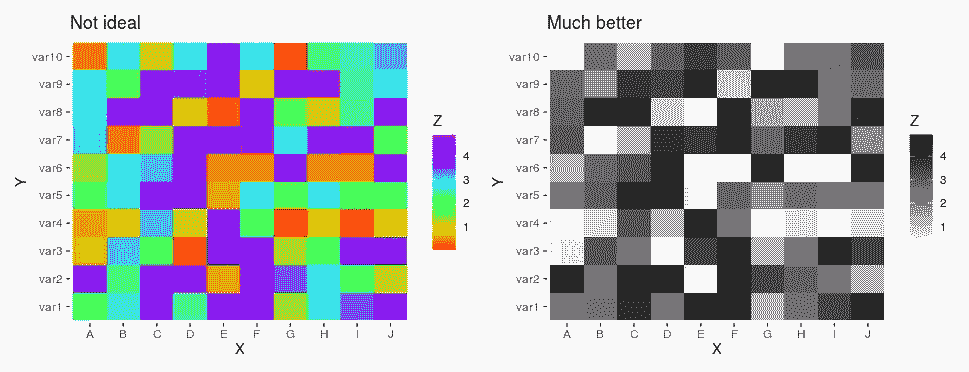

# 学生在开始学习数据科学时会犯的 3 个错误

> 原文：<https://towardsdatascience.com/3-mistakes-students-make-when-starting-data-science-aa6081733a54?source=collection_archive---------11----------------------->

## 成为更好的数据科学家的技巧和资源

最近，我有幸作为小组成员参加了东北大学的新冠肺炎发现数据大会。目标很简单:从[开源新冠肺炎数据](https://www.kaggle.com/roche-data-science-coalition/uncover)中产生可操作的见解和/或预测模型，以帮助社区做出更好的决策。

我想写下一些我注意到的学生在资源上犯的常见错误，他们可以在那里找到更多的帮助。

# 忽略了良好可视化的价值

我坚信，如果没有有意义的可视化，您的分析和建模工作是没有价值的。视觉化不需要新颖，但必须是深思熟虑的和完整的。提高可视化的一些技巧:

1.  添加轴标签和绘图标题:对“x”和“y”轴标签和 df $变量标题说不！这就像穿着运动裤去参加一个聚会，没什么不对，但你可能要重新考虑一下。

添加轴标签和标题(必要时添加图例)会使可视化更加有效。图片作者。

2.彩虹色是一大禁忌！色彩可以让剧情在视觉上刺激，但是太多了从来都不好。彩虹调色板的衰落已经被记录了几次，无数的帖子对此进行了更详细的讨论，一个简单的谷歌搜索就会发现无数的文章。
我的经验法则是:少用颜色，让观众注意到视觉的某个方面。

虽然彩虹调色板的颜色更丰富，但黑白更有价值。彩虹是混乱的，需要观看者不断地看着传说，然后理解故事情节。图片作者。

下面的帖子详细介绍了如何使用一些简单的工具来挑选更好的颜色，[colorbrewer2.org](https://colorbrewer2.org/)是我经常使用的一个网站。

 [## 如何为数据可视化选择更漂亮的颜色

### 为图表选择好的颜色很难。这篇文章试图让它变得更简单。我希望你感觉更自信…

blog.datawrapper.de](https://blog.datawrapper.de/beautifulcolors/) 

3.选择正确的可视化:这听起来像是一句“废话，天才！”点，但从传达信息的意义上来考虑一个情节，而不是从数据中传达一个观察结果，这是值得的。下面的帖子是一个很好的起点。提示:试着为给出的例子想出不太理想的可视化效果。

 [## 如何为您的数据选择正确的图表

### 如果您想要可视化数据，请确保使用正确的图表。虽然您的数据可能适用于多个…

infogram.com](https://infogram.com/page/choose-the-right-chart-data-visualization) 

最后，如果你是一名东北学生，我强烈建议你参加一门可视化课程——比如 DS5500。

# 幻灯片很无聊，故事很有趣

讲故事非常有效地帮助观众理解你对数据和你试图解决的问题的观点。我喜欢带领我的观众踏上数据之旅，向他们展示我在哪里遇到了麻烦，并用可靠的数据可视化来支持我的决策。从一个简单的结构开始:

1.  分析的目的:清楚地陈述你想要达到的目标和一个小要点，以及为什么这对某人有用。
2.  数据:数据的一个小片段(标题)有助于将听众与手边的问题联系起来。当使用大型数据集时，重要变量的汇总统计会很有帮助。
3.  分析、方法和结果:向观众介绍一些你执行的分析和使用的建模方法，必要时用可视化来补充。显示变量中的异常值、不一致和缺失，以及如何处理它们。
4.  结论:这个比你想象的简单多了，重申结果，以及为什么有意义。我喜欢把这一部分看作是我的一两张幻灯片的概述。

熟能生巧，我发现 YouTube 是一个很好的资源。观察演讲者如何分析，并尝试思考是否有其他方式可以传达相同的信息。

最终想法:演示者就像牧羊人引导观众(羊)通过数据得出结论。当你得出结论的时候，你不希望羊群走失。

# 太快开始做模特了

从数据科学开始，我也渴望拟合模型，并在测试集上呈现最高的准确性。但是随着时间的推移，我意识到一个**模型的好坏取决于用来建立模型**的数据。探索性数据分析不仅能让你更好地理解数据，还能让你更好地向听众传达为什么要做出某些决定。作为一名数据科学家，我 70%的时间都花在清理数据和发现不一致的地方。

建模前需要考虑的几件事:

1.  多重共线性和混杂变量:数据通常充满了噪音和混杂变量。查看可以消除哪些变量的一个简单方法是查看相关性热图，并对保留/删除显示明显相关性的变量进行推理。在我看来，这为你和你的观众完成了 80%的工作。
2.  数据很乱！清理异常值，并考虑如何处理缺失值。真实世界的数据永远不会像你期望的那样，这很容易打乱你的分析，得出错误的结论。

这不是数据科学。来源:https://xkcd.com/1838/

 [## 为什么数据科学不仅仅是？适合()。预测()

### 在这篇文章中，我将回顾一些我学到的让我从一名技术数据科学家变成…

towardsdatascience.com](/top-examples-of-why-data-science-is-not-just-fit-predict-ce7a13ef7663) 

总之，关注你的听众，从数据中呈现一个故事。使用正确的可视化来帮助你的故事，并验证你选择的变量来创建模型。记住这些提示，通过实践，你将学会成为一名更好的数据科学家。

感谢阅读！