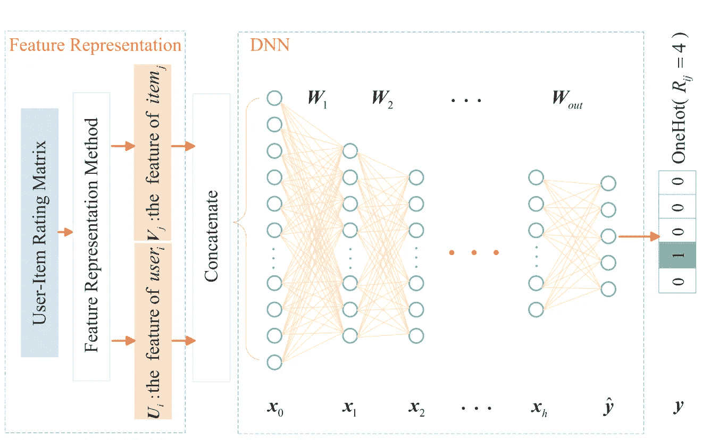

# 用这三个数据科学项目打动你的招聘经理

> 原文：<https://towardsdatascience.com/3-must-do-projects-for-every-aspiring-data-scientist-in-2020-c03ed888c017?source=collection_archive---------49----------------------->

## 用有影响力的项目打动你的招聘经理

## 向您展示各种不同的现实世界问题以及如何解决它们。

蒂姆·范德奎普在 [Unsplash](https://unsplash.com?utm_source=medium&utm_medium=referral) 上拍摄的照片

2020 年，如果你想进入数据科学和机器学习行业，教育背景是不够的。招聘人员和招聘经理希望看到真正的时间被投入到解决可能对企业和世界产生影响的现实问题中。如今，商业世界将数据科学用于各种目的，包括金融、零售、制造、运输等。拥有技术和实际的实践技能是将你与其他数据科学家区分开来的最重要的标准之一。您必须能够理解如何识别哪些业务相关的问题可以通过使用您所拥有的特定技能得到最好的解决。这就是为什么做那些**接近真实世界的项目是重要的**。我列出了 3 个与现实环境密切相关的项目，以及如何利用这些项目建立一个坚实有效的个人技能组合。

以下 3 个项目旨在解决成为数据科学家的一些核心基础问题:

> 统计和概率、数学、预测和逻辑建模、数据争论和**预处理**技能、数据可视化、机器学习、神经网络、CNN 等等。

# 新冠肺炎全球研究项目(CORD-19)

照片由[空气焦点](https://unsplash.com/@airfocus?utm_source=medium&utm_medium=referral)在 [Unsplash](https://unsplash.com?utm_source=medium&utm_medium=referral) 上拍摄

新冠肺炎全球疫情为数据科学家同事提供了一个绝佳的机会，让他们可以将自己的一些崇高工作投入到当前的形势中。CORD-19 数据集是与白宫和领先的研究小组联盟合作编制的，其中包括超过 140，000 篇学术文章，包括超过 65，000 篇全文，涉及新冠肺炎，新型冠状病毒和相关的冠状病毒病例。

> **你的目标？—开发强大的数据和文本挖掘工具，帮助医疗机构回答高优先级的科学问题**

目前有 18 项任务需要一个全面的解决方案来准确回答美国国家科学院、工程和医学委员会新兴传染病和 21 世纪健康威胁常设委员会(NASEM 的 SCIED)和世界卫生组织(世卫组织)在疫情援助中提出的一些紧迫的科学问题。

 [## tarunk 04/新冠肺炎案例研究和预测

### 这个库是一个案例研究，分析和新冠肺炎疫情传播的可视化，以及预测模型…

github.com](https://github.com/tarunk04/COVID-19-CaseStudy-and-Predictions)  [## 新型冠状病毒 2019 数据集

### 新冠肺炎受影响病例的日水平信息

www.kaggle.com](https://www.kaggle.com/sudalairajkumar/novel-corona-virus-2019-dataset) 

CORD-19 是一个巨大的 13.3Gb 数据集，包括超过 114k 个文件和 3000+列，具有 8 个不同的目标表— *人口、患者描述、材料、诊断、治疗干预、风险因素和模型*，以准确提供关于该疫情的一些关键科学问题的相关答案。迄今为止，CORD-19 数据集已有超过 178 万次浏览和 73，000 次下载。许多重要的基础知识，如****时序分析*** 和 ***可视化*** 都经过测试，以开发出最终的工具。这个项目确实值得一试。*

# *信用卡欺诈交易检测*

**

*由[塞巴斯蒂安·赫尔曼](https://unsplash.com/@officestock?utm_source=medium&utm_medium=referral)在 [Unsplash](https://unsplash.com?utm_source=medium&utm_medium=referral) 上拍摄的照片*

*想象一下。你正在研究你的每月信用卡账单，你注意到附近的一家杂货店收取了 150 美元。问题是，你已经几个月没去商店买东西了。那笔可疑的费用可能是一个信号——你是信用卡诈骗的受害者。检测信用卡交易中的欺诈是金融研究中的一个巨大课题，具有深远的经济意义。此外，检测未经授权的信用卡交易是一个极其复杂的问题，因为如果单独使用，这些特征很少有用。*

> *你的目标？— **预测和分析任何特定的信用卡交易是否是欺诈交易***

* [## 信用卡欺诈检测

### 被标记为欺诈或真实的匿名信用卡交易

www.kaggle.com](https://www.kaggle.com/mlg-ulb/creditcardfraud) 

布鲁塞尔自由大学(ULB)提供了 143Mb 的数据集，这是欧洲持卡人在 2013 年进行的交易。它包含 284，807 笔交易中的 492 个欺诈和 28 个匿名特征，这些特征经过了主成分分析(PCA)以保护用户身份和敏感特征。处理**不平衡/偏斜数据**、**异常检测**、**逻辑回归**等。是你在这个项目中会面临的一些问题，如果彻底分析，这些问题是真正有益的。* 

# *项目推荐模型*

**

*照片由[自由使用声音](https://unsplash.com/@freetousesoundscom?utm_source=medium&utm_medium=referral)上的 [Unsplash](https://unsplash.com?utm_source=medium&utm_medium=referral)*

*随着 Youtube、亚马逊、网飞等在线公司和许多其他类似网络服务的兴起，推荐系统在我们的生活中占据了越来越多的位置，而我们却没有意识到这一点。最近的一项研究表明，网飞有超过 1300 个关于其所有用户的推荐集群，可以根据他们的观看行为(类型、观看时间、兴趣等)将正确的电影准确地部署在正确的用户面前。推荐系统目前被部署用于大型互联网公司和企业的各种任务，包括广告点击率(CTR)预测和排名。这些系统有时在一些行业中至关重要，因为当它们有效时可以产生大量的收入，或者是在市场中脱颖而出的一种方式。*

> *你的目标？—使用 TensorFlow 开发基于客户项目的推荐模型*

* [## 在 TensorFlow 中构建推荐系统:概述|解决方案

### 本文是一个多部分教程系列的概述，向您展示如何实现一个推荐系统…

cloud.google.com](https://cloud.google.com/solutions/machine-learning/recommendation-system-tensorflow-overview) 

推荐模型是一种简单的算法，用于将正确的内容呈现在正确的用户面前。有相当多的方法被用来建立模型，如协同过滤、内容过滤、神经网络等。协同过滤是最广泛使用的系统，因为它们不同于基于内容的方法，因为它们不需要关于用户或项目的大量信息，并且它们仅基于用户和项目之间的交互信息(例如点击、浏览和评级)来做出准确的推荐。随着用户信息变得越来越丰富，这些算法中的每一个算法的复杂度都在增加。除了**可视化**、**统计分析**、**数据处理**等，该项目主要关注当前算法的实现，以构建一个健壮的推荐模型。

此外，推荐模型目前也在研究使用深度神经网络。在中国科学院大学 2017 年提出的一篇论文中，作者演示了基于深度神经网络的[推荐模型的实现](https://ieeexplore.ieee.org/stamp/stamp.jsp?arnumber=8247172)

来源:[https://ieeexplore.ieee.org/stamp/stamp.jsp?arnumber=8247172](https://ieeexplore.ieee.org/stamp/stamp.jsp?arnumber=8247172)

DNN 的方法正在获得巨大的吸引力，甚至谷歌也有一个关于如何构建、测试和部署系统的使用 TensorFlow 的迷你课程。

 [## 深度神经网络模型|推荐系统

### 上一节向您展示了如何使用矩阵分解来学习嵌入。矩阵的一些限制…

developers.google.com](https://developers.google.com/machine-learning/recommendation/dnn/softmax) 

从整体上看，推荐模型仍然是数据科学中最重要的支柱之一，它为企业和经济带来了积极的好处。如上所述，将 DNN 模型应用于基于内容的推荐系统的有效性和实现细节也与机器学习领域中的原始算法一起被积极地研究。

# 最后

上述项目对我们当前的经济产生了切实的影响。从在疫情中提供真正的价值到识别无现金欺诈，我相信不仅学到了新的技能，而且最终推动了使用数据科学和机器学习可以解决什么问题的界限。

如果我成功地让你注意到了这一点，请留下你的评论，如果你对这个系列有任何建议，因为这将大大增加我的知识，改善我的写作方式。 [***普雷姆·库马尔***](https://towardsdatascience.com/@premstroke95) *是一个无私的学习者，对我们身边的日常数据充满热情。如果你想谈论这个故事和等待的未来发展，请在*[***LinkedIn***](https://www.linkedin.com/in/premstrk/)**上与我联系。***