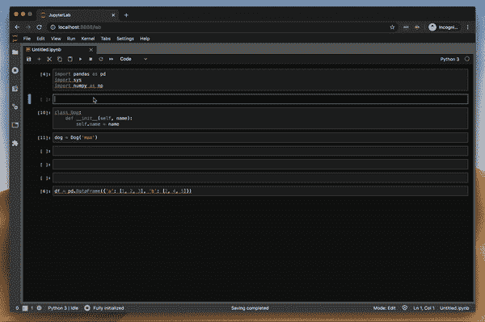
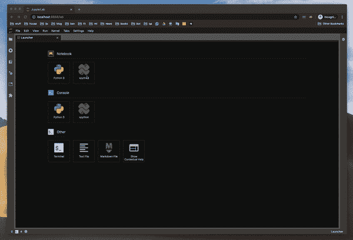
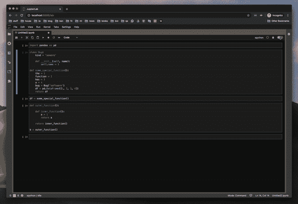
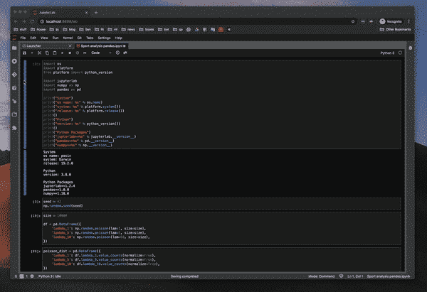
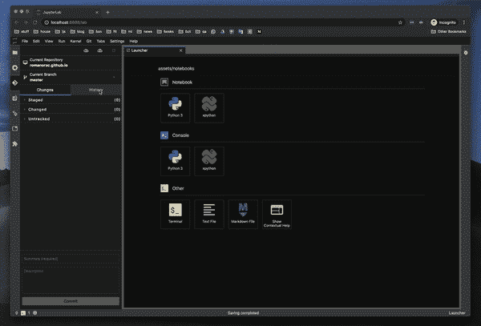

# 3 个必备的 JupyterLab 2.0 扩展

> 原文：<https://towardsdatascience.com/3-must-have-jupyterlab-2-0-extensions-41024fe455cc?source=collection_archive---------3----------------------->

## JupyterLab 刚刚成为一个成熟的 IDE，具有代码辅助、调试和 Git 等功能——欢迎来到笔记本编辑的未来。


维克多·加西亚在 [Unsplash](https://unsplash.com/s/photos/future?utm_source=unsplash&utm_medium=referral&utm_content=creditCopyText) 上拍摄的照片

我很高兴地确认，在最新扩展的帮助下，JupyterLab 刚刚成为一个成熟的 IDE。一周前，我提到了我在用 JupyterLab 编辑笔记本时注意到的几个缺陷——不存在的代码帮助就是其中之一。

不久之后，JupyterLab-LSP 的一位主要开发人员联系了我，并向我展示了他们的扩展。我尝试了一下——这是 Jupyter 生态系统的一大进步。

在 JupyterLab 生态系统中仍然有一些缺失的部分，使它至少在功能上等同于 PyCharm。但现在不是了。

**这里有几个你可能会感兴趣的链接:**

```
- [Labeling and Data Engineering for Conversational AI and Analytics](https://www.humanfirst.ai/)- [Data Science for Business Leaders](https://imp.i115008.net/c/2402645/880006/11298) [Course]- [Intro to Machine Learning with PyTorch](https://imp.i115008.net/c/2402645/788201/11298) [Course]- [Become a Growth Product Manager](https://imp.i115008.net/c/2402645/803127/11298) [Course]- [Deep Learning (Adaptive Computation and ML series)](https://amzn.to/3ncTG7D) [Ebook]- [Free skill tests for Data Scientists & Machine Learning Engineers](https://aigents.co/skills)
```

上面的一些链接是附属链接，如果你通过它们进行购买，我会赚取佣金。请记住，我链接课程是因为它们的质量，而不是因为我从你的购买中获得的佣金。

**如果你错过了我之前关于这个话题的文章:**

[](/are-you-still-using-jupyterlab-ce1a4339c0a9) [## 你还在用 JupyterLab 吗？

### 数据科学城推出了一款新的高端产品。它有优越的编码辅助，调试和更多…是吗…

towardsdatascience.com](/are-you-still-using-jupyterlab-ce1a4339c0a9) [](/jupyterlab-2-0-edd4155ab897) [## JupyterLab 2.0

### 让我们来一窥 Jupyter 笔记本编辑的未来。有了编码等特性，未来看起来一片光明…

towardsdatascience.com](/jupyterlab-2-0-edd4155ab897) 

# JupyterLab-LSP

LSP 为 JupyterLab 增加了代码辅助功能。阅读 [JupyterLab 2.0](/jupyterlab-2-0-edd4155ab897) 。要了解更多信息:

[](/jupyterlab-2-0-edd4155ab897) [## JupyterLab 2.0

### 让我们来一窥 Jupyter 笔记本编辑的未来。有了编码等特性，未来看起来一片光明…

towardsdatascience.com](/jupyterlab-2-0-edd4155ab897) 

使用 JupyterLab-LSP 在 JupyterLab 中完成代码

# 调试器

我曾经用 pdb 包在 JupyterLab 做调试——那是一个痛苦的过程。几天前，我听说了一个新的调试扩展，我很想尝试一下:

[](https://github.com/jupyterlab/debugger) [## jupyterlab/调试器

### JupyterLab 调试器 UI 扩展。这个扩展正在积极开发中。JupyterLab 2.0+xeus-python 0 . 7 . 1+…

github.com](https://github.com/jupyterlab/debugger) 

合适的调试器是 JupyterLab 生态系统中最后缺失的部分之一。所有对最新的 JupyterLab 扩展的开发者的赞美——第一次安装就能工作，写得很好的文档等等。调试器扩展也是如此。**注意，调试器仅支持 JupyterLab ≥ 2.0，它仍在积极开发中。**

## 如何启用调试器？



创建一个新的 xpython 笔记本，启用调试并打开调试窗格。

调试器在 xpython Notebook 中工作——x 是 xeus 的缩写，xeus 是一个旨在帮助 Jupyter 实现内核的库。它承担了实现 Jupyter 内核协议的负担，因此开发人员可以专注于实现内核的解释器部分。

## 如何使用调试器？



要使用调试器，请启用右上角的橙色开关，设置一个断点并执行代码。使用右边的调试面板调查变量。

我通过调查函数中变量的值来尝试调试器——这是使用 pdb 包时最大的痛点——它工作得很好。我还试图研究一个类和一个数据帧的值。这一切都完美无缺。

## 怎么安装？

请确保您安装了 JupyterLab 2.0 或更高版本，并且启用了扩展管理器。然后安装要求:

```
pip install xeus-python==0.7.1
pip install ptvsd
```

要安装扩展，请运行:

```
jupyter labextension install [@jupyterlab/debugger](http://twitter.com/jupyterlab/debugger)
```

# JupyterLab-Git

如果你曾经将一个 Jupyter 笔记本推送到 Git，然后对它做了一些修改，再推一次，你就知道 Git 的 diff 功能是没用的——它标记了一切。我使用了一个在推之前重置所有输出的变通方法，但有时我会忘记(或者 JupyterLab 没有保存最新的状态)，最后出现了一个大混乱。我真的对这一个感到兴奋。它会符合我的期望吗？

## 让我们试试吧



我打开右边的 git 面板。然后我去掉 3 个细胞，再加上 3 个细胞。diff 功能运行良好。

哇，我真的被这一个惊呆了。我在笔记本上做了一些改动，diff 功能运行得很好。向 [jupyterlab-git](https://github.com/jupyterlab/jupyterlab-git) 团队致敬。

> 提示:还原笔记本中的更改时，首先关闭笔记本，然后使用“还原”。效果更好

## 提交历史记录



探索带有 jupyter-git 责任的提交历史

您可以观察提交历史—这是一个致命的特性。它甚至显示图像。你终于可以观察到同事做了什么改变，而不用翻阅整个笔记本。

## 怎么安装？

请确保您安装了 JupyterLab 2.0 或更高版本，并且启用了扩展管理器。然后运行:

```
pip install --upgrade jupyterlab-git
jupyter lab build
```

安装完成后，Extension Manager 显示软件包已经过时，所以我点击了 update，等待了一段时间，确认了重建并重启 jupyter-lab。然后成功了！

# 结论

就像我在以前关于 JupyterLab 的文章中提到的——笔记本编辑的未来是光明的，☀️。当 vim 扩展和代码格式化程序扩展可用时，我将切换到 JupyterLab 2.x。在那之前，我将坚持 will JupyterLab 1.2。

# 在你走之前

在 [Twitter](https://twitter.com/romanorac) 上关注我，在那里我定期[发布关于数据科学和机器学习的](https://twitter.com/romanorac/status/1328952374447267843)。


由[考特尼·海杰](https://unsplash.com/@cmhedger?utm_source=medium&utm_medium=referral)在 [Unsplash](https://unsplash.com/?utm_source=medium&utm_medium=referral) 拍摄的照片