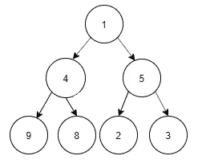

# 给初学者的 3 个 MySQL 头脑风暴问题

> 原文：<https://towardsdatascience.com/3-mysql-brain-storming-questions-for-a-beginner-c99ad01963ee?source=collection_archive---------54----------------------->

## SQL 问题，以评估和提高初学者的技能


内特·格兰特在 [Unsplash](https://unsplash.com?utm_source=medium&utm_medium=referral) 上的照片

T 他的文章总结了我在解决各种 MySQL 难题时发现的有趣且具有挑战性的问题。这些将向您介绍 MySQL 世界的 3 个领域，即:

1.  CASE WHEN 语句。
2.  比较运算符。
3.  正则表达式。

我相信尝试解决这些问题是 MySQL 初学者评估他们目前所学技能的一个更好的方法。让我们来看看这些问题。

## 1.标记二叉树节点

这个挑战是标记二叉树的节点。

***查询:将二叉树节点标记为根节点、内部节点和叶节点。***

对于那些不熟悉二叉树的人来说，它看起来会像下面这样:



**二叉树**

节点 1:根节点(没有父节点，有 0 个或更多子节点)

节点 4、5:内部节点(具有父节点和一个或多个子节点)

节点 9、8、2、3:叶节点(有父节点，没有子节点)

***设 N 为节点，P 为 N 的父节点，则上述二叉树的数据表如下:***

**双星树**

为了解决上述问题，可以使用 MySQL CASE，其语法如下。

**基本 SQL CASE 语句语法:**

```
CASE
    WHEN condition1 THEN result1
    WHEN condition2 THEN result2
    .
    .
    .
    WHEN conditionN THEN resultN
    ELSE result
END;
```

***SQL 将二叉树节点标注为根节点、内节点和叶节点:***

```
SELECT N,
CASE
    WHEN P IS NULL THEN 'Root'
    WHEN N IN (SELECT P FROM BinaryTree) THEN 'Inner'
    ELSE 'Leaf'
END
from BinaryTree;
```

**输出:**

**解释:**

1.  节点 1:P 的值为空，因此节点 1 是根节点。
2.  节点 4、5:满足这个条件“当 N 在(从 BinaryTree 中选择 P)”因此它们是内部节点。
3.  节点 9、8、2、3:无法满足上述两种情况中的任何一种，因此它们是叶节点。

## 2.查找中间值

不幸的是，MySQL 没有计算列的中值的默认函数。有多种方法可以实现这一点，但是，我想分享实现这一点的详细解决方案。

**中位数:**中位数是奇数排序列表中的中间数，也是偶数排序列表中中间数的平均值。

考虑以下数据:

**标记数据集—奇数**

上述案例中的中位数是 30

**标记数据集—偶数**

上述案例中的中位数是 35 岁

**奇数值集的 MySQL 解决方案:**

当参考*标记数据集-奇数*时，很明显，值 30 在其之前具有相同数量的元素(aka。2 个值)和它下面的元素的相同元素(也称为。2 值)。可以按照下面的步骤找到中间值。

1.  对于每个值，计算比它小的值的个数。
2.  对于每个值，计算大于它的值的个数。
3.  找出上面和下面有相同数量的值的值。这将是中间值。

**伯爵**

在上表中，值 30 有相等数量的大于它的值和相等数量的小于它的值。因此，中值为 30。

***SQL 查找奇数个数据值的中值:***

```
SELECT marks as Median FROM MarksTable m
WHERE (SELECT COUNT(marks) from MarksTable
       WHERE m.marks > marks) = 
       SELECT COUNT(marks) from MarksTable
       WHERE m.marks < marks);
```

**偶数集的 MySQL 解决方案:**

可以按照下面的步骤找到偶数组值的中值。

1.  对于每个值，找出值的个数加上大于它的个数的 1，并在该计数上加 1。就当是 x 吧。
2.  对于每个值，找出小于它的值的个数。顺其自然吧。
3.  找出数据集中 X = Y 的值，设它为 z。
4.  对于每个值，找出值的个数加一，小于它的个数加一。假设它是 X1。
5.  对于每个值，找出大于它的值的个数。就当是 Y1 吧。
6.  找出数据集中 X1 = Y1 的值。假设是 Z1。
7.  中位数是 Z 和 Z1 的平均值。

**计数**

根据上表，Z 值为 40，Z1 值为 30。因此，中位数是这两个值的平均值，即 35。

***SQL 查找偶数个数据值的中位数:***

```
SELECT avg(marks)as Median FROM MarksTable m
WHERE (SELECT COUNT(marks) from MarksTable
       WHERE m.marks > marks) + 1 = 
       SELECT COUNT(marks) from MarksTable
       WHERE m.marks < marks)
OR
      (SELECT COUNT(marks) from MarksTable
       WHERE m.marks > marks) = 
       SELECT COUNT(marks) from MarksTable
       WHERE m.marks < marks) + 1)
```

***因此整个查询找出的中位数会如下:***

如果数据值的数目可被 2 整除，则该列中的值为偶数，否则为奇数。

```
SELECT IF (SELECT COUNT(marks, 2) FROM MarksTable) = 0,
       (SELECT avg(marks)as Median FROM MarksTable m
              WHERE (SELECT COUNT(marks) from MarksTable
              WHERE m.marks > marks) + 1 = 
              SELECT COUNT(marks) from MarksTable
              WHERE m.marks < marks)
        OR
              (SELECT COUNT(marks) from MarksTable
              WHERE m.marks > marks) = 
              SELECT COUNT(marks) from MarksTable
              WHERE m.marks < marks) + 1)
),
      SELECT marks as Median FROM MarksTable m
              WHERE (SELECT COUNT(marks) from MarksTable
              WHERE m.marks > marks) = 
              SELECT COUNT(marks) from MarksTable
              WHERE m.marks < marks)
));
```

## **3。查找不以元音字母开头和结尾的名字:**

考虑下面的学生姓名数据表:

**学生表**

***查询:查找不以元音字母*** 开头和结尾的学生姓名

MySQL 支持 **REGEXP** 操作符进行基于正则表达式的模式匹配操作。

解决上述查询所需的模式是:

1.  ^:检查字符串的开头。
2.  $:检查字符串的结尾
3.  [abc]:方括号中列出的任何字符。

**查询:**

```
SELECT name FROM studentTable WHERE name NOT IN 
       (SELECT name FROM studentTable WHERE name 
        REGEXP '^[aeiou]' or name REGEXP '[aeiou]$';
```

**输出:**

感谢阅读！