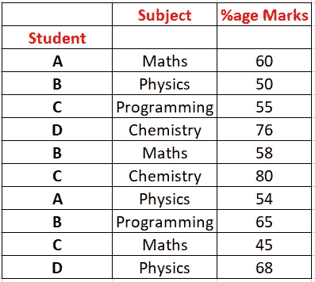
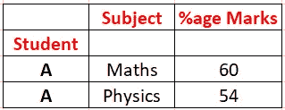
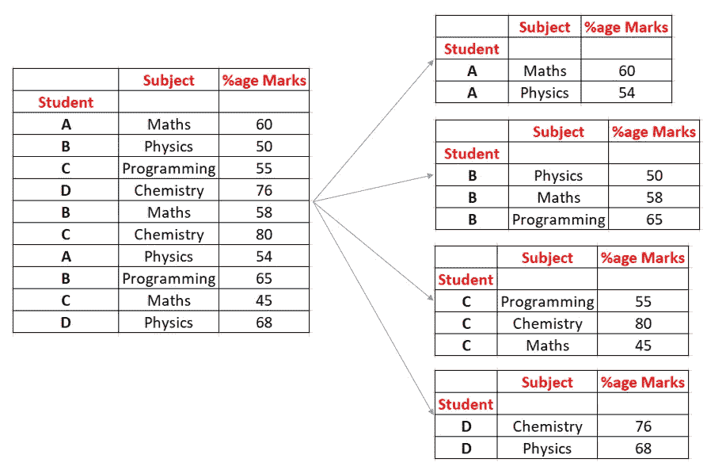
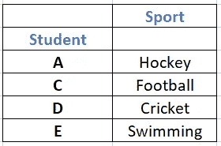
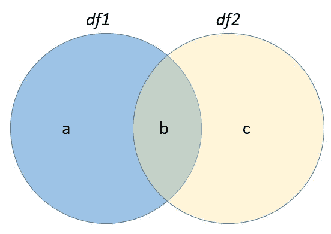
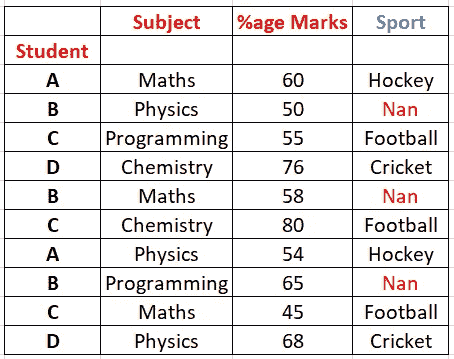
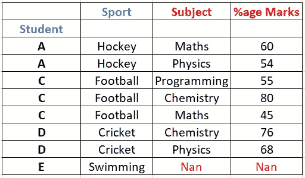
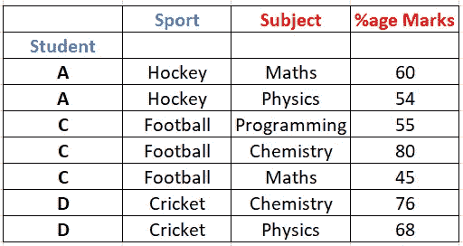
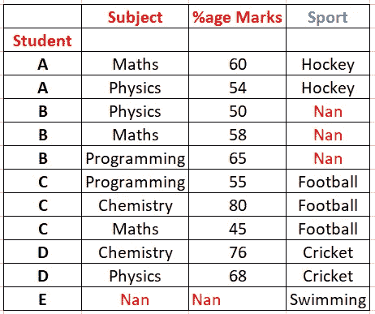

# 3 Pandas 函数控制数据帧

> 原文：<https://towardsdatascience.com/3-pandas-functions-to-rule-the-data-frames-813b46ff3099?source=collection_archive---------28----------------------->


照片由 [Xtina Yu](https://unsplash.com/@tongs?utm_source=unsplash&utm_medium=referral&utm_content=creditCopyText) 在 [Unsplash](https://unsplash.com/s/photos/panda-king?utm_source=unsplash&utm_medium=referral&utm_content=creditCopyText) 上拍摄

Pandas 是一个广泛的 Python 库，数据科学家在许多领域使用它。如果你使用过微软的 Excel 或者 MySQL，你应该已经熟悉了关系数据结构。您必须熟悉按行和列排列的数据。我是在学习 Python 的机器学习的时候开始了解这个库的。Pandas 不仅为你提供了进行大量数据分析和统计推断的工具，而且因为它是建立在 Numpy(另一个重要的 Python 库)之上，它被证明是一个构建高度复杂的[机器学习](https://www.wildregressor.com/2020/05/machine-learning-overview.html)和人工神经网络算法的平台。Pandas 提供的三种主要数据结构是数据序列(一维)、数据帧(二维)和数据面板(多维)。Pandas 配备了大量的函数和类，给你足够的能力来处理任何数据分析问题。在本文中，我们将讨论数据框的三个主要功能，这些功能不仅在几乎所有问题/项目中都有应用，而且如果理解了这些功能，将会证明是至关重要的。让我们不要进一步延伸，直接跳到函数。

1.  **布尔屏蔽:**布尔屏蔽是一种数据帧切片技术。在大多数问题中，我们需要满足特定条件的数据框的子集，例如，可能会要求您在学生分数和成绩的数据框中过滤出通过特定测试的学生的数据，或者从人口普查数据框中过滤出识字的男性的数据。熊猫的这类问题可以很容易地通过布尔掩蔽来解决。为了理解这个概念，让我们考虑如下所示的数据帧(df1 ):



上述数据表总结了 4 名学生(A、B、C、D)在 4 门学科(数学、物理)中取得的分数百分比。，化学。，和 Prog。).为了便于理解，只显示了 10 个数据条目。在 pandas 中，每个数据帧都有一个与之相关的索引。它是标识数据条目或数据行的东西。在当前数据框中，Student 列被视为索引(还要注意，Pandas 中的索引与 MySQL 中的主键不同，因为索引条目可以重复)。在布尔屏蔽中，我们将一个布尔序列(一系列真、假值)传递给数据帧，然后根据数据帧索引进行匹配。返回索引与真值匹配的所有数据条目，不返回索引与假值匹配的那些条目(行)。通过回答与上述数据框相关的几个问题，我们将更清楚地理解布尔掩蔽。如果我们被要求从上面的数据框中只取出学生 **A** 的数据，我们将不得不首先创建条件语句，这将创建一个我们想要的布尔序列。如果我们写 *df1['学生']= ' A '*，它会将值' A '与学生列匹配，如果满足条件则返回 True，否则返回 False】。上述条件语句将返回如下所示的序列:

**真**

错误的

错误的

错误的

错误的

错误的

**真**

错误的

错误的

错误的

仔细观察以上系列。该系列仅在满足给定条件*df1[' Student ']= = ' A '【T11]的地方包含真值。上面创建的布尔序列可以作为索引参数传递给数据框，以过滤掉数据。该语句可以写成:*

```
*df1[ df1[‘Student’] == ‘A’ ]*
```

上述语句将只返回学生姓名为 A 的那些数据条目，而忽略所有其他条目:



到目前为止，布尔屏蔽背后的思想应该是清楚的。这是一个强大的工具，也可以解决更复杂的问题，例如:提取那些数学成绩超过 50%的学生的数据

```
*df1[ (df1[‘Subject’] == ‘Maths’) & (df1[‘%age Marks’] > 50) ]*
```

布尔掩码适用于所有类型数据框架，且在几乎所有类型的问题/项目中被证明是一个方便的工具

2.**分组数据:**分组数据是数据科学家面临的另一个要求，例如，在当前数据框架的上下文中，我们可能会被要求找出每个学生获得的总分或平均分，或者学生获得的学科总分或平均分等。熊猫通过*群和*函数解决这类问题。我们就直接用这个函数来理解吧。让我们试着解决第一个问题。“每个学生获得的总分数”。这些问题要求我们首先将每个学生的数据分组，然后找出总分或平均分。编程方式如下所示:

```
*df1.groupby(‘Student’)*
```

它会将相同的学生及其相关数据分组在一起。通过下图可以理解:



当运行*df1 . group by(‘Student’)*时，可以认为原始数据帧根据学生的名字分成了 4 个不同的数据帧。现在我们有了不同学生的不同数据框架，通过熊猫提供的聚合函数，我们可以很容易地找出每个学生获得的总和或平均分数。

```
*df1.groupby(‘Student’).sum()* 
```

会给我们每个学生的总分表

```
*df1.groupby(‘Student’).mean()* 
```

会得出平均值。通常，我们可以通过下面提到的命令创建基于列的组:

```
df1.groupby('col_name')
```

或者，我们可以将列名列表传递给 *groupby* 命令，根据多个列进行分组:

```
df1.groupby([‘col_1’, ‘col_2’, ‘col_3’])
```

3.**合并:**到目前为止，我们只讨论了适用于单个数据帧的操作，但这并不是数据分析受限的地方。很多时候，我们被要求对多个数据框架进行分析。为了了解合并的概念，让我们介绍另一个学生数据框( *df2* ):



上述数据框显示了学生参加体育活动的信息。与前一个数据框架一起，体育数据框架可以与它合并，以提取许多有意义的信息。在开始编程之前，让我们先了解一下合并过程。两个数据帧主要可以通过如下所示的 4 种不同方式进行合并:



两个圆圈表示任意两个数据帧，而 **a、b、c** 表示三个可能的区域。区域 **b** 被称为两个数据帧的交集。类似地，区域 **a** 是数据帧 1 ( *df1* )减去交集部分，类似的解释也适用于区域 **c** 。

四种可能的合并过程是:

1.  **左合并:**区域 **a** +区域 **b** 。在当前数据框的上下文中，它将是 marks 数据框中提到的所有学生的运动详细信息。在 Pandas 中，它是通过运行以下命令来实现的:

```
 *df1.merge(df2, on = ‘Student’, how = ‘left’)*
```

on = 'Student '属性表示合并必须在 Student 列上完成，how = 'left '表示合并过程必须是左侧的。上述命令将生成如下所示的表格:



注意，在左侧合并中，左侧数据帧占优势，并且从右侧数据帧中提取附加信息。此外，请注意 Nan 值，这些值会在缺少信息的地方插入。

2 **。右合并:**右合并与左合并含义相同，只是数据帧被翻转，即代表区域 **b** + **c** 。在 Pandas 中，它是通过运行以下命令来实现的:

```
*df1.merge(df2, on = ‘Student’, how = ‘right’)*
```

这些属性具有通常的含义，并将生成如下所示的数据框:



上表包含右表中的所有条目，以及从左表中提取的附加信息。此外，请注意，所有在右表中而不在左表中的条目在左数据框的列上都有 Nan 值

3.**内部合并**:这代表两个数据帧的交集，即区域 **b** 。熊猫同样的命令如下:

```
*df1.merge(df2, on = ‘Student’, how = ‘inner’)*
```

结果数据帧将是:



请注意，只包括了出现在两个数据帧中的那些条目的信息

**4。外部合并:**外部合并是指两个数据帧的合并。在上述图表的上下文中，它表示区域 **a** +区域 **b** +区域 **c** 。在熊猫中，这种现象表现为:

```
*df1.merge(df2, on = ‘Student’, how = ‘outer’)*
```

并将产生如下所示的数据帧:



在外部合并中，包含两个数据帧中存在的所有条目，并且所呈现的数据点由 Nan 表示

虽然 Pandas 是一个由许多强大的类和函数组成的包，但上面包含的三个是经常使用的，很少有其他函数足以执行非常复杂的数据分析任务。要进一步了解这个话题，你可以参加密歇根大学 Coursera 上的数据分析课程，或者阅读 Matt Harrison 的书《学习熊猫》

希望你喜欢这篇文章，你可以在下面提出你的疑问，或者通过 [**LinkedIn**](https://www.linkedin.com/in/tanvirhurra/) 联系我，了解关于这个话题的更多问题。

谢谢，

祝你玩得愉快😊

*原载于 2020 年 5 月 14 日 https://www.wildregressor.com*[](https://www.wildregressor.com/2020/05/introduction-pandas-is-extensive-python.html)**。**