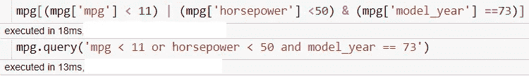

# 3 只熊猫让你的数据生活变得轻松

> 原文：<https://towardsdatascience.com/3-pandas-trick-to-easing-your-data-life-984a0dac5311?source=collection_archive---------32----------------------->

## 你可以在日常工作中运用的一些熊猫技巧


由 [Unsplash](https://unsplash.com?utm_source=medium&utm_medium=referral) 上的[回声网格](https://unsplash.com/@echogrid?utm_source=medium&utm_medium=referral)拍摄

作为一名数据科学家，我们的日常工作包括提取数据、理解数据、清理数据、转换数据和创建新功能。注意我没有包括创建一个机器学习模型？因为创建一个模型将是我们做的最后一件事，它不一定是我们的日常工作。然而，清理数据是日常工作。

基于以上原因，我想向你展示三个漂亮的熊猫技巧，让你的数据工作变得更简单。

# 1.使用查询进行数据选择

作为数据科学家，数据选择是最基本的活动，但也是最麻烦的事情之一，尤其是在重复进行的时候。让我给你看一个例子。

```
#Let's use a dataset example
import pandas as pd
import seaborn as snsmpg = sns.load_dataset('mpg')
mpg.head()
```


上面是我们的数据集示例，假设我想选择 mpg 小于 11 或马力小于 50 且 model_year 等于 73 的行。这意味着我需要像下面这样写代码。

```
mpg[(mpg['mpg'] < 11) | (mpg['horsepower'] <50) & (mpg['model_year'] ==73)]
```


典型数据选择方法结果

这是选择数据的通常方式，但有时因为条件太多而很麻烦。在这种情况下，我们可以使用来自 Pandas 数据框对象的**查询方法**。

那么，这个查询方法是什么呢？这是一种从熊猫数据框中选择的更人性化的方法。下面让我给你看一个例子。

```
mpg.query('mpg < 11 or horsepower < 50 and model_year == 73')
```


查询方法的结果

结果和平时的选拔方式一模一样吧？唯一的区别是，对于查询，我们有一个不太冗长的条件，我们将它写在字符串中，其中查询方法接受字符串英语单词，如示例中所示。

通常的选择方法和查询方法的另一个简单区别是执行时间。让我们看看下面的例子。



通常的选择方法需要 18ms，查询方法执行代码需要 13ms。在这种情况下，查询方法是一种更快的选择方法。

# 2.用替换、掩码和 where 替换值

当我们处理数据时，我确信有时需要用其他特定值替换列中的一些值。如果我们手动操作，可能会很麻烦。让我们说，在我的 mpg 数据集之前，我想取代所有的气缸整数值到一个字符串值。我举个例子，说明如何手动替换。

```
def change_value(x):
    if x == 3:
        return 'Three'
    elif x == 4:
        return 'Four'
    elif x == 5:
        return 'Five'
    elif x == 6:
        return 'Six'
    else:
        return 'Eight'mpg['cylinders'] = mpg['cylinders'].apply(change_value) 

mpg.head()
```


用函数替换值的结果表

在最简单的情况下，我们需要使用 Pandas 数据框对象中的 apply 方法，或者您可以使用 for 循环方法手动完成。无论哪种方式，每次需要替换一个值时都要这么做，这很麻烦。

在这种情况下，我们可以使用 Pandas 数据框对象中的**替换方法**。这是一种专门用来帮助我们替换数据框中特定值的方法。下面让我给你看一个例子。

```
mpg.replace({'cylinders' : {3: 'Three', 4: 'Four', 5: 'Five', 6: 'Six', 8 : 'Eight'}}, inplace = True)mpg.head()
```


用 replace 方法替换值的结果表

结果是一样的，唯一的区别是我们用来替换值的行有多短。在我上面的例子中，我使用 dictionary 对象来指定我想要替换哪些列的值，并使用字典中的另一个字典来选择我想要替换哪些值和替换值。换句话说，它可以概括为{列名:{列中的值:替换值}}。

如果你想用一个特定的条件替换这些值呢？在这种情况下，我们可以尝试使用**蒙版法**。此方法是一种 if-then 方法，最适用于系列对象，而不是数据框对象。让我给你演示一下蒙版法是如何工作的。

```
mpg['mpg'].mask(mpg['mpg'] < 20, 'Less than Twenty' )
```


使用掩码方法时，我们通常会向方法传递两个参数；要替换的条件和值。在这种情况下，我给出了一个 mpg 值小于 20 的条件，然后用“小于 20”替换这些值。

如果您需要不止一个条件，您需要将这些方法链接起来。

```
mpg['mpg'].mask(mpg['mpg'] < 20, 'Less than Twenty' ).mask(mpg['mpg'] > 40, 'More than Fourty')
```


还有一个 **where 方法**，它的工作方式与 mask 方法相反。

```
mpg['mpg'].where(mpg['mpg'] < 20, 'More than Twenty' )
```


从结果中，您可以看到不符合条件的值被替换了。

在任何情况下，您都可以用自己喜欢的方法替换这些值。

# 3.隐藏不需要的索引和/或列

有时，您希望展示您的数据框，但不希望内容分散观众的注意力(我经常遇到这种情况，尤其是索引值)。

例如，我想给你看 mpg 数据集的前五名。

```
mpg.head()
```


上面的结果显示了整个表，表中有索引。有一次，我展示了一张和上面一样的桌子，被问及桌子旁边的数字，需要时间向大家解释。这当然是浪费时间。这就是为什么我们可以用下面的代码隐藏索引。

```
mpg.head().style.hide_index()
```


我们可以从数据框对象中使用 **style.hide_index()** 方法。

此外，可能有这样一种情况，您可能希望只保留一列，而呈现数据框的其余部分。要选择你想要的每一列，只留下一个不必要的列，这将是一项很大的工作。

在这种情况下，我们可以使用数据框对象中的 **style.hide_columns()** 。让我们看看下面的例子。

```
mpg.head().style.hide_index().hide_columns(['weight'])
```


在我上面的例子中，我想省去权重列，这就是为什么我只在方法中传递权重。当然，您可以隐藏任意多的列。你只需要把值传入列表。

# 结论

在这篇文章中，我向您展示了三个技巧来简化您的日常数据工作。这包括:

1.  使用查询
2.  用 replace、mask 和 where 替换值
3.  使用 hide_index 和 hide_columns 隐藏

希望有帮助！

# 如果您喜欢我的内容，并希望获得更多关于数据或数据科学家日常生活的深入知识，请考虑在此订阅我的[简讯。](https://cornellius.substack.com/welcome)

> 如果您没有订阅为中等会员，请考虑通过[我的介绍](https://cornelliusyudhawijaya.medium.com/membership)订阅。