# 你应该知道的熊猫数据选择的 3 个主要方法

> 原文：<https://towardsdatascience.com/3-primary-methods-for-pandas-data-selection-you-should-know-21c3153b7fc1?source=collection_archive---------62----------------------->

## 以您需要的方式选择您的数据


罗伯特·卡茨基在 [Unsplash](https://unsplash.com?utm_source=medium&utm_medium=referral) 上的照片

熊猫作为一个数据科学家是一个不可分割的库，尤其是对于 Pythonist 来说。这是因为库能够轻松地存储和操作数据。熊猫图书馆力量的一个例子是我们可以多么容易地选择我们想要的数据。下面让我用 seaborn 库中的 mpg 数据集给你举个例子。

```
#importing the library
import pandas as pd
import seaborn as snsmpg = sns.load_dataset('mpg')
mpg.head()
```

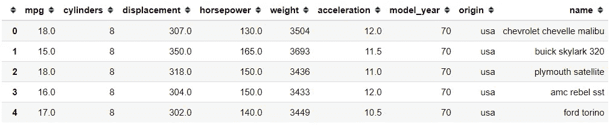

这是数据框形式的 mpg 数据集。现在，假设我只想要 mpg 列，我们可以用下面的代码得到它。

```
#Getting the data column with bracket and the column name
mpg['mpg'].head()
```

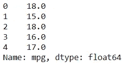

我们最终得到了之前选择的列的系列数据。这只是选择数据的例子。在下一节中，我将展示使用 Pandas 选择数据的四种不同的主要方法。

> "熊猫是一个不可分割的图书馆作为一个数据科学家，尤其是对 Pythonist 来说."

# 1.按标签选择

取自熊猫文献。

> “pandas 提供了一套方法来让**完全基于标签的索引**。这是一个基于严格包含的协议。要求的每个标签都必须在索引中，否则将引发一个`*KeyError*`

熊猫让我们根据标签选择数据。如果你意识到，在我们之前的例子中，我们只选择了基于列的数据。对于基于标签的**选择，我们需要熊猫`.loc`属性。让我们在下面的例子中展示它是如何工作的。**

```
#Selecting data on index 0
mpg.loc[0]
```

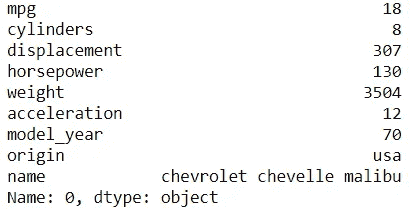

使用`.loc`属性，我们选择标签 0 数据，并以标签 0 行的序列结束。现在，如果我们想要**在我们的选择**中包含更多的标签，我们需要选择一系列带有`:`符号的标签，如下所示。

```
#Selecting data from index 0 to 4
mpg.loc[0:4]
```

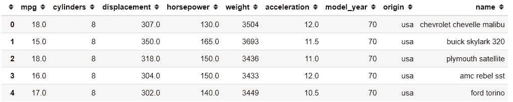

假设我只想**从各行中选择某个标签**，我需要把它放入列表对象中。

```
#Selecting data from index 0,4,6
mpg.loc[[0,4,6]]
```

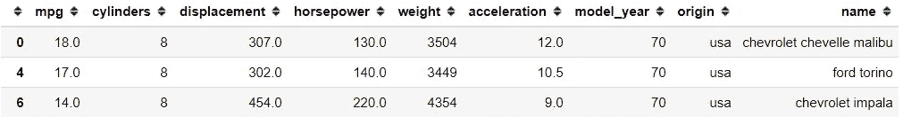

我们也可以**添加我们希望**在`.loc`属性中选择的列，如下所示。

```
#Select the column we want with the list of the columns name
mpg.loc[[0,4,6], ['mpg', 'cylinders', 'origin']]
```

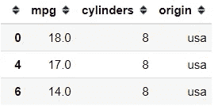

在熊猫对象中，第一个位置是行位置，第二个位置是列位置。这就是为什么当我们选择数据时，我们首先根据行，然后根据列进行选择。

我们的数据框大部分时间都有默认标签，但是我们可以**将另一列设置为标签**并基于新索引选择数据。我将在下面的例子中展示它。

```
#Set the 'origin' column as the new index using .set_index then selecting the data using .locmpg.set_index('origin').loc['europe']
```

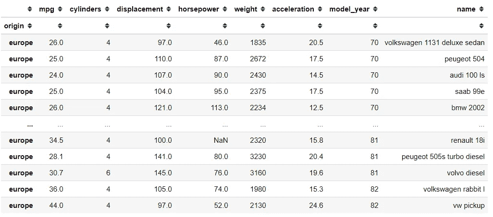

在上面的数据框中，现在我只得到带有‘欧洲’标签的数据。

# 2.按位置选择

如果在前面的部分中我们基于标签选择数据，Pandas 也提供了一个基于**整数索引位置**的选择方法。我们将使用的熊猫属性是`.iloc`属性。

> 这些是`*0-based*`索引。切片时，起始边界为*包含*，上限为*排除*。试图使用一个非整数，甚至一个**有效的**标签都会引发一个`*IndexError*`。

以上是熊猫官方文档说明。从解释中我们可以看到，当我们选择数据时，我们**只** **使用** **整数值作为从 0 开始的位置，而不是标签**。让我在下面的例子中展示一下。

```
#Selecting the data in the index position two
mpg.iloc[2]
```

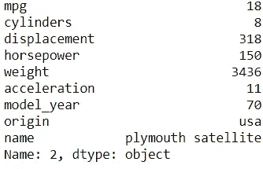

我们从位置索引位置 2 的数据帧中获取序列。一目了然，与使用标签方法相比没有什么不同，但如果我们将标签更改为非整数标签，会有什么不同。

```
mpg.set_index('origin').iloc['europe']
```

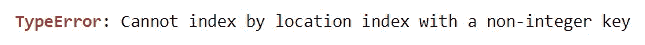

这会引发一个错误，因为使用`.iloc`属性是基于位置的，而不是标签本身。现在，如果使用与上面相同的数据，但是我使用一个整数值来选择数据，会发生什么呢？

```
mpg.set_index('origin').iloc[2]
```

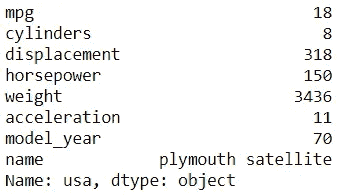

我们可以看到，如果我们不改变指数，结果是相似的。这是因为我们根据位置而不是标签来选择数据。现在，像上一节那样的序列索引怎么样？它还能用吗？

```
#Selecting a sequence index based on position
mpg.iloc[0:4]
```

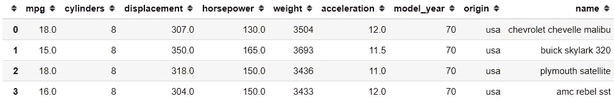

是的，我们仍然可以基于序列选择，但是我们需要记住的是，在基于位置的选择中，下限不包括在内。我们选择`0:4`,但是我们最终只得到从位置 0 到 3 的数据。

就像以前一样，我们也可以通过使用 list 对象来选择一个特定的位置。

```
mpg.iloc[[0,4,6]]
```

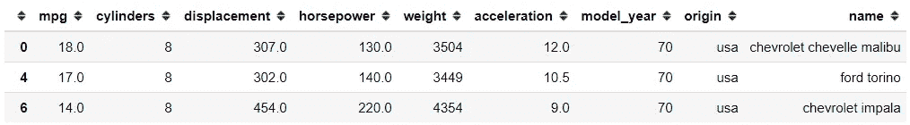

但是，如果我们想在这里包含列选择。

```
mpg.iloc[[0,4,6], ['mpg', 'cylinders', 'origin']]
```

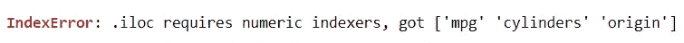

会出现错误，因为`.iloc`函数只接受数字索引，不接受其他内容。

# 3.布尔选择

在我们继续讨论之前，我想解释一下熊猫怎么会有**布尔结果**。试试下面的代码。

```
#Comparing the 'mpg' data with integer 17
mpg['mpg'] > 17
```

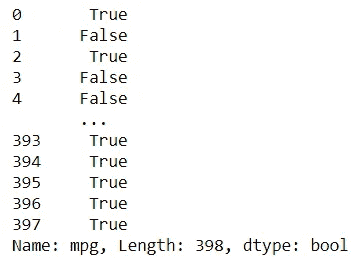

结果将是一系列布尔值，这些值指示结果状态。True 表示大于 17 的数据，False 表示小于 17 的数据。现在，我们可以把布尔值作为选择标准。让我们试试下面的代码。

```
#Inputing the criteria within the square bracket
mpg[mpg['mpg'] > 17]
```

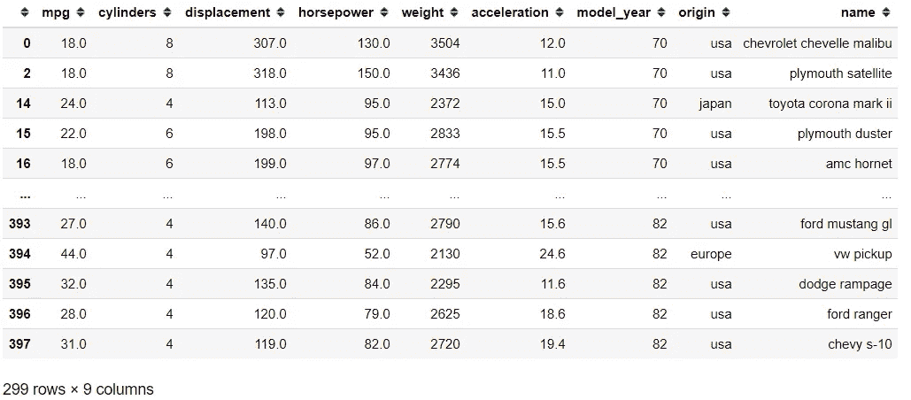

结果将是“mpg”数据大于 17 的所有数据或每个单个真布尔结果。如果我们想要两个或更多的标准呢？我们也可以像下面的代码那样做。

```
mpg[(mpg['mpg'] > 17) & (mpg['origin'] == 'japan')|~(mpg['horsepower'] <120)]
```

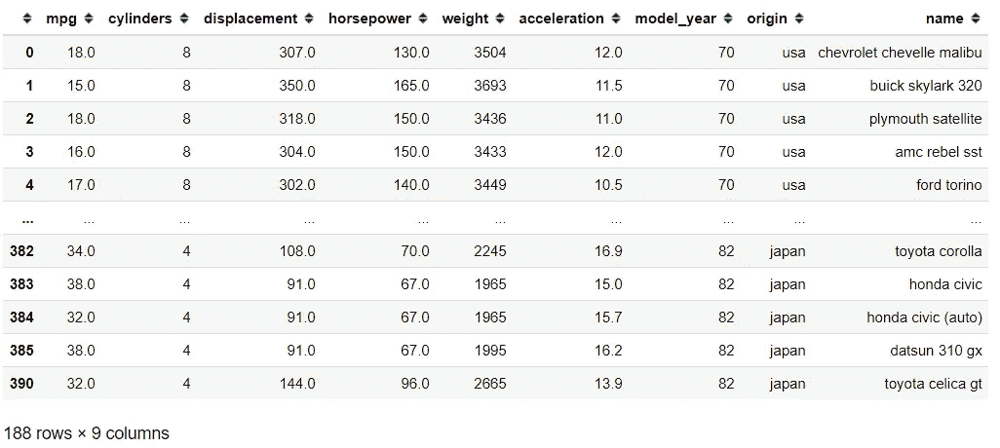

在上面的代码中，我指定了三个标准；“mpg”数据高于 17，“原产地”数据等于日本，“马力”数据不低于 120。当我们提出一个以上的标准时，我们需要把它放在括号中。而且，我们用`&`符号作为与，`|`符号作为或，`~`符号作为非。

# 结论

在这里，我向您展示了如何根据标签、位置和布尔值选择数据。虽然有许多选择数据的方法，但请使用您更熟悉的方法。

# 如果您喜欢我的内容，并希望获得更多关于数据或数据科学家日常生活的深入知识，请考虑在此订阅我的[简讯。](https://cornellius.substack.com/welcome)

> 如果您没有订阅为中等会员，请考虑通过[我的推荐](https://cornelliusyudhawijaya.medium.com/membership)订阅。