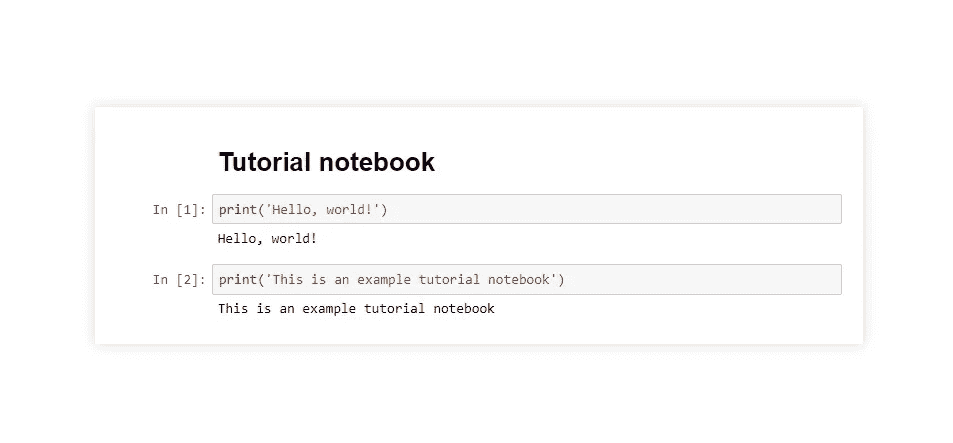

# 数据科学教育的 3 个问题…以及如何解决它们。

> 原文：<https://towardsdatascience.com/3-problems-with-data-science-education-and-how-you-can-fix-them-d904a9a11c3a?source=collection_archive---------38----------------------->

你想在大学里学习数据科学。你的大学提供了一个全新的数据科学学位，你可以用它来获得“ [*全美最好的工作*](https://www.kdnuggets.com/2018/01/glassdoor-data-scientist-best-job-america-3years.html) *”。你看看那些充斥着一些世界上最时髦词汇的课程描述:“机器学习”、“人工智能”、“大数据”、“神经网络”等等……你激动了！*

你应该感到兴奋。许多大学正在创建数据科学/机器学习学科的全新课程和计划，以满足行业的高需求。虽然这些课程很好地为学生提供了数据科学基础的良好概述，但我确实相信，有一些主题和想法被忽略了，这些主题和想法可以为学生在大学毕业后有所作为做好更好的准备。

*旁注:这些想法都是我根据大学经历得出的个人看法。我并不是说数据科学项目在任何方面都不好。我只是想分享一些我自己研究过的帮助我在行业中脱颖而出的东西。*

来源: [XKCD](https://xkcd.com/1838/) (CC BY-NC 2.5)

# 1.数据清理

数据清洗是我要讲的第一个话题。数据清理可能是机器学习管道中最重要的部分。没有好的数据，计算机就无法学会有效地做出自主决策。

## 问题是

许多机器学习课程旨在让学生探索不同的 ML 算法，甚至可能建立自己的神经网络。项目的分配是为了让每个学生都能得到相同的、干净的数据来进行分析。这不实际！

在“真实世界”中，数据是肮脏、丑陋的，并且通常对数据科学家来说不是很好——当我们运行第一个机器学习脚本时，我们都被 iris 数据集欺骗了。下图显示，数据科学家花费大约 80%的时间清理和准备数据，不到 20%的时间实际运行分析。

## 解决办法

数据科学家花费如此多的时间准备数据的想法得到了一个非常坏的名声。相反，我们应该接受它，并在这方面变得很棒。

这将需要一些课外的工作。做自己的项目是好的，但是要为此收集自己的数据。虽然 [Kaggle](https://www.kaggle.com) 是磨练数据科学技能的绝佳资源，但它并不是练习数据清理和准备的好资源。我提出一个想法:

做包含数据争论的非学术项目。使用以下建议作为练习:

*   编写脚本从网络上抓取数据(查看 [BeautifulSoup](https://www.crummy.com/software/BeautifulSoup/bs4/doc/)
*   搜索那些**而非**必须用于机器学习的数据(查看[谷歌的数据集搜索](https://datasetsearch.research.google.com/)
*   使用你已经有的数据，但是尝试解决一个不同的问题
*   给一家拥有有趣数据的公司发电子邮件，要求将其用于研究(这可能很难，除非你给他们一些回报，一些公司可以提供学术许可证)

# 2.可解释性

好的…这是一个大的。这不仅是数据科学教育的问题，也可能是数据科学和机器学习领域的最大问题。

我将这一部分命名为“可解释性”,因为它很模糊——抱歉。我这么说的意思是，优秀的数据科学家需要有能力向非技术专业人士解释他们的模型。这对于能够交付业界最强大的模型至关重要。

我不是在谈论“模型可解释性”,这意味着准确描述一个模型如何做出决策。Cassie Kozyrkov 写了一篇非常全面的文章[关于为什么可解释的 AI **不会**交付。她文章中的一段话是:](https://hackernoon.com/explainable-ai-wont-deliver-here-s-why-6738f54216be)

> “复杂性是所有这一切的原因”

是的，人工智能和人工智能的全部目的是从如此复杂的数据中产生洞察力，以至于人类自己无法完成这项任务。

所以你问我的‘可解释性’是什么意思？嗯，问题来了。

## 问题

在大学里:你是一名**数据科学**专业的学生，由一名**数据科学**教授授课，他会为你设计全面的编程作业，让你和你的**数据科学**同学一起完成，然后交给**数据科学**博士生助教，助教会给你打分。

你从未被要求向一个非数据科学家解释你的工作，更不用说向一个非技术人员解释了。在工业界，如果你在一家大公司工作，这种交流每天都会发生。构建复杂的模型，然后向项目经理和执行人员解释它们的用途，这对于部署您的模型至关重要。通常人们发现自己在大学毕业后第一次做这种“解释”。拥有解释模型的能力将使你在工作中表现出色，更好地理解你自己的工作，并能够接触到更广泛的受众。此外，人们通常害怕改变。如果一个公司的功能在历史上是以一种方式完成的，如果没有一个好的解释，人们会犹豫是否要转换到“现代机器学习方法”。

## 解决办法

对于如何在大学期间获得这种体验，我提出了一些建议:

*   与专业以外的人或教授讨论你的工作
*   在非技术层面上写关于你的工作的文章(这就是我所做的，查看我的第一篇文章[这里](/bpdr-a-new-dimensionality-reduction-technique-f570eea3fc65)！)
*   我个人认为《走向数据科学》出版物有许多文章，它们以简单的方式很好地解释了高水平的技术主题。订阅并关注您最喜欢的作家！
*   在你热爱的学科中做自己的项目总是一个好主意。我喜欢棒球，所以我做了很多关于棒球的预测模型的工作。我总是觉得解释这些模型很容易，因为我对这个学科非常熟悉。如果你不是植物学家，就很难解释为什么鸢尾花是一种植物！(哇，我的第二个 iris 笑话，这是个问题)

**总之**:我不认为有必要解释你的模型是如何得出一个决定的，但我认为很好地解释你的模型的本质以及它们如何适应一个生态系统是必要的。

# 3.可量测性

用可以在你的笔记本电脑上安装的数据集做项目是很好的。但在“现实世界”中，你将经常处理如此庞大的数据，你的笔记本电脑根本不够用！我们需要知道如何扩展！

> (可伸缩性)是指当计算机应用程序或产品(硬件或软件)的大小或容量发生变化以满足用户需求时，它仍能继续正常运行的能力。通常，重新调整是为了更大的尺寸或体积。-TechTarget

## 问题

换句话说，知道如何编写代码和使用可用的资源来构建可以在企业级部署的应用程序是很重要的。这种类型的教育很少在本科阶段教授。

有些课程将涵盖这一领域的特定技术，如大数据和云计算。然而，根据我的经验，这些课程涵盖了这些概念的架构，而不是将它们具体应用于数据科学。我不想贬低这些课程的价值，但是对于数据科学家来说，使用 Amazon Web Services 并不完全需要知道 Amazon Web Services 的幕后是什么。我的解决方案将突出一些在工业中广泛使用，但在学校中很少涉及的重要技术。

## 解决办法

**云服务:**学习如何使用云服务是一项无价的技能(尤其是在这个时代)。云服务是构建可伸缩程序的最新技术。幸运的是，世界上最大的三家云提供商——亚马逊网络服务、谷歌云、微软 Azure——都有免费服务可供尝试。唉，我提出我的第一个解决方案:

*   在 [AWS](https://aws.amazon.com/) 、 [Google Cloud](https://cloud.google.com/) 或 [Azure](https://azure.microsoft.com/en-us/) 上注册账户，开始了解他们的服务。
*   拿一个你的深度学习模型，试着在云上构建它。看到它跑得多快了吗？看，可扩展性。[这里](https://aws.amazon.com/getting-started/hands-on/get-started-dlami/)是帮助你入门的教程。

**大数据:**下一个解决方案与大数据有关。许多云提供商都有大数据存储服务。这些都值得探讨。此外，其他公司专门从事大数据存储，如 [Splunk](https://www.splunk.com/en_us/big-data/splunk-for-big-data-analytics.html) 。我的第二个解决方案是:

*   查看 [Splunk 获取大数据](https://www.splunk.com/pdfs/solution-guides/splunk-for-big-data.pdf)。Splunk 被许多大公司用于他们的大数据解决方案，他们的许多服务也是免费的。

**集装箱化:**接下来，值得一提的是[码头工人](https://www.docker.com)集装箱。简而言之，使用 Docker 容器是一种“打包项目”的方式。它们将运行一个项目所需的所有不同的依赖项包装在一个容器中。这使得在任何地方运行你的项目都很容易(甚至是云端！).了解如何使用 Docker 容器很重要，因为这是一种在企业级部署应用程序的广泛使用的技术。我的第三个解决方案如下:

*   练习创建和使用 Docker 容器。从查看[这篇](https://docker-curriculum.com/)教程开始。本教程非常强大，但是入门部分是一个很好的入门地方。

# 荣誉奖

以下是一些优化数据科学工作流程的重要技术。这些工具很少在学校教授，因为它们不够全面，不足以让整个班级都来讨论它们。我会把它们列为“荣誉奖”。

## 饭桶

令我非常惊讶的是，一些计算机科学和数据科学课程并没有涵盖 git。Git 是一个允许程序员分享他们项目工作的系统。它跟踪每个人对文件所做的更改，并可以将它们合并在一起。这对团队发展是绝对必要的。无论你是和 1 个人一起工作，还是和 100 个人一起工作，git 都是行业标准。

Git 是一个重要的软件，在合作编程项目时可以使用。它是一个足够广泛的工具，通常有资格进入自己的大学课堂。因此，学生通常被迫自己学习 git。

以下是一些开始的想法:

*   GitHub 是使用 git 最流行的客户端。GitHub 为你的在线存储提供了一个很好的用户界面。关于如何使用 GitHub，网上有无限的教程。[这里](https://guides.github.com/activities/hello-world/)是我喜欢的一个。
*   [BitBucket](https://bitbucket.org/product) 类似 GitHub。
*   另一个很少被提及的协作工具是 [Google Colab](https://colab.research.google.com/notebooks/intro.ipynb) 。Google Colab 就像编码的 Google Docs。为此，它使用了一个 Jupyter 笔记本类型的界面。

想知道为什么我没有进一步解释 Jupyter 笔记本？只是等待…

## **Jupyter 笔记本**

是的，你猜对了……[Jupyter 笔记本](https://jupyter.org/)是文本编辑器的替代品。它们允许您一次运行特定的代码块，也可以写入 Markdown。下面是一个笔记本的截图:

我的 Jupyter 笔记本样本。

Jupyter 笔记本很重要，因为它们可以让您轻松地可视化数据，而不必重新运行脚本和恢复数据，并且可以快速运行。

以下是开始使用 Jupyter 的分步过程:

1.  打开一个终端窗口。
2.  运行命令:`pip3 install jupyter`。
3.  等待 jupyter 安装其依赖项。
4.  运行命令`jupyter notebook`启动你的第一个笔记本。
5.  将其中一个 URL 复制并粘贴到 web 浏览器中，按 enter 键。
6.  单击右上角的“新建”创建新笔记本

# 总结一下…

我希望你从中吸取了一些东西。我想再次重申，这些是我的意见。我对**持肯定态度**有些学校提供涵盖这些话题的课程。然而，这 4 个主题非常重要，我的节目没有深入讨论它们。我写这篇文章是为了帮助那些发现自己和我处境相同的人。

一如既往，非常感谢您的反馈。感谢阅读！

J