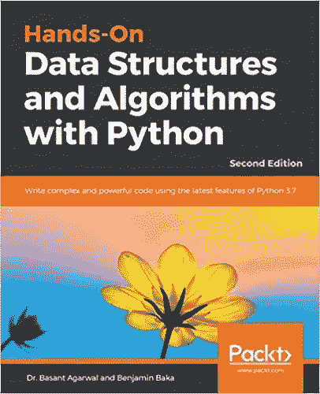
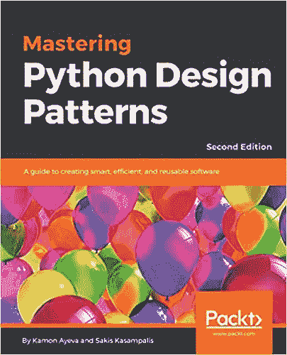
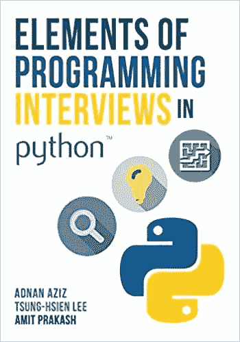

# 每个数据科学家必读的 3 本编程书籍

> 原文：<https://towardsdatascience.com/3-programming-books-every-data-scientist-must-read-db1d3a1a284c?source=collection_archive---------5----------------------->

## 用 Python 掌握数据科学的编程方面

实用数据科学更多的是关于编程，而不是数学。Python 是大多数人选择的语言，所以掌握这种语言的非数据科学方面是很重要的。今天我们将讨论 3 本基本的书来做到这一点。

普里西拉·杜·普里兹在 [Unsplash](https://unsplash.com?utm_source=medium&utm_medium=referral) 上的照片

*但是，作为一名数据科学家，掌握编程为何如此重要？好吧，我会碰碰运气，说你将为一家有其他软件开发人员的公司工作，所以了解你的角色如何融入大局是很重要的。*

让我们快速地对此进行详细说明。

大多数数据科学家在提供一些产品/服务的公司工作，这些产品/服务主要由软件开发团队开发。数据科学家的角色是通过数据分析或某种预测性建模来扩展上述产品/服务的功能。

知道如何在笔记本上训练机器学习模型是不够的。此外，了解软件开发的基础知识对于软件开发部门的高效工作也是不够的。

您需要知道如何编写简单、可读且高效的代码，还需要知道如何以最佳方式组织代码。

这就是更高级的编程概念发挥作用的地方——如*数据结构*、*算法*、*设计模式*和*面试问题*等主题——它们不一定只与面试相关。但稍后会详细介绍。

请记住，在这篇文章中，你会找到我推荐的书籍的链接。这对你来说没什么，因为价格是一样的，但是如果你决定购买，我会得到一点佣金。此外，我只收录了我亲自阅读过的书籍，可以保证 100%的质量。

好吧，我们从第一个开始。

# 用 Python 实践数据结构和算法

[https://amzn.to/3zXJ57I](https://amzn.to/3zXJ57I)

如果你认真对待你的编程工作，学习数据结构和算法是必须的。

这是那些一开始你不理解要点的概念之一，但是一旦你浏览了材料，一切都变了。你将了解到高效编写的代码有多优雅，还将了解一些最常见的面试问题的答案。

这是学习 Python 编程语言中的数据结构和算法的入门书籍，它涵盖了内置数据类型、*集合*模块中的数据类型、单向和双向链表、堆栈、队列、树和树遍历、哈希表、图形、搜索和排序算法等主题。

网上有很多学习这些话题的资源，但我发现这本书的价格非常不错。它大约有 400 页长，所以不要指望很快就能完成。至少花两个月的时间，因为主题相当复杂。

你可以在这里得到《T2》这本书。

# 掌握 Python 设计模式

【https://amzn.to/3GsYU97 

将设计模式视为一组最佳实践，您可以在设计应用程序时使用它们来解决特定的问题。

这本书将教你如何构建你的代码。呆在笔记本电脑里不是生产环境的解决方案，所以学习如何正确地组织代码是必须的——即使你不是在编写应用程序(从传统意义上来说)。

这本书涵盖了绝大多数的设计模式，比如抽象工厂模式、构建器模式、适配器模式、装饰器模式、桥模式、门面模式、命令模式、观察者模式等等。

这些被分成几个部分以使学习变得合理和容易，主要部分是*创造模式*、*结构模式*和*行为模式*。

它只有大约 250 页，所以它不应该花费你那么长时间来完成。再说一次，这不是最简单的话题，所以慢慢来，不要着急。

你可以在这里得到书[。](https://amzn.to/3GsYU97)

# Python 中编程面试的要素

[https://amzn.to/3GA5qLq](https://amzn.to/3GA5qLq)

又一本很棒的书。如果你已经阅读了列表中的第一个——用 Python 实践数据结构和算法*——你可能会发现这个有点类似。这并不是一件坏事。我来详细说明一下。*

你需要学好数据结构和算法，重复几个月前学过的概念只会有好处。此外，你应该学习或至少浏览一些最常见的编码面试问题。

*为什么？因为这些很可能会在你的求职面试中发生。你应该知道这些东西，尽管它与数据科学没有直接联系。我知道这很糟糕。*

这就是数据科学的情况——面试官要求的大量先决条件，其中你将在工作中用到 5%。也许吧。但事实就是如此。

你可以在这里得到这本书。

# 在你走之前

编程和软件工程比人们想象的要广泛得多。学习如何编写代码是不够的，因为我们必须以最简单和最有效的解决方案为目标。

这些书是我推荐的让你的 Python 技能达到最高水平的方法。如果你是 Python 初学者，这里有一篇文章值得一读:

 [## 以下是我如何学习足够的数据科学编程

### 如何学习编程和我推荐的最佳书籍

towardsdatascience.com](/heres-how-i-learned-just-enough-programming-for-data-science-58389f50c570) 

感谢阅读，我希望你喜欢它。

## [**加入我的私人邮件列表，获取更多有用的见解。**](https://mailchi.mp/46a3d2989d9b/bdssubscribe)

*喜欢这篇文章吗？成为* [*中等会员*](https://medium.com/@radecicdario/membership) *继续无限制学习。如果你使用下面的链接，我会收到你的一部分会员费，不需要你额外付费。*

 [## 通过我的推荐链接加入 Medium-Dario rade ci

### 作为一个媒体会员，你的会员费的一部分会给你阅读的作家，你可以完全接触到每一个故事…

medium.com](https://medium.com/@radecicdario/membership)