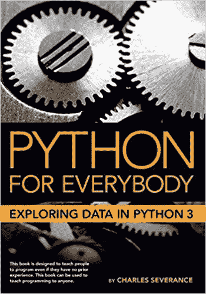
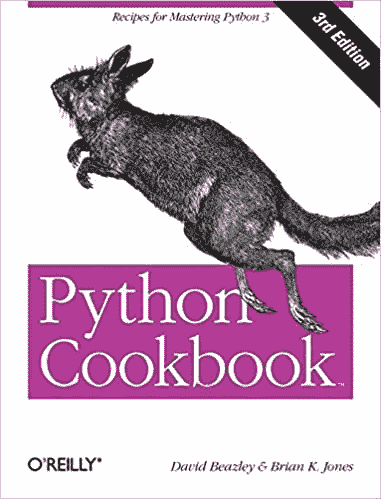
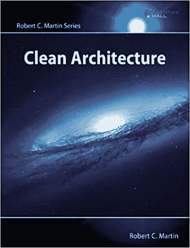

# 每个数据科学家都应该阅读的 3 本编程书籍

> 原文：<https://towardsdatascience.com/3-programming-books-every-data-scientist-should-read-badbb7a64c4a?source=collection_archive---------48----------------------->

## 用 Python 掌握数据科学的编程和架构

照片来自 [Unsplash](https://unsplash.com/) 上的[Janko ferli](https://unsplash.com/@itfeelslikefilm)

如果你读了我上一篇关于数据科学工程师书籍资源的文章，你就会知道我在毕业前从来没有太喜欢过教科书。回头看看我的书架，我发现了另外三本对 Python 编程有帮助的书。在过去的一年里，我致力于为公司内部的数据科学家设计新的工具和技术，并发现当我陷入某个问题时，这些资源非常有价值。到目前为止，我发现最有帮助的三本书是《面向所有人的 Python:探索 Python3 中的数据》、《Python 食谱》和《干净的架构》。

# 面向所有人的 Python:探索 Python3 中的数据

来自[亚马逊列表](https://www.amazon.com/Python-Everybody-Exploring-Data/dp/1530051126)的图书封面图片

**作者:**查尔斯·塞弗伦

即使你已经编程一段时间了，这也是一本很好的复习书。Python for Everybody 首先介绍了为什么应该学习编程以及编程意味着什么。这本书对于没有编程经验的人来说是一本很好的入门读物。在浏览了为什么你应该编程和什么是编程之后，这本书详细介绍了变量、表达式和语句。这篇简介很好地介绍了如何使用条件执行、函数和迭代。在本书的结尾，作者讨论了面向对象编程，与数据库和 SQL 交互，并简要介绍了数据可视化。

如果你正在学习编程或者需要复习基础知识，我强烈推荐你去读一读。这是一本帮助阐明 Python 中具体编程要点的好书，并且有助于强化基本编程原则。作者有简单明了的例子，容易理解。

# Python 食谱

来自[亚马逊列表](https://www.amazon.com/Python-Cookbook-Third-David-Beazley/dp/1449340377/ref=sr_1_3?dchild=1&keywords=Python+Cookbook&qid=1604856375&s=books&sr=1-3)的图书封面图片

作者:大卫·比兹利和布莱恩·k·琼斯

Python Cookbook 在我的书架上已经有一段时间了，当你需要你可能遇到的日常 Python 任务的快速例子时，它是一个很好的参考。这本书一章一章地分解主题，每一节都有几个详细的例子。在阅读这本书的序言时，您会注意到作者是为那些希望更好地理解 Python 和现代编程习惯用法的更有经验的 Python 程序员写的这本书。书中的每个食谱都被写成一个框架例子，为读者提供必要的信息。你得到了一个基本的理解，如果需要的话，你可以去做更深入的研究。

我最初被这本书吸引是基于食谱是如何设置的。每个食谱在一章的一个小节中都是独立的。例如，第 8 章关注类和对象，而配方 8.9 讨论创建新的类或实例属性。在每份食谱中，你会发现三个部分:问题、解决方案和讨论。第一部分详述了问题陈述。然后，解决方案进入一个代码示例和输出的简要描述。讨论将深入到解决方案的更多细节，以及这种方法的任何顾虑、缺点或劣势。这些例子并不都是包罗万象的方法，但它们是理解一个概念并决定是否需要为手头的问题研究进一步信息的一个很好的起点。

# 干净的建筑

亚马逊列表的封面图片

**作者:**罗伯特·c·马丁

在我的上一篇文章中，我讨论了同一作者的《干净的代码》一书，认为这是一本适合软件工程师和数据科学家的完美书籍。与这本书一起的是《干净的建筑》,这是你图书馆的另一个极好的补充。在工作中开发了不同的工具和库之后，我今年购买了这本书。在本书中，作者分解了软件设计和架构的含义，并简要讨论了不同的编程范例。他详细介绍了如何设计软件架构以及如何处理业务规则。

通过阅读这本书，你将更好地理解架构代码意味着什么，以及你如何在你的工作中使用不同的范例和原则。每一部分都详细描述了开发干净架构的各个方面，比如第 3 部分，他详细描述了架构方面的坚实原则。总的来说，这是一本很好的读物，它讨论了业务逻辑应该如何在一个干净的架构代码基中自包含。总而言之，如果你想学习更多关于架构代码的知识，这是添加你的书架的一个很好的参考。

# 摘要

如果你读了我上一篇关于这个主题的文章，你会知道我向对数据科学和软件开发感兴趣的人推荐的前三本书是:

*   罗伯特·塞西尔·马丁的《干净的代码》
*   [统计学习介绍](https://www.amazon.com/Introduction-Statistical-Learning-Applications-Statistics/dp/1461471370)作者 Gareth James，Daniela Witten，Trevor Hastie，Robert Tibshirani
*   [每个程序员都应该知道的 40 种算法](https://www.amazon.com/gp/product/1789801214/ref=ppx_yo_dt_b_search_asin_title?ie=UTF8&psc=1)

 [## 每位数据科学工程师的前三本书

### 我放在书架上的伟大资源，我喜欢介绍给软件工程师和数据科学家。

towardsdatascience.com](/top-3-books-for-every-data-science-engineer-e1180ab041f1) 

当你继续你的旅程时，我推荐以下三本书:

*   面向所有人的 Python:探索 Python3 中的数据
*   大卫·比兹利和布莱恩·k·琼斯的 Python 食谱
*   罗伯特·塞西尔·马丁的清洁建筑

按照这个顺序，您将首先获得关于 Python 的精彩介绍。随着您对这种语言的了解越来越多，并寻找更复杂的例子，您可以浏览 Python 指南。这本书是一个很好的资源，可以通过框架例子来解决常见问题。从框架例子中走出来，你可以开始理解架构你的代码的方法，并且清楚地做出更好的设计决策。

你的书架上有什么有用的书吗？如果有，它们是什么？

如果你想阅读更多，看看我下面的其他文章吧！

 [## 每位数据科学家的 8 大技能

### 当我参加大学讲座时，最常被问到的问题是“我需要具备什么技能？”

towardsdatascience.com](/top-8-skills-for-every-data-scientist-79e6b1faf3e1)  [## 停止浪费你的时间，咨询一个主题专家

### 在从事数据科学项目时，请一位主题专家来审查您的工作可能会有所帮助。

towardsdatascience.com](/stop-wasting-your-time-and-consult-a-subject-matter-expert-f6ee9bffd0fe)  [## 创建用于熊猫分组的自定义聚合

### Pandas groupby 是一个函数，您可以在数据帧上使用它来分割对象、应用函数以及组合…

towardsdatascience.com](/creating-custom-aggregations-to-use-with-pandas-groupby-e3f5ef8cb43e)  [## 数据可视化的前 3 篇文章

### 如果您想更好地构建数据可视化，这些文章很有帮助。

towardsdatascience.com](/top-3-articles-for-data-visualization-956a08a54b04)  [## 不要太骄傲而不愿寻求帮助

### 如果你被一个 bug 卡住了或者感到不知所措，你可以寻求你需要的帮助。

towardsdatascience.com](/dont-be-too-proud-to-ask-for-help-76f21d16f318)  [## 理解分析开发生命周期

### 将您的分析从摇篮带到坟墓。

towardsdatascience.com](/understanding-the-analytic-development-lifecycle-2d1c9cd5692e)