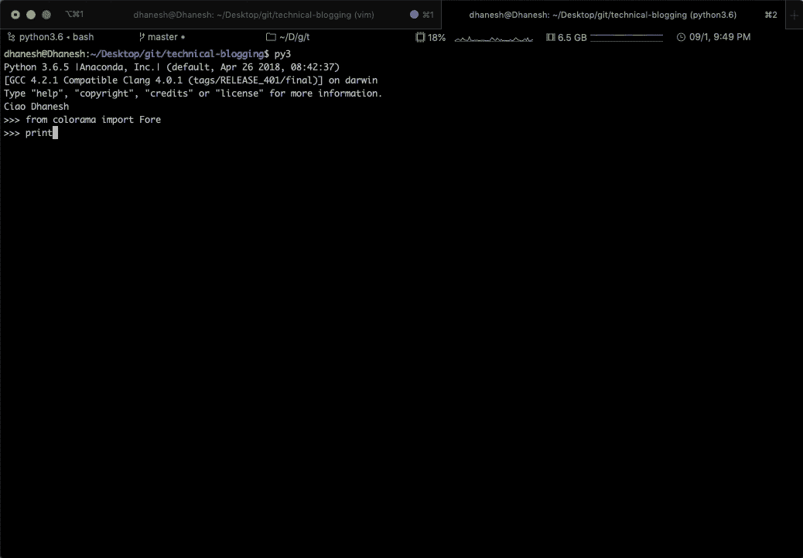
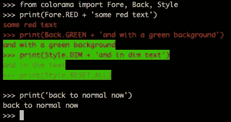

# 2020 年你不能错过的 3 个 Python 库

> 原文：<https://towardsdatascience.com/3-python-libraries-you-cant-miss-in-2020-2ee4a7277cf1?source=collection_archive---------26----------------------->

## 给新的一年开个好头。



在这篇文章中，我将展示 3 个你可能不知道的强大的库。我们开始吧！

# python-dateutil

你可能已经使用过 [Python 的标准日期时间模块](https://docs.python.org/3/library/datetime.html)，尽管它在大多数情况下已经很好了，但你可能觉得它缺少了什么。好吧，让我告诉你，在 [python-dateutil](https://pypi.org/project/python-dateutil/) 中可能已经有了一些东西，你可以安装如下:

```
pip3 install python-dateutil
```

这个库提供了许多强大的功能，例如，您可以用自然语言解析包含日期的字符串。让我们通过一个例子来看看如何做到这一点:

```
from dateutil.parser import parse
s = "Today is the 31st of January of the 91\. And the current time is 12:34:56 AM"
parse(s, fuzzy=True)
```

…提供以下输出:

```
datetime.datetime(1991, 1, 31, 0, 34, 56)
```

在我看来，相当令人印象深刻。这个库中还有许多其他有趣的特性，所以我真的推荐你去看看。

# 降价

如果你曾经觉得有必要将 Markdown 转换成 HTML，这是为你准备的。 [Markdown](https://pypi.org/project/Markdown/) 库，也可以安装 pip:

```
pip3 install Markdown
```

然后，它允许您解析 Markdown 格式的字符串或 Markdown 文件。例如，您可以按如下方式转换字符串:

```
import markdown
markdown.markdown('1\. **Hello**')
```

…提供以下输出:

```
'<ol>\n<li><strong>Hello</strong></li>\n</ol>'
```

# 彩色光

你刚刚在你的网站上发布了一个新的特性，然后走向实时日志的海洋，寻找错误信息。然而都是黑白的，你几乎分辨不出什么。为什么不给你的标准输出增加一些色彩呢？例如，您可能想用红色打印您的错误消息。有了 [colorama](https://pypi.org/project/colorama/) ，这就变得容易了，可按如下方式安装:

```
pip3 install colorama
```

下面的例子摘自[库的 PyPI 站点](https://pypi.org/project/colorama/)，很好地总结了这个库的强大之处:

```
from colorama import Fore, Back, Style
print(Fore.RED + 'some red text')
print(Back.GREEN + 'and with a green background')
print(Style.DIM + 'and in dim text')
print(Style.RESET_ALL)
print('back to normal now')
```

…给出这样的结果！



您有更多颜色和款式可供选择:

```
Fore: BLACK, RED, GREEN, YELLOW, BLUE, MAGENTA, CYAN, WHITE, RESET.
Back: BLACK, RED, GREEN, YELLOW, BLUE, MAGENTA, CYAN, WHITE, RESET.
Style: DIM, NORMAL, BRIGHT, RESET_ALL
```