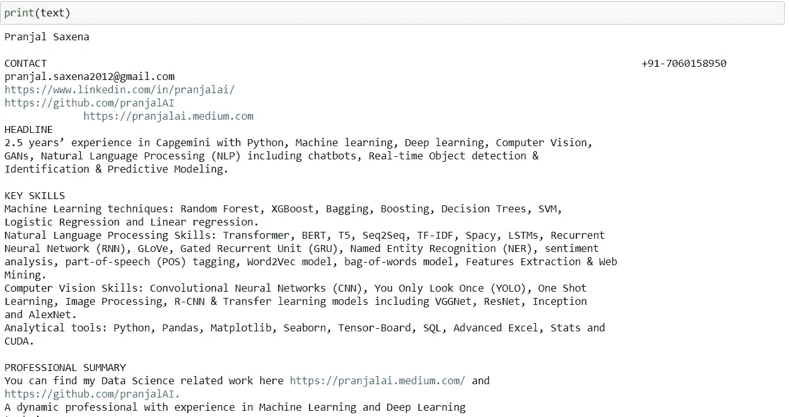
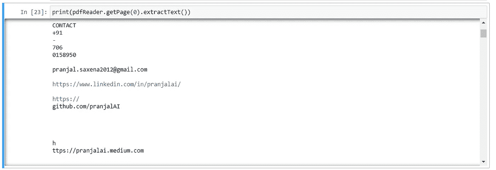
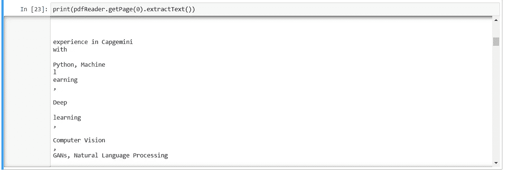
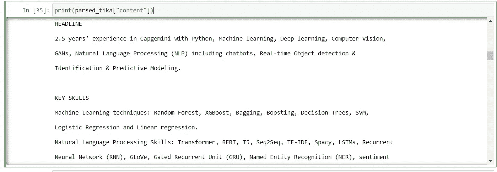

# 提取文本数据应该知道的 3 个 Python 模块

> 原文：<https://towardsdatascience.com/3-python-modules-you-should-know-to-extract-text-data-3be373a2c2f9?source=collection_archive---------21----------------------->

## *用于文本分析的 Python*


[joo ferro](https://unsplash.com/@joaoscferrao?utm_source=medium&utm_medium=referral)在 [Unsplash](https://unsplash.com?utm_source=medium&utm_medium=referral) 上拍照

提取文本数据是进一步分析数据的第一步。我们在社交媒体上有大量的数据。然而，我们需要一个能帮助我们从大量文本数据中提取有用信息的系统。一些使用文本提取的著名应用程序是简历解析和发票阅读。在本文中，我们将看到一些最新的免费使用 python 库来提取文本数据以及如何使用它们。

# 1.Pdf 水管工

PDF 水管工库是用 python 写的。这个库可以在提取文本时解决不同的目的。如果我们想从任何文档中提取文本或表格数据，这个库会非常方便。

## 如何安装

要安装此库，请打开命令提示符并键入以下命令。确保 python 在机器中可用。

```
pip install pdfplumber
```

## 如何使用

要使用这个库，首先，我们需要导入它，然后使用`pdfplumber.open`来读取任何 pdf 文件。

```
import requests
import pdfplumberwith pdfplumber.open("Pranjal Saxena Resume.pdf") as pdf:
    page=pdf.pages[0]
    text=page.extract_text()
```

## 输出

我已经用我的简历提取了数据，并得到了一个很棒的结果来对文本做进一步的处理。



PDF 水管工

# 2.PyPDF2

Matthew Stamy 的 PyPDF2 是另一个很好的库，可以帮助我们从文档中提取数据。它可以执行以下操作。

*   提取文档信息。
*   逐页拆分文档
*   逐页合并文档
*   裁剪页面
*   将多页合并成一页
*   加密和解密 PDF 文件

它执行 pdf 文档中的所有操作。让我们看看它如何从文档中提取文本数据。

## 如何安装

要安装 PyPDF2 库，请打开命令提示符并键入以下命令。确保 python 在机器中可用。

```
pip install PyPDF2
```

## 如何使用

要使用这个 PyPDF2 库，首先，我们需要导入它，然后使用`PdfFileReader`读取任何 PDF 文件。然后，最后使用`extractText()`来获取文本数据。

```
from PyPDF2 import PdfFileReader
pdfFile_pypdf = open('Pranjal Saxena Resume.pdf', 'rb')
pdfReader = PdfFileReader(pdfFile_pypdf)print(pdfReader.getPage(0).extractText())
```

## 输出

如果我们将它与 PDF Plumber 库进行比较，这里的输出并不那么令人满意，因为这个库也关注其他 PDF 文档操作任务。



PyPDF2



PyPDF2

# 3.阿帕奇蒂卡

Apache Tika 是一个内容检测和分析框架，用 Java 编写，由 Apache Software Foundation 管理。看到它所能提供的输出，我感到很惊讶(你也会这样)。因为它对用户友好，易于转换成有价值的数据。

## 如何安装

要安装和使用 Apache Tika python 库，您应该安装最新版本的 Java。安装 Java 后，打开命令提示符并键入以下命令。确保 python 在机器中可用。

```
pip install tika==1.23
```

而且，如果你是用 Jupyter Notebook 来运行代码，那么 Jupyter Notebook 会自己安装所需的 java 环境。

## 如何使用

要使用 Apache Tika 库，首先，我们需要从 Tika 导入解析器，然后使用`parser.from_file`读取任何 pdf 文件。然后，最后使用`[“content”]`来获取文本数据。

```
from tika import parser
parsed_tika=parser.from_file("Pranjal Saxena Resume.pdf")print(parsed_tika["content"])
```

## 输出

输出看起来很有趣。我们可以从文档中提取适当组织的文本。



阿帕奇蒂卡

# 结束点

我们已经讨论了一些最新的免费使用 python 库从文档中提取文本或表格数据。这些库非常有助于从文档中收集信息数据。我们可以尝试这三个库，并根据文档的格式相应地使用它们。现在我们有了数据，下一步是使用正则表达式找到数据中的模式，并存储提取的数据以供进一步操作。

这就是本文的全部内容。我会在附近的某个地方见到你。

> *在你走之前……*

如果你喜欢这篇文章，并希望**继续关注更多关于 **Python &数据科学**的**精彩文章**——请点击这里[https://pranjalai.medium.com/membership](https://pranjalai.medium.com/membership)考虑成为中级会员。**

请考虑使用[我的推荐链接](https://pranjalai.medium.com/membership)注册。通过这种方式，会员费的一部分归我，这激励我写更多关于 Python 和数据科学的令人兴奋的东西。

还有，可以随时订阅我的免费简讯: [**Pranjal 的简讯**](https://pranjalai.medium.com/subscribe) 。