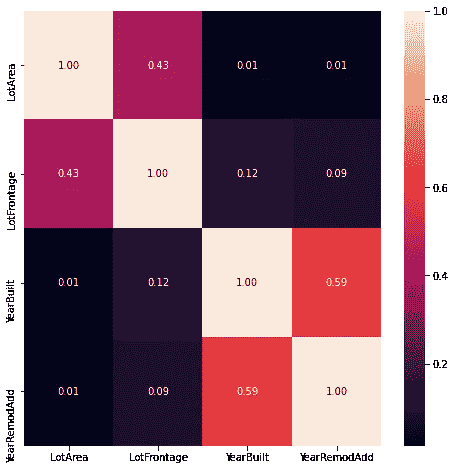
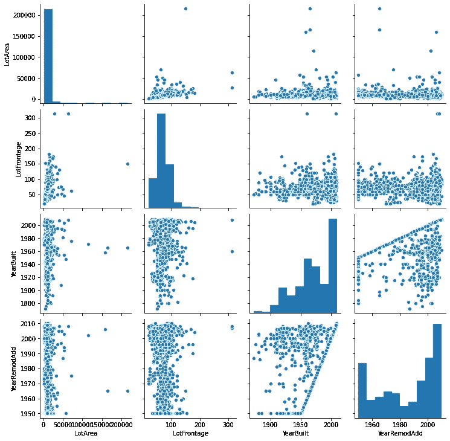
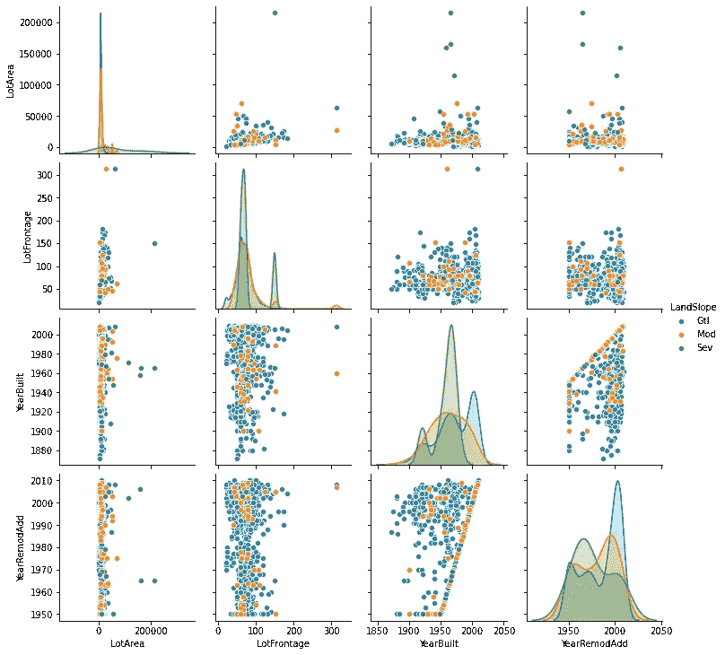
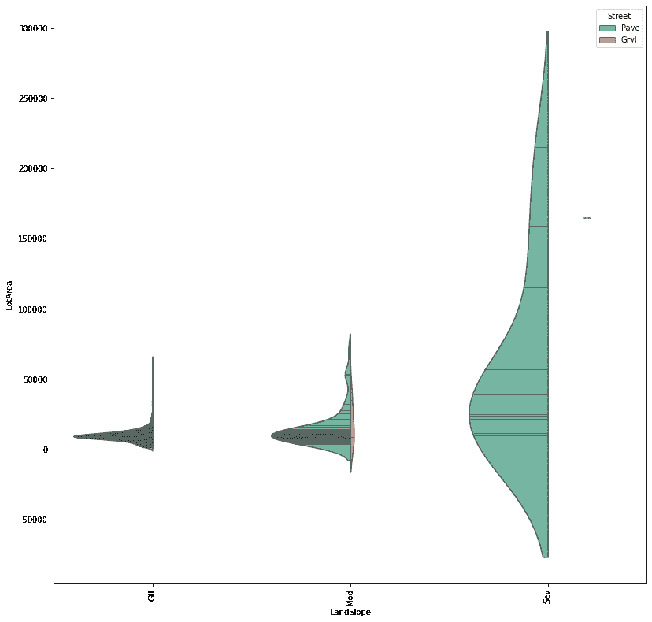
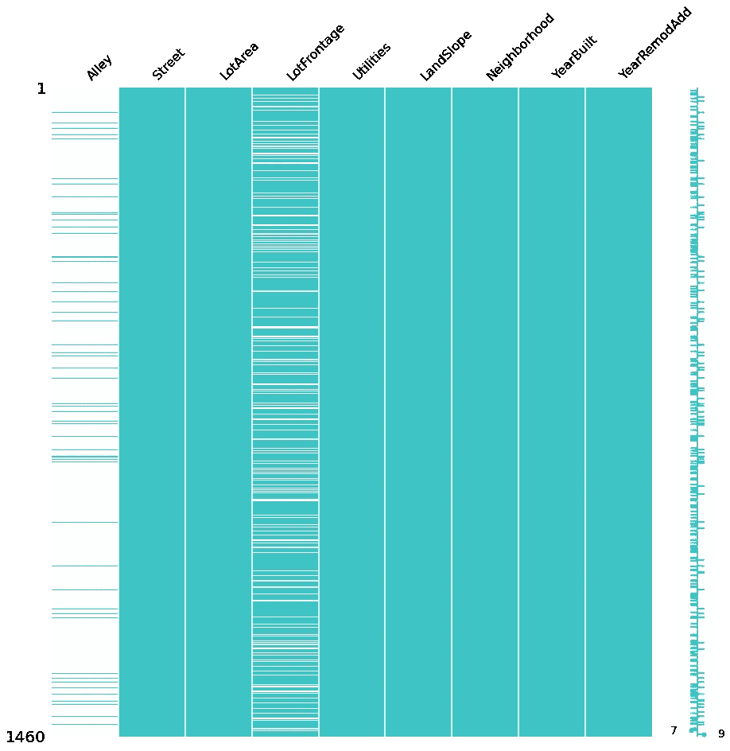

# 作为数据科学家，你必须了解的 3 个 Python 可视化库

> 原文：<https://towardsdatascience.com/3-python-visualization-libraries-you-must-know-as-a-data-scientist-8d0cd25e1c73?source=collection_archive---------15----------------------->

在现实生活中，数据预处理对于大多数数据科学家来说确实是一件痛苦的事情。但是在数据可视化库的帮助下，玩起来会很有趣。


视觉通过[加里·基利安](https://www.vectorstock.com/royalty-free-vectors/vectors-by_GarryKillian)，经由[矢量控制](https://www.vectorstock.com/royalty-free-vector/big-data-round-visualization-vector-14256092)

以我为例，我经常处理医疗行业的数据，通常面对稀疏、误标记和遗留的数据集(oops)。一种优秀的可视化技术可以让您快速深入了解数据，有时甚至在训练之前，或者更好地表示现有的模型解释和提取。

如标题所示，我们将快速地用 Python 编写三个最令人兴奋的可视化库，并帮助您看穿劣质数据的伪装。

## 概述:

*   [**Matplotlib**](https://matplotlib.org/) :底层详细开发工具，自由编码
*   [**Seaborn**](https://seaborn.pydata.org/) :“统计数据可视化”，基于 Matplotlib
*   [**Missingno**](https://github.com/ResidentMario/missingno) :一个小巧轻便的 NaN 表示工具

# 环境设置:

我们正在利用 [*熊猫*](https://pandas.pydata.org/) 和 [*Numpy*](https://numpy.org/) 的力量。如果您手中没有这些工具，只需单击上面的链接并按照说明进行操作。我个人推荐使用 [Anaconda](https://www.anaconda.com/) 来安装这两个依赖项，在 Anaconda 提示符下键入以下命令，就大功告成了！

```
conda install -c anaconda pandasconda install -c anaconda numpy
```

然后，设置我们的五个可视化库:

*Matplotlib:*

```
conda install -c conda-forge matplotlib 
```

*Seaborn:*

```
conda install -c anaconda seaborn
```

*缺失编号:*

```
conda install -c conda-forge missingno
```

现在，一切都准备好了！

# 数据设置:

我正在使用来自 [Kaggle](https://github.com/Kaggle/kaggle-api) open dataset 的数据，并在 Colab 中设置。我不会用 API 调用和设置的细节来烦你，如果你需要帮助，你可以给我发邮件，我会帮你完成的！如果你真的想在 Colab 工作，这些[文档](https://github.com/Kaggle/kaggle-api/issues/15)可能会有帮助，我也在这里 分享我的工作空间 [***。***](https://colab.research.google.com/drive/1qdaZwJLP14-vhImVjMNiYFZTqXJ9Qo04)

这个脚本用于 Colab，在本地 env 上创建一个工作区，从 Kaggle 获取数据，然后安装 missingno。我们使用的数据是 ka ggle“ka ggle Learn 用户的房价竞争”，这是一个记录良好的开源数据集。

现在，我们导入所有依赖项，读取数据，浏览数据集的前几行

整个数据集

然后，出于演示的目的，我们仅使用整个数据集的子集

选择感兴趣的列

所选列的标题()

# 希博恩-马特普罗特里布公司

正如我们上面提到的，Matplotlib 是一个支持所有绘图功能的低级绘图工具。我们通常结合 Seaborn 和 Matplotlib 的力量来获得更好的表示。Seaborn 中一些常用的图形:

1.  [热图](https://seaborn.pydata.org/generated/seaborn.heatmap.html?highlight=heat#seaborn.heatmap):

我们通常使用`heatmap` 来绘制特征之间的相关性，但它也可以用来绘制 3D 轮廓图中任意三个特征之间的关系(至少一个必须是数字字段)



列之间关联的热图

只有带有`dtype!=string`的数据才会计算相关性。我们看到变量`YearBuild`和`YearRemodAdd`之间的高度相关性

2.配对图:

`pairplot` 也是一个非常方便的数据汇总工具。您不仅可以看到特征之间的成对关系，还可以看到单变量图、概率质量图等。



子集数据的配对图



随特征“景观”变化的数据对绘图

3.[紫罗兰花](https://seaborn.pydata.org/generated/seaborn.violinplot.html?highlight=vio#seaborn.violinplot):

`violinplot` 一般用于分布可视化和分布比较。对于只有两个唯一条目的不同特征，我们使用`split=True`在它们之间进行比较



小提琴在'土地斜坡'，'空地'和'街道'之间

如图所示，我们看到`LandSlope`和`LotArea`只受`Street`影响，它只有两种类型的入口: *Pave* 和 *Grvl* 。板变量选择该图的颜色主题和对应于每个数据集条目的`inner=”stick”`

# missingno & Matplotlib

Missingno 是一个很小但很棒的数据可视化库。它有像 Seaborn 一样的常规图表，如`heatmap`、`Bar Chart`，但也有一些独特的图表，如空图`Matrix` 和`Dendrogram`。

在医学数据中，经常会有大量的空数据，这些空数据用零空间表示非常直观，不推荐！



缺少矩阵号

缺少的数字用横条表示数据，缺少横条表示空值。我们看到特性`Alley`非常稀疏，而特性`LotFrontAge` 有相当数量的有用数据。因此，对于数据预处理，我们可以决定丢弃`Alley` 并估算`LotFrontage`

关于如何处理数据科学中的缺失数据，可以参考这篇文章:

[](https://medium.com/@haoyanjiang0709/real-life-machine-learning-deal-with-missing-values-in-raw-data-29c5e9b6f00d) [## 现实生活中的机器学习:处理原始数据中的缺失值

### 预处理对于现实生活中的机器学习非常重要，通常我们会看到一个数据集包含很多…

medium.com](https://medium.com/@haoyanjiang0709/real-life-machine-learning-deal-with-missing-values-in-raw-data-29c5e9b6f00d) 

# 下一步及以后:

这三个库非常基础，但在数据科学领域非常强大，足以满足行业中 95%的数据可视化工作。一些下一级工具，如 [Plotly](https://plotly.com/python/line-and-scatter/) 或 [Bokeh](https://docs.bokeh.org/en/latest/docs/installation.html) ，也建立在 Matplotplib 之上，让您能够构建交互式绘图并在 Web 应用程序上提供服务。当我学习了更多关于 Python 后端技术和前端工程的知识后，我将进入这个领域👊