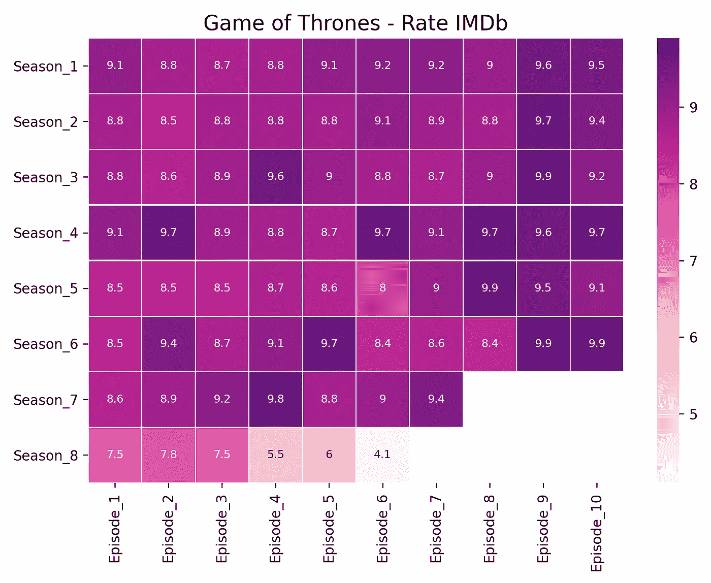
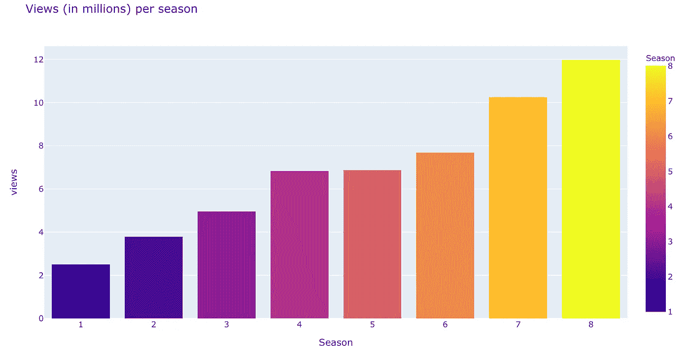
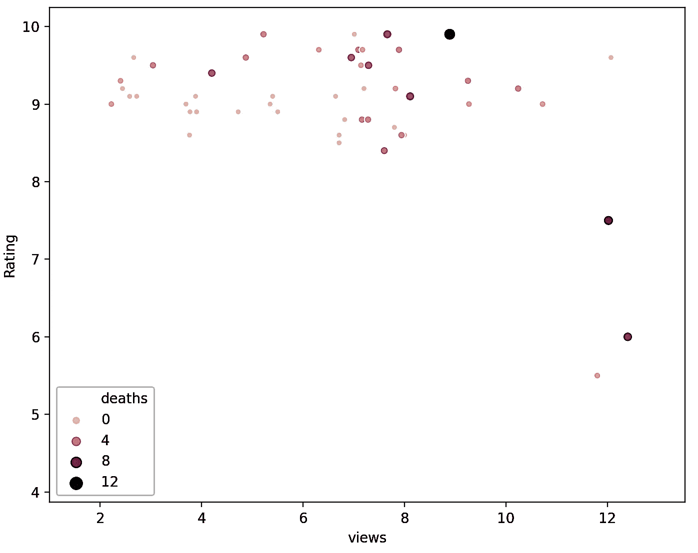
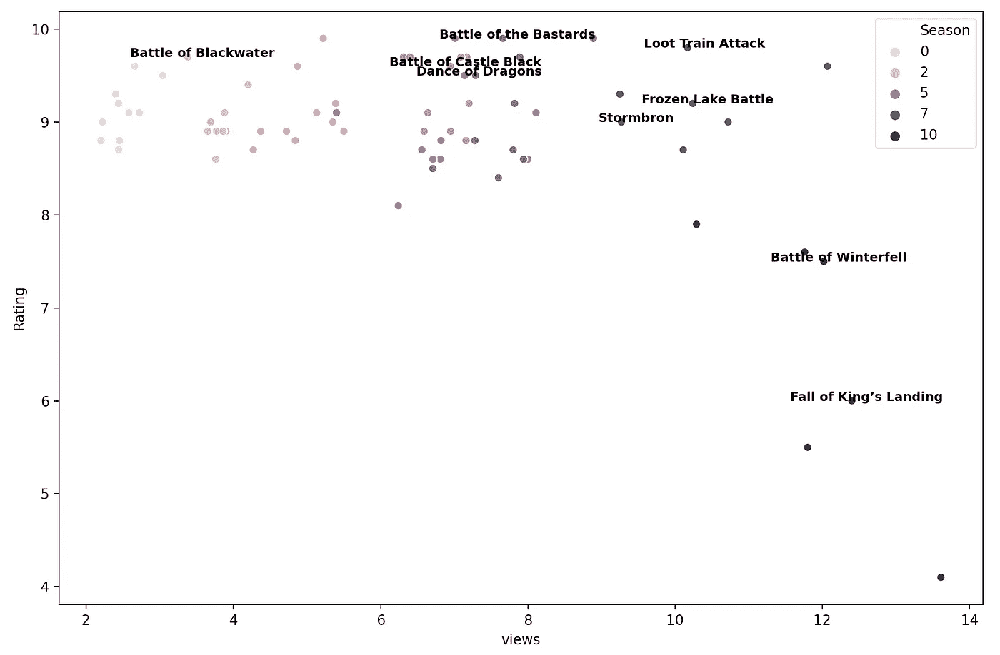
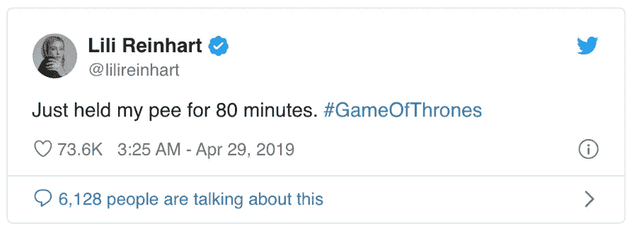

# 受《权力的游戏》启发的 3 种快速简单的数据可视化

> 原文：<https://towardsdatascience.com/3-quick-and-easy-data-visualisations-inspired-by-game-of-thrones-37c0e611b9bf?source=collection_archive---------50----------------------->

## 回答问题:我在看什么？


由[mauricio Santos](https://unsplash.com/@souomau?utm_source=unsplash&utm_medium=referral&utm_content=creditCopyText)在 [Unsplash](https://unsplash.com/s/photos/game-of-thrones?utm_source=unsplash&utm_medium=referral&utm_content=creditCopyText) 上拍摄的照片

又被隔离了一个下午。我决定通过玩一些有趣的数据来提高我的视觉化技能。在这篇文章中，你会发现:

*   Seaborn 图书馆提供的热图
*   由 Plotly Express 提供的条形图
*   散点图(带注释！)动力 Seaborn

我会揭开浏览量、收视率、每集死亡人数和史诗战役之间的关系！剧透警告:如果你认为你知道大量观众喜欢什么，请三思！

# 使用的数据集

用于收集每集**收视率和**浏览量的第一个数据集可以在**Kaggle**这里找到。

我使用的第二个数据集总结了每集**的死亡人数**和可以在**数据世界** [这里](https://data.world/aendrew/game-of-thrones-deaths)找到。

关于我是如何根据季节和剧集连接这两个数据帧的更多信息可以在下面找到。

# IMDb 评级所有季节

我希望能够看到的第一件事是每集的收视率，以及它在不同季节的变化。为此，我使用了 Seaborn 热图。

```
df1=pd.read_csv("Data/Heatmap_GOT.csv"**,** index_col=**0**)sns.heatmap(df1**,** annot=True**,** cmap='RdPu'**,** annot_kws={"size":**8**}**,** linewidths=**.5**)plt.title('Game of Thrones - Rate IMDb'**,** fontsize=**15**)
plt.show()
```

我们可以清楚地看到，《权力的游戏》前七季的收视率非常出色，每一季的最后几集收视率都明显较高。当我们到达第八季时，出现了相当大的下降。我不喜欢批评…但是这里有几个可能导致低收视率的原因…



# 每季浏览量

## 最后一季的收视率明显较低，这是否意味着观看人数减少？

让我们通过绘制每个季节的点击率来看一下。该柱状图是使用 plotly express 绘制的。[这里](/step-by-step-bar-charts-using-plotly-express-bb13a1264a8b)是如何使用这个最近更新的新库的一步一步的教程。

> **条形图**在试图可视化少于 10 个类别的分类数据时非常有效。多了这些，剧情就会杂乱无章，难以理解。在处理分类数据时，我更喜欢使用条形图，因为我们可以通过简单地查看条形的大小来轻松地可视化类别之间的差异。此外，我们可以按颜色分类。

```
views =df.groupby(['Season']).mean().reset_index()
fig = px.bar(views,
             x='Season',
             y= 'views',
             color='Season',
             title = "Views (in millions) per season")
fig.show()
```

从第一季的 230 万到第八季的 1200 万，浏览量直线上升。这解释了为什么预算从第一季的 600 万美元增加到最后一季的 1500 万美元。不幸的是，我提出的假设被证明是错误的，因为收视率最低的那个季节有最多的浏览量！



# 每集死亡人数—假设检验 v.1

我的一个假设是，有更多动作的剧集会转化成更多的观看次数，并且会从公众那里获得更高的收视率。为了形象化这种关系，我决定实现一个散点图，将浏览量和收视率联系起来。

> **散点图**非常适合显示多个变量之间的关系，因为我们可以看到原始数据的分布。通过对各组进行颜色编码，我们可以查看不同数据组之间的关系。为了形象化三个变量，我们创建了另一个参数，比如点的大小，或者颜色。

我做的第一件事是合并两个数据帧(视图和死亡)。我创建了一个公共列，对季节和情节进行编码。以第一季第二集为例，结果采用这种格式(1，2)。

```
df["episode"] = df["Season"].astype(str) + ","+df["Number in Season"].astype(str)
deaths["episode"] = deaths["death_season"].astype(str) + ","+ deaths["death_episode"].astype(str)

merged = pd.merge(df**,** deaths**,** on='episode'**,** how='inner')
```

使用 groupby 函数，我对剧集进行排序，并保存“浏览量”、“收视率”和“死亡人数”这三列。

```
new_merged = merged.groupby(['episode'**,**'views'**,**'Rating'**,** 'Season'**,** 'Death_Count']).size().reset_index(name='deaths')ax = sns.scatterplot(data=new_merged**,** x="views"**,** y="Rating"**,** hue="deaths"**,** size="deaths")
plt.show()
```

情节上的每个圆圈代表系列中的一集。大小和颜色与事件中重大死亡的数量成线性关系。这种观想所提供的信息并没有导致任何结论性的结果。这一集的**内容一定会强烈影响收视率，而且**不仅仅是死亡**！这是我将在下一节研究的内容。**



# 每集战斗—假设检验 v.2

我的第二个假设是观众喜欢战斗。谁不喜欢穿着闪亮盔甲的男人和女人为他们所爱的人而战。让我们看看这是否可以用数据来佐证。

我找不到包含该系列主要战役的数据集。我决定手动创建一个，用下面的[网站](https://www.vulture.com/article/game-of-thrones-battles-ranked.html)花了大约 8 分钟。

```
# Create dataframe with main battles
battles = {'Name': ["Frozen Lake Battle"**,** " Loot Train Attack"**,** "Battle of Blackwater"**,** "Battle of Castle Black"**,** "Battle of the Bastards"**,** "Fall of King’s Landing"**,** "Battle of Winterfell"**,** "Dance of Dragons"**,** "Stormbron"]**,** 'Episode': [**6, 4, 9, 9, 9, 5, 3, 9, 2**]**,** 'Season': [**7, 7, 2, 4, 6, 8, 8, 5, 7**]
     }
battles = pd.DataFrame(data=battles)
```

我将“战斗”数据帧与包含视图和评级的数据帧合并。我决定保持散点图的可视化，但是**为包含一场战斗的每一集增加了一个标记**。

```
battles["episode"] = battles["Season"].astype(str) + ","+ battles["Episode"].astype(str)
d.drop(['Season'**,**'Episode' ]**,** axis=**1,** inplace=True)
merged = pd.merge(df**,** battles**,** on='episode'**,** how='outer')
merged = merged.replace(np.nan**,** ''**,** regex=True)

p1=sns.scatterplot(data=merged**,** x="views"**,** y="Rating"**,** hue = 'Season')for n in range(**0,** merged.shape[**0**]):
    p1.text(merged.views[n] + **0.2,** merged.Rating[n]**,** merged.Name[n]**,** horizontalalignment='center'**,** color='black'**,**weight='semibold'**,** fontsize=**9**)
plt.show()
```



清澈见底，不是吗？有战斗的剧集收视率一直较高。唯一的例外仍然是排名较低的最后一季剧集，这可以从对应于该季的每个点的颜色看出。

# 感谢阅读！

如果你喜欢我的作品，我会非常感激你跟随我来到这里。

如果您对如何改进有任何问题、建议或想法，请在下面留下评论或通过 LinkedIn [这里](https://www.linkedin.com/in/alejandra-g-283595b8)取得联系。

# Github 知识库

所有代码都可以在 Github [这里](https://github.com/alejandra-gutierrez/TVshows)的**gameoftrones . py**文件中找到！

