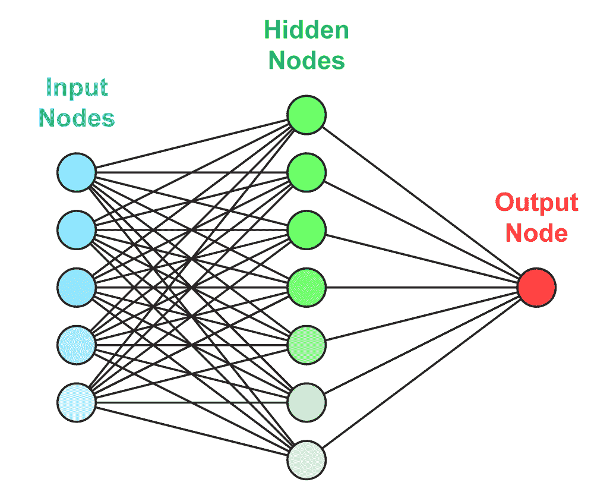
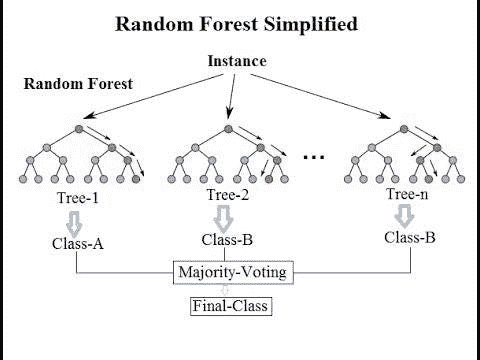

# 在神经网络上使用随机森林的 3 个理由——比较机器学习和深度学习

> 原文：<https://towardsdatascience.com/3-reasons-to-use-random-forest-over-a-neural-network-comparing-machine-learning-versus-deep-f9d65a154d89?source=collection_archive---------5----------------------->

## 由于几个主要原因，随机森林是比神经网络更好的选择。下面是比较机器学习和深度学习需要知道的。

[神经网络](https://blog.exxactcorp.com/?s=neural+network)已被证明在许多行业领域胜过许多机器学习算法。它们不断地学习，直到得出最佳特征集，以获得令人满意的预测性能。然而，神经网络会将你的变量换算成一系列数字，一旦神经网络完成学习阶段，这些特征对我们来说就变得无法区分了。

[图片来源](http://unsplash.com/)

如果我们关心的只是预测，那么神经网络将是一直在使用的事实上的算法。但是在一个行业环境中，我们需要一个能给利益相关者赋予特征/变量意义的模型。这些利益相关者很可能是除了具有深度学习或机器学习知识的人之外的任何人。

# 随机森林和神经网络的主要区别是什么？

随机森林和神经网络是学习方式不同的不同技术，但可以用于类似的领域。随机森林是[机器学习](https://blog.exxactcorp.com/?s=machine+learning)的技术，而神经网络是[深度学习的专属。](https://blog.exxactcorp.com/category/deep-learning/)

# 什么是神经网络？

一个**神经网络**是一个松散地基于人类大脑皮层功能的计算模型，用于复制相同类型的思维和感知。神经网络被组织成由互连节点组成的层，这些节点包含计算网络输出的激活函数。

[图像来源](https://www.intellisystem.it/en/category/news/news-tecnologia/)

神经网络是机器学习的另一种方式，其中计算机通过分析训练样本来学习执行任务。由于神经网络松散地基于人脑，它将由数千或数百万相互连接的节点组成。一个节点可以连接到它下面的层中的几个节点，它从这些节点接收数据，也可以连接到它上面的几个节点接收数据。每个输入的数据点接收一个权重，然后相乘并相加。如果加权和等于零，则添加偏差，然后传递给激活函数。

# 神经网络的体系结构

神经网络有 3 种基本架构:

1.  单层前馈网络

*   它是最简单的网络，是感知器的扩展版本。它在输入层和输出层之间有额外的隐藏节点。

2.多层前馈网络

*   除了输入和输出之外，这种类型的网络具有一个或多个隐藏层。它的作用是干预输入和输出层之间的数据传输。

[3。循环网络](https://blog.exxactcorp.com/5-types-lstm-recurrent-neural-network/)

*   递归神经网络与上述类似，但被广泛用于预测序列数据，如文本和时间序列。最著名的递归神经网络是“[长短期记忆”模型(LSTM)](https://blog.exxactcorp.com/5-types-lstm-recurrent-neural-network/) 。

# 什么是随机森林？

[图片来源](http://events.constantcontact.com/register/event?llr=x9cqvsdab&oeidk=a07egvxohhadf4625dc)

**随机森林**是决策树的集合，其中最终/叶节点要么是分类问题的多数类，要么是回归问题的平均值。

随机森林将生长许多分类树，并且对于来自该树的每个输出，我们说树'*为该类投票'*。使用以下步骤来生长树:

1.  将为每棵树从训练数据中随机抽取行样本。
2.  从步骤(1)中获取的样本中，将获取一个特征子集用于在每棵树上进行分割。
3.  每个树都增长到参数指定的最大程度，直到达到该类的投票。

# 为什么应该使用随机森林？

使用随机森林而不是决策树的根本原因是将许多决策树的预测合并到一个模型中。逻辑是，由许多平庸的模型组成的单个 even 仍将优于一个好模型。鉴于随机森林的主流表现，这是有道理的。因此，随机森林不太容易过度适应。

像决策树这样的灵活模型可能会出现过拟合，其中模型会记忆训练数据并学习数据中的任何噪声。这将使其无法预测测试数据。

***随机森林可以通过将许多树组合成一个集成模型来减少来自决策树等灵活模型的高方差。***

# 什么时候应该使用随机森林而不是神经网络？

随机森林的计算成本较低，并且不需要 GPU 来完成训练。随机森林可以给你一个不同的决策树解释，但性能更好。神经网络需要比普通人手头更多的数据才能真正有效。神经网络会简单地降低要素的可解释性，以至于对性能而言变得毫无意义。虽然对某些人来说这听起来很合理，但这取决于每个项目。

如果目标是在不考虑变量的情况下创建一个预测模型，那么尽一切可能使用神经网络，但是这样做需要资源。如果需要了解变量，那么不管我们喜欢与否，在这种情况下通常会发生的情况是，性能将不得不受到轻微的影响，以确保我们仍然能够了解每个变量对预测模型的影响。

***我在这里遗漏了什么吗？***

请让我知道，我很乐意把它加进去。