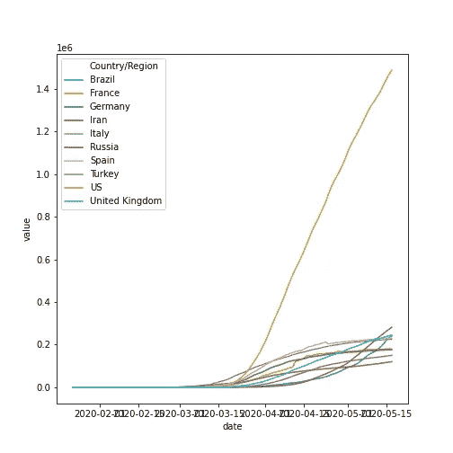
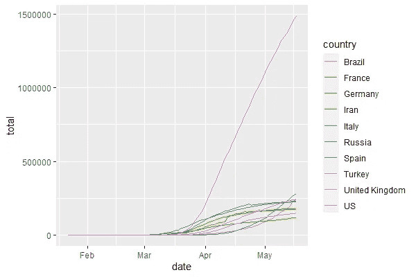

# 我推荐你先学习 Python 的 3 个理由

> 原文：<https://towardsdatascience.com/3-reasons-why-i-recommend-you-to-learn-python-first-8e72ed4a6c65?source=collection_archive---------71----------------------->


马库斯·斯皮斯克在 [Unsplash](https://unsplash.com/s/photos/programming?utm_source=unsplash&utm_medium=referral&utm_content=creditCopyText) 上的照片

## 如果你想从数据科学开始而不是先学 R

P ython 和 R 是数据科学和机器学习领域最常用的语言。两种语言各有优势。

在过去的两年里，我已经在我的数据科学和机器学习项目中使用了这两种语言。如果你想在这个领域起步，我强烈建议你先开始学习 Python，几个月后你已经习惯了，你可以学习 r。相信我，你会意识到这两种语言都有简单易学的语法。

# 原因

为什么我推荐你先学 Python，而不是两个都学？以下是我认为你应该首先学习 Python 的 3 个理由，然后我会给你我对 R 语言的看法，不建议你先学习它。

**Python 有很多应用**

Python 是计算机科学的流行语言。这种语言非常流行，因为它有简单的语法，而且是开源的。这意味着这种语言是由世界各地的社区贡献的，你可以通过使用它来制作任何东西，例如制作游戏、web 应用程序、自动化非常无聊的事情，以及进行数据科学。

**对于新人来说，Python 很难但是值得学**

对于第一个进入数据科学领域的人来说，您可能没有使用任何编程语言的经验。从计算机科学的角度来看，Python 很容易学，但是我知道您可能认为这并不容易。在转到另一种语言之前，先花时间学习编程语言是没问题的，例如 r。在你习惯了它之后，你就可以探索任何其他语言了。但是记住，只学习基础知识，然后用它做你自己的项目。

**深度学习库主要工作在 Python 上**

这就是我认为的 R 语言的缺点。也许它有一些可以用于深度学习的库，比如 Keras 和 TensorFlow，但它的后端仍然需要 Python。如果你也对深度学习感兴趣，我真的建议你先学习 Python，然后花上几个月的时间。

这是我能给你的为什么你应该首先学习 Python 的主要原因，即使你是编程语言的新手或者你是数据科学领域的新手。

# 比较

那么，如果你是数据科学或者编程的新手，为什么我不建议你先学习 R 呢？

我不想让你先学习 R 的主要原因是因为它的语法太容易学了，尤其是在他们的数据科学库上，例如 ggplot2，dplyr，tidyr 等。看看我最近收到的很多笑声的推文，

另一个，

可能你现在还不明白，尤其是那些数据科学的新手，但这只是因为这些推文而让我的一天变得美好。我得说他们刚才说的是真的，我是说真的。

> 原因是 dplyr 和 ggplot2 包具有独特且易于学习的语法，而不是像 pandas 和 matplotlib 这样的 python 库。

让我举一些例子，特别是关于如何使用 Python 和 r 操作数据和可视化数据。这次我将使用约翰·霍普斯金大学的冠状病毒数据集向您演示这两种语言是如何完成这项任务的。

假设我们要绘制一个线图，其中包含全球确诊率最高的 10 个病例。

这是如何在 Python 上实现的，

```
**# Import the data**
import pandas as pd
df = pd.read_csv("[https://raw.githubusercontent.com/CSSEGISandData/COVID-19/master/csse_covid_19_data/csse_covid_19_time_series/time_series_covid19_confirmed_global.csv](https://raw.githubusercontent.com/CSSEGISandData/COVID-19/master/csse_covid_19_data/csse_covid_19_time_series/time_series_covid19_confirmed_global.csv)")**# Get the columns**
get_top_10 = df.iloc[:,[0, 1, 2, -1]]**# Summarize by country/region**
get_top_10 = get_top_10.groupby(['Country/Region']).sum().reset_index()**# Sort by the value and get the top 10**
get_top_10 = get_top_10.sort_values('5/17/20', ascending=False)**# Convert it as an array**
countries = get_top_10.iloc[:10, 0].values**# Melt (Pivot) the table**
df_tidy = df.melt(id_vars=df.columns[:4], var_name='date')**# Set the date column type as datetime**
df_tidy['date'] = pd.to_datetime(df_tidy['date'])**# Group by countries and dates** 
df_tidy = df_tidy.groupby(['Country/Region', 'date']).sum().reset_index()**# Filter it by top 10 countries**
df_tidy = df_tidy[df_tidy['Country/Region'].isin(countries)]
df_tidy.head()**# Create the plot**
import seaborn as sns
import matplotlib.pyplot as plt
sns.lineplot(x='date', y='value', hue='Country/Region', data=df_tidy)
```

这是结果，



然后，看看 R 是怎么做的，

```
**# Import the data**
library(readr)
confirmed <- read_csv("[https://raw.githubusercontent.com/CSSEGISandData/COVID-19/master/csse_covid_19_data/csse_covid_19_time_series/time_series_covid19_confirmed_global.csv](https://raw.githubusercontent.com/CSSEGISandData/COVID-19/master/csse_covid_19_data/csse_covid_19_time_series/time_series_covid19_confirmed_global.csv)")
head(confirmed)**# Get the 10 most confirmed cases countries**
library(dplyr)
get_top_10 <- confirmed %>%
  select(`Country/Region`, "5/17/20")
colnames(get_top_10) <- c("country", "total")get_top_10 %>%
  arrange(desc(total)) %>%
  top_n(10) %>%
  select(country)countries <- c("US", "Russia", "United Kingdom", "Brazil", "Spain", "Italy", "France", "Germany", "Turkey", "Iran")**# Make the data prepared for analysis by tidying it**
library(tidyr)
confirmed_tidy <- confirmed %>%
  pivot_longer(5:(length(colnames(confirmed))), names_to = "date", values_to = "total")
colnames(confirmed_tidy) <- c("province", "country", "lat", "long", "date", "total")
confirmed_tidy$date <- as.Date(confirmed_tidy$date, format="%m/%d/%y")
confirmed_tidy**# Summarize for countries that have province on it**
library(ggplot2)
confirmed_tidy %>%
  group_by(country, date) %>%
  summarise(total = sum(total)) %>%
  ungroup() %>%
  filter(country %in% countries) %>%

  **# Create line plot from it**
  ggplot(aes(x=date, y=total, color=country)) +
  geom_line()
```

这是结果，



> 那么，基于这些例子，你更喜欢用哪一个呢？r 还是 Python？请在下面的评论区告诉我！

# 结论

总之，Python 和 R 各有各的功能。先学哪个，我会推荐你先学 Python 而不是 r。

除了我上面给出的所有理由之外，Python 比 R 更具有面向对象的语法，使用函数来完成它，但是两者具有相同的功能。如果你花更多的时间学习 python，那么你会对编程语法，尤其是面向对象的编程语法很熟悉。如果你在 R 上投资很多，可能你会喜欢它的语法，但是不要一开始就学，因为你不会有面向对象编程的感觉。

我不想劝阻你学 R，但是如果你先学 R 而不学 Python 你懂吗？看看吧，它的语法比 Python 好得多，不是吗？

尽管如此，我还是建议你先学习 Python，因为当你学习 Python 的时候，你可以很容易地学习其他语言。

## 感谢您阅读我的文章。我在这里发表过其他文章。下面是我以前的文章:

[](/matrix-computation-with-numpy-a865ebaf2005) [## NumPy 矩阵计算

### NumPy 如何简化您的代码，同时提高其性能。广播和 SIMD 来救援了！

towardsdatascience.com](/matrix-computation-with-numpy-a865ebaf2005) [](/this-is-how-i-will-learn-data-science-if-i-got-back-my-own-time-e9148c909ce9) [## 如果我有自己的时间，我会这样学习数据科学

### 感觉不知所措和筋疲力尽让我在释放数据科学技能方面表现不佳。这个…

towardsdatascience.com](/this-is-how-i-will-learn-data-science-if-i-got-back-my-own-time-e9148c909ce9) [](/greater-accuracy-does-not-mean-greater-machine-learning-model-performance-771222345e61) [## 更高的准确性并不意味着更好的机器学习模型性能

### 我们可以定量地衡量机器学习模型的性能，但不仅仅是准确性，还有很多…

towardsdatascience.com](/greater-accuracy-does-not-mean-greater-machine-learning-model-performance-771222345e61)