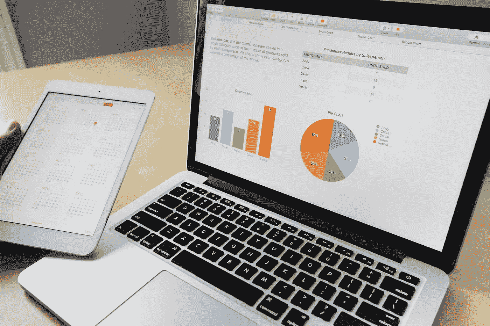

# 人们实际关注的仪表板的 3 条规则

> 原文：<https://towardsdatascience.com/3-rules-for-dashboards-people-actually-look-at-7d7c60fa3353?source=collection_archive---------41----------------------->

## 大多数仪表盘都没用，让我们来解决这个问题。

## 1)仪表板应该简单。

在我的职业生涯中，有人要求我为几家公司设计仪表板。令我惊讶的是，世界上最大的技术公司之一的营销团队要求我的团队为他们开发仪表板。我以为大型科技公司已经想通了所有这些事情。特别是这家公司，有一整个部门致力于营销分析和测量，并有数百个仪表板供他们使用。

问题是，*没有人使用它们中的任何一个*。

图片来源:[https://www . pexels . com/photo/business-charts-commerce-computer-265087/](https://www.pexels.com/photo/business-charts-commerce-computer-265087/)

当我最终看了一下团队已经准备好的仪表板时，不难发现为什么。没有人使用仪表盘，因为没有人知道他们在看什么。请注意，这些是我见过的最漂亮、最复杂的仪表盘——它们充满了许多 KPI、高级图表、统计数据、仪表和表格。这些仪表板是根据最高程度的技术熟练程度和分析能力构建的，但它们未能解决它们应该解决的问题:为业务提供可操作的信息。

不要陷入复杂性=复杂性这一常见陷阱。做得多肯定不一定好。我真的相信莱昂纳多·达芬奇的这句话:“**简单**是终极的**复杂**”在你的仪表盘上遵循这个信条(以及你做的几乎所有事情)。如果业务用户不能清楚地理解仪表板给他们带来的价值，他们将永远不会看它。它需要简单易用，让企业用户没有它就无法运营他们的业务。

不幸的是，即使是业务方面的人也可能被非常漂亮的图表和图形所蒙蔽——您甚至可能因为自己构建的极其复杂的仪表板而受到业务部门的称赞。但是这种认可仅仅是企业认可你的技术能力，而不是对你解决了他们的问题感到满意。乍一看，他们会认为你已经解决了他们的问题，因为一切看起来都很棒。但是想都不用想，他们会在一个月之内回到数据透视表和手动数据提取。

## 2)仪表板用于跟踪和测量，而不是分析。

将大量信息放在仪表板上的诱惑是对数据分析的总体渴望的一部分——业务用户希望获得洞察力，以使他们更好地完成工作。问题是，仪表板是最糟糕的数据分析工具之一。它们不是为回答有关数据的深层问题而设计的，但它们非常适合跟踪和测量。

仪表板擅长回答以下类型的问题:

*   我表现最好的营销活动是什么？
*   我们这个月赚了多少钱？
*   哪些活动的投资回报率最高？
*   我们表现最好的产品是什么？
*   有多少物品的库存很低？

仪表板不擅长回答以下类型的问题:

*   为什么我们的搜索活动胜过我们的社交活动？
*   明年我们应该在每个渠道上花多少钱做广告？
*   我们的高价值电子商务客户最常购买的产品是什么？
*   哪些客户最有可能再次购买我们的产品？

开发你的仪表板，着眼于那些可以 **a)** 长期跟踪和 **b)** 根据某些东西衡量的指标。不要只是将数字形象化，将它们与目标、历史时间表或竞争产品进行比较。可视化不仅要回答“什么”的问题以及“什么时候？”而是“跟什么比？”

**仪表板应该衡量重要的事情，而不是容易的事情。**

工作理论不仅教授如何创新的框架，还教授如何围绕“要做的工作”建立你的组织，并确定重要的衡量标准。工作理论的创始人 Clayton Christensen 博士将这些指标称为“客户利益指标”——换句话说，这些指标表明你的产品或服务在多大程度上解决了它设计解决的工作(与运气竞争，第 161 页)。不幸的是，“客户利益指标”背后的数据通常难以收集。随后，作为分析专家和数据科学家，我们默认使用最容易获得和最容易获得的数据。为了努力让自己感觉有所成就，我们引入、透视并分析了数百个数据源，创建了复杂的模型和令人惊叹的可视化效果，虽然看起来很美，并展示了我们的技术技能，但最终还是达不到目标，即尽可能为企业提供最重要、最有价值的信息。

减少制作仪表板小部件、精美图表或创建新数据管道的时间，将更多时间用于定义最重要的 KPI。然后，制定策略来获取对您的业务真正重要的数据。

## 规则:

1.  仪表板应该简单。
2.  **仪表板跟踪和测量，它们不进行分析。**
3.  **仪表板应该衡量重要的事情，而不是容易的事情。**

有问题或意见吗？你可以给我发电子邮件，地址是 cwarren@stitcher.tech，或者在 Linkedin 上关注我，地址是[https://www.linkedin.com/in/cameronwarren/](https://www.linkedin.com/in/cameronwarren/)

我还提供数据服务，你可以在 http://stitcher.tech/的[了解更多。](http://stitcher.tech/)