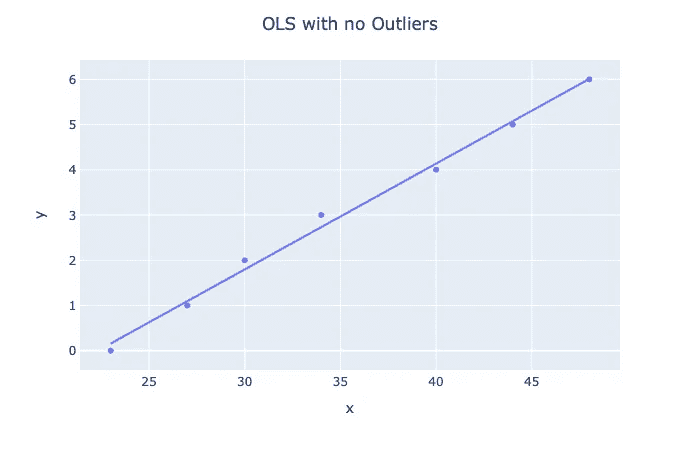
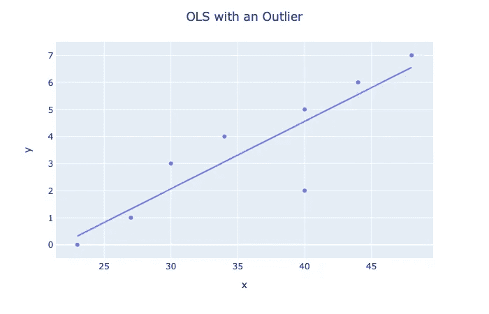
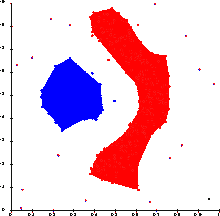
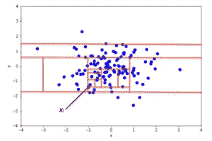
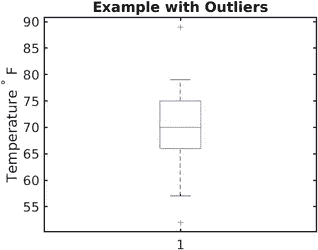
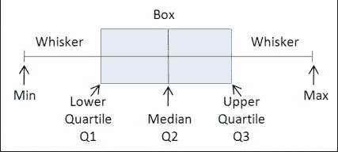
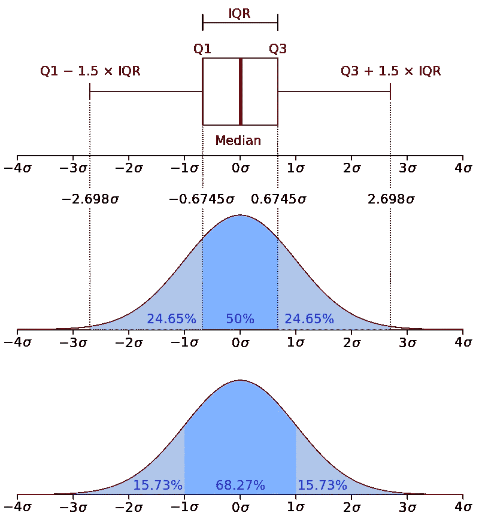
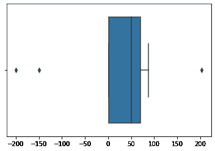
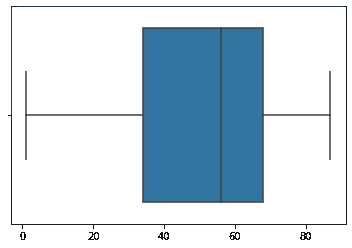

# 每个数据科学家都需要的 3 种简单的异常值/异常检测算法

> 原文：<https://towardsdatascience.com/3-simple-outlier-anomaly-detection-algorithms-every-data-scientist-needs-e71b1304a932?source=collection_archive---------0----------------------->

## 深入了解异常值检测，以及如何在 Python 中实现 3 种简单、直观且强大的异常值检测算法


斯科特拍摄的照片。在 [Flickr](https://www.flickr.com/photos/31673483@N00/39151353820/in/photolist-22DEVtJ-JK3N3j-73AeXk-WtscC8-awpTxE-MZx16D-bv51wM-pYJoVx-262n5CX-b7L1uH-uGu7nd-2dmbaVW-XFRM8N-2jKUw4v-d85XWy-2j5aTjR-WNNJAf-pdRgEy-N8MRV6-2j22H6Y-U3xQuk-XES3Zn-r9m7SS-TV1Fmf-2jJ1QFJ-cauLTY-ds31pR-qtMWbF-niZxTj-2hMkNCc-nKi4XA-DowBNs-5yKzFd-2bQqifH-qB9Nvk-oEQ9WG-CRNtRN-hQzL9o-JXxP5u-29Wj4Lj-dGz93P-JKjBGX-2j7NfDg-nDv1WE-8Q1mSc-seYDya-wVPBZN-oZdBXB-2g3uJeP-s6sqJm) 上的 T

我相信你已经遇到了以下几种情况:

1.  你的模型没有像你希望的那样运行。
2.  你会不由自主地注意到，有些地方似乎与其他地方大相径庭。

恭喜你，因为你的数据中可能有异常值！

# 什么是离群值？


照片可以在[证券交易所](https://stats.stackexchange.com/questions/328968/is-it-an-outlier/328986)找到

在统计学中，**异常值**是与其他观察值显著不同的数据点。从上图中，我们可以清楚地看到，虽然大多数点位于线性超平面中或其周围，但可以看到一个点与其他点有所不同。这个点是一个*离群点*。

例如，看看下面的列表:

```
[**1**,35,20,32,40,46,45,**4500**]
```

在这里，很容易看出 1 和 4500 是数据集中的异常值。

## 为什么我的数据中有异常值？

通常，异常值可能发生在以下情况之一:

1.  有时它们可能是偶然发生的，可能是因为测量误差。
2.  有时它们会出现在数据中，因为数据很少是 100%干净的，没有任何异常值。

## 为什么离群值是一个问题？

以下是几个原因:

1.  线性模型

假设你有一些数据，你想用线性回归来预测房价。一个可能的假设可能是这样的:



作者照片

在这种情况下，我们实际上对数据拟合得太好了(*过拟合*)。然而，请注意所有的点是如何位于大致相同的范围。

现在，让我们看看当我们添加一个离群值时会发生什么。



作者照片

很明显，我们看到我们的假设是如何改变的，因此，推论会比没有异常值时更糟糕。线性模型包括:

*   感知器
*   线性+逻辑回归
*   神经网络
*   KNN

2.数据输入


[Ehimetalor Akhere Unuabona](https://unsplash.com/@theeastlondonphotographer?utm_source=unsplash&utm_medium=referral&utm_content=creditCopyText) 在 [Unsplash](https://unsplash.com/s/photos/missing?utm_source=unsplash&utm_medium=referral&utm_content=creditCopyText) 拍摄的照片

一种常见的情况是丢失数据，可以采取以下两种方法之一:

1.  删除缺少行的实例
2.  使用统计方法估算数据

如果我们采用第二种选择，我们可能会有有问题的估算，因为异常值可以极大地改变统计方法的价值。例如，回到我们没有异常值的虚构数据:

```
# Data with no outliers
np.array([35,20,32,40,46,45]).mean() = 36.333333333333336# Data with 2 outliers
np.array([1,35,20,32,40,46,45,4500]).mean() = 589.875
```

显然这个类比很极端，但是想法是一样的；数据中的异常值通常是一个问题，因为异常值会在统计分析和建模中导致严重的问题。然而，在这篇文章中，我们将研究一些方法来检测和对付它们。

# 解决方案 1: DBSCAN



图片来自[维基百科](https://en.wikipedia.org/wiki/DBSCAN)

对有噪声的应用程序进行基于密度的空间聚类(或者更简单地说，DBSCAN)实际上是一种无监督的聚类算法，就像 KMeans 一样。然而，它的用途之一是能够检测数据中的异常值。

DBSCAN 之所以受欢迎，是因为它可以找到非线性可分的聚类，而这是 KMeans 和高斯混合所做不到的。当集群足够密集并且被低密度区域分隔开时，它工作得很好。

## DBSCAN 如何工作的高级概述

该算法将聚类定义为高密度的连续区域。算法非常简单:

1.  对于每个实例，它计算有多少实例位于距离它很小的距离ε (epsilon)内。这个区域被称为实例的 *ε-邻域。*
2.  如果实例在其ε-邻域中有超过**个 min_samples** 实例，那么它被认为是一个*核心实例。*这意味着实例位于高密度区域(内部有许多实例的区域)。)
3.  核心实例的ε-邻域内的所有实例都被分配到同一个集群。这可能包括其他核心实例，因此一长串相邻的核心实例构成一个集群。
4.  任何不是核心实例或者不位于任何核心实例的ε-邻域中的实例都是离群值。

## DBSCAN 正在运行

由于 Scikit-Learn 的直观 API，DBSCAN 算法非常易于使用。让我们来看一个运行中的算法示例:

```
fromsklearn.cluster import DBSCAN 
from sklearn.datasets importmake_moonsX, y = make_moons(n_samples=1000, noise=0.05)
dbscan = DBSCAN(eps=0.2, min_samples=5)
dbscan.fit(X)
```

这里，我们将使用 0.05 的ε-邻域长度来实例化 DBSCAN，5 是将一个实例视为核心实例所需的最小样本数

记住，我们不传递我们的标签，因为这是一个*无监督算法。*我们可以看到标签算法使用以下命令生成的标签:

```
dbscan.labels_OUT:
array([ 0,  2, -1, -1,  1,  0,  0,  0, ...,  3,  2,  3,  3,  4,  2,  6,  3])
```

注意一些标签的值等于-1:这些是异常值。

DBSCAN 没有预测方法，只有 fit_predict 方法，这意味着它不能对新实例进行集群。相反，我们可以使用不同的分类器来训练和预测。对于这个例子，让我们使用一个 KNN:

```
from sklearn.neighbors import KNeighborsClassifierknn = KNeighborsClassifier(n_neighbors=50)
knn.fit(dbscan.components_, dbscan.labels_[dbscan.core_sample_indices_])X_new = np.array([[-0.5, 0], [0, 0.5], [1, -0.1], [2, 1]])knn.predict(X_new)OUT:
array([1, 0, 1, 0])
```

这里，我们在核心样本和它们各自的邻居上拟合 KNN 分类器。

然而，我们遇到了一个问题；我们给出了没有任何异常值的 KNN 数据。这是有问题的，因为它将迫使 KNN 为新实例选择一个集群，即使新实例确实是一个离群值。

为了解决这个问题，我们利用 KNN 分类器的杠杆 kneighbors 方法，该方法在给定一组实例的情况下，返回训练集的 *k* 个最近邻居的距离和索引。然后我们可以设置一个最大距离，如果一个实例超过了这个距离，我们就把它定义为离群值:

```
y_dist, y_pred_idx = knn.kneighbors(X_new, n_neighbors=1)
y_pred = dbscan.labels_[dbscan.core_sample_indices_][y_pred_idx]
y_pred[y_dist > 0.2] = -1
y_pred.ravel()OUT:
array([-1, 0, 1, -1])
```

这里我们讨论并实现了用于异常检测的 DBSCAN。DBSCAN 很棒，因为它很快，只有两个超参数，并且对异常值很鲁棒。

# 解决方案 2:隔离森林



照片由[作者](https://en.wikipedia.org/wiki/Isolation_forest)

IsolationForest 是一种集成学习异常检测算法，特别适用于检测高维数据集中的异常值。该算法基本上执行以下操作:

1.  它创建了一个随机森林，其中决策树随机生长:在每个节点上，随机选取特征，并选取一个随机阈值将数据集一分为二。
2.  它继续切割数据集，直到所有实例都相互隔离。
3.  异常通常远离其他实例，因此，平均而言(在所有决策树中)，它变得比正常实例孤立的步骤少。

# 隔离森林在行动

再次感谢 Scikit-Learn 的直观 API，我们可以轻松实现 IsolationForest 类。让我们来看一个运行中的算法示例:

```
from sklearn.ensemble import IsolationForest
from sklearn.metrics import mean_absolute_error
import pandas as pd
```

我们还将引入 mean_absolute_error 来度量我们的误差。对于数据，我们将使用可以从 Jason Brownlee 的 [GitHub](https://raw.githubusercontent.com/jbrownlee/Datasets/master/housing.csv) 获得的数据集:

```
url='[https://raw.githubusercontent.com/jbrownlee/Datasets/master/housing.csv'](https://raw.githubusercontent.com/jbrownlee/Datasets/master/housing.csv')df = pd.read_csv(url, header=None)data = df.values
# split into input and output elements
X, y = data[:, :-1], data[:, -1]
```

在拟合隔离森林之前，让我们尝试对数据拟合一个简单的线性回归模型，并获得我们的 MAE:

```
from sklearn.linear_model import LinearRegressionlr = LinearRegression()
lr.fit(X,y)mean_absolute_error(lr.predict(X),y)OUT:
3.2708628109003177
```

相对较好的分数。现在，让我们看看隔离林是否可以通过移除异常来提高分数！

首先，我们将实例化我们的 IsolationForest:

```
iso = IsolationForest(contamination='auto',random_state=42)
```

算法中最重要的超参数可能是*污染*参数，它用于帮助估计数据集中异常值的数量。这是一个介于 0.0 和 0.5 之间的值，默认设置为 0.1

然而，它本质上是一个随机化的随机森林，因此随机森林的所有超参数也可以用在算法中。

接下来，我们将使数据符合算法:

```
y_pred = iso.fit_predict(X,y)
mask = y_pred != -1
```

请注意我们如何过滤掉预测值= -1，就像在 DBSCAN 中一样，这些预测值被视为异常值。

现在，我们将为 X 和 Y 重新分配异常值过滤后的数据:

```
X,y = X[mask,:],y[mask]
```

现在，让我们尝试用线性回归模型来拟合数据，并测量 MAE:

```
lr.fit(X,y)
mean_absolute_error(lr.predict(X),y)OUT:
2.643367450077622
```

哇，成本大大降低了。这清楚地表明了隔离林的威力。

# 解决方案 3:箱线图+塔克法

虽然箱线图是识别异常值的一种非常常见的方法，但我真的发现后者可能是识别异常值最被低估的方法。但是在我们进入 Tuckey 方法之前，让我们谈谈箱线图:

## 箱线图



图片来自[维基百科](https://en.wikipedia.org/wiki/Box_plot)

箱线图本质上提供了一种通过分位数显示数字数据的图形方式。这是一个非常简单而有效的方法来可视化离群值。

上下须显示分布的边界，任何高于或低于的都被认为是异常值。在上图中，任何高于 80 和低于 62 的都被认为是异常值。

## 箱线图如何工作

基本上，盒状图的工作原理是将数据集分成 5 个部分:



照片来自 [StackOverflow](https://stackoverflow.com/questions/48719873/how-to-get-median-and-quartiles-percentiles-of-an-array-in-javascript-or-php?rq=1)

*   **Min** :分布中排除任何异常值的最低数据点。
*   **Max** :分布中排除任何异常值的最高数据点。
*   **Median ( *Q* 2 /第 50 百分位)**:数据集的中间值。
*   **第一个四分位数(*Q*1/25 个百分点)**:是数据集下半部分的中位数。
*   **三分位数( *Q3* /第 75 百分位)**:数据集上半部分的中位数。

四分位距(IQR)很重要，因为它定义了异常值。本质上，它如下:

```
**IQR** = Q3 - Q1**Q3**: third quartile
**Q1**: first quartile
```

在箱线图中，测量出 1.5 * IQR 的距离，并包含数据集的较高观察点。类似地，在数据集的较低观察点上测量出 1.5 * IQR 的距离。任何超出这些距离的都是异常值。更具体地说:

*   如果观察点低于(Q1 1.5 * IQR)或*箱线图下须线*，则被视为异常值。
*   类似地，如果观察点高于(Q3 + 1.5 * IQR)或*箱线图上须，*，那么它们也被视为异常值。



图片来自[维基百科](https://en.wikipedia.org/wiki/Box_plot#Example(s))

## 行动中的箱线图

让我们看看如何使用 Python 中的箱线图来检测异常值！

```
import matplotlib.pyplot as plt
import seaborn as sns
import numpy as npX = np.array([45,56,78,34,1,2,67,68,87,203,-200,-150])
y = np.array([1,1,0,0,1,0,1,1,0,0,1,1])
```

让我们绘制一个数据的箱线图:

```
sns.boxplot(X)
plt.show()
```



作者照片

根据我们的箱线图，我们看到我们的数据中有 50 个中值和 3 个异常值。让我们去掉这几点:

```
X = X[(X < 150) & (X > -50)]sns.boxplot(X)
plt.show()
```



作者照片

在这里，我基本上设置了一个门槛，所有小于-50 大于 150 的点都会被排除在外。而结果；平均分配！

## Tuckey 方法异常检测

tuckey 方法异常值检测实际上是盒图的非可视化方法；方法是一样的，除了没有观想。

我有时更喜欢这种方法，而不是箱线图的原因是，有时看一看可视化并粗略估计阈值应该设置为什么并不真正有效。

相反，我们可以编写一个算法，它实际上可以返回它定义为离群值的实例。

实现的代码如下:

```
import numpy as np
from collections import Counterdef detect_outliers(df, n, features):
    # list to store outlier indices
    outlier_indices = [] # iterate over features(columns) for col in features:
        # Get the 1st quartile (25%)
        Q1 = np.percentile(df[col], 25)
        # Get the 3rd quartile (75%)
        Q3 = np.percentile(df[col], 75)
        # Get the Interquartile range (IQR)
        IQR = Q3 - Q1 # Define our outlier step
        outlier_step = 1.5 * IQR # Determine a list of indices of outliers outlier_list_col = df[(df[col] < Q1 - outlier_step) |     (df[col] > Q3 + outlier_step)].index # append outlier indices for column to the list of outlier indices 
        outlier_indices.extend(outlier_list_col) # select observations containing more than 2 outliers
    outlier_indices = Counter(outlier_indices)        
    multiple_outliers = list(k for k, v in outlier_indices.items() if v > n)return multiple_outliers# detect outliers from list of features
list_of_features = ['x1', 'x2']
# params dataset, number of outliers for rejection, list of features Outliers_to_drop = detect_outliers(dataset, 2, list_of_features)
```

基本上，该代码执行以下操作:

1.  对于每个特征，它获得:

*   第一个四分位数
*   第三个四分位数
*   IQR

2.接下来，它定义了*异常值步长*，就像在箱线图中一样，它是 1.5 * IQR

3.它通过以下方式检测异常值:

*   查看观察点是否为< Q1 — outlier step
*   Seeing if the observed point is Q3 + outlier step

4\. It then checks selects observations that have *k* 异常值(在这种情况下，k = 2)

# 结论

总之，有许多离群点检测算法，但我们通过 3 个最常见的:DBSCAN，IsolationForest 和 Boxplots。我鼓励你:

1.  在 Titanic 数据集上尝试这些方法。哪一个检测异常值最好？
2.  寻找其他异常值检测方法，看看它们的性能比您最初尝试的方法更好还是更差。

我真的很感激我的追随者，我也希望不断地写作，给每个人提供很好的精神食粮。然而现在，我必须说再见；}


照片由 [ZoeyMoey](https://www.flickr.com/photos/hit-thepineapple/3740510520/in/photolist-6Gx6sG-3BRTT-aKGUWR-vfmAbJ-2jQXvsu-2jbxm87-8RdPJ-8b7L44-27Bpxnx-6Zk8FP-eMsWsS-3RFHy-smyjPc-8veeS2-2e9yDYX-Wu5D6r-bnCWXg-55QKEB-TnH85D-6jfenr-4TYH1T-2e9yDZi-5Bq4G1-2cKFWDr-6CCPBy-2icpZMn-2gvGVpQ-2hutLvF-U76bvn-2inoGCK-4uqPt7-72LKqn-7txdM-67hfDv-2cKFWDM-Nb3XAw-6t9gHx-8AUJY4-CyuTL-e12QP-Lewuc-W5RM2o-2hztpRp-4ZKnuV-nLC7gh-6wN132-Wfh7FH-2abfTG-a3RyD7-2cKFWDX) 在 [Flickr](https://www.flickr.com/photos/hit-thepineapple/) 上拍摄