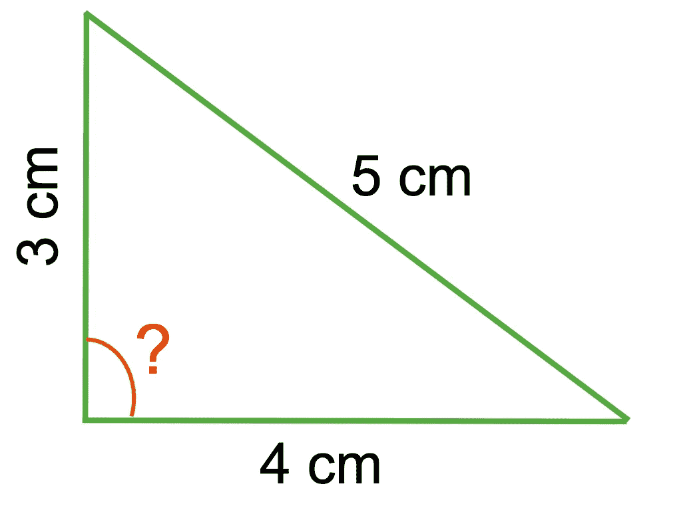
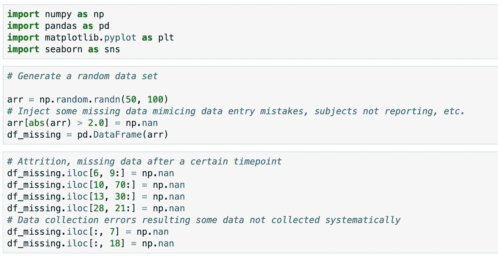
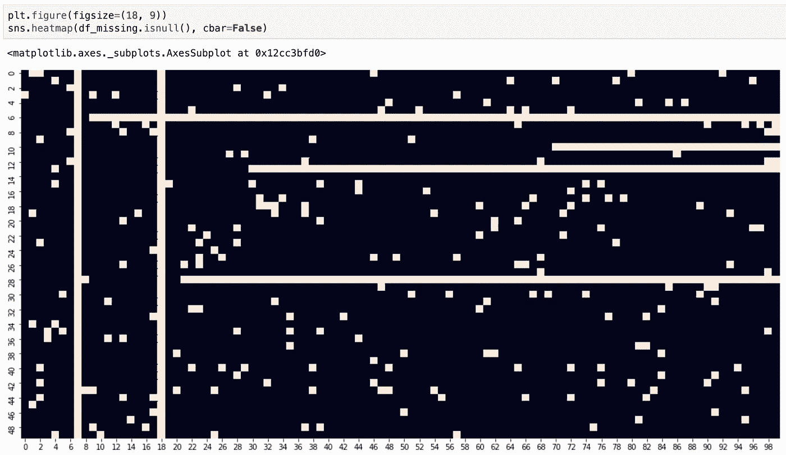
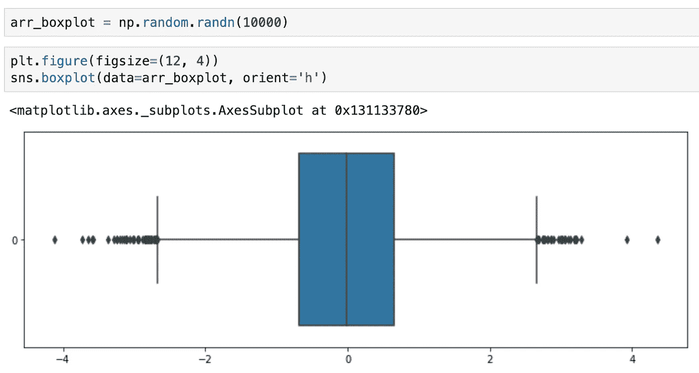
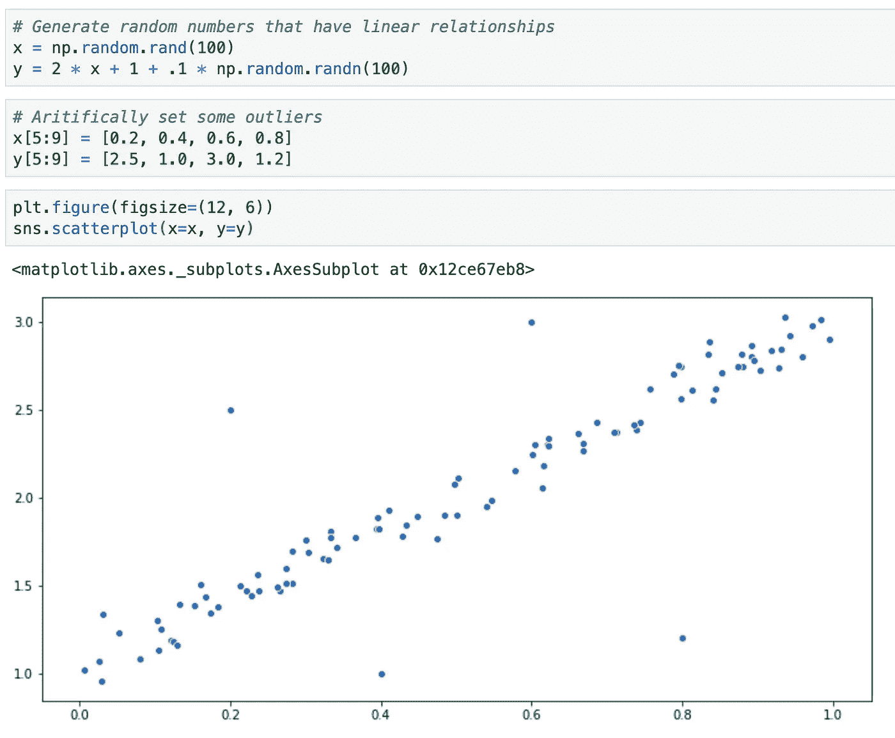
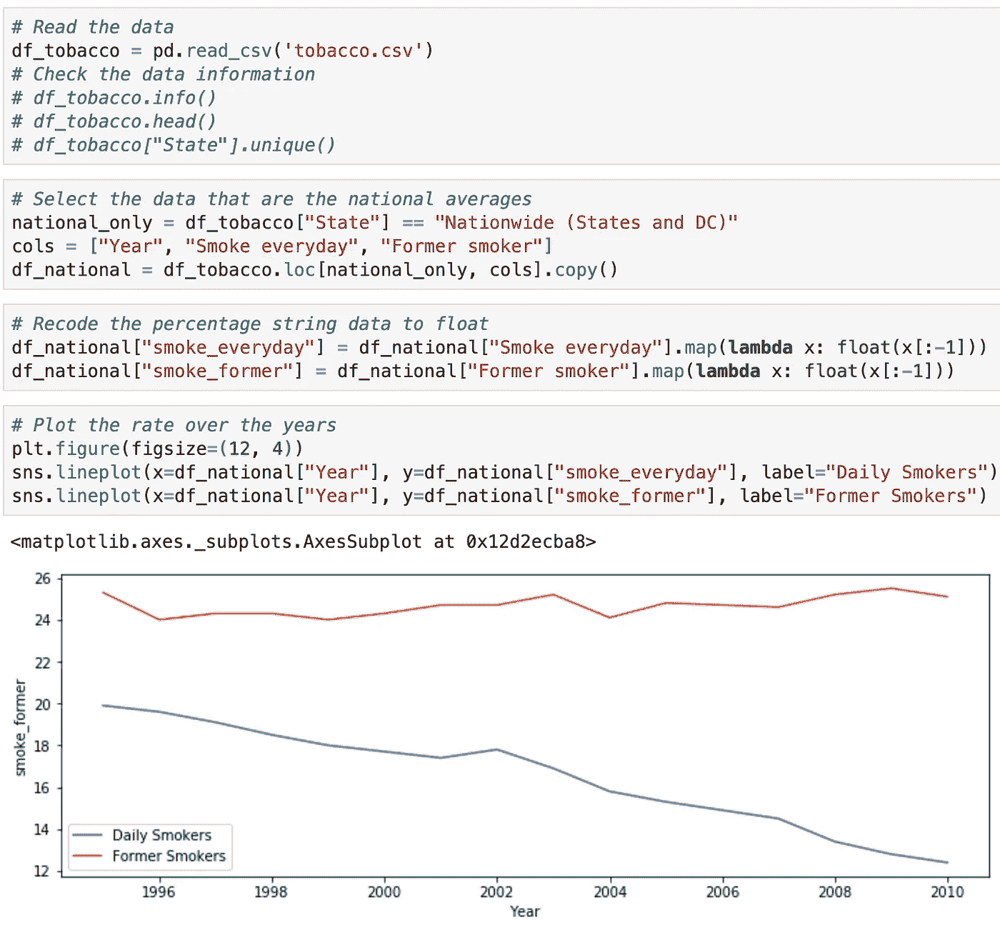
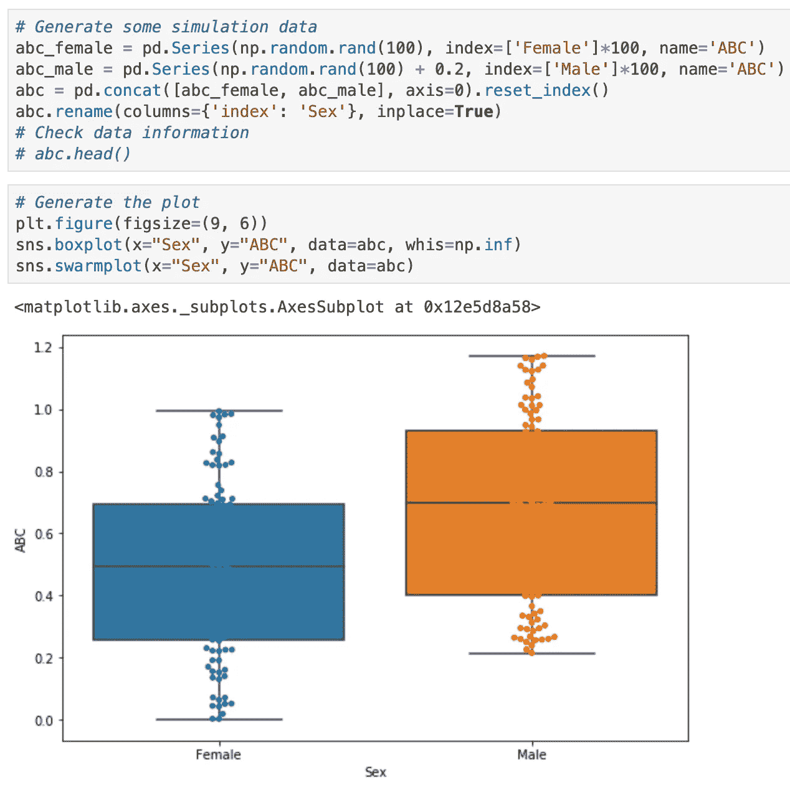

# 为什么在做其他事情之前应该首先可视化数据的 3 个简单原因

> 原文：<https://towardsdatascience.com/3-simple-reasons-why-you-should-first-visualize-data-before-doing-anything-else-63ec05d86d9?source=collection_archive---------21----------------------->

由[西部边界摄影 chris gill](https://unsplash.com/@chris7520?utm_source=medium&utm_medium=referral) 在 [Unsplash](https://unsplash.com?utm_source=medium&utm_medium=referral) 上拍摄

## 我们大脑处理的 90%的信息是视觉的，我们大脑处理视觉的速度比文本快几千倍。为什么不利用一下呢？

# 介绍

当我在中学解决几何问题时，我总是做的第一件事是将可用的数据可视化，尤其是那些只有文字描述的问题。把它放在一个环境中，假设小学生要解决下面的假设问题。

> 三角形的边长分别是 3 厘米、4 厘米和 5 厘米。最大的角度是多少度？
> 
> **A.** 85 度
> b .90 度
> c .95 度

对于开始上四五年级的小学生来说，他们可能还不知道勾股定理。他们解决这个问题的最好办法是画一个精确尺寸为 3、4 和 5 厘米的三角形(希望如下)，然后测量最大的角度。他们应该能发现最大的角度是 90 度。

边长分别为 3、4 和 5 厘米的三角形—作者

做数据科学不仅仅是处理三个数据点。对于更复杂的数据，可视化数据对于理解我们的数据更加重要。在这里，我看到了许多优秀的文章，它们介绍了各种方便的数据可视化工具(例如 Tableau 和 Python 模块，如`matplotlib`和`seaborn`)以及各种用于不同场景的精美图表(例如热图、蜘蛛图)，主要用于结果报告。

令人惊讶的是，据我所知，在数据科学项目的早期阶段，很少有人讨论数据可视化的重要性。缺乏广泛的讨论可能是因为 1)经验丰富的数据科学家认为这是他们懒得谈论的例行步骤，2)新数据科学家可能没有意识到可视化数据作为关键预处理步骤的必要性。

在这篇文章中，我想与您分享为什么我们应该在开始任何后续数据处理和分析步骤之前可视化我们的数据的三个主要原因。在我们开始之前，有四件事需要注意。

1.  为了提供概念证明，我将使用模拟相关数据模式的合成数据，这些数据模式在现实世界中可能会遇到，也可能不会遇到。如果您愿意，请随意使用您的数据。BTW:你可以在 [GitHub](https://github.com/ycui1/data_visualization_3_reasons.git) 上找到本文使用的代码。
2.  只有当分辨率合理时，可视化才有意义。因此，对于一个庞大的数据集，您必须运行一些迭代来逐段查看数据，以生成清晰的图表。
3.  本文面向初级到中级水平的数据科学家。优先考虑使用 Python 及其相关模块(例如 Pandas)的知识，但是这里介绍的原理仍然适用于使用其他数据处理和可视化工具。
4.  这篇文章并不详尽。对于下面讨论的每一个原因，都有其他可视化方法来实现相同的目标。此外，在运行任何分析或构建模型之前，我们应该可视化我们的数据还有其他原因。

# 1.理解缺失模式

由于各种原因，真实世界的数据存在缺失问题。由于种族和收入等隐私问题，受试者拒绝回答具体问题。受试者意外输入了不正确的数据(例如，电话号码中缺少一个数字)。在纵向研究中，一些受试者因退出或死亡而退出研究。

因此，了解我们数据的缺失是很重要的，尤其是那些从现实生活研究中收集的数据。事实上，我们可以用描述性统计来计算缺失的数据，但是可视化数据是生成数据缺失的总体印象的一种强大而直接的方法。

合成数据的生成

在上面的代码片段中，我们生成了随机数的数据帧。然后我们注入一些缺失的数据。了解总体缺失模式的最简单方法是使用热图，如下所示。浅米色的每个单元格代表一个缺失值。

热图揭示的缺失模式

根据这张热图，我们可以得出以下观察结果。1)总体来说，这个模拟数据集的缺失度还不错。为了找出每个变量的确切数量，我们可以使用一些描述性统计。2).如果每行代表一个纵向研究中受试者的数据，似乎有些受试者在不同的时间点退出了研究。我们可以对照他们的数据图表。3).两栏中缺少所有受试者的数据，这非常令人担忧。工作人员可能误解了该方案，因此没有按预期收集这些数据。或者，这些数据可能还没有输入数据库。

使用这个简单的热图可视化丢失的数据有助于我们理解这个数据集的丢失模式，**，更重要的是，它可以引导我们回到数据源以恢复一些丢失的数据。**最后，我们可以减少数据中的遗漏，我们都知道完整的数据集对任何数据科学项目来说有多么重要。

# 2.识别异常值

数据预处理的一个早期步骤是**处理离群值，离群值是与数据集中的其他数据值明显不同的数据值**。它们的发生至少有两个原因。第一，数据输入错误。例如，缺少一个小数会使值增大 100 倍(10.24 对 1024)。第二，数据集有真正的离群值。例如，在健康人群的生理学研究中，大多数受试者的静息心率为 60-100 BPM，但出于某种原因，受试者的心率为 130 bpm，这可能是一个真正的异常值。

我们会知道异常值对数据分析的负面影响。这里有一个真实的例子，我不知道它是否被研究过。考虑研究大学辍学对一个人在商业上成功的影响。我们可能会错误地得出这样的结论:与在哈佛读完四年相比，从哈佛退学会大大增加你成为亿万富翁的可能性。为什么会这样？这都是因为比尔·盖茨和马克·扎克伯格这两个真正的异类都从哈佛退学了。

玩笑归玩笑，数据可视化是识别数据集中可能的异常值的强大方法。根据数据结构的性质，有不同类型的图表可以显示异常值。在这里，我只是给大家展示一些常见的。

***要使用单变量方法可视化异常值，箱线图在大多数情况下都适用。*** 如下图所示，我生成了 10000 个正态分布的随机数。使用箱线图，我们可以看到这个数据集有异常值，我们必须处理。处理异常值可能是未来一篇文章的另一个主题。

箱形图

如果我们要研究两个连续变量之间的关系，我们在大多数情况下可以使用散点图。 如下图，我生成了两个一维的随机数数组，它们之间有一个投影的线性关系。我人为地添加了一些可能的异常值。如您所见，这四个异常值明显远离散点图中的其他点。请注意，对于真实世界的数据集，如果可能的话，我们需要回到数据源，以验证这些数据是在没有任何人为错误的情况下收集的有效值。

散点图

# 3.产生有意义的假设

在我正在进行的数据科学或神经科学研究中，利用现有数据开发一些可测试的假设至关重要。类似地，在机器学习设置中，总是需要形成一些假设，并用训练数据集开发一些有意义的模型，我们希望在测试数据集中运行模型时能够保持这些假设。

类似于离群值的识别，给定数据集的特定数据结构将决定我们在进行任何测试之前如何可视化数据。例如，如果您试图确定两个连续变量之间可能的线性关系，您可以从散点图开始，如上一节所示。既然您已经看到了，我将向您展示另外两种类型的图，以针对特定的研究需求生成其他潜在的假设。

**如果你试图在纵向研究中找出一个趋势，最好从折线图开始。**在下面的例子中，我从 [Kaggle](https://www.kaggle.com/cdc/tobacco-use) 下载了烟草使用数据。为简单起见，我只将全国平均数据归入日常吸烟者和戒烟者类别。因为百分比数据是作为字符串读取的，所以为了绘图的目的，我将它们转换为浮点数。从线图中，我们可以观察到每日吸烟率下降的趋势，而以前吸烟者的流行率保持不变。通过确定这一趋势，我们可能会产生一个假设，即 2010 年后，每日吸烟率将继续下降。

线形图

**如果您试图研究两个变量(连续和/或分类)之间的关系，有几个选项可用，例如散点图(我们在上一节中用于线性关系的那个)、热图和条形图。**为了向您展示一些不同的东西，我将向您展示蜂群图，它有助于检查分类变量和连续变量之间的关系，并显示了后者的分布。

典型的例子包括比较两组之间特定测量的差异，以及比较同一组手术前后的差异。很大程度上，这就像是独立 t 检验和从属 t 检验。

群体图和箱线图

假设我们想要研究性别(生物医学研究中使用的一种生物因素，而不是使用性别，这具有一些社会影响)是否影响新冠肺炎的特定严重性度量 ABC。上图显示了使用`seaborn`模块混合盒状图的群体图的数据模拟和生成。有了这个数字，我们可以假设男性的 ABC 因子水平可能比女性高，这个假设我们可以在以后用更大的人群进行测试。

# 结论

数据预处理是一门艺术，它将顶尖的数据科学家与平庸的科学家区分开来。数据预处理步骤中的一些关键部分是缺失值和异常值的识别和处理。我们必须仔细观察数据，以确保数据本身的质量。如果条件允许，回到数据源验证数据完整性，从源头上消除人为错误总是一个好主意。

除了检查我们数据的文本描述之外，在我们数据处理步骤的早期阶段可视化数据，而不是保存可视化工具以便稍后展示最终产品，这是非常有用的。这种可视化提供了一种基本的方式来告知数据质量并为接下来的分析步骤生成可能的有意义的假设。