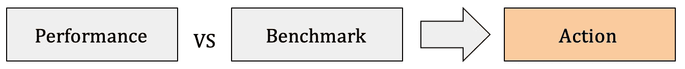

# 传达数据见解的 3 个简单步骤

> 原文：<https://towardsdatascience.com/3-simple-steps-to-communicating-data-insights-6eeac0f790ba?source=collection_archive---------38----------------------->

## 使数据可操作的简单框架。

照片由[马太·亨利](https://burst.shopify.com/@matthew_henry?utm_campaign=photo_credit&utm_content=Free+Woman+At+Whiteboard+Image%3A+Stunning+Photography&utm_medium=referral&utm_source=credit)发自[突发](https://burst.shopify.com/young-adult?utm_campaign=photo_credit&utm_content=Free+Woman+At+Whiteboard+Image%3A+Stunning+Photography&utm_medium=referral&utm_source=credit)

在 People Analytics 工作时，我经常发送数据，尤其是以仪表板的形式。仪表板很棒，因为它们能以简洁的方式直观地显示大量信息。我喜欢构建仪表板，因为它可以让我发挥创造力，以直观的方式显示不同类型的数据。

对我来说，这些仪表盘充满了等待实施的见解。我非常兴奋，全心全意地投入到这些吸盘中，并高兴地将它们发送给利益相关者。然后，什么也没发生。而且令人心碎。

经过一段时间的哀悼，我开始挖掘哪里出了问题。我不明白我是如何将所有这些伟大的数据交到需要它们的人手中，但他们却没有使用它们。你还想从我这里得到什么？！

问题是，人们被仪表盘弄得不知所措，不知道从哪里开始。*我看到了数据但那又怎样？我在数据上花费了太多的时间，以至于有时我忘记了大多数人并没有这样做。虽然解释数据对我来说已经变得很直观，但那些没有整天、每天忙于数字的人需要花更多有意识的努力来解释。*

我发现一个非常简单的交流数据的公式非常有用。我开始自己使用这个公式，然后开始把它教给其他人，这样他们就可以从他们的数据中得出自己的见解。

[性能]与[性能指标评测]= >[操作]

1.  选择一个基准
2.  情境化表演
3.  行动计划

完成这些步骤后，您就可以交流从数据中获得的见解。根据我们的基准，我们的表现如何？我们应该做些什么？

# 1.选择一个基准

让我们从选择一个基准开始。在我们知道自己表现如何之前，我们首先需要知道什么是“好”。我们需要把我们的表演放在上下文中。

假设我们正在查看一个营业额仪表板，并希望向领导报告结果。有几种方法可以选择要比较的基准:

*   **行业标准**。*其他公司客服员工平均离职金额是多少？*
*   **内部组比较**。*一个部门的营业额与整个公司的营业额相比如何？一个办公地点的营业额与另一个办公地点的营业额相比如何？*
*   **历史对比**。这个团队去年的营业额是多少？
*   **公司目标**。我们公司的目标是将营业额保持在 25%以下。

决定使用哪种类型的比较的关键是，你希望它足够相似，这样才有意义。例如，如果您正在查看两个完全不同的办公地点(例如，不同的员工数量、不同的角色等),则内部组比较可能没有意义。).类似地，如果在过去的一年中发生了显著的变化(例如，您的规模扩大了一倍)，那么历史比较可能没有意义。虽然苹果和苹果的比较几乎是不可能的，但我们希望避免苹果和长颈鹿的比较。

除了上述考虑，使用公司目标应该谨慎。目标理论又是一堆令人着迷的蠕虫，但请记住，这些目标通常需要灵活。*这个目标对这个部门有意义吗*(即，这是一个我们可能有不同期望的特定类型的部门吗)？*考虑到当前背景*(如组织变革、就业市场等)，此目标是否有意义。)?

# 2.周边绩效

一旦我们选择了我们的基准，我们就可以将我们的表现联系起来。这可能非常简单。我们本质上需要与领导者沟通，如果他们需要坚持到底，或者如果他们需要做出改变。

以下是一些将我们的表演放在上下文中使用的形容词示例:

*   更高或更低
*   更好还是更坏
*   更快还是更慢
*   赛道上还是赛道外

假设我们将发送一封电子邮件给 Jolly，他是我们位于棒棒糖森林的客户服务呼叫中心的领导。我们决定使用内部组比较作为我们的基准:甘草泻湖一个类似规模的客户服务呼叫中心。

在我们的示例中，假设甘草泻湖的年初至今周转率为 18%，棒棒糖伍兹的年初至今周转率为 24%。简单来说，你可以简单地说棒棒糖伍兹的营业额比我们的对照组高，或者更低。这至少给了领导者一个衡量他们营业额表现的标准。

如果我们想更进一步，我们可以使用多个基准测试。喔，小心。我们可以说棒棒糖伍兹的营业额高于我们的对照组，也略高于他们去年的营业额。这是令人兴奋的东西！现在我们开始深入研究*我们该做些什么。*

# 3.行动计划

现在，我们知道了与我们的基准相比我们的表现如何，我们需要知道如何去做。

拥有一个潜在行动计划库是一个很好的做法，您的组织愿意为各种情况做出承诺(例如，如果我们的人员流动率高，我们的参与度低，等等，我们准备采取什么行动)。).例如，一个降低流动率的潜在行动计划是给每个人加薪 100 万美元，但这对你的公司可行吗？(如果是，请打电话给我)。这样，当我们准备好从我们的数据中提取见解时，我们可以根据我们的绩效和基准选择最佳的*预先审核的*行动计划。

也许我们已经了解到以下做法有助于降低离职率:与员工进行职业对话、轮岗计划、增加学习机会。一旦我们有了可用的可能选项库，我们就可以根据绩效和环境选择适当的行动计划。

如果我们回到棒棒糖森林的例子，我们知道我们的营业额高于去年，也高于我们的对照组。我们在棒棒糖森林的营业额偏离了轨道。

我们来看看我们的银行降低流动率的潜在行动计划。在查看我们的行动计划时，我们知道我们目前没有增加学习机会的预算，所以我们现在忽略这一点。在考虑其他选择时，我们可能不知道员工是愿意进行更多的职业对话还是愿意参加轮岗计划。

如果我们需要更多信息，我们可以查看对离职调查的回复(如果我们有),或者我们可以与员工组成焦点小组，讨论目前是什么让他们留在自己的岗位上，以及什么会让他们对组织更加忠诚。

在查看了离职调查的反馈后，我们发现大多数离开公司的员工表示，他们离开公司是因为他们觉得在公司内没有明确的职业发展道路。正因为如此，你决定与员工进行职业对话，讨论他们的目标是什么，他们在组织中的下一步是什么，这是解决棒棒糖森林中人员流动增加的最佳行动方案。

现在，我们已经选择了最合适的行动方案，我们准备完成给我们的领导 Jolly 的电子邮件。

> 今年迄今为止，棒棒糖森林的营业额高于去年，也高于对照组。为了让棒棒糖森林的营业额重回正轨，我建议我们与所有员工进行职业对话。这些对话旨在通过确保员工感觉到他们有一个清晰的职业道路和在组织中成长的方向来增加保留率。

灯光，摄像机，开拍。

照片由[马太·亨利](https://burst.shopify.com/@matthew_henry?utm_campaign=photo_credit&utm_content=Free+Smiling+Woman+Leading+Meeting+Photo+%E2%80%94+High+Res+Pictures&utm_medium=referral&utm_source=credit)发自[突发](https://burst.shopify.com/fitness?utm_campaign=photo_credit&utm_content=Free+Smiling+Woman+Leading+Meeting+Photo+%E2%80%94+High+Res+Pictures&utm_medium=referral&utm_source=credit)

# 摘要

只要记住，和领导分享数据洞察的时候，不需要很复杂。领导者需要知道他们是否需要继续做他们正在做的事情，或者他们是否需要做一些不同的事情。按照以下步骤开始:

1.  选个标杆
    -行业标准
    -集团内部对比
    -历史对比
    -公司目标
2.  将表现
    -更高或更低
    -更好或更差
    -更快或更慢
    -在轨或离轨
3.  行动计划
    -有银行
    -考虑背景
    -获得更多反馈

继续用你的头撞墙，这样会好很多！

*我是一名工业组织心理学家，在 People Analytics 工作。我相信工作应该是有趣的，龙舌兰酒应该被认为是药用的，数据应该民主化。*