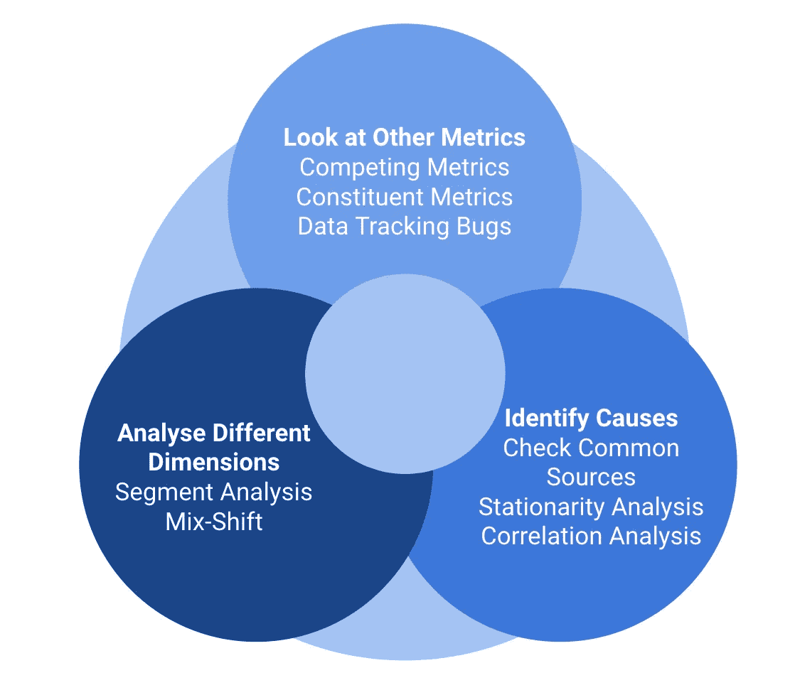
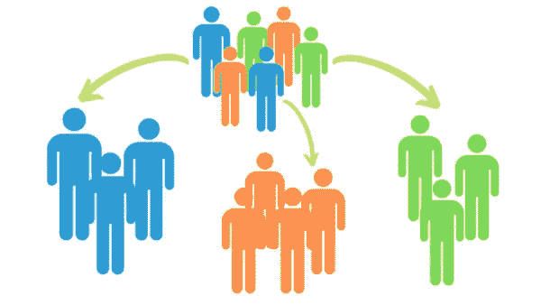
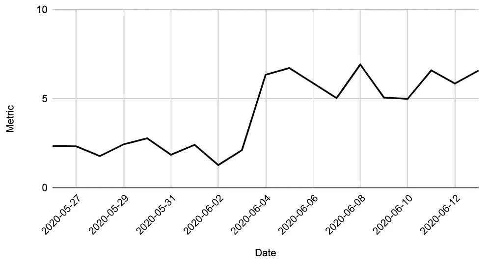
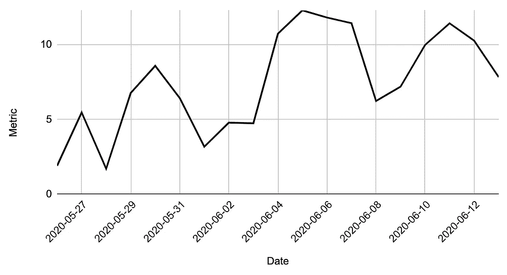

# 理解数据变化的 3 个简单步骤

> 原文：<https://towardsdatascience.com/3-simple-steps-to-understand-changing-data-871e829c7785?source=collection_archive---------37----------------------->

## 数据分析师探索数据的框架

今天，深入分析数据分析中的变化。图片来源:[艾米·李斯特](https://unsplash.com/photos/Gck455DlpPI)。

“每周购买量下降了！！为什么？？怎么会？？救命啊！!"—如果你是一名数据分析师，你肯定以前从苦恼的同事那里听说过类似的事情。变化是每项业务的一部分，并且发生在所有时间范围内。它可以影响许多领域，如网站上的每周购买量、生产的单位数量或天气。当人们看到变化时，他们会被驱使去理解是什么导致了变化，这样他们就可以制定合适的行动计划。作为分析师，我们应该促进这种理解，并概述核心问题。

在这篇文章中，我们将探索一些常见类型的变化进行分析。我们还将讨论您可以用来理解这些变化的方法。这些是数据分析师使用的基本描述性(或诊断性)分析方法，但任何对利用数据感兴趣的人都可以应用它们。

> 请注意，当某个值或指标与之前的值不同时，我们定义了该值或指标的变化。除了时间之外，维度也会发生变化，比如位置的变化。可以将下面讨论的许多方法应用于这些其他类型的方差。

我们将遵循这个粗略的结构:

1.  考虑系统环境中的指标，以及其他可能相关的指标。
2.  按不同维度分解指标，检查总体变化。
3.  寻找可能引起变化的事件，发现相互关系。

我们将采取的分析变化的步骤的概要。虽然我通常会建议遵循这里描述的顺序，但是从一个开始并在另一个停止肯定是可能的。

# **第一步:查看其他指标**

当查看正在变化的特定指标时，我们倾向于采用狭隘的观点。我们专注于这个单一指标，以及它是如何上下波动的。这对于那些严格跟踪既定指标的成熟团队来说尤其如此。查看指标时要记住的一个关键点是，所有指标都有缺陷。虽然一个给定的度量标准对某些用例可能是好的，但它在其他用例中可能会失败。一个指标可能很好地代表了一种行为，但却无法捕捉到另一种行为。因此，最好的第一步是查看其他指标，看看它们是如何受到影响的。

> 最好的第一步是查看其他指标，看看它们是如何受到影响的。

您可以从查看**竞争指标**开始。竞争指标是指在竞争相同资源时会向相反方向移动的指标。Youtube 视频上的赞和评论就是一个例子。一个引起人们注意“喜欢”按钮的产品变化会增加喜欢，但会减少评论。在这里，这两个功能争夺用户的注意力，以获得留下反馈的方法。当然，随着总浏览量的增加，喜欢和评论可能会一起上升。其他例子包括不同服装品牌的销售额或使用不同应用程序的时间。对于您的分析，您可能会发现，当您的典型指标下降时，另一个指标却上升了。这甚至可能对业务有益！

其他值得关注的指标是**组成指标**。组成指标是由其他指标“组成”的指标。拿某电商网站上的购买次数来说；这可以用一种方式分解为:

`purchases = no. visitors x sign-up rate x sign-up to purchase rate`。

在分析每个指标时，可以看到后两个指标是恒定的，而访问者的数量却下降了。总的来说，组成指标通过将指标分解成更小的块，为您提供了另一种研究指标的方法。

与分支根类似，组成指标可以以多种不同的方式组合起来，组成一个被研究的指标。图片来源:[佩里克利斯 Lolis](https://unsplash.com/photos/2vklt70Ey9E) 。

请注意，在选择如何分解指标时，有许多可能的选项。通常有些并不比其他的更明显，这使得做出正确的决定成为一种艺术。在这种情况下，拥有强大的业务经验是相当有价值的。例如，对于某些业务来说，一些指标会有内在的利益。当然，如果你能调查所有的指标，那是最好的。通过使用脚本和警报的更加自动化的方法，这当然是可以实现的。

在这个过程中，其他指标没有以预期的方式变化也变得很明显。这通常是引起警报的原因，因为问题可能是由**数据跟踪错误**引起的。

无论是组成指标、竞争指标还是其他指标，停下来想想其他可能影响系统变化的指标。通常，通过分析其他指标，我们可以检测到更强的信号，从而显著降低分析的难度。

# **第二步:分析不同的维度**

一旦你有了你确定要分析的指标，是时候深入细节了。检测变化的下一步是分析数据中的各个维度。我们所说的维度指的是数据点的各种属性。你可以考虑用户有不同的维度，比如年龄、性别、设备、国家和语言。这些维度描述了用户，并允许我们将数据分成不同的组。

> 检测变化的下一步是分析数据中的各个维度。

客户细分是数据分析的经典之一。

通常我们把用户组(或者任何东西，真的)称为**细分**。对于数据分析师来说，确定业务的关键部分非常重要。这可以通过业务驱动的方法来实现，例如，我们了解不同国家的用户有不同的行为，或者通过应用一些统计分析(数据科学)，如[用户聚类](https://en.wikipedia.org/wiki/Cluster_analysis)。识别不同的细分市场后，就可以分析指标的相应变化。这可以显示更改如何影响不同的用户，并缩小搜索范围。

另一个需要注意的关键是**混合换档**。在混合移位的情况下，段的混合有一个移位。这有点棘手，所以让我们考虑一个电子商务商店的例子，它销售两种产品，下面是两个不同时期的数据。

`Product A: 100->200 Sales, 5% CVR`

`Product B: 200->200 Sales, 10% CVR`

老板注意到网站的整体转化率(销售/用户)有所下降，并要求分析师进行调查。根据以上所学，分析师决定按产品进行分解。他们很快发现每个产品都有稳定的转化率——这怎么可能呢？这是一个典型的混合换档案例。由于 A:B 的产品比例(组合)已从 1:2 变为 1:1，因此转换率较低的产品 A 现在对总指标有更大的影响。实际上，我们的销售有所增长，两种产品都卖得很好，我们只是看到了衡量标准的假象。

理解 Mix-shift 很重要，因为它通常可以将坏的变化转变为中性的，甚至是好的变化(正如我们在本例中看到的)。在分析长期趋势(如同比变化)时，许多宏观事件会影响分析结果，这种情况也很常见。

理解关键维度以及它们如何变化通常有助于理解事物为什么会发生变化并缩小搜索范围。

# **最后一步:**确定原因

确定并理解了指标和细分后，最后一步是找出导致变化发生的确切原因。用更专业的术语来说，我们在寻找指标和一些潜在事件之间的相关性。获取事件列表的常见位置有:

*   产品发布历史；例如新的推荐算法、界面更新
*   所采取的营销或业务发展行动的清单；例如，新的广告活动开始，新的产品列表添加到库存中
*   和世界大事；例如公共假日或自然灾害。

总的来说，从一个组织内的不同团队收集信息，找出可能与问题相关的东西，是有启发性的。理想情况下，上述所有内容都已被记录下来，以便轻松利用，但如果没有，最好开始记录！

> 确定并理解了指标和细分后，最后一步是找出导致变化发生的确切原因。

在一个理想的世界中，我们可能会看到类似下面第一幅图的东西:一个独特的事件导致了一个显著的、值得注意的变化。这种情况可能发生在低噪声环境或有较大变化的环境中(这里我们关心的是信噪比)，但在日常实践中非常罕见。我们通常看到的更像是第二幅图，我们有相同的指标平均差异，但噪声要高得多。

来自单一事件的度量阶跃变化的两个示例。在左图中，潜在的变化或噪声相当低，因此变化非常明显。在右图中，变化是相同的，但是潜在的噪声要高得多，使得用肉眼和任何平稳性分析都很难检测到这种变化。

对于第一种情况，让某人相信变化是由特定事件带来的是相当容易的。在第二种情况下，我们可以通过一些统计显著性测试来达到这个目的。一种常见的方法是**平稳性测试**，例如[增强的 Dickey-Fuller 测试](https://en.wikipedia.org/wiki/Augmented_Dickey%E2%80%93Fuller_test)。

也可能不是单个事件导致了度量的变化，它可能是一个累积的过程，在上面讨论的方法中是检测不到的。在这种情况下，及时做一个**相关性分析**可能是有建设性的。一种方法是识别竞争对手，并将您的指标与其他平台的日常指标进行对比。根据公司的规模，您可能会看到正相关或负相关，随着时间的推移，这些指标会以显著的方式相互移动。这将告诉您，变化的一部分是由于相关的指标。

# **其他要考虑的事情**

在进行数据分析时，需要考虑更多的事情(否则我们就失业了)，其中一些包括设置假设、将数据放在上下文中并纳入更广泛的理解。

在以上各点中，我们一直在含蓄地**做出假设**。这是值得明确的，因为陈述你的假设创造了一个更科学和可重复的方法。创建假设也有助于避免持续的挑选数据的风险，在这种情况下，选择数据是为了找到一个结论，但我们没有找到数据的负面情况会被忽略。

我们经常没有花足够的时间坐下来思考潜在的假设。一开始就投资这一次真的很值得，因为它可以在以后省去很多痛苦。投入的时间也可以提高对产品的总体理解。做的时候尽量不要做这个表情就好！图片来源:[布鲁斯·马尔斯](https://unsplash.com/photos/xj8qrWvuOEs)。

我们应该始终努力将数据放入**背景**中。在执行分析时，说某个指标下降可能很容易，但为什么要止步于此呢？如前所述，大多数企业都有许多相互交织的指标，因此如果一个指标下降，另一个指标可能上升。值得检查其他关键指标，并标记是否有任何其他原始请求者可能没有注意到的意外差异。也许这次下跌意味着另一次上涨，这将对企业产生整体的良好影响。同时，记录下你分析过的所有其他领域也很有用，因为这些问题不可避免地会出现。

变化本身，就是变化。虽然我们可能会看到指标的变化，但未来**的预期行为是什么样的**？该指标会稳定在新值，还是会继续发展？这对于产品的变化特别有意思。你可以想象一个类似 Snapchat 过滤器更新的功能。当过滤器被更新时，许多用户将与它交互，并且最初的分析可能显示出改进，但是随着用户对该特性感到厌倦，它将再次开始改变。在大多数情况下，预测长期行为并不容易，但值得注意的是它是否可能发生，并计划在以后重新分析。

当我们谈论基于时间的事件时，我们没有进入季节性的话题。由于月与月之间的波动，指标以相对可预测的方式上下波动是很常见的。执行分析时，最好通过将指标值与您预期的指标值进行比较来调整这种季节性。预测**可以是单纯基于去年的简单预测，也可以是使用像[脸书的预言家](https://facebook.github.io/prophet/)这样的模型进行更详细的预测。**

这篇文章中的语言集中在坏的变化上——但是我们不要忘记事情并不总是在下降，它们也会上升。然而在商业中，我们倾向于关注消极的一面，试图理解哪里出了问题，而不是正确的一面。同样重要的是，花时间了解**事情为什么会上涨**，这样这些知识就可以用于进一步发展业务。

# **结论**

分别考虑上面讨论的每一点是很重要的。它们各有千秋，可以帮助构建更全面的数据视图。我们讨论了在系统的上下文中考虑指标，按照不同的维度分解指标，以及搜索可能导致变化的事件。

在整个数据中，我特别提到了数据分析师作为受众，但在现实中，许多工作现在都是数据驱动的，我认为对数据分析和如何思考变化的基本理解对我们所有人都是必要的。因此，如果你有同事可能从中受益，请与他们分享！或者，如果你有没有提到的你喜欢使用的技术，让我们来讨论一下。