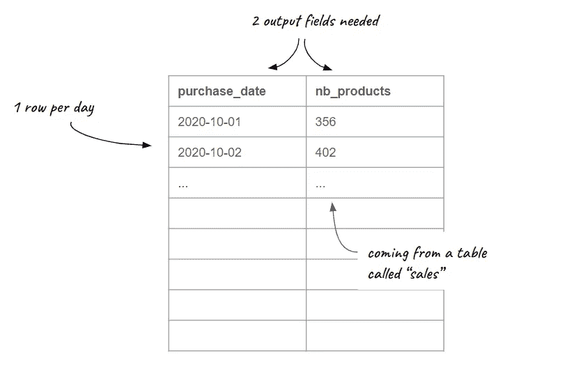

# 更好地构建 SQL 查询的 3 个简单技巧

> 原文：<https://towardsdatascience.com/3-simple-tricks-to-better-structure-your-sql-queries-f5e3b38d58e2?source=collection_archive---------5----------------------->

## 以及立即应用它们的实际例子

卡斯帕·卡米尔·鲁宾在 [Unsplash](https://unsplash.com/?utm_source=unsplash&utm_medium=referral&utm_content=creditCopyText) 上的照片

SQL 代表结构化查询语言。不幸的是，这并不意味着一旦你开始用这种计算机语言编程，你就会自然而然地写出一段结构完美的代码。

作为一名数据分析师，我不断地应用三个简单的规则来更好地组织我的 SQL 查询。它们不仅让我避免了从数据库中查询的错误，还为我自己和与我分享查询的同事节省了时间。让我向您展示这些技巧，并用一个真实的例子来说明它们。

# 1.可视化您的查询输出

高效地构建 SQL 代码始于牢记您想要实现的结果。问自己这个简单的问题:**我希望我的输出表看起来像什么？**

特别要注意以下几点:

*   **粒度级别**:您希望您的输出表处于哪种聚合级别？换句话说，每行应该对应什么？
*   **输出字段**:根据查询生成的表格，您将使用哪些字段？换句话说，每一列应该对应什么？
*   **输入变量**:你的数据从哪里来？换句话说，您将在查询中处理的变量的性质是什么？

让我们用一个例子来实践第一个技巧。想象一下，你的老板刚刚让你分析上个月销量的演变。为此，您将需要检索每天(粒度级别)的产品数量(输出字段)，知道您可以访问一个数据库表，该表汇总了客户在过去几个月中所做的购买(输入变量)。

因此，您的查询输出应该如下表所示:

玛丽·勒费夫尔

# 2.使用 WITH 子句

要生成所需的表，您需要采取许多步骤。当我开始用 SQL 编码时，我的第一反应是从关键字“SELECT”开始。但有了经验，我现在系统地从“用”这个关键词入手。乍一看，使用 WITH 子句可能会让您认为这会使您的查询看起来过于复杂。但是我可以向你保证**即使对于相对简单的查询，它也可以让你组织你的思维，让你的查询更容易阅读和理解**。

WITH 子句的另一个主要优点是，您可以构造一系列子查询，每个子查询都可以引用(或不引用)前一个子查询。通过这样做，您将避免在主查询中编写无穷无尽的嵌入式子查询，从而减少失去思路的风险。使用 WITH 子句允许您在代码底部编写主查询之前，首先检索并计算主查询中请求的所有字段。

让我用前面的例子来说明这一点。编写获得所需输出所需的代码的第一种方法是:

使用 WITH 子句的另一种方法是:

请注意，这两个查询具有相同的性能，并且具有相同的代码行数。然而，**第二段代码向读者展示了通向主查询**的逻辑步骤:首先从表“sales”中检索原始字段，在适当的级别对它们进行计算，然后在主查询中使用它们。虽然对于这个示例，第一个版本对大多数用户来说可能已经足够清楚了，但是您可以很容易地想象到，对于更复杂的查询，不使用 WITH 子句可能会导致大量的嵌入式子查询，从而导致代码的高度复杂性。

# 3.勤奋写作

在行动最激烈的时候，你可能没有花时间以最干净的方式编写代码。不关心代码中的每一个语法规则的诱惑确实很大。协调一段代码也可能是痛苦的，似乎是浪费时间，特别是如果原始代码正确运行并做了它应该做的事情。

然而，我建议你**在把你的代码放在一边**之前花点时间仔细检查一下——也许六个月后再回来问自己“这部分代码应该做什么？”。首先，即使你现在确信你将永远记住你的代码的逻辑，你以后可能会回想起它，并且不记得它是如何被构造的。如果做得好，你会节省很多时间。第二，其他人可能需要阅读和重用你的代码。除非你确定你或其他任何人以后都不会使用你的作品，否则请考虑以下部分。

**协调你的代码语法并确保其风格的一致性并不意味着你必须花费数小时来重写你的代码。一些免费工具允许你根据广泛使用的标准或者你自己定义的格式化规则来重新格式化你的代码。它们可以是您的查询工具中的功能(例如 Google 的 BigQuery 控制台中的“格式查询”)、在线工具(例如像 Poor-SQL 或 sql-format 这样的网站)或您的文本编辑器中的附加包(例如 Sublime Text 的“SqlBeautifier”)。**

校对您的代码时，请注意以下元素的一致性:

*   **缩进**:对齐所有具有相同性质并且处于相同聚合级别的字段，可以更容易理解代码背后的逻辑。
*   **大小写**:对所有 SQL 关键字使用相同的大小写规则(通常为大写)和另一种独特的字段大小写逻辑(例如 camelCase、snake_case 或 PascalCase)可以更容易地理解每个单词在查询中扮演的角色。
*   **注释**:用来注释一段代码的字符可能会根据你使用的数据库管理系统(RDBMS)而有所不同(双连字符、斜杠、hashtag…)，因此，调整整个代码中用来注释它的语法是至关重要的。

如果回到前面的例子，您会注意到我对 SQL 关键字使用了大写，对字段名使用了 snake case。由于我习惯于 BigQuery 中的标准 SQL，所以我使用双连字符来添加注释。

# 结论

如果您处于 SQL 编程的初级阶段，这些技巧将有助于您更加自信地编写查询，因为它们鼓励您组织自己的思维，并通过这样做，使您编写的代码更加清晰。

如果您在 SQL 掌握方面处于更高级的水平，这些技巧将鼓励您更好地组织代码，并使其易于被其他人理解，而不管他们的背景和 SQL 熟练程度如何。

你喜欢阅读这篇文章吗？ [*成为*](https://marie-lefevre.medium.com/membership) *的一员，加入一个不断成长的充满好奇心的社区吧！*

 [## 加入 Medium！

### 作为一个媒体会员，你的会员费的一部分会给你阅读的作家，你可以完全接触到每一个故事…

marie-lefevre.medium.com](https://marie-lefevre.medium.com/membership)