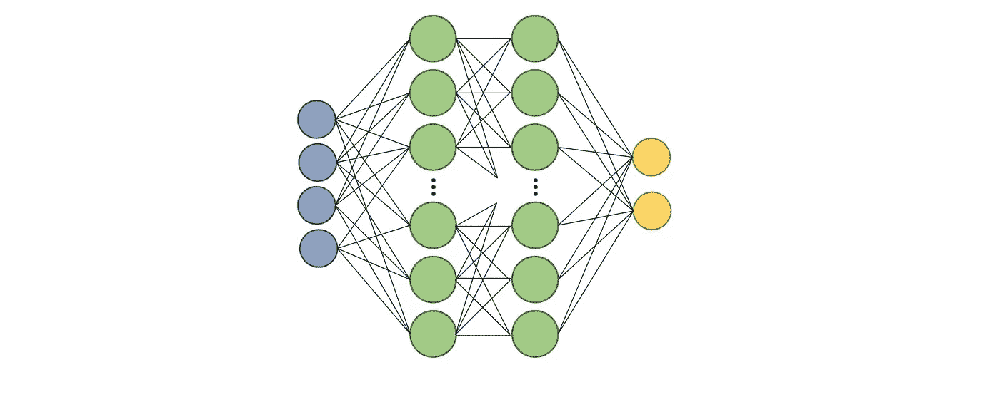
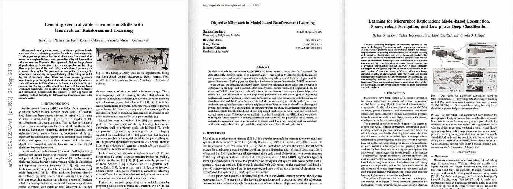

# 强化学习(RL)前需要掌握的 3 项技能

> 原文：<https://towardsdatascience.com/3-skills-to-master-before-reinforcement-learning-rl-4176508aa324?source=collection_archive---------30----------------------->

## 你需要能够训练神经网络，将搜索视为规划，并理解学术论文。

当我在搜索强化学习的掌握时，通过所有的教程和课程，有一些他们认为你知道的常用工具。最终，你要应用的领域中的小弱点会变成大错误。

来源——作者在俄勒冈州本德的冒险经历。

# 1.监督学习

现代强化学习几乎完全专注于**深度强化学习**。短语*深度强化学习*中的单词 ***深度*** 暗示了在算法的核心方面使用神经网络。神经网络在学习过程中进行一些高维近似。也就是说，模型不需要有许多层和特性，这是一个常见的误解，即深度意味着许多层。

几乎所有的课程和教程都会假设你**能够微调简单的神经网络来逼近状态值或者创建最终的策略**。这些模型在历史上对以下所有训练参数高度敏感:学习率、批量大小、模型参数、数据标准化等等。再加上难以解决的任务，调试 RL 可能会非常困难，就像一个二元的*它工作*或*它不工作*。通过了解所有的次近似都达到标准，消除混淆的尾巴。最好的方法是学习监督学习，然后让一个 [AutoML](https://www.automl.org/automl/) 工具为你完成这项工作。

从一些[代码](https://pytorch.org/tutorials/beginner/blitz/cifar10_tutorial.html)开始，破坏一切，然后重新构建。这样做几次，你应该很好去。**监督学习**也是一项技能，在未来十年里，它将转化到计算机科学的几乎所有领域，所以，努力追求它吧。

在使用现代人工智能系统时，你会经常看到这个草图。

# 2.人工智能中的搜索方法

RL 是策略空间中的搜索问题。近年来最具影响力的报纸一直从过去的搜索问题中获得严肃的灵感。让我们来看看最近 RL 最有影响力的三篇论文:

1.  迄今为止最主流的强化学习成果: [Deepmind 用 at-scale 强化学习对很多游戏的掌握](https://deepmind.com/research/publications/investigation-model-free-planning)。最近的结果是使用规划网络来探索未来行动的长链。
2.  基于模型的 RL 的最新发展水平:[基于模型的策略优化](https://arxiv.org/abs/1906.08253) (MBPO)。MBPO 正在状态-动作空间的附近区域进行搜索，以获得系统动力学的更完整的知识。这种模拟的知识就像一种肤浅的、面包优先的搜索。
3.  无模型 RL 中的艺术状态:软演员-评论家(SAC)。SAC 以结合高效探索和高峰性能而闻名。它通过最大化策略上的熵项来做到这一点。直接策略搜索是 RL 作为搜索问题的最关键的方面。

> RL 中的规划对于基于模型的*强化学习的子领域(相对较小，但正在增长)来说是一个巨大的胜利，该子领域试图学习离线规划的环境模型。*

*你问:我在哪里可以重温一下**搜索的概念？**这里是我学习的地方:[加州大学伯克利分校的](https://inst.eecs.berkeley.edu/~cs188/)和[麻省理工学院的](https://ocw.mit.edu/courses/electrical-engineering-and-computer-science/6-034-artificial-intelligence-fall-2010/)人工智能课程简介。然后做一两个代码项目，挑战自己。*

**

*来源——我们在 [CS188](https://inst.eecs.berkeley.edu/~cs188/sp20/assets/lecture/lec-4.pdf) 的一次讲座。*

# *3.理解学术论文*

*请注意，我没有说*阅读*学术论文。关键是要能够理解他们。*

*学术领域变化很快，活跃的 Twitter 社区每天都有论文发布(说真的，关注几个著名的研究人员——这对让你跟上进度很有帮助)。你需要学习的是区分**有影响力的论文**和*噪音*以及**进度**和*炒作*。*

*现在不是转发或引用的问题——尽管我承认引用是一个很好的替代——而是实质性的实验。机器学习的出版周期是粘性的，研究人员预计一年出版多次。你应该看的是实验:它们是遵循一个问题、实验、然后解决的弧线，还是只是逐步改进另一个人的方法？最好的论文是在寻找真理，而不是数字。*

*最好的研究寻找最重要的问题，不管学术讨论的浪潮如何。学会辨别这些信号，你就能跟上这个领域，成为下一个十年有价值的人力资源。*

**

*来源，我在机器人学和 ML 方面的 3 篇论文*

*我已经写了很多在强化学习中建立基本技能的教程，见下面的大纲。*

* [## 到底什么是马尔可夫决策过程？

### 了解大多数强化学习问题中使用的模型。

towardsdatascience.com](/what-is-a-markov-decision-process-anyways-bdab65fd310c)  [## 强化学习的隐藏线性代数

### 线性代数的基础如何支持深度强化学习的顶点？

towardsdatascience.com](/the-hidden-linear-algebra-of-reinforcement-learning-406efdf066a)  [## 强化学习的基本迭代方法

### 学习价值和策略迭代能掌握多少强化学习？很多。

towardsdatascience.com](/fundamental-iterative-methods-of-reinforcement-learning-df8ff078652a)  [## 强化学习算法的收敛性

### 有什么简单的收敛界限吗？

towardsdatascience.com](/convergence-of-reinforcement-learning-algorithms-3d917f66b3b7) 

继续学习！

更多？订阅我关于机器人、人工智能和社会的时事通讯！

 [## 自动化大众化

### 一个关于机器人和人工智能的博客，让它们对每个人都有益，以及即将到来的自动化浪潮…

robotic.substack.com](https://robotic.substack.com/)*