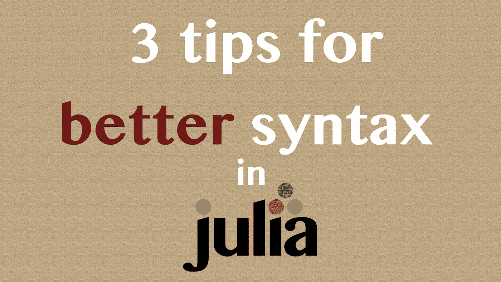
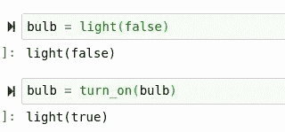
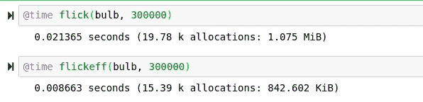
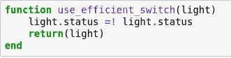
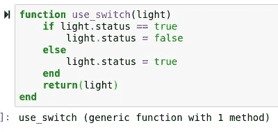
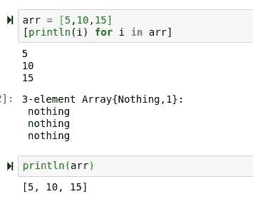
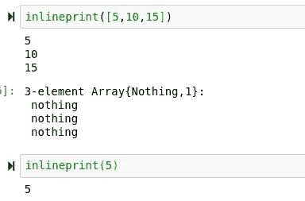
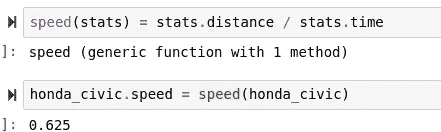
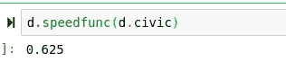
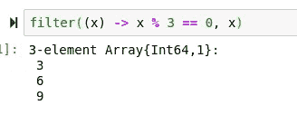

# 给 Julia 的 3 个流畅的语法技巧

> 原文：<https://towardsdatascience.com/3-smooth-syntactical-tips-for-julia-65ddf577f071?source=collection_archive---------61----------------------->

## 用这些令人兴奋的技巧最大化你的语法！



(茱莉亚标志由 http://julialang.org/提供)

伟大的代码编写艺术，尤其是像 Python 和 Julia 这样的高级语言，是一种相当容易学习的东西——但却难以掌握。即使非常熟练的程序员也有可能在他们的语法中犯看似基本的错误。然而，拥有清晰简洁的代码不仅在可读性标准上很重要，而且在做错的时候也会产生非常严重的影响。学习一些伟大的技术和快捷方式来执行操作，这绝对是一个让你的代码发光并让你的同事喜欢你的绝妙方法。幸运的是，有成千上万的小技巧可以用来增强你的代码。

> [笔记本](https://github.com/emmettgb/Emmetts-DS-NoteBooks/blob/master/Julia/3%20Tips%20for%20better%20Syntax.ipynb)

# №1:布尔逆


让我们来看看下面的场景:

```
mutable struct light
   status
end
function turn_on(light)
    light.status = true
    return(light)
end
function turn_off(light)
    light.status = false
    return(light)
end
```

在这个例子中，我们可以使用 turn_on 和 turn_off 方法打开或关闭灯光。



> 如果我们想把两者结合成一个功能呢？

对于条件语句来说，这是一项显而易见的工作，许多程序员会这样处理这个问题:

```
function use_switch(light)
    if light.status == true
        light.status = false
    else
        light.status = true
    end
end
```

首先，我们检查灯光是否设置为 true。这将首先需要来自处理器的 MOV 指令，其中由变量 light.status 表示的数据将被移动到注册表核心中进行比较。接下来，还需要将 true 移动到注册表核心中。然后，将执行一个 CMP 指令来比较这两个值，这将改变一个标志—(但在这种情况下，他们可能会使用 JNE 条件转移来代替。)

接下来，计算机需要将我们的 false 移动到当前保存 light.status 变量数据的内存中。如果我们的标志从未被更改，那么下面将有一个部分，它将在代表 light.status 变量的地址处移入我们的内存。

因此，如果 light.status 为真，这个条件语句至少需要 4 条指令。如果是假的，最少需要 6 个指令。幸运的是，在 Julia 中，我们有一个用于反转 bool 类型的操作符。为了在 Julia 中这样做，我们可以使用=！。

```
function use_efficient_switch(light)
    light.status =! light.status
    return(light)
end
```

现在让我们建立一个小的性能测试，并测量这两种方法之间的差异。我构造了两个函数在 for 循环中调用这些不同的方法。然后我用@time 宏运行这两个函数，看看这个小小的改进会带来什么样的不同。

```
function flick(bulb, iters)
    for i in 1:iters
        use_switch(bulb)
    end
end
function flickeff(bulb, iters)
    for i in 1:iters
        use_efficient_switch(bulb)
    end
end
```



> 显然好多了

由于需要移动到内存中的值更少了，我们浪费的时间更少了，甚至减少了分配。不仅如此，还有这个:



看起来比这好多了:



# №2:调度一切！

如果您是 Julia 的新手，您可能会很高兴了解到该语言有一个多态分派，允许您基于某些标准(如类型或值)来路由方法。下面是调度用法的一个基本示例:

从两个函数开始，在这个例子中，我们想要打印一个数组的每个元素，或者打印一个整数。下面是实现这一目的的两个函数:

```
function handle_array(arr)
    [println(i) for i in arr]
end
function handle_int(int)
    println(int)
end
```

需要明确的是，迭代地执行 println()和在一行上打印数组是有区别的。



我们还从 for 循环中得到一个有趣的三元素 nothing 返回。如果您想取消它，您总是可以添加一个；到循环的终点。我们可以将这些合并到一个函数中，通过使用 Julia 的调度来处理这两种类型，如下所示。为此，我们只需使用=运算符。

```
inlineprint(arr::Array) = handle_array(arr)
inlineprint(arr::Int64) = handle_int(arr)
```

> 结果是:



现在我们可以就此打住，这本身就是一个强大的工具，但重要的是要记住，函数只是一个有着花哨名字的类型。朱莉娅的伟大之处在于我们能够利用这一点。首先，你应该理解语法表达。这些当然是朱莉娅语法的一大部分，而且是一种只因为分派而存在的能力。让我们举一个速度的例子:

```
mutable struct car_stats
    distance
    time
    speed
end
honda_civic = car_stats(25, 40, nothing)
```

在这个特定的场景中，我们知道汽车行驶的距离，以及汽车行驶那么远所用的时间。我们缺少这辆车的速度数据，我们需要找到它。如果你还记得的话，这个公式就是距离除以时间得到速度。所以与其写这样一个函数:

```
function speed(carstat)
    mph = carstat.distance / carstat.time
    return(mph)
end
```

我们可以用 Julia 返回时间的调度创建一个语法表达式:



我们甚至可以更进一步，使用 dispatch 将这些方法作为一种类型的子方法，这是非常不可思议的！为此，我们首先需要创建另一个分派函数来返回我们的类型:

```
typemaker(speedfunc,civic) = ()->(speedfunc;civic)
```

然后，我们将为变量分配相应的方法和速度统计类型:

```
d = typemaker(speed,honda_civic)
```

现在我们可以跑了

```
d.speedfunc(d.civic)
```



作为一个新的 Julia 开发人员，你可能犯的最大错误之一就是没有利用 Julia 的调度并充分发挥它的潜力！

# №3:滤镜！

Filter 可能是来自 Julia 库的最有用和最通用的工具之一，尤其是如果你像我一样，经常发现自己在对大量数据进行排序。您可以花费数小时构建循环来确定数据中是否满足某些条件，或者您可以只使用 filter！Filter 是 Python 的 Pandas 的条件屏蔽的 Julian 等价物，然而，它被合并到语言的基础中，使它更快并且与语言的其余部分的语法非常一致。

在数据操作中，过滤是实现各种不同目标的一种很好的方法。毫无疑问，能够有效地使用这种方法将会使您在 Julia 中管理数据时受益匪浅。考虑以下数据:

```
x = 1:10
```

使用过滤器！，我们可以根据每个 dim 是否满足特定条件来决定包含或排除哪些数据。比方说，我们只想得到能被 3 整除的值:

```
filter((x) -> x % 3 == 0, x)
```



虽然这是一个相当不实用的例子，但它确实以最基本的方式展示了 filter 的用法。在基本的统计测试中，这可能会派上用场。在 Julia 中有许多方法可以做到这一点，但是 filter 始终是一种非常有效的方法。

# 结论

在 Julia 语言中，有很多很酷的小技巧可以用来升级语法，让事情变得更简单。从像操作符和多态调度这样令人惊奇和复杂的工具到像过滤器这样简单的基本功能！，使用 Julia 语言总有一些很好的东西可以让你的代码更快更简洁。