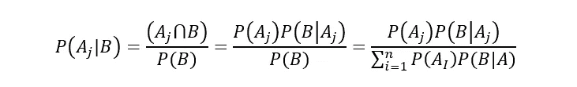

# 数据科学面试中你应该知道的 3 个统计学概念

> 原文：<https://towardsdatascience.com/3-statistics-concepts-you-should-know-for-data-science-interviews-54d827ec242c?source=collection_archive---------16----------------------->

## 你应该知道的基本统计概念

由故事创建的数据向量—[www.freepik.com](http://www.freepik.com)

数据科学家基本上是现代统计学家。以下是你在数据科学面试中最有可能遇到的 3 种常见的统计学问题。出现如此频繁的原因是，它们是许多数据科学应用程序的基本构建模块，如贝叶斯机器学习或假设检验。

请记住，有许多许多统计概念是重要的，例如，我没有包括中心极限定理，但在谈论概率分布时，这仍然是一个重要的概念，所以从这里拿走你想要的东西。

说到这里，我们开始吧！

> **除此之外我推荐的另一个资源是**[**StrataScratch**](https://platform.stratascratch.com/?utm_source=blog&utm_medium=click&utm_campaign=terenceshin)**。它有数百个数据科学面试问题，并帮助我提供了像这样的资源！所以查一下** [**这里**](https://platform.stratascratch.com/?utm_source=blog&utm_medium=click&utm_campaign=terenceshin) **。**

# 1.贝叶斯定理/条件概率

简单明了，你需要了解贝叶斯定理和条件概率(方程见下文)。最流行的机器学习算法之一 Naive Bayes 就是建立在这两个概念之上的。此外，如果你进入**在线**机器学习领域，你很可能会使用贝叶斯方法。

贝叶斯定理

条件概率

*例题:你即将登上飞往西雅图的飞机。你想知道你是否应该带一把伞。你打电话给住在那里的三个朋友，分别问他们是否在下雨。你的每个朋友都有 2/3 的机会对你说真话，1/3 的机会用谎言来搞乱你。三个朋友都告诉你“是的”下雨了。西雅图真的下雨的概率有多大？*

回答:你可以看出这个问题与贝叶斯理论有关，因为最后一个陈述本质上遵循这样的结构，“给定 B 为真，A 为真的概率是多少？”因此，我们需要知道西雅图在某一天下雨的概率。假设是 25%。

P(A) =下雨的概率= 25%
P(B) =三个朋友都说在下雨的概率
P(A|B)假定他们说在下雨的概率
P(B|A)假定在下雨的情况下三个朋友都说在下雨的概率= (2/3) = 8/27

*第一步:求解 P(B)*
P(A | B)= P(B | A) * P(A)/P(B)，可以改写为
P(B)= P(B | A)* P(A)+P(B |非 A)* P(非 A)
P(B)=(2/3)* 0.25+(1/3)* 0.75 = 0.25 * 8/27+0.75 * 1/27

*第二步:求解 P(A | B)*
P(A | B)= 0.25 *(8/27)/(0.25 * 8/27+0.75 * 1/27)
P(A | B)= 8/(8+3)= 8/11

因此，如果三个朋友都说在下雨，那么有 8/11 的几率是真的在下雨。

***更多类似问题，查看我的免费资源*** [***这里***](https://docs.google.com/document/d/1UV6pvCi9du37cYAcKNtuj-2rkCfbt7kBJieYhSRuwHw/edit#heading=h.8dxlgh60ooti) ***！***

# 2.计数应用程序

如果你从事网络安全、模式分析、运筹学等工作，组合和排列是非常重要的。让我们再来回顾一下这两者分别是什么:

## 排列

**定义:**n 个元素的排列是这 n 个元素按照**确定的顺序**的任意排列。有 n 个阶乘(n！)排列 n 个元素的方式。注意粗体字:顺序很重要！

**一次取 r 的 n 个事物的排列数**被定义为可以从 n 个不同元素中取出的 r 元组的数目，并且等于以下等式:

*例题:一个 6 位数的车牌有多少种排列？*

回答

## 组合

定义:在**顺序不重要**的情况下，从 n 个对象中选择 r 的方式数。

**一次取 r 个的 n 个事物的组合数**定义为一个具有 n 个元素的集合中具有 r 个元素的子集的数目，等于以下等式:

*例题:从一副 52 张牌中抽出 6 张牌有多少种方法？*

回答

请注意，这些都是非常非常简单的问题，可能会比这复杂得多，但是您应该很清楚上面的例子是如何工作的！

# 3.概率分布/置信区间

人们很容易在概率分布中迷失方向，因为概率分布太多了。也就是说，如果我必须选择五个主要的发行版，它们是:

1.  正态分布
2.  泊松分布
3.  二项分布
4.  指数分布
5.  均匀分布

例句问题:苏格兰的凶杀率从前一年的 115 下降到了去年的 99。这种报道的变化真的值得注意吗？

回答:由于这是一个泊松分布问题，所以均值=λ=方差，也就是说标准差=均值的平方根。

*   95%的置信区间意味着 z 值为 1.96
*   一个标准偏差= sqrt(115) = 10.724

因此置信区间= 115+/- 21.45 = [93.55，136.45]。由于 99 在这个置信区间内，我们可以假设这个变化不是很值得注意。

# 感谢阅读！

仅此而已！我希望这对你的面试准备有所帮助，并祝你在未来的努力中好运。读完这篇文章后，希望你对这三个概念有一个基本的理解。如果你觉得你需要更多地研究这些概念，我会查看我的[免费数据科学资源](https://docs.google.com/document/d/1UV6pvCi9du37cYAcKNtuj-2rkCfbt7kBJieYhSRuwHw/edit#heading=h.8dxlgh60ooti)，它涵盖了概率基础和概率分布。

## 特伦斯·申

*   *如果你喜欢这个，* [*跟我上 Medium*](https://medium.com/@terenceshin) *了解更多*
*   *我们来连线一下*[*LinkedIn*](https://www.linkedin.com/in/terenceshin/)
*   *检出*[***StrataScratch***](https://platform.stratascratch.com/?utm_source=blog&utm_medium=click&utm_campaign=terenceshin)