# 预测时间序列的三个步骤:LSTM 与张量流 Keras

> 原文：<https://towardsdatascience.com/3-steps-to-forecast-time-series-lstm-with-tensorflow-keras-ba88c6f05237?source=collection_archive---------4----------------------->

## Python 中的一个实用示例，提供了有用的技巧

来源: [Adobe 股票](https://stock.adobe.com/ca/images/black-retro-alarm-clock-on-yellow-background-top-view-flat-lay-copy-space-minimalistic-background-concept-of-time-deadline-time-to-work-morning/246199883?asset_id=246199883)

在本教程中，我们用 **Python** 呈现一个深度学习时间序列分析实例。你会看到:

*   如何**预处理/转换**用于时间序列预测的数据集。
*   当我们的计算机内存有限时，如何处理**大型时间序列数据集**。
*   如何用**tensor flow****Keras**神经网络模型拟合[长短期记忆( **LSTM** )](https://colah.github.io/posts/2015-08-Understanding-LSTMs/) 。
*   还有更多。

如果你想用机器学习技术分析大型时间序列数据集，你会喜欢这个带有*实用提示*的指南。

让我们现在开始吧！

我们正在使用的数据集是来自 Kaggle 的[家庭用电量](https://www.kaggle.com/uciml/electric-power-consumption-data-set)。它以一分钟的采样率测量一个家庭的电力消耗。

在 4 年内收集了 2，075，259 个测量值。不同的电量和一些分计量值是可用的。但是我们将只关注三个特性:

*   *日期*:日/月/年格式的日期
*   *时间*:时间格式为 hh:mm:ss
*   *全局有功功率*:家庭全局分钟平均有功功率(千瓦)

在这个项目中，我们将预测 10 分钟后 Global_active_power 的电量。

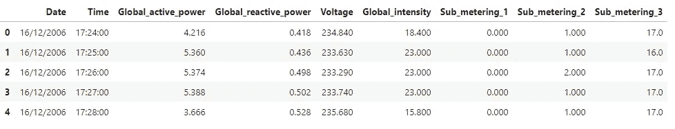

# 步骤#1:为时间序列分析预处理数据集

首先，让我们处理数据集，为时间序列分析做好准备。

我们通过以下方式转换数据集 *df* :

*   通过组合日期和时间以日期时间格式创建特征*日期时间*。
*   将 Global_active_power 转换为数字并删除缺失值(1.25%)。
*   在新数据集中按时间对要素进行排序。

现在我们有一个数据集 df 如下。

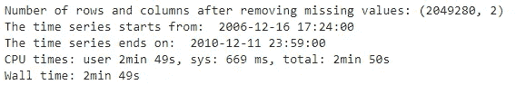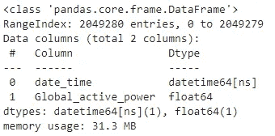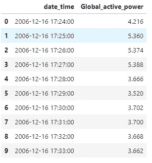

接下来，我们将数据集分为训练、验证和测试数据集。

*df_test* 保存原始数据集中最近 7 天的数据。 *df_val* 有测试数据集前 14 天的数据。 *df_train* 有剩余的数据。

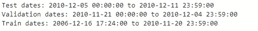

**相关文章** : [时间序列分析，可视化&与 LSTM](/time-series-analysis-visualization-forecasting-with-lstm-77a905180eba)
预测本文仅比历史数据提前 1 分钟预测 Global_active_power。
但实际上，我们希望在更长的时间内进行预测，我们将在本文中这样做。

# 步骤 2:为 TensorFlow Keras 转换数据集

在我们可以拟合张量流 Keras LSTM 之前，还有其他过程需要完成。

让我们一点一点地对付他们！

## 将数据集分成更小的数据帧

如前所述，我们希望预测未来 10 分钟的 Global_active_power。

下图将问题可视化:使用滞后数据(从 t-n 到 t-1)来预测目标(t+10)。

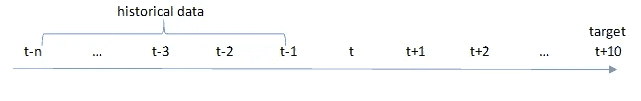

单位:分钟

在训练模型时遍历数据集是没有效率的。因此，我们希望用代表历史数据和目标的每一行来转换数据集。

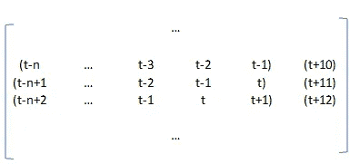

单位:分钟

这样，我们只需要使用上述矩阵的每一行来训练模型。

现在挑战来了:

*   我们如何将数据集转换成新的结构？
*   当我们的计算机内存有限时，我们如何处理这个更大的新数据结构呢？

因此，函数 *create_ts_files* 被定义为:

*   将原始数据集转换为上面的新数据集。
*   同时，将新数据集分成更小的文件，这样更容易处理。

在该函数中，我们定义了以下参数:

*   *start_index* :包含在*所有*历史数据中进行预测的最早时间。
    在本练习中，我们希望从一开始就包含历史记录，因此我们将其默认值设置为 0。
*   *end_index* :被纳入*所有*历史数据进行预测的最晚时间。
    在本练习中，我们希望包括所有历史记录，因此我们将其默认值设置为无。
*   *history_length* :这是前面提到的 n，是每次预测要回顾的时间步数。
*   *step_size* :历史窗口的步幅。随着时间的推移，Global_active_power 不会快速变化。所以为了更有效率，我们可以让 step_size = 10。这样，我们下采样使用过去每 10 分钟的数据来预测未来的量。我们只看 t-1，t-11，t-21 直到 t-n 来预测 t+10。
*   *target_step* :未来要预测的期数。
    如前所述，我们试图提前 10 分钟预测 global_active_power。所以这个特性= 10。
*   *num_rows_per_file* :放入每个文件的记录数。
    这是将大型新数据集分割成较小文件所必需的。
*   *data_folder* :包含所有文件的单一文件夹。

那是一大堆复杂的参数！

最后只要知道这个函数创建一个文件夹里面有文件就行了。
每个文件包含一个熊猫数据帧，看起来像上面图表中的新数据集。
每个数据帧都有列:

*   *y* ，这是要预测的目标。这将是 t + target_step (t + 10)时的值。
*   *x_lag{i}* ，时间 t + target_step — i 的值(t+10–11，t+10–21 等等)，即相对于 y 的滞后值。

同时，该函数还返回数据帧中的滞后数(len(col_names)-1)。稍后为张量流模型定义形状时，将需要此数字。

在应用 create_ts_files 函数之前，我们还需要:

*   缩放 global_active_power 以与神经网络一起工作。
*   将历史记录长度 n 定义为 7 天(7*24*60 分钟)。
*   将历史数据中的步长定义为 10 分钟。
*   将 target_step 设置为 10，这样我们就可以预测历史数据 10 分钟后的 global_active_power。

之后，我们将创建 ts 文件应用于:

*   在文件夹 *ts_data* 中创建 158 个文件(每个文件包括一个熊猫数据帧)。
*   返回 *num_timesteps* 作为滞后数。

当函数运行时，它打印每 10 个文件的名称。

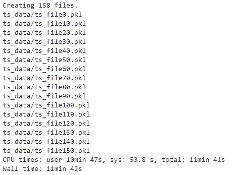

ts_data 文件夹大约有 16 GB，我们仅使用过去 7 天的数据进行预测。现在，您可以看到为什么需要将数据集分成更小的数据帧了！

## 定义时间序列对象类

在这个过程中，我们创建一个类 *TimeSeriesLoader* 来转换数据帧并将其输入到模型中。

有来自 Keras 的内置函数比如 Keras Sequence，tf.data API。但是它们在这方面效率不高。

在这个类别中，我们定义:

*   *__init__* :对象的初始设置，包括:
    - *ts_folder* ，这将是我们刚刚创建的 ts_data。
    - *filename_format* ，ts_folder 中文件名的字符串格式。
    例如，当文件为 ts_file0.pkl、ts_file1.pkl、…、ts_file100.pkl 时，格式为 ts _ file { }。pkl。
*   *num_chunks* :文件总数(块)。
*   *get_chunk* :这个方法从一个文件中取出数据帧，对其进行处理，为训练做准备。
*   *shuffle_chunks* :这个方法打乱了 get_chunk 中返回的块的顺序。这对于建模来说是一个很好的实践。

这些定义可能看起来有点混乱。但是请继续阅读，您将在下一步中看到这个对象的作用。

定义之后，我们将这个 TimeSeriesLoader 应用到 ts_data 文件夹。

现在对象 tss 指向了我们的数据集，我们终于为 LSTM 做好了准备！

# 步骤 3:创建 LSTM 模型

> **长短期记忆** ( [**LSTM**](https://en.wikipedia.org/wiki/Long_short-term_memory) )是一种用于深度学习领域的人工递归神经网络(RNN)架构。
> 
> LSTM 网络非常适合基于时间序列数据进行分类、处理和预测，因为时间序列中的重要事件之间可能存在未知持续时间的滞后。

如前所述，我们将基于 TensorFlow Keras 库构建一个 LSTM 模型。

根据我们的[指南](https://www.justintodata.com/hyperparameter-tuning-with-python-complete-step-by-step-guide/)，我们都知道超参数调整的重要性。但是在本文中，我们只是简单地演示了没有调整的模型拟合。

程序如下:

*   定义输入数据集的形状:
    - *num_timesteps* ，我们在步骤#2 中设置的数据帧中的滞后数。
    -时间序列的*号*为 1。因为我们只使用了 global_active_power 的一个功能。
*   定义*的数量单位*，4 *单位*(单位+2)是 LSTM 的参数数量。
    数字越高，模型中的参数越多。
*   定义*下降*率，用于防止过拟合。
*   指定*输出层*具有线性*激活功能*。
*   定义*型号*。

然后我们还定义了优化函数和损失函数。同样，调整这些超参数以找到最佳选项将是一种更好的做法。

为了在运行之前查看一下我们刚刚定义的模型，我们可以打印出摘要。

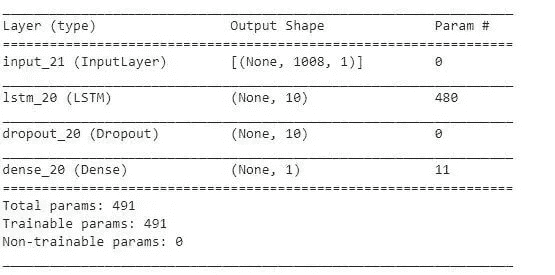

可以看到输出形状看起来不错，是 n / step_size (7*24*60 / 10 = 1008)。需要训练的参数数量看起来也很合适(4 *单位*(单位+2) = 480)。

开始建模吧！

我们分批训练每个组块，只运行一个[历元](https://deepai.org/machine-learning-glossary-and-terms/epoch)。理想情况下，你可以为神经网络训练多个时期。

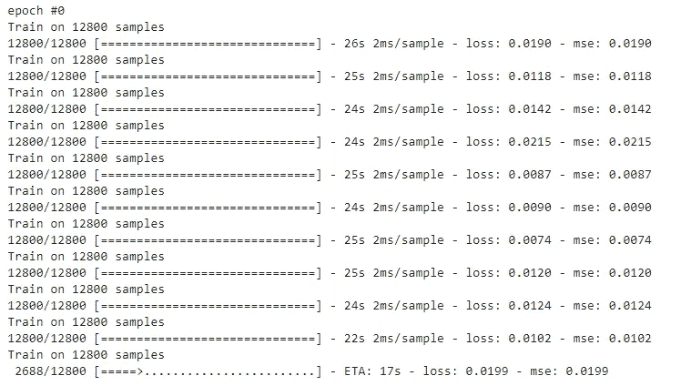

在拟合模型之后，我们还可以使用验证数据集来评估模型性能。

与训练数据集相同，我们还创建了一个验证数据文件夹，为模型拟合准备验证数据集。

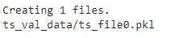

除了使用验证数据集进行测试，我们还使用最近的历史点(t+10–11)对基线模型进行测试。

下面是详细的 Python 代码。

使用 LSTM 的验证数据集给出的均方误差(MSE)为 0.418。而基线模型的 MSE 为 0.428。LSTM 的表现略好于基线。

我们可以通过超参数调整和更多的纪元做得更好。此外，一些其他重要的时间序列分析技巧，如季节性，也会有所帮助。

**相关文章** : [用 Python 调优超参数:完整分步指南](https://www.justintodata.com/hyperparameter-tuning-with-python-complete-step-by-step-guide/)

感谢您的阅读！

希望你能在本指南中找到有用的东西。如果你有任何问题，请留言。

在离开之前，别忘了 [*报名参加刚刚进入数据快讯*](https://www.justintodata.com/) ！或者通过[推特](https://twitter.com/JustintoData)、[脸书](https://www.facebook.com/justintodata/)与我们联系。
因此，您*不会*错过我们的任何新数据科学文章！

*原载于 2020 年 3 月 22 日*[*https://www.justintodata.com*](https://www.justintodata.com/forecast-time-series-lstm-with-tensorflow-keras/)*。*

 [## 如何在线学习数据科学:你需要知道的一切——进入数据

### 这是利用在线资源进入数据科学的完整路线图/课程。你是否想学习…

www.justintodata.com](https://www.justintodata.com/how-to-learn-data-science-online-all-you-need-to-know/)  [## 什么是冠状病毒死亡率与超参数调整-只是进入数据

### 我们用 Python 给出了一个深度学习时间序列分析的例子。您将看到:-如何预处理/转换…

www.justintodata.com](https://www.justintodata.com/coronavirus-death-rate-with-hyperparameter-tuning/)  [## 如何在 Python 中使用 NLP:一个实用的分步示例——只进入数据

### 在这篇文章中，我们展示了一个分步的 NLP 应用程序。这是对…的技术解释

www.justintodata.com](https://www.justintodata.com/use-nlp-in-python-practical-step-by-step-example/)