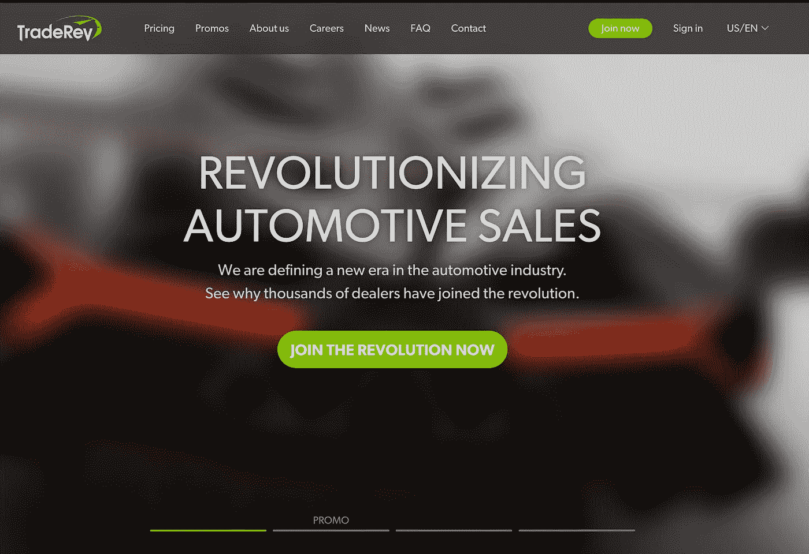

# 成功转入繁荣的数据科学职业的 3 个策略

> 原文：<https://towardsdatascience.com/3-strategies-to-successfully-switch-to-a-thriving-data-science-career-5cf0cbe1f010?source=collection_archive---------39----------------------->

## 有抱负的数据科学家的 2 个常见陷阱，以及如何通过这些简单的方法避免它们。

完整视频[此处](https://www.youtube.com/watch?v=vDhhXvkqxhs&feature=youtu.be)

TowardsDataScience.com 大学的面试官**。**

****受访者:** [Amit Jain](https://www.linkedin.com/in/jaamit/) 技术主管，ML at Trade Rev**

**欲了解更多仅限 TDS 的面试，请点击此处查看:**

** [## Tds 访谈-走向数据科学

### 阅读《走向数据科学》中关于 Tds 采访的文章。共享概念、想法和代码的媒体出版物。

towardsdatascience.com](https://towardsdatascience.com/tagged/tds-interview) 

# 你能告诉我们你的专业背景吗？

到目前为止，它已经在许多垂直行业积累了 15 年的丰富经验。我做过团队经理、团队领导之类的工作。在这 15 年的时间里，我的职业生涯分为三个阶段。前 5 年是在电信行业度过的。我在开发 3G 协议栈的算法，用 C，汇编代码等等。接下来的 5 年，我投身于云计算和应用编程。在过去的 5 年里，我磨练了我的后端技能，并将 ML 加入到我的技能组合中。

最近，我于 2017 年 9 月搬到多伦多，并加入 TradeRev，担任 ML 团队的技术主管。

# 你在 TradeRev 的重点是什么？

TradeRev 是 B2B 领域的二手车在线平台。因此，他们使用 TradeRev 的在线平台，而不是经销商在实物拍卖中拍卖经销商。就像易贝经销商对经销商的汽车交易一样。

机器学习进入画面，给汽车、经销商等带来信心。一些常规用途是推荐系统、价格预测、回归问题和从视频中识别汽车视图的计算机视觉问题。

我在 TradeRev 的角色非常独特。我主要负责 ML 产品的交付。这意味着将研究转化为生产。我领导着 ML 团队，参与了产品生命周期的所有方面。

这始于产品团队对您正在寻找的解决方案的构想。然后与数据工程师和数据科学家合作，构建原型，到处选择 AWS 服务，然后将原型转化为完善的解决方案。我们的技术栈是 python、Scikit-Learn、Tensorflow 和其他普通库。

另一项重要的工作是在数据科学中引入软件最佳实践，例如机器学习领域的 CI/CD、模型监控(我们如何实际建模我们的模型)、单元测试等。

# 你能谈谈你的团队使用 ML 在 Trade Rev 上产生的商业影响吗？

将研究带入生产的一件重要事情是理解 ML 实际上是如何对业务产生影响的。推荐系统就是一个例子。这是很基本的事情；根据我以前的经历，我对哪些新项目感兴趣？

因此，基于汽车经销商以前的历史(他对购买什么汽车感兴趣)，我们可以帮助客户销售团队通过 ML 算法只锁定特定的经销商(专注于 10 家经销商，而不是 100 家)。这可能会减少完成交易的时间。这是在生产中使用 ML 算法的一个非常直接的影响。

# 对于像你这样背景(软件工程)的人来说，你有什么建议要转到数据科学行业吗？

我有 3 个具体的建议。

1.  清楚了解数据科学中的各种角色。他们是产品经理、SDE、ML 工程师、数据工程师、研究员、数据科学家、商业分析师等等。询问你对哪个角色感兴趣，你拥有哪些相关技能。此外，将领域专业知识与机器学习技能结合起来。
2.  确定技能差距。如果你的目标是职业生涯的一部分，找到你的技能差距，参加适当的数学、编码等课程。
3.  专注于 ML 的应用方面。假设你有一个住房数据集，你想预测一些东西。使用现有的库看看你能找到什么。获得对你所构建的东西的反馈。

# 您谈到了领域专业知识。它在机器学习中的作用是什么，有多重要？

我的观点是，这里没有灵丹妙药。ML 只不过是统计、数学和新的库。这是一种古老的技术，有新的库，新的框架，有更多的数据和计算能力(简而言之)。

假设你没有某个领域的专业知识，你只知道工具。在这种情况下，把这种情况想象成马拉松而不是短跑。对于马拉松来说，你需要有自己的基础——所以要学习新的跑步技术或什么的。但问题是你有没有毅力，也就是说你有没有该领域专业知识的基础。

因此，让我们以药物发现为例(考虑到冠状病毒季节)。对于一个在 Tensorflow 或 Scikit-Learn 方面是专家，但对分子一无所知的人来说——我不认为这个人能在药物发现方面创造奇迹。但是如果另一个人在这个领域有专业知识，两个人可以一起获得更大的成功。当然，有些独角兽拥有所有的技能，但平均来说，如果我们建立一个拥有不同技能的团队，团队的成功率会提高。

# 对于你关于药物发现的观点，我确实看到很多人在没有真正理解生物领域的情况下就把他们的模型贴在了网上。这似乎很危险。

是的，我看到的是许多人孤立地看待这件事。它更应该是一种用 ML 构建产品的整体方法。在金融领域，如果这个人没有任何经济学背景，并且在股票市场上建立模型，而明天股票市场表现怪异，那么 ML 单独不起作用。

# 您经常提到模型生产，我经常听到这是数据科学项目生命周期的最后一部分。能不能多讲讲这个话题的重要性，新人如何学习？

对此我想引用吴恩达的话。他说“我们知道 ML 的工作原理。现在是时候将它投入生产并实现货币化了。”但我看到的是，数据科学家通常专注于 Jupyter 笔记本和超参数。

我要说的是不要有如此狭隘的方法。考虑业务环境——ML 如何适应业务。ML 是商业的一部分，就像推荐系统一样。推荐系统不是业务，而是业务的一部分。

另一部分是思考 ML 发布到产品中意味着什么。例如，您的现场数据可能与训练/测试数据具有不同的分布。因此，如果你没有这种心态，如果明天出现一些错误，预测变得偏离，并且变得难以修复，那就麻烦了。这就引出了一些问题，比如“你如何改进你的训练？你如何改进你的 API？”

## 完整的采访，请点击查看[视频:](https://www.youtube.com/watch?v=vDhhXvkqxhs&feature=youtu.be)

**