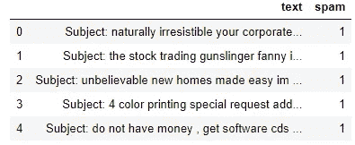
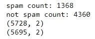
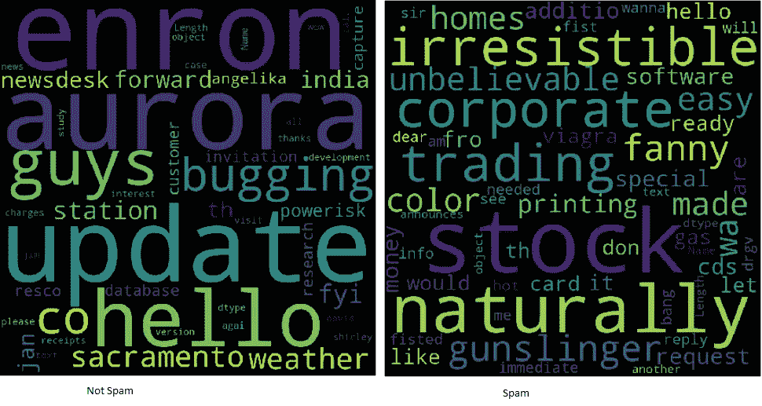
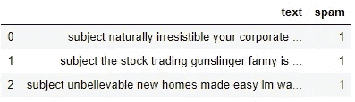
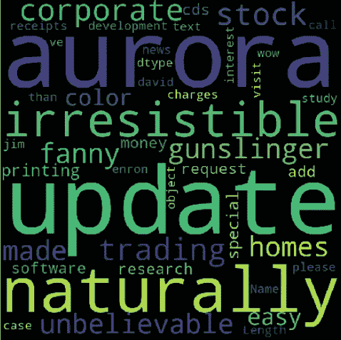
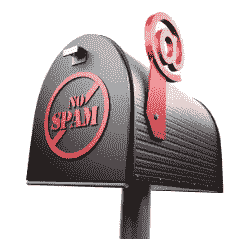
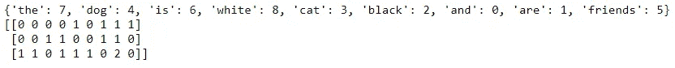
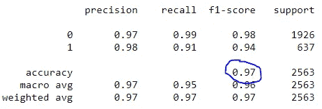
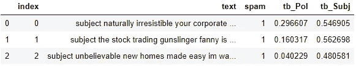

# 使用 Python 学习自然语言处理的 3 个超级简单的项目

> 原文：<https://towardsdatascience.com/3-super-simple-projects-to-learn-natural-language-processing-using-python-8ef74c757cd9?source=collection_archive---------6----------------------->

## 单词云、垃圾邮件检测和情感分析的简单代码示例


照片由 [Siora 摄影](https://unsplash.com/@siora18?utm_source=medium&utm_medium=referral)在 [Unsplash](https://unsplash.com?utm_source=medium&utm_medium=referral) 上拍摄

# 什么是 NLP？

从事数据科学工作并有技术写作背景的我被自然语言处理(NLP)领域所吸引。理解语言的机器令我着迷，我经常思考，如果亚里士多德有机会，他会使用哪些算法来建立一个修辞分析机器。如果你是数据科学的新手，进入 NLP 可能看起来很复杂，尤其是因为该领域最近有如此多的进展。很难知道从哪里开始。

# 项目和数据

这三个超级简单的项目将向您介绍自然语言处理中使用的概念和技术。

**字云**
**情感分析
垃圾邮件检测**

这些项目使用的数据是垃圾邮件数据集，可以在我的 GitHub 中的所有代码中找到:

 [## bendgame/nlpBeginnerProjects

### permalink dissolve GitHub 是超过 5000 万开发人员的家园，他们一起工作来托管和审查代码，管理…

github.com](https://github.com/bendgame/nlpBeginnerProjects/blob/master/NLP_beginner_projects.ipynb) 

# 机器能理解什么？

虽然计算机实际上很擅长寻找模式和总结文档，但它必须先将单词转换成数字，然后才能理解它们。这种转变是必要的，因为机器“学习”归功于数学，而数学在文字上不太管用。在将单词转换成数字之前，它们通常会被清除掉特殊字符和标点符号之类的东西，并被修改成更统一、更易解释的形式。

# 项目一:词云

清洗单词通常被称为预处理，这是项目 1 的重点:**单词云**。

## 导入依赖项和数据

从导入依赖项和数据开始。数据存储为逗号分隔值(csv)文件，所以我将使用 pandas 的 ***read_csv()*** 函数将其打开到 DataFrame 中。

```
import pandas as pd
import sqlite3
import regex as re
import matplotlib.pyplot as plt
from wordcloud import WordCloud#create dataframe from csv
df = pd.read_csv('emails.csv')df.head()
```



df.head()

## 探索性分析

在做任何事情之前，最好对数据进行快速分析，以消除重复的行并建立一些基线计数。我使用 pandas drop_duplicates 来删除重复的行。

```
print("spam count: " +str(len(df.loc[df.spam==1])))
print("not spam count: " +str(len(df.loc[df.spam==0])))
print(df.shape)
df['spam'] = df['spam'].astype(int)

df = df.drop_duplicates()
df = df.reset_index(inplace = False)[['text','spam']]print(df.shape)
```



删除重复之前/之后的计数和形状

## 什么是词云？

词云是可视化文本数据的一种有用方式，因为它们使理解词频变得更容易。在电子邮件文本中出现频率更高的单词在云中显得更大。词云使识别“关键词”变得容易



词云示例

注意在单词云图片中，所有的文字都是小写的。没有标点符号或特殊字符。那是因为文本已经被清理了，以便于分析。使用正则表达式，很容易通过循环来清理文本:

```
clean_desc = []
for w in range(len(df.text)):
    desc = df['text'][w].lower()

    #remove punctuation
    desc = re.sub('[^a-zA-Z]', ' ', desc)

    #remove tags
    desc=re.sub("&lt;/?.*?&gt;"," &lt;&gt; ",desc)

    #remove digits and special chars
    desc=re.sub("(\\d|\\W)+"," ",desc)

    clean_desc.append(desc)#assign the cleaned descriptions to the data frame
df['text'] = clean_desc

df.head(3)
```



注意，我创建了一个空列表 **clean_desc** ，然后使用一个 *for 循环*逐行遍历文本，将其设置为小写，删除标点符号和特殊字符，并将其追加到列表中。然后我用 **clean_desc** 列表中的数据替换文本列。

## 停止言语

停用词是最常见的词，如“the”和“of”将它们从电子邮件文本中删除可以突出更相关的常用词。去掉停用词是常用的技巧！一些 Python 库，比如 NLTK，预加载了一个停用词列表，但是从头开始创建也很容易。

```
stop_words = ['is','you','your','and', 'the', 'to', 'from', 'or', 'I', 'for', 'do', 'get', 'not', 'here', 'in', 'im', 'have', 'on', 're', 'new', 'subject']
```

请注意，我包含了一些与电子邮件相关的词，如“*回复*”和“*主题*”由分析师决定应该包含或排除哪些单词。有时候包含所有单词是有益的！

## 构造单词 Could

方便的是，有一个 Python 库用于创建[单词云](https://github.com/amueller/word_cloud)。它可以使用 pip 安装。

`pip install wordcloud`

当构建单词云时，可以设置几个参数，如高度和宽度、停止单词和最大单词。[甚至可以对其进行整形，而不是显示默认的矩形](https://github.com/amueller/word_cloud/blob/master/examples/alice.png)。

```
wordcloud = WordCloud(width = 800, height = 800, background_color = 'black', stopwords = stop_words, max_words = 1000
                      , min_font_size = 20).generate(str(df1['text']))#plot the word cloud
fig = plt.figure(figsize = (8,8), facecolor = None)
plt.imshow(wordcloud)
plt.axis('off')
plt.show()
```

使用 [matplotlib](https://matplotlib.org/) 和**可以保存和显示单词云。show()** 。这是所有记录的结果，不管它是不是垃圾邮件。



**通过分割数据框和制作两个词云来进一步推动练习，以帮助分析垃圾邮件和非垃圾邮件中使用的关键词之间的差异。**

# 项目 2:垃圾邮件检测

这是一个二元分类问题，因为电子邮件可能是垃圾邮件(1)，也可能不是垃圾邮件(0)。我想建立一个机器学习模型，可以识别电子邮件是否是垃圾邮件。我将使用 Python 库 Scikit-Learn 来探索[记号化](https://en.wikipedia.org/wiki/Lexical_analysis#Tokenization)、[矢量化](https://en.wikipedia.org/wiki/Array_programming)和[统计分类](https://en.wikipedia.org/wiki/Statistical_classification)算法。



[needpix.com](https://www.needpix.com/photo/1075588/spam-mail-box-email-3d-render-sign-post-isolated-spam-communication-box)

## 导入依赖项

导入转换和建模数据所需的 Scikit-Learn 功能。我将使用**计数矢量器**、**训练 _ 测试 _ 分割**、**集成模型**，以及一些度量标准。

```
from sklearn.feature_extraction.text import CountVectorizer
from sklearn.model_selection import train_test_split
from sklearn import ensemble 
from sklearn.metrics import classification_report, accuracy_score
```

## 将文本转换为数字

在项目 1 中，文本被清理。当你看一个词云时，注意它主要是单个的词。单词越大，出现的频率越高。为了防止单词云输出句子，文本要经过一个称为标记化的过程。这是把一个句子分解成单个单词的过程。单个的单词被称为记号。

使用 SciKit-Learn 的 **CountVectorizer()** ，可以很容易地将文本主体转换为计算机可以传递给机器学习算法的稀疏数字矩阵。为了简化计数矢量化的概念，假设您有两个句子:

> *狗是白色的
> 猫是黑色的*

将句子转换为向量空间模型会以这样的方式转换它们，即查看所有句子中的单词，然后用数字表示句子中的单词。

> *狗猫是白的黑的
> 狗是白的= [1，1，0，1，1，0]
> 猫是黑的= [1，0，1，1，0，1]*

我们也可以用代码来展示这一点。我将添加第三句话来说明它计算令牌。

```
#list of sentences
**text = ["the dog is white", "the cat is black", "the cat and the dog are friends"]**#instantiate the class
cv = CountVectorizer()#tokenize and build vocab
cv.fit(text)print(cv.vocabulary_)#transform the text
vector = cv.transform(text)print(vector.toarray())
```



字数的稀疏矩阵。

注意在最后一个向量中，你可以看到一个 2，因为单词“*和*出现了两次。 **CountVectorizer** 正在对记号进行计数，并允许我构建包含单词到数字的转换的稀疏矩阵。

## 词汇袋法

因为该模型没有考虑单词的位置，而是将单词混合起来，就像它们是拼字游戏中的瓷砖一样，这被称为单词袋方法。我将创建稀疏矩阵，然后使用 sk-learn**train _ test _ split()**拆分数据。

```
**text_vec** = CountVectorizer().fit_transform(df['text'])X_train, X_test, y_train, y_test = train_test_split(**text_vec**, **df['spam']**, test_size = 0.45, random_state = 42, shuffle = True)
```

注意，我将稀疏矩阵 **text_vec** 设置为 X，将**df[' spam ']【T26]列设置为 y。**

## 分类器

我强烈建议尝试几种分类器，并确定哪一种最适合这个场景。在本例中，[我使用的是 Scikit-Learn 集合](https://scikit-learn.org/stable/modules/generated/sklearn.ensemble.GradientBoostingClassifier.html)中的**GradientBoostingClassifier()**模型。

```
**classifier** = ensemble.GradientBoostingClassifier(
    n_estimators = 100, #how many decision trees to build
    learning_rate = 0.5, #learning rate
    max_depth = 6
)
```

每个算法都有自己的一套参数，你可以调整。这就是所谓的超参数调整。浏览文档以了解模型中使用的每个参数的更多信息。

## 生成预测

最后，我们拟合数据，调用预测并生成分类报告。使用[**class ification _ report()**](https://scikit-learn.org/stable/modules/generated/sklearn.metrics.classification_report.html)，很容易构建一个显示主要分类指标的文本报告。

```
classifier.fit(X_train, y_train)
predictions = classifier.predict(X_test)print(classification_report(y_test, predictions))
```



分类报告

注意我们的模型达到了 97%的准确率。**通过调整超参数、探索不同的分类器和尝试不同的矢量器来进一步推动练习！**

# 项目 3:情感分析

情感分析也是一种分类问题。这篇文章本质上反映了一种积极的、中立的或消极的情绪。这被称为文本的极性。也有可能衡量和说明文本的主观性！有大量的资源涵盖了情绪分析背后的理论。

该项目没有构建另一个模型，而是使用一个简单的开箱即用工具来分析名为 TextBlob 的情感。我将使用 TextBlob 向 DataFrame 添加情感列，以便可以对其进行分析。


[表情符号](https://pxhere.com/fr/photo/795239)

## 什么是 TextBlob？

Python 2 和 3 的 [TextBlob](https://textblob.readthedocs.io/en/dev/index.html) 库建立在 [NLTK](http://www.nltk.org/) 和[模式](https://www.clips.uantwerpen.be/pages/pattern-en)之上，试图简化一些文本处理任务。它提供了分类、词性标注、名词短语提取、情感分析等工具。使用 pip 安装，并查看[安装指南](https://textblob.readthedocs.io/en/dev/install.html)。

```
pip install -U textblob
python -m textblob.download_corpora
```

## 文本 Blob 情感

使用*情感*属性，TextBlob 返回一个*名为元组*的表单情感(极性，主观性)。**极性**是范围[-1.0，1.0]内的浮点数，其中-1 为最大负值，1 为最大正值。**主观性**是在【0.0，1.0】范围内的浮动，其中 **0.0 非常客观**而 **1.0 非常主观**。

```
blob = TextBlob("This is a good example of a TextBlob")
print(blob)blob.sentiment#Sentiment(polarity=0.7, subjectivity=0.6000000000000001)
```

## 应用 TextBlob

使用[列表理解](/my-trick-to-learning-list-comprehensions-in-python-8a54e66d98b)，很容易将**文本**列作为 TextBlob 加载，然后创建两个新列来存储*极性*和*主观性。*

```
#load the descriptions into textblob
email_blob = [TextBlob(text) for text in df['text']]#add the sentiment metrics to the dataframe
df['tb_Pol'] = [b.sentiment.polarity for b in email_blob]
df['tb_Subj'] = [b.sentiment.subjectivity for b in email_blob]#show dataframe
df.head(3)
```



TextBlob 使生成极性和主观性的基线情感分数变得非常简单。**为了进一步推动这一训练工具，看看您能否将这些新功能添加到垃圾邮件检测模型中，以提高准确性！**

# 包扎

尽管自然语言处理看起来是一个令人生畏的话题，但基础部分并不难掌握。有大量的库使得开始探索数据科学和 NLP 变得容易。完成这三个项目:

**词云
垃圾邮件检测
情感分析**

您将探索对文本数据应用预处理、标记化、矢量化和特征工程的具体示例。

如果您有兴趣学习更多关于数据科学或编程的知识，请查看我的其他文章！

[](/using-functiontransformer-and-pipeline-in-sklearn-to-predict-chardonnay-ratings-9b13fdd6c6fd) [## 在 SkLearn 中使用 FunctionTransformer 和 Pipeline 预测 Chardonnay 评级

### 一个将函数转换成可用的管道代码，然后通过传递数据帧来预测葡萄酒评级的例子…

towardsdatascience.com](/using-functiontransformer-and-pipeline-in-sklearn-to-predict-chardonnay-ratings-9b13fdd6c6fd) 

# 谢谢大家！

*   *如果你喜欢这个，* [*在 Medium 上关注我*](https://medium.com/@erickleppen) *了解更多*
*   [*通过订阅*](https://erickleppen.medium.com/membership) 获得完全访问权限并帮助支持我的内容
*   *我们连线上*[*LinkedIn*](https://www.linkedin.com/in/erickleppen01/)
*   *用 Python 分析数据？查看我的* [*网站*](https://pythondashboards.com/)

[**—埃里克·克莱本**](http://pythondashboards.com/)